# 扩展我的表格模型的三个步骤

> 原文：<https://towardsdatascience.com/three-steps-for-expanding-my-tabular-model-9e2d939378d7>

## 在 Power BI 中扩展数据模型是一项日常任务。我们定期这么做。但是，大多数时候，我们没有考虑我们需要采取的三个必要步骤。让我们深入研究一下。


由[林赛·亨伍德](https://unsplash.com/@lindsayhenwood?utm_source=medium&utm_medium=referral)在 [Unsplash](https://unsplash.com?utm_source=medium&utm_medium=referral) 上拍摄

# 介绍

每当我们必须改变我们的数据模型时，我们必须首先理解需求。

一旦我们知道需要什么，我们就必须:

1.  定义目标数据模型
2.  获取和准备数据
3.  完成数据模型并计算和测试结果

大多数时候，我们是凭直觉做到这一点的。

但有时，我们需要重新考虑我们必须做什么以及如何去做。

虽然下面解释的需求是相对具体的，但是我将使用标准方法来满足这些需求。正如你将看到的，我会遇到一些不寻常的挑战，我会告诉你如何解决它们。

# 要求

我的一个客户问我，他如何根据年销售额对客户进行分类，并在 Power BI 的切片器中使用这些分类。

因此，我需要创建一个计算列来计算每个客户每年的销售额，并将分类分配给客户。

让我们来完成这些步骤。我们会在前进的道路上发现一些绊脚石。

# 步骤 1 —数据建模

下图显示了原始数据模型:

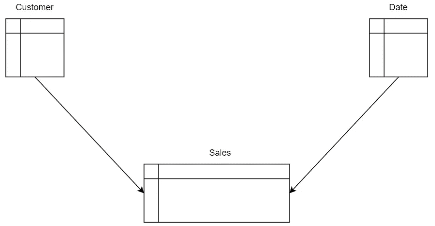

图 1 —原始数据模型(作者绘制)

从逻辑的角度来看，我们需要创建一个结合所有客户和所有年份的表。然后，我们可以计算每个客户每年的销售额，对每个客户进行分类。

下面您会看到带有附加表的数据模型:

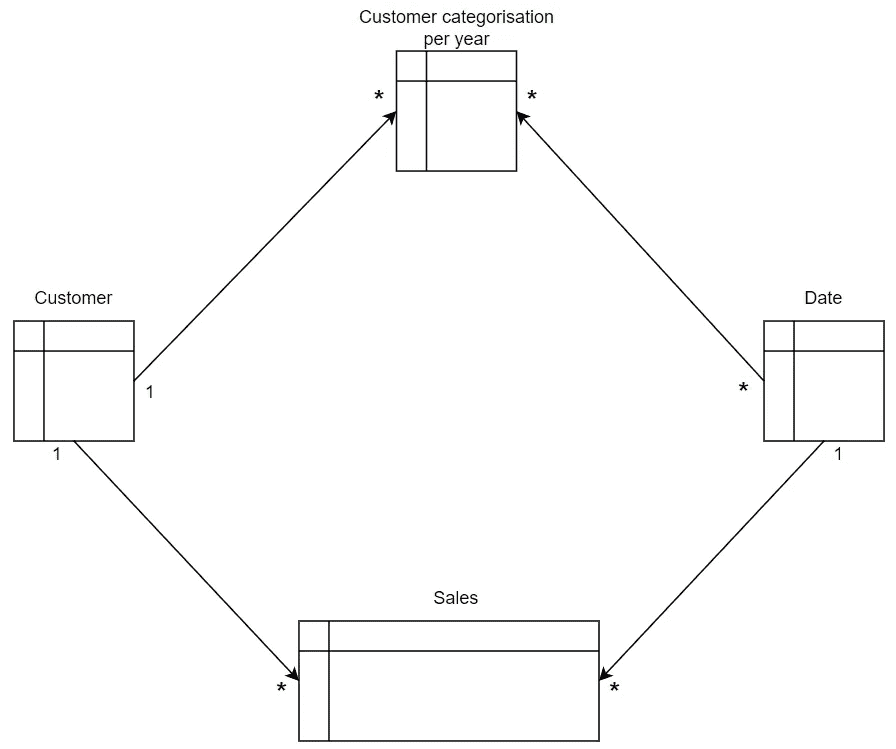

图 2 —数据模型(起点)(作者绘制)

新的*每年客户分类*表与客户表中的客户 Id 和日期表中的年份相关联。从而创建了一个与数据表的 m:n 关系。

因为我想用客户类别的选择来过滤日期**和**客户表，所以我需要将关系设置为双向过滤:

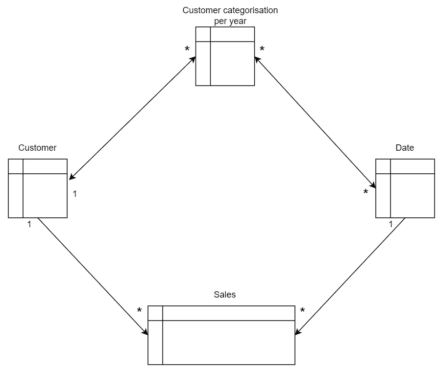

图 3 —双向过滤的数据模型(作者绘制)

但是，这种配置给数据模型带来了不确定性:

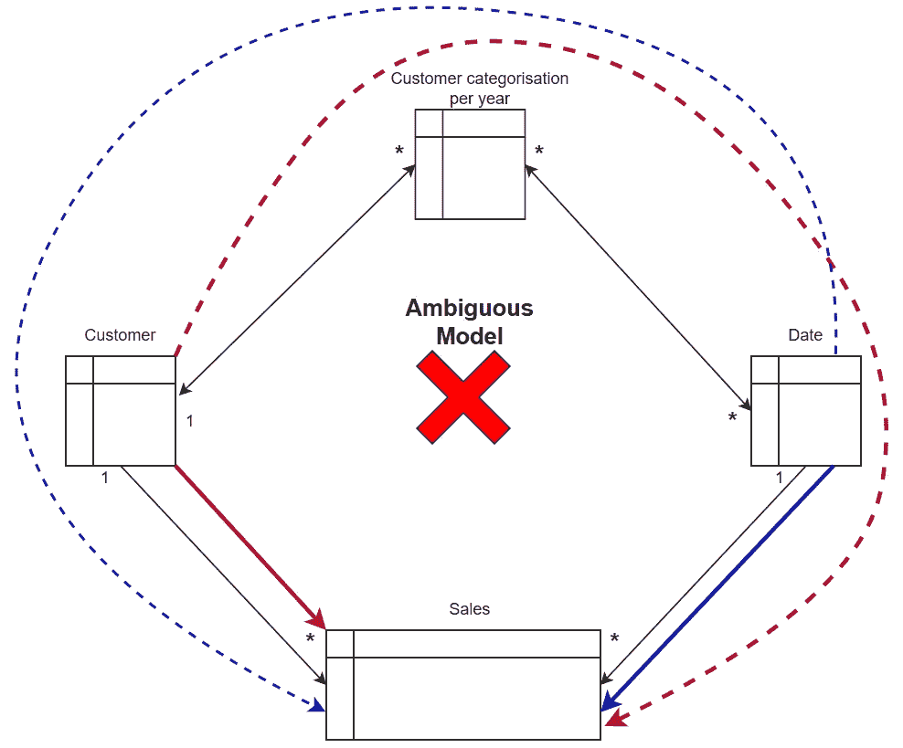

图 4 —不明确的数据模型(由作者绘制)

如您所见，Sales 表可以通过多条路径到达。表格模型不允许这样的配置。

当我试图将第二个关系设置为交叉筛选时，我得到一条错误消息:

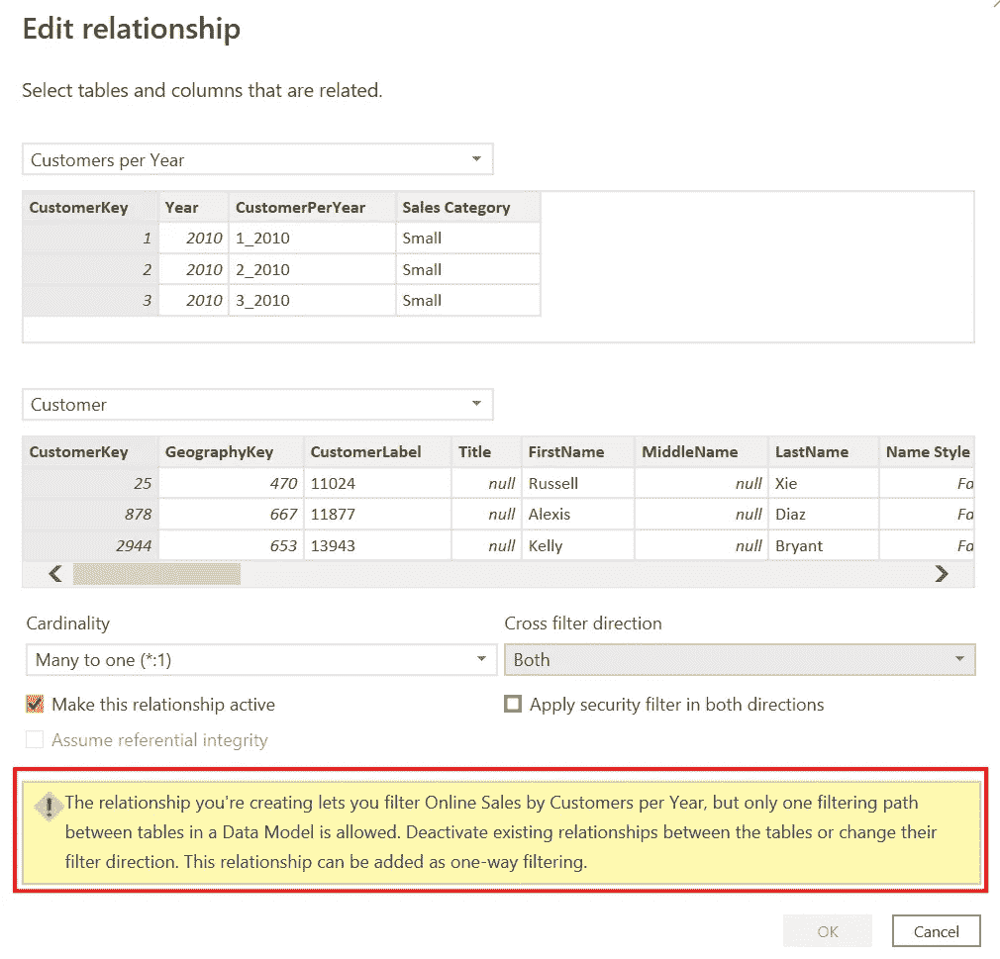

图 5 —不明确的错误消息(作者提供的图片)

这个特性确保了我的数据模型不会有歧义。

由于这种方法行不通，我们需要将逻辑视图转移到技术视图来解决这个问题。

在继续之前，花点时间尝试自己找到解决方案:

.

.

.

.

在 Power BI 或 Analysis Services (SSAS)的表格模型中建模数据的一个原则是避免雪花模式，如上所示。重温一段感情需要时间。这同样适用于使用雪花来过滤数据。

参加 SQLBI 关于数据建模的免费在线课程可以获得关于这个主题的很好的解释。

或者观看以下来自 SQLBI 的关于模糊性问题的视频:

好吧，有什么解决办法？

我们需要改变模型，在新的每年客户分类表和销售表之间建立联系:

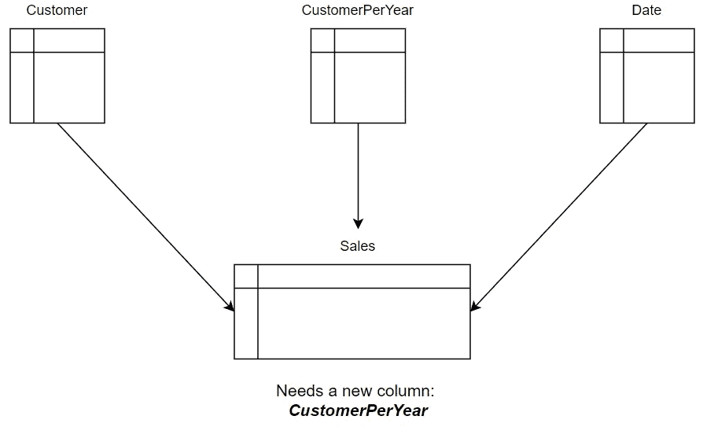

图 6 —目标数据模型(由作者绘制)

为了实现这一点，我们需要在两个表中添加一个额外的列，将 CustomerKey 和订单年份结合起来

下一步，我们将准备数据来满足这些要求。

# 步骤 2 —数据准备

首先，我们必须决定在哪里准备数据。

当我们有一个关系数据库作为数据源时，我们可以在数据库中创建一个视图，或者添加一个新表并定期刷新数据。

如果这是不可能的，我们可以使用数据库查询或使用 Power Query 来准备数据。

在我的例子中，不允许我更改源上的数据库。

但是在将数据导入 Power BI 时，我可以通过查询添加新表。

但是，我们有两种方法来准备新表:

1.  从所有客户与所有年份的组合来看
2.  来自销售表中客户和订单日期的组合

这两种变体之间的区别如下:

*   使用 Customer 表时，每个客户和年份都有一行，不管该客户在该年是否下了订单
*   使用 Sales 表时，您将只获得每年下订单的客户的行
*   使用销售表时，您将得到一个更短的表

您需要根据自己的需求来决定哪种变体最适合您:

*   如果您只对某一年有订单的客户感兴趣，那么可以使用销售表
*   当您对所有客户都感兴趣时，不管订单如何，请使用客户表

根据源系统的不同，加载时间会有所不同。您必须用您的源系统测试这一点。[查询折叠](https://docs.microsoft.com/en-us/power-query/power-query-folding)可以在这个场景中产生显著的不同。

# 通过查询获取数据

从数据库中，我们可以使用以下查询从 Customer 表中获取数据:

```
WITH [Years]
AS
    (SELECT DISTINCT [Year]
        FROM [dbo].[Date])
    SELECT [CustomerKey]
        ,[Year]
        ,CONVERT(nvarchar(50)
              , [CustomerKey]) + ‘_’ + CONVERT(nvarchar(50), [Year]) AS [CustomerPerYear]
      FROM [dbo].[DimCustomer]
           CROSS JOIN [Years];
```

或者类似下面的查询，当从 Sales 表中获取数据时:

```
SELECT DISTINCT CONVERT(nvarchar(30), [CustomerKey]) + ‘_’ + CONVERT(nvarchar(30), YEAR([OrderDate]) )
    FROM [dbo].[V_FactOnlineSales];
```

但是有时候，你必须使用 Power Query 来准备你的数据。

例如，当源数据不是来自关系数据库，或者您不具备所需的技能时。

# 使用 Power Query 获取数据

让我们看看如何使用 Customers 表作为源为新表准备数据:

1.  打开 Power Query 并从 Customer 表中创建一个引用:

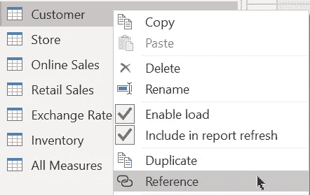

图 7 —创建客户表的引用(作者提供的图片)

2.删除除客户密钥之外的所有其他列:

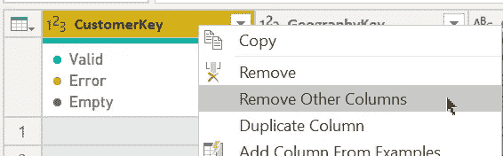

图 8 —删除所有列，除了自定义键(图片由作者提供)

3.从日期表中添加自定义列:

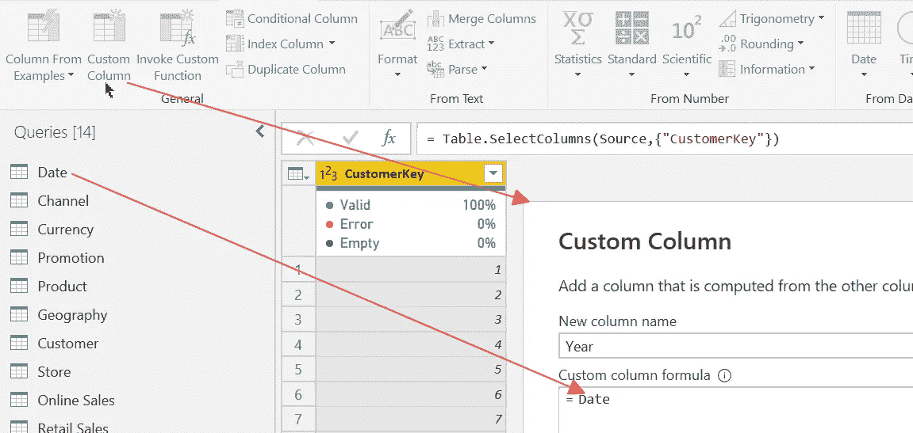

图 9 —从日期表中添加一个定制列(作者提供的图片)

4.展开日期表，仅使用年份列:

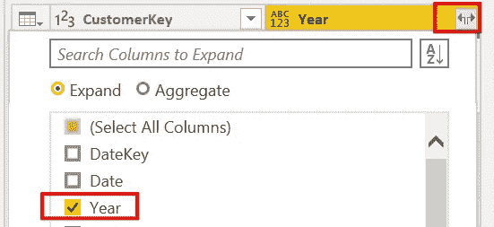

图 10 —展开数据表(作者提供的图片)

这一步对应于上面 SQL 语句中的交叉连接。它将 Customer 表的每一行与 date 表的 Year 列中的每个值相乘。

5.选择剩余的列并删除所有重复的列:

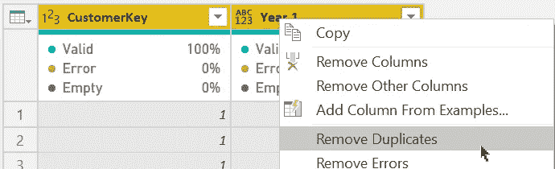

图 11 —删除所有重复项(图片由作者提供)

现在你看到结果了:

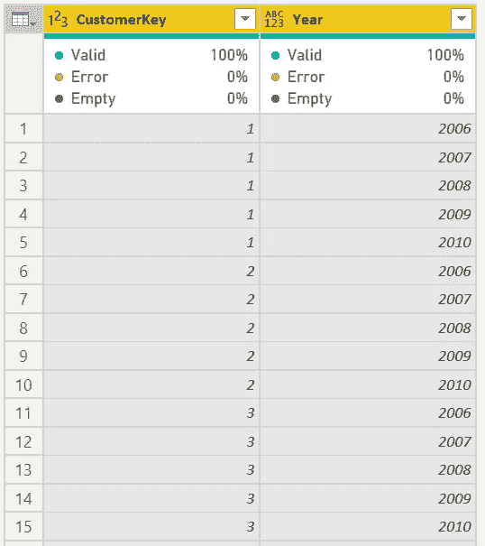

图 12 —日期表中所有年份所有客户的结果(作者提供的图片)

当使用 Sales 表作为新表的源时，过程是不同的。

首先，您必须在 Sales 表中创建键列，结合 CustomerKey 和 Year:


图 13 —添加新的键列(作者提供的图片)

对新表使用以下表达式:

```
Text.From ( [CustomerKey] ) & “_” & Text.From ( [OrderYear] ))
```

在 sales 表中，可以使用下列表达式之一:

当您有一个数字日期键列时，可以使用下面的表达式，如 20220322:

```
Text-From ( [CustomerKey] )
    & “_”
    & Text.From ( OrderDateKey / 10000 )
```

或者这个表达式，当 OrderDate 作为日期列时:

```
Text.From ( [CustomerKey] )
    & “_”
    & Text.From ( Date.Year ( [OrderDate] ) )
```

接下来，创建一个被引用的表，删除除新的 CustomerPerYear 列之外的所有列，并删除重复的列。

现在，您已经准备好将数据加载到数据模型中，并完成解决方案。

# 步骤 3 —完成数据模型并计算和测试结果

下一步是在新的每年*客户分类*表和销售表之间添加一个关系:

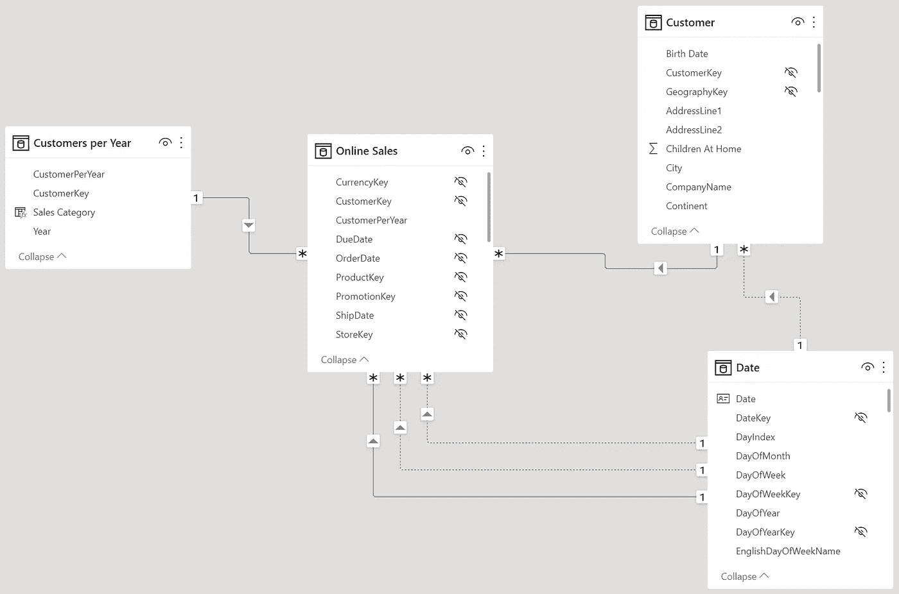

图 14 —带有新表的数据模型(作者提供的图片)

下一步是使用上下文转换来计算每个客户每年的销售额。

如果您不了解这种机制，可以阅读我关于上下文转换的文章:

</whats-fancy-about-context-transition-in-dax-efb5d5bc4c01>  

首先，我们创建一个调用现有销售度量值的计算列:

```
Sales per Year = [Online Sales (By Order Date)]
```

下一步是验证结果。

我在我的报告中添加了一个矩阵，包括客户、年份和基本度量，比如销售额。现在，我可以使用矩阵中的结果与新表中的结果进行比较。

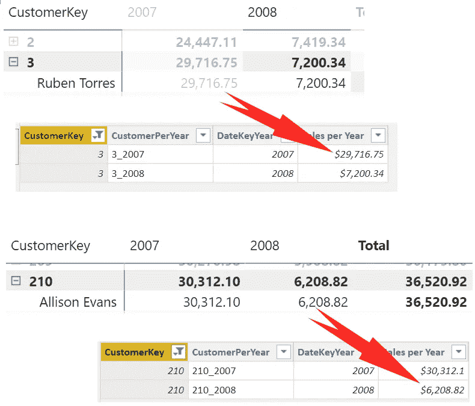

图 15 —结果的验证(作者提供的图片)

下一步是添加计算分类的条件:

```
Category by Sales =SWITCH( TRUE()
    ,ISBLANK([Online Sales (By Order Date)]), “No Sales”
        ,[Online Sales (By Order Date)] < 10000, “Small Sales”
        ,[Online Sales (By Order Date)] >= 10000
           && [Online Sales (By Order Date)] < 25000, “Medium Sales”
        ,”Large Sales”
        )
```

现在可以创建一个度量来计算新的*客户每年分类*表中的行数(Counter = count rows(‘客户每年’))，从而创建一个如下所示的报告:

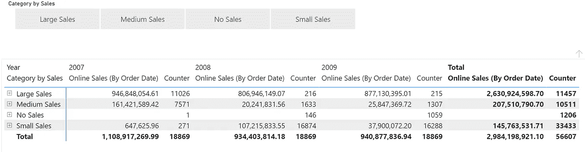

图 16 —包含每个类别的销售和客户(包括没有销售的客户)的报告(图片由作者提供)

要获得这个报告，您必须使用新表中的 Year 列。日期表中的年份列将不起作用。

有一个解决方案可以解决无法使用日期表的问题。

我邀请你思考这个问题，并写下你的解决方案作为回应。

# 结论

如您所见，逻辑或业务视图和技术解决方案之间可能存在差异。

它有助于为您的模型创建计划更改的绘图。这样的绘图将有助于看到和理解计划中的变化的含义。

这些要求对数据的准备有重大影响。您需要了解预期，以便根据需要准备数据。

完成数据模型的最后一步很简单，因为绘图已经包含了数据模型的定义。

计算结果的 DAX 代码是最后一步，可能非常简单也可能非常复杂。计算也是由需求定义的。

如您所见，对需求的理解对于解决方案的定义至关重要。理解需求所花的每一分钟都将节省您在实施解决方案过程中的时间。

不要小看这个。


由[达伦·劳伦斯](https://unsplash.com/@wild_away?utm_source=medium&utm_medium=referral)在 [Unsplash](https://unsplash.com?utm_source=medium&utm_medium=referral) 上拍摄的照片

# 参考

我使用 Contoso 样本数据集，就像我以前的文章一样。你可以从微软[这里](https://www.microsoft.com/en-us/download/details.aspx?id=18279)免费下载 ContosoRetailDW 数据集。

Contoso 数据可以在 MIT 许可下自由使用，如这里的[所述](https://github.com/microsoft/Power-BI-Embedded-Contoso-Sales-Demo)。

<https://medium.com/@salvatorecagliari/membership> 