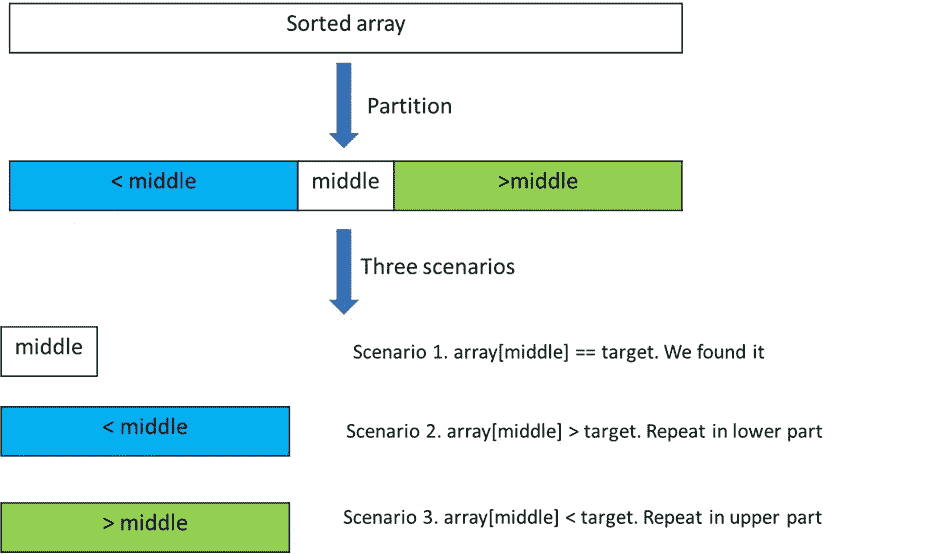
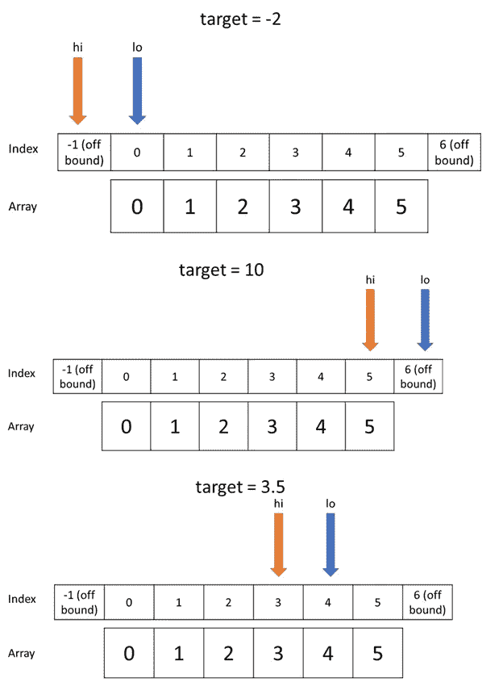

# 了解二分搜索法的三件事

> 原文：<https://towardsdatascience.com/three-things-to-know-about-binary-search-cf3b00971c2c>

## 彻底揭开二分搜索法的神秘面纱

二分搜索法将列表分为两部分，然后只关注其中的一部分。照片由[克鲁索](https://unsplash.com/@thexclu?utm_source=medium&utm_medium=referral)在 [Unsplash](https://unsplash.com?utm_source=medium&utm_medium=referral) 上拍摄

从概念上讲，二分搜索法是一种非常容易理解的算法。然而，实现它是非常困难的，尤其是当你试图实现它的许多变种时。我的目标是让你明白如何很好地实施二分搜索法，这将是你需要的关于二分搜索法的最后一本指南。

几点:第一，这篇文章是长文。有时候，当我们解释事情的时候，我们倾向于跳过对每个人来说不明显的事情。其次，我使用 Python 编写代码。在 Python 中，数组中的第一个元素的索引是`0`，数组中的最后一个元素的索引是`len(array)-1`。阅读本指南后，你将能够适应 1 索引语言。另外，Python 是一种动态类型语言。如果你使用像 C++这样的静态语言，为`lo`和`hi`使用合适的数据类型。

感恩:我从[拉布拉东二分搜索法教程](https://labuladong.gitbook.io/algo-en/iii.-algorithmic-thinking/detailedbinarysearch#fourth-unified-logic)中学到了区间和退出条件的概念。这是我读过的关于面试算法的最好的公开指南。你在这里读到的一些东西是他思想的延伸。我认为他对寻找左右边界的解释太快了，所以我在本指南中花了相当大的篇幅来解释这个问题。

# 概念审查

二分搜索法是一种分治算法。目标是在排序后的数组中找到一个目标值。它只能处理已排序的数据，通常是按升序排序的。该算法通过选择数组中的中间点，然后将数组分为三部分:小于中间点的部分、中间点和大于中间点的部分。有关解释，请参见图 1。

图一。二分搜索法算法的概念概述。假设所有元素都是唯一的。作者图。

# 人们为什么与二分搜索法斗争？

从个人经验和阅读 StackOverflow 来看，实施二分搜索法的大部分问题似乎来自:

*   越界->错误的间隔考虑
*   目标存在但未找到->间隔之间的间隙
*   返回了错误的元素->没有考虑退出条件
*   第一个或最后一个元素的边界情况
*   整数溢出(在 C++ 等静态类型语言中发现)

如果你需要精通二分搜索法的实现，你需要理解为什么会发生这一切。**理解**有三个步骤:(1)区间，(2)分区，(3)退出条件。

# 一:音程

首先，我们来复习一下音程的概念。结束间隔包括结束值，而开始间隔不包括。

*   间隔`[1,5]`具有以下元素:`1 2 3 4 5`
*   间隔`[1,5)`具有以下元素:`1 2 3 4`
*   间隔`(1,5)`具有以下元素:`2 3 4`

考虑以下打印一组整数的函数。

循环的退出条件是`lo > hi`。当我们增加`lo`直到`lo = hi+1`时，它退出。这意味着该功能将打印出闭合区间`[lo, hi]`内的所有值，包括 lo 和 hi。

现在，考虑下面的函数。

该功能的退出条件是`lo >= hi`。当我们增加`lo`直到`lo == hi`的点时，它退出。这意味着该功能不会打印`hi`。该功能打印出左开区间`[lo, hi)`的所有值

Take away 1。如果我们想要一个两端封闭的区间`[lo, hi]`，那么我们使用`lo <= hi`作为我们的循环条件。另一方面，如果我们想要一个左端开放区间`[lo, hi)`，我们必须在循环条件中使用`lo < hi`。

现在，让我们将它应用于遍历一个列表。在我们的封闭区间中，我们想要遍历范围`[0, length(array) — 1]`中的所有元素，因此我们的遍历循环如下:

如果我们想遍历一个左开区间，那么最后一个元素(不包括)应该是 `length(array)`，我们的区间应该是`[lo, length(array))`

我的建议是，从现在开始，无论你什么时候实现二分搜索法，你都要使用封闭区间。不仅闭区间更容易理解，而且它还具有开区间所没有的对称性质。下面的函数说明了这一点，这些函数通过递减 hi 来向后遍历间隔。对称性使得封闭区间的反向版本成为可能，但开放区间版本则不可能。第一个功能覆盖`[lo, hi]`，但是第二个功能覆盖`(lo, hi]`而不是`[lo, hi)`。

# 第二:隔板

如果列表有不止一个元素，我们可以把它分成三个子列表。`[lo, middle — 1]`是左边的子列表，`[middle, middle]`是一个元素列表，`[middle + 1, hi]`是右边的子列表。

Take away 2。三个区间`[lo, middle — 1]` `[middle, middle]`和`[middle + 1, hi]`不重叠，并且覆盖了整个闭合区间`[lo, hi]`。这确保了列表中的所有元素都被考虑在内。

区间的选择是很多人犯错的地方:

*   为什么左音程在`middle-1`结束？因为记住这些都是闭区间(含闭区间)。`[lo, middle-1]`表示该区间也有元素`middle-1`。如果我们使用区间`[lo, middle]`，那么我们的区间将与`[middle, middle]`元素重叠，这是我们不想要的。`[middle+1, hi]`的逻辑相同。

我使用我选择的三个封闭区间来实现。

最后，我们退出 while 循环，因为`lo > hi`，这表明我们在数组中找不到目标。它返回`None`。

Take away 3。使用`mid = lo + (hi — lo)//2`。当你用其他语言实现二分搜索法时，用这个代替`mid = (hi+lo)//2`。这是因为`hi+lo`可以溢出([斯基亚纳的书](https://www.algorist.com/)是我第一次了解到这个的地方)。

如果我们想在区间`[lo, hi)`上搜索，而不是在封闭区间`[lo, hi]`上搜索呢？我们仍然可以对数组进行分区，但是我们的所有分区(除了中间的分区)都必须有右开区间。这是因为我们已经使二分搜索法适应右开音程，所以它接收的应该是右开的。回想一下，我们的起始条件应该是`[0, length(array))`，因为`length(array)`不包含在区间内。

我们想要的分区是`[lo, mid)`和`[mid+1, hi)`。

*   为什么左音程在`mid`结束？因为这个区间是`[lo, mid)`所以它不包括`mid`元素。因此它不与`[mid, mid]`区间重叠。自己确认它们没有重叠，并且仍然覆盖整个右开区间`[lo, hi)`。

# 三:退出条件

在我们的封闭区间例子中，如果目标不在数组中，那么最终`lo > hi`和 while 循环退出。但是在这些情况下`lo`和`hi`指针在哪里呢？

考虑下面的排序数组`[0 1 2 3 4 5]`和三种情况的`target`:

*   目标= -2
*   目标= 10
*   目标= 3.5

一旦我们退出循环，这里就是`lo`和`hi`指针所在的位置(注意在所有这些情况下都是`lo > hi`)。

图二。作者图

Take away 4。如果`target`在`array`中不存在，那么`lo`显示的是**目标在数组**中的索引。对此的解释相当简单:

*   在第一种情况下，我们只更新`hi`的值，因为`nums[mid] > target`在 while 循环的每次迭代中。这意味着`lo`停留在`0`直到我们退出。因为新元素比所有其他元素都小，所以我们将它插入位置`0`。
*   在第二种情况下，我们只更新`lo`的值，因为在 while 循环的每次迭代中`nums[mid] < target`。当`lo > hi`或`lo == hi + 1`时，回路存在。因为`hi`指针不改变值，我们在`lo == length(array)`时退出循环。因为新元素比其他所有元素都大，所以我们将它插入到位置`length(array)`。(`array`指原数组)
*   在第三种情况下，由于 target 不存在，我们将列表分成两部分:小于`target`的列表和大于`target`的列表。当循环退出时，`lo`标志着第二部分的开始。当我们插入目标元素时，它将获取`lo`所指向的索引。

如果你不熟悉，这可能很难得到，所以一步一步地自己看几个例子。调试工具可以帮助您在循环的不同迭代中查看`lo`和`hi`的值。另一种思考方式是`lo`指针索引显示**有多少元素严格小于目标**。在第一个例子中，有一个比`-2`小的`0`元素。在第二个例子中，有比`10`小的`6`元素。在第三个例子中，有比`3.5`小的`4`元素。

我们为什么要做这些？因为我想告诉你如何修改二分搜索法算法来完成许多其他任务，每个任务都建立在前一个任务的基础上。相信我，一切都是值得的。

# 二分搜索法的变体

## 任务 1。找出比目标值小的元素数

我们之前的观察是一个很好的起点。当我们退出循环时，我们返回`lo`而不是`None`。但是，当我们在数组中找到`target`时，我们该怎么办呢？我们知道，如果目标不存在于数组中，那么函数将退出，并且`lo`指向解。换句话说，如果`array[mid] == target`没有被调用，那么函数将退出，并且`lo`指向解决方案。我们可以修改前面的函数，这样当`array[mid] == target`不返回`mid`时，我们更新`lo`或者`hi`指针。

那么，我们更新哪个指针呢？这取决于我们想在哪里搜索。如果我们找到一个等于`target`的值，并且我们想知道有多少个元素更小，那么专门在较低的分区中搜索是有意义的。因此，我们希望更新 hi 指针，将搜索区间缩小到`[lo, mid-1]`。

这是我们的解决方案。注意第 8 行是我们修改的地方。

## 任务 2。找到目标的第一次出现

想象一下，如果我们的排序列表没有唯一的元素。我们的任务是找到第一次出现的`target`。我们不能使用常规的二分搜索法，因为它不能保证我们将返回正确的索引。

这个任务和任务 1 很像(原因就看你自己了)。事实上，任务 1 的解决方案在大多数情况下都适用。唯一的问题是当元素在数组的边缘或者`target`不在数组中的时候。请记住，任务 1 的解决方案返回数组中小于目标的元素数，因此结果可以是从`0`到`length(array)`的任意值。

*   如果当`lo == len(array)`时 while 循环存在，那么我们知道所有元素都小于 target。我们可以返回`-1`,因为目标不存在
*   否则，`lo`指向大于或等于 target 的第一个元素(仔细阅读)。该元素可以是`lo`或大于`lo`。我们简单地检查一下`array[lo] == target`。

## 任务三。找到目标的最后一次出现

我们能反过来吗？是的，我们可以感谢闭区间的**对称性(这是我在编码二分搜索法时推荐闭区间的另一个原因)。我们需要修改以下内容:**

*   当`array[mid] == target`时，我们现在更新 lo 指针，这样我们就可以专注于闭合区间`[mid+1, hi]`
*   我们返回`hi`的值。该值的范围从`-1`到`length(array)-1`(返回图 2 查看`hi`的范围)。如果`hi == -1`，那么所有元素都大于目标，所以我们返回`None`

## 任务 4。第一缺陷元素

给定两个数组，一个充满缺陷元素(表示为“F”)，一个充满正常元素(表示为“T”)。不知道两个数组是否都非空。我们将两个数组连接在一起，这样得到的数组如下所示:

`[T T T T T T F F F F F F F F F F F]`

我们的任务是找出正常元素的数量。要了解二分搜索法如何提供帮助，请考虑一个只有两个唯一数字 1 和 2 的数组:

`[1 1 1 1 1 1 1 1 1 1 1 2 2 2 2 2 2 2 2 2 2]`

显而易见，我们可以使用函数`elements_less_than`来查找数组中 1 的数量。现在，假设我们所有的输入都是由数字 1 和 2 以这种方式排列而成的。我们可以通过删除不必要的代码来修改函数:

请注意两个变化:

*   我们删除`array[mid] > target`分支条件。之所以不需要，是因为数组只有 1 和 2，所以我们没有大于 2 的元素。
*   我们将`array[mid] < target`改为`array[mid] == 1`。这是因为元素小于 2 的唯一方式是它等于 1。

简单地用 T 和 F 代替 1 和 2 就得到我们的解。另一种思考方式是，当我们找到 T 时，我们需要更新对上层分区的搜索，反之亦然。

# 外卖食品

1.  这是我推荐的二分搜索法框架。它使用封闭区间`[0, length(array) — 1]`。记住三个分区`[lo, mid-1]`、`[mid, mid]`和`[mid+1, hi]`。如果要使用 open interval `[0, length(array))`，记得正确分区即可。

2.现在，您可以通过考虑以下四点来调试任何二分搜索法代码:

*   间隔是多少？
*   分区重叠并覆盖整个阵列吗？
*   当循环退出时，`lo`和`hi`的位置在哪里？
*   如果目标位于边缘会发生什么？

编码快乐！

以下是一些训练问题:

     