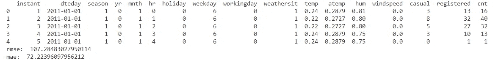
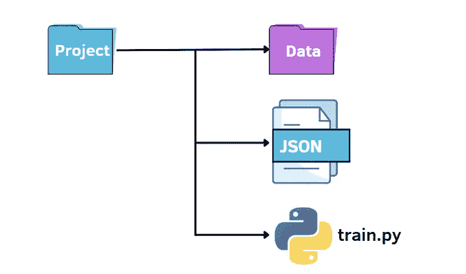
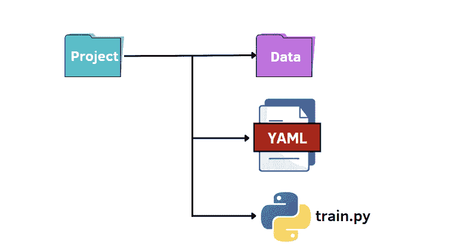

# 解析 Python 代码中参数的三种方法

> 原文：<https://towardsdatascience.com/three-ways-to-parse-arguments-in-your-python-code-aba092e8ad73>

## 通过使用 Python 中的命令行和配置文件来提高代码的效率


里卡多·安南达尔在 [Unsplash](https://unsplash.com/photos/7e2pe9wjL9M) 上的照片

如果你在机器学习和深度学习模型方面做了很多工作，你可能会在 Jupyter 笔记本或 python 脚本上尝试改变超参数一百万次，以提高数据集的性能。如果每次编辑时都要检查代码，这可能会很耗时。

在从事数据科学项目时，我发现了不同的方法来加速这种持续的变化。第一个选项是使用`argparse`，这是一个流行的 Python 模块，专门用于命令行解析。另一种方法是读取 JSON 文件，在那里可以放置所有的超参数。第三种也是不太为人所知的方法是使用 YAML 文件！你好奇吗？开始教程吧！

# 先决条件

在本教程中，我将使用 Visual Studio 代码，这是一个非常高效的 Python 集成开发环境。这个程序的美妙之处在于，它通过安装扩展支持每一种编程语言，集成了终端，并允许同时处理大量的 python 脚本和 Jupyter 笔记本。如果您从未使用过它，请查看本指南[这里的](https://code.visualstudio.com/docs/languages/python)开始使用

为了展示这些命令行策略的效率，**自行车共享数据集** [1]正被用于根据温度、风速和湿度等特征来预测每小时租赁自行车的数量。这个数据集可以在 [UCI 的机器学习库](https://archive.ics.uci.edu/ml/datasets/bike+sharing+dataset)和 [Kaggle](https://www.kaggle.com/datasets/lakshmi25npathi/bike-sharing-dataset) 上找到。

目录:

1.  **使用 argparse**
2.  **使用 JSON 文件**
3.  **使用 YAML 文件**

# 1.使用 argparse


使用 argparse 的项目结构。作者插图

在我们的迷你项目中，我们有一个标准的结构来组织我们的工作:

*   名为`data`的文件夹包含我们的数据集
*   `train.py`文件
*   用于指定超参数的`options.py`文件

首先，我们可以创建一个文件`train.py`，其中包含导入数据、根据训练数据训练模型以及在测试集上评估模型的基本过程:

在代码中，我们还导入了 train_options 函数，它包含在`options.py`文件中。后一个文件是一个 python 文件，从中我们可以更改 train.py 中考虑的超参数:

在这个例子中，我们使用了`argparse`库，这是一个非常流行的解析命令行参数的库。首先，我们初始化解析器，然后，我们可以添加我们想要访问的参数。

这是一个运行代码的示例:

```
python train.py
```



要更改超参数的默认值，有两种方法。第一个选项是在`options.py`文件中设置不同的默认值。另一种方法是从命令行传递超参数值:

```
python train.py --n_estimators 200
```

我们需要指定想要更改的超参数的名称以及相应的值。

```
python train.py --n_estimators 200 --max_depth 7
```

# 2.使用 JSON 文件



使用 JSON 文件的项目结构。作者插图

像以前一样，我们可以维护一个类似的文件结构。在本例中，我们用一个 **JSON** 文件替换了`options.py`文件。换句话说，我们希望在 JSON 文件中指定超参数的值，并将它们传递给`train.py`文件。与 argparse 库相比， **JSON** 文件可能是一个快速而直观的替代方案。它利用键值对来存储数据。下面，我们创建了一个`options.json`文件，其中包含了我们稍后需要传递给其他代码的数据。

```
{
"normalize":true,
"n_estimators":100,
"max_features":6,
"max_depth":5 
}
```

如您所见，它非常类似于 python 字典。与字典不同，它包含文本/字符串格式的数据。此外，还有一些语法略有不同的常见数据类型。比如一个布尔值是**假** / **真**，而 python 识别的是**假** / **真**。JSON 中其他可能的值是数组，用方括号表示为 python 列表。如果您想深入理解 JSON 文件所要求的语法，请在这里查看其他案例。

在 python 中使用 JSON 数据的好处在于，它可以通过`load`方法转换成 python 字典:

```
f = open("options.json", "rb")
parameters = json.load(f)
```

要访问一个特定的项目，我们只需要引用它在方括号中的键名:

```
if parameters["normalize"] == True:
    scaler = StandardScaler()
    X = scaler.fit_transform(X)rf=RandomForestRegressor(n_estimators=parameters["n_estimators"],max_features=parameters["max_features"],max_depth=parameters["max_depth"],random_state=42)
model = rf.fit(X_train,y_train)
y_pred = model.predict(X_test)
```

# 3.使用 YAML 文件



使用 YAML 文件的项目结构。作者插图

最后一个选择是挖掘 YAML 的潜力。像 JSON 文件一样，我们将 python 代码中的 YAML 文件作为字典来读取，以访问超参数的值。YAML 是一种人类可读的数据表示语言，其中层次结构用双空格字符表示，而不是像 JSON 文件中那样用括号表示。下面我们展示了`options.yaml`文件将包含的内容:

```
normalize: True 
n_estimators: 100
max_features: 6
max_depth: 5
```

在`train.py`中，我们打开`options.yaml`文件，该文件将始终使用`load`方法转换成 Python 字典，这次是从 yaml 库导入的:

```
import yaml
f = open('options.yaml','rb')
parameters = yaml.load(f, Loader=yaml.FullLoader)
```

和以前一样，我们可以使用字典所需的语法来访问超参数的值。

# 最后的想法

如果你在这里，你终于到了文章的结尾。恭喜你！本文的目标是展示三种优雅而有效的方法来解析 python 代码中的参数。

*   配置文件编译起来非常快，而 argparse 需要为每个想要添加的参数编写一行代码。
*   根据您的目的，这些方法中的一种可能是您的正确选择。
*   例如，如果您需要为参数添加注释，JSON 并不合适，因为它不允许注释，而 YAML 和 argparse 可能是一个很好的选择。

感谢阅读。祝您愉快！

## 参考资料:

[1]https://www.capitalbikeshare.com/data-license-agreement

你喜欢我的文章吗？ [*成为会员*](https://eugenia-anello.medium.com/membership) *每天无限获取数据科学新帖！这是一种间接的支持我的方式，不会给你带来任何额外的费用。如果您已经是会员，* [*订阅*](https://eugenia-anello.medium.com/subscribe) *每当我发布新的数据科学和 python 指南时，您都会收到电子邮件！*