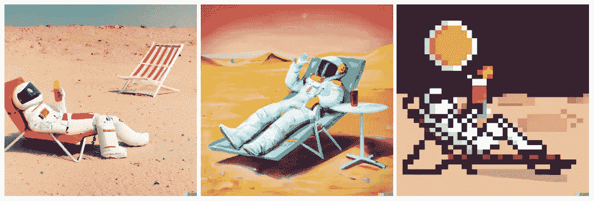
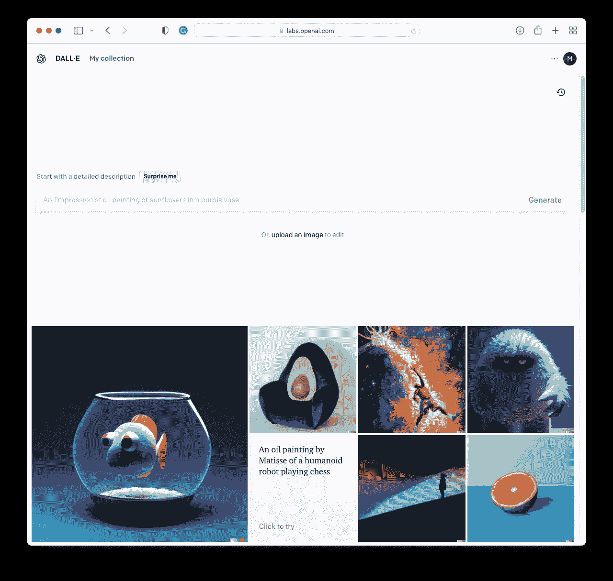
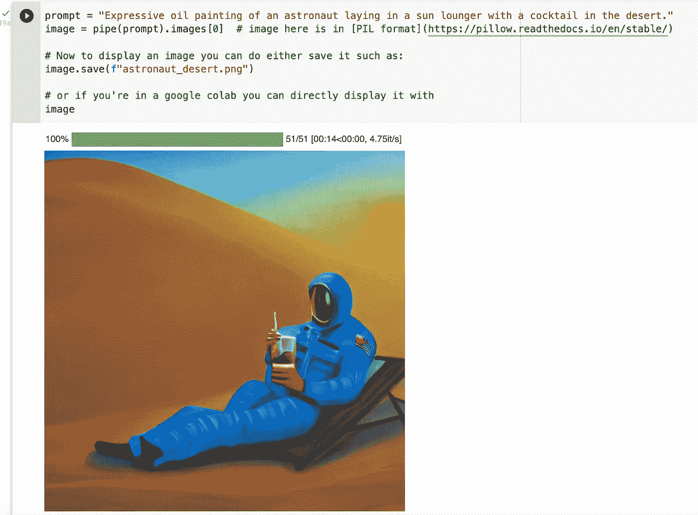
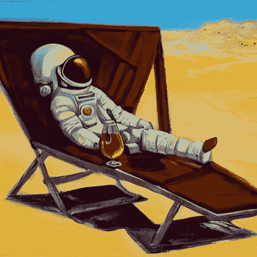

# 使用人工智能生成令人惊叹的图像的三种方法

> 原文：<https://towardsdatascience.com/three-ways-to-use-ai-to-generate-stunning-images-44c667c89a28>



“照片/表现性油画/像素艺术，一名宇航员躺在沙漠中的躺椅上，喝着鸡尾酒。”—用 DALL-E2 使用各自的提示创建的图像。

最近，互联网上充斥着人工智能生成的惊人图像。也就是说，用户提供文本提示，AI 系统基于所述提示生成图像。有趣的是，它不仅产生了——坦率地说——非凡的图像，而且人们可以将有趣的想法和风格结合起来。这可能意味着你将一名宇航员放在沙漠中，并将其作为照片级真实感图像、富有表现力的油画或像素艺术。在这里，我们将提供三种方法，让你可以用不同的技术专业知识水平探索这些技术:在线版本的 *DALL-E 2* ，谷歌 Colab，以及本地版本的*稳定扩散。*

## 背景

让我们首先简要了解一下不同技术的一些基本信息。[*DALL-E 2*](https://en.wikipedia.org/wiki/DALL-E)*是一个拥有 35 亿参数的 AI 模型，由 [OpenAI](https://openai.com) 在[创成式预训练变压器(GPT)](https://en.wikipedia.org/wiki/Generative_Pre-trained_Transformer) 模型的基础上构建而成。针对选定用户的测试阶段于 2022 年 7 月开始，并于 9 月 28 日由 OpenAI 向公众推出，源代码尚未公开。*

*与此相反，稳定扩散的代码和模型权重对[公众](https://github.com/CompVis/stable-diffusion)可用。这是一个潜在的扩散模型，于 2022 年 8 月 22 日由 Ludwig Maximilian 大学(LMU)的 CompVIS 集团、[stability ai](https://stability.ai)——一家视觉艺术初创公司和 [Runway](https://runwayml.com) 合作发布。稳定扩散模型是用大规模人工智能开放网络( [LAION](https://en.wikipedia.org/wiki/LAION) )的数据训练的，这是一家德国非营利组织，从网络上搜集图像。模型本身有 8.9 亿个参数，可以在消费级显卡上运行。*

*除了 DALL-E，还有 [Midjourney](https://www.midjourney.com/home/) ，它也只能通过云服务访问，并于 2022 年 7 月 12 日开始公开测试。*

*从商业角度来看，人工智能生成的艺术似乎非常有前途。StabilityAI 刚刚从[筹集了 1.01 亿美元](https://techcrunch.com/2022/10/17/stability-ai-the-startup-behind-stable-diffusion-raises-101m/?guccounter=1&guce_referrer=aHR0cHM6Ly93d3cuZ29vZ2xlLmNvbS8&guce_referrer_sig=AQAAAF-7nlldrhRUB5FtuJITew7PeyssTHYQit4FjI3wVX49ijDVkbsPjBInzZlrRq7P84d-Q7zT1WOy-PZIpRHspgdvv67qZn0oB7WH7_XaqKzaXZJiUzn0YYCTX5dCDgzwUuWn7Loye0n1BL9yFYF2bTyseLGB6VpapBXReDRu938e)，Midjourney 声称[已经盈利。](https://www.theregister.com/2022/08/01/david_holz_midjourney/)*

## *达尔-E 2*

**

*截至 2022 年 10 月的 DALL-E 登录后截图。*

*DALL-E 2 的用法简单明了:进入 OpenAI 的 DALL-E 2 页面[注册](https://openai.com/dall-e-2/)。他们将需要一个手机号码来注册您的帐户。就是这样。你最终会看到一个类似谷歌的文本提示；输入你的想法，几秒钟内就能生成四幅示例图像。你可以点击单个图像，得到它们的变化。每要求 [*花费*](https://help.openai.com/en/articles/6399305-how-dall-e-credits-work) 你一个信用点；第一个月你将获得 50 个学分，随后的每个月会增加 15 个学分。此外，你可以花 15 美元购买 115 个积分。*

## *稳定扩散*

*如果你更喜欢开源的替代稳定扩散，我们首先需要设置东西。*

***谷歌可乐。**如果你没有合适的硬件，我推荐使用 Google Colab，它可以访问适合该任务的 GPU。作为起点，我们从这个[笔记本](https://colab.research.google.com/github/huggingface/notebooks/blob/main/diffusers/stable_diffusion.ipynb)开始。它需要一个[拥抱脸](https://huggingface.co/)令牌来访问模型权重。你可以通过创建一个拥抱脸帐户，前往[稳定扩散](https://huggingface.co/CompVis/stable-diffusion-v1-4)模型，并接受共享模型的条款来获得令牌。*

*要生成图像，请执行所有单元格，直到需要输入令牌，然后继续执行，直到到达可以输入图像生成提示的单元格。这需要几分钟的时间，生成一幅图像需要几秒钟的时间。*

**

*Google Colab 和 Stable Diffusion:“一幅富有表现力的油画，描绘了一名宇航员躺在阳光躺椅上，在沙漠中喝着鸡尾酒。”*

*如果您想将图像保存到您的 Google Drive，例如保存在文件夹 *exported-images* 中，您可以这样做:*

*安装驱动器:*

```
*from google.colab import drive
drive.mount(‘/content/gdrive’)*
```

*保存图片(注意主目录是*我的驱动*为谷歌驱动)*

```
*image.save(f"/content/gdrive/My Drive/exported-images/image.png")*
```

*Google Colab 方法的一个局限性是，如果失去了与内核的连接，您需要重新设置环境。*

***本地安装。**如果你有一台为深度学习任务而设置的 GPU 机器正在运行；您可以在本地安装并运行稳定的扩散。更准确地说，你应该有一个 Python 环境(比如 [Anaconda](https://anaconda.org/) 或者 [Miniconda](https://docs.conda.io/en/latest/miniconda.html) )， [Git](https://git-scm.com/) ，并且正确安装了 GPU，也就是 CUDA 驱动)。实事求是地说，对于一台装有 NVIDIA 卡的 Windows 机器，如果你运行*

```
*nvidia-smi*
```

*在命令行中，您应该会看到 CUDA 版本。对于安装，您可以遵循 [GitHub](https://github.com/CompVis/stable-diffusion) 指令，但是本质上，您通过 Git 克隆存储库并创建和安装环境。*

```
*conda env create -f environment.yaml
conda activate ldm*
```

*接下来，你需要从稳定扩散的[拥抱脸页面下载重量。我用的是最新的](https://huggingface.co/CompVis/stable-diffusion-v-1-4-original)[SD-v1–4 . ckpt](https://huggingface.co/CompVis/stable-diffusion-v-1-4-original/resolve/main/sd-v1-4.ckpt)。在 Linux 上，可以像 GitHub 存储库上描述的那样链接文件；在 Windows 系统上，您可以下载该文件并将其重命名为 model.ckpt，然后将其复制到稳定扩散模型的文件夹中，如下所示:*

```
*models/ldm/stable-diffusion-v1/model.ckpt*
```

*然后，您可以(在激活的环境中)通过命令行提示符创建图像(注意，您需要位于 GitHub 存储库的文件夹中):*

```
*python scripts/txt2img.py --prompt "Expressive oil painting of an astronaut laying in a sun lounger with a cocktail in the desert" --plms*
```

**

*“一幅富有表现力的油画，描绘了一名宇航员躺在太阳躺椅上，喝着沙漠中的鸡尾酒”——由稳定扩散的本地装置生成。请注意，我尝试了五种不同的种子，才在照片中找到一名穿着太空服的宇航员。*

*生成的图像将位于 outputs/txt2img-samples 中。*

*这里的是一个更详细的安装指南，也展示了如何使用网络界面。*

*我用 12 GB 内存的 Titan V 进行了测试，确实经常遇到内存问题。在这里，通过传递-H 或-W 参数或者用-n_samples 减少样本数来减小大小是有帮助的。*

## *结论*

*今天，生成带有文本提示的 AI 图像出奇的容易。使用 DALL-E 2 这样的工具，甚至不需要昂贵的硬件或编码技能。虽然图像质量令人惊叹，但仍可能存在伪像，这些伪像会泄露图像是人造的，例如，当查看来自稳定扩散的本地安装的最后一个示例图像的阴影时。最终，我相信这将彻底改变创意部门，因为它从未如此容易地将想法可视化。*