# 门限自回归模型——超越 ARIMA + R 码

> 原文：<https://towardsdatascience.com/threshold-autoregressive-models-beyond-arima-r-code-6af3331e2755>

## 满足 TAR——自回归模型的非线性扩展。


由 [3844328](https://pixabay.com/pl/users/3844328-3844328/)

## 介绍

当谈到时间序列分析时，在学术上你最有可能从自回归模型开始，然后扩展到自回归移动平均模型，然后扩展到积分使其成为 ARIMA。接下来的步骤通常是季节性分析类型，包含额外的内生和外生变量(ARDL，VAR)最终面临协整。*从这一刻开始，事情变得越来越有趣*。

这是因为这是严格而美好的程序的终结，例如在 Box-Jenkins 方法中。[如前所述，时间序列中非线性排列的可能数量几乎是无限的](https://medium.com/@michacukrowski/nonlinear-time-series-an-intuitive-introduction-7390aae8b446)——因此通用程序不再适用。是不是意味着游戏结束了？见鬼不要。如今，处理非线性时间序列最流行的方法是使用机器学习和深度学习技术——由于我们不知道时刻 *t-1* 和 *t* 之间的真实关系，我们将使用一种不假设依赖类型的算法。

在机器学习之前，计量经济学家是如何管理这个问题*的？这就是 TAR 模型的用武之地。*

## 阈值自回归模型

让我们从简单的 AR 模型开始。其公式确定为:

一切都只存在于一个等式中——美丽。在我们继续讨论焦油的分析公式之前，我需要告诉你它实际上是如何工作的。首先，在 TAR 模型中，我们称之为*机制*。它们是什么？它们是由*阈值*分隔的区域，根据这些阈值我们切换 AR 方程。*我们交换，什么？*为简单起见，让我们考虑最简单的双机制 TAR 模型:

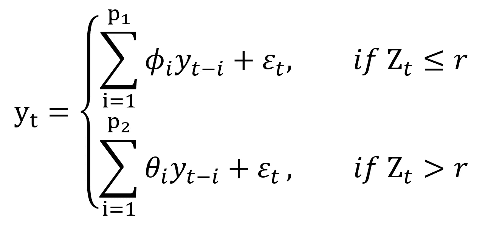

阈值自回归的一般方程，作者的图形。

其中:

p1，p2——自回归子方程的阶数，

r —已知的阈值，

z _ t——取决于状态的力矩 *t* 中的已知值

现在让我们来读一下这个公式，以便更好地理解它:

> 时间序列在时刻 *t* 的值等于满足*条件的自回归模型的输出:****Z≤r****或* Z *> r.*

听起来有点抽象，对吧？难怪 TAR 模型是阈值转换模型的概括。**这意味着在建立政权转换发生的条件模型时，你是最灵活的。我建议你读完整篇文章后再读一遍这一部分——我保证到时会更清楚。现在，让我们来看一个更实际的例子。**

如果我们用*时间序列的前一个值*代替 Z_t 值，TAR 模型就变成了一个自激门限自回归模型— SETAR(k，p1，…，pn)，其中*k*是模型中的状态数，【T10]p 是每个自回归分量的连续阶数。两种状态的 SETAR(2，p1，p2)模型可以描述为:

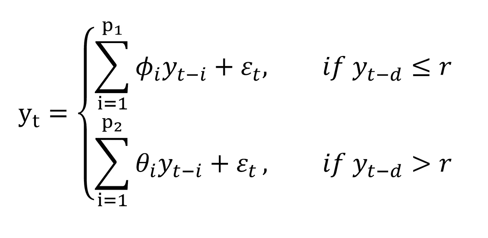

两种状态下的一般方程。

现在它看起来更贴近地面了，对吗？让我们用散点图来形象化它，这样你就有了直觉:

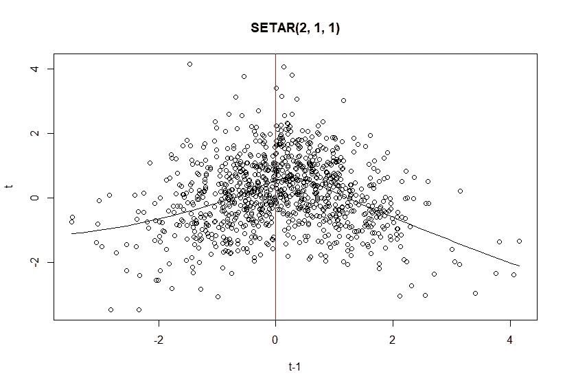

生成的 SETAR(2，1，1)的散点图，其上绘制了黄土线和标记阈值的垂直红线，由作者绘制。(由 tsDyn 生成)

在这种情况下，`k = 2`、`r = 0`、`p1 = p2 = 1`和`d = 1`、*。*你可以清楚地看到状态转换发生的阈值。但是在实际的时间序列上看起来如何呢？

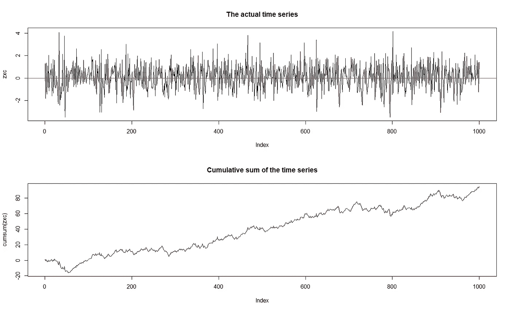

生成的 SETAR(2，1，1)及其累积和，由作者绘制。

正如你所看到的，仅仅从外观上很难说我们正在处理一个阈值时间序列。那我们能做什么？让我们解决一个没有生成的例子，这样你就可以重复整个过程。

## **建模程序**

让我们开始编码吧，我会一路解释这个过程。我们将使用 Lynx 数据集，并将其分为训练集和测试集(我们将进行预测):

```
library("quantmod")
library("tsDyn")
library("stats")
library("nonlinearTseries")
library("datasets")
library("NTS")

data <- log10(datasets::lynx)

train <- data[1:80]
test <- data[81:114]
```

我记录了整个数据集，因此我们可以获得整个数据集的更好的统计属性。现在，让我们检查自相关和偏自相关:

```
{par(mfrow=c(2,1))
acf(train)
pacf(train)}
```

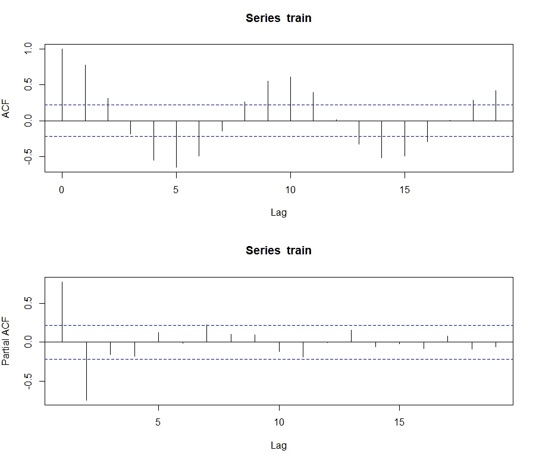

按作者

看起来这个系列有可能以 ARIMA 为模型——也将在路上尝试一下。然而，让我们来看看滞后图:

```
{par(mfrow=c(2,2))
  scatter.smooth(Lag(train, 1), train, span = 2/3, degree = 1,
                 family = c("symmetric", "gaussian"), evaluation = 50, 
  xlab = "t-1", ylab = "t")
  scatter.smooth(Lag(train, 2), train, span = 2/3, degree = 1,
                 family = c("symmetric", "gaussian"), evaluation = 50, 
  xlab = "t-2", ylab = "t")
  scatter.smooth(Lag(train, 3), train, span = 2/3, degree = 1,
                 family = c("symmetric", "gaussian"), evaluation = 50, 
  xlab = "t-3", ylab = "t")
  scatter.smooth(Lag(train, 4), train, span = 2/3, degree = 1,
                 family = c("symmetric", "gaussian"), evaluation = 50, 
  xlab = "t-4", ylab = "t")
}
```

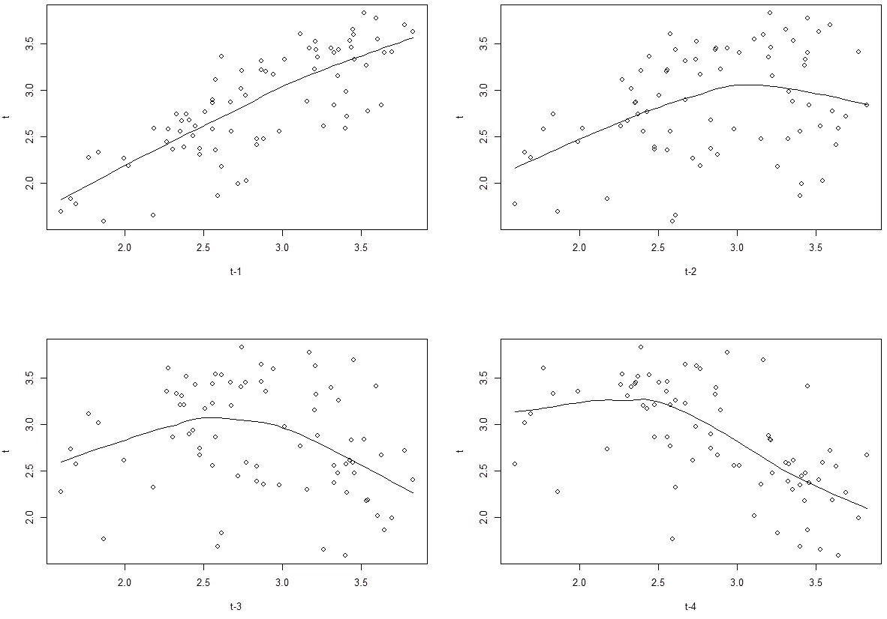

黄土线打开时训练集的滞后散点图，作者

在第一个滞后中，这种关系似乎确实适合 ARIMA，但从第二个滞后上看，非线性关系是显而易见的。然而，有时事情就是这样发生的，要决定这种类型的非线性是否存在并不那么简单*。在这种情况下，我们必须进行统计测试——这种方法是汉森和 Tsay 最推荐的方法。然而，为了做到这一点，最好首先建立我们或多或少在谈论的滞后次序。为此，我们将使用平均互信息，并将订单限制为其第一个本地最小值:*

```
*mutualInformation(train)*
```

*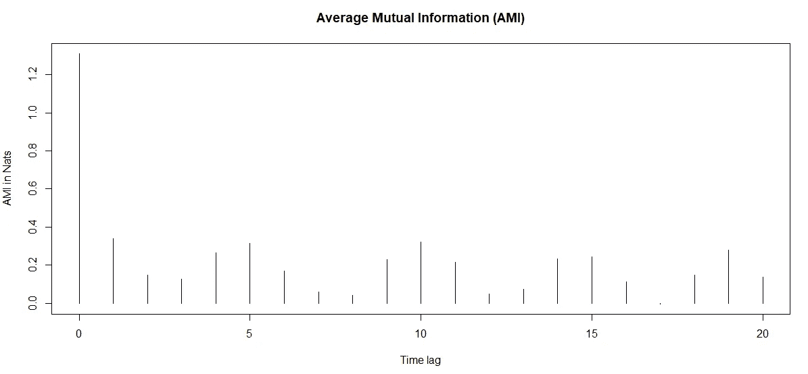*

*作者为训练集创建的 AMI*

*因此，嵌入维度被设置为`*m=3*`。当然，这只是一种方法，你可以用不同的方法。请注意，我们可以再次看到强烈的季节性。现在，我们已经建立了最大滞后，让我们执行统计测试。我们将使用似然比检验来检验阈值非线性。它的假设是:*

> *H0:这个过程是一个 AR(p)*
> 
> *H1:这个过程是一个集合*

*这意味着我们想要拒绝关于过程是 AR(p)的零假设——但是记住过程应该是自相关的——否则，H0 可能没有多大意义。*

```
*for (d in 1:3){
  for (p in 1:3){
    cat("p = ", p, " d = ", d, " P-value = ", thr.test(train, p=p, d=d), "\n")
  }
}*
```

```
*SETAR model is entertained 
Threshold nonlinearity test for (p,d):  1 1 
F-ratio and p-value:  0.5212731 0.59806 

SETAR model is entertained 
Threshold nonlinearity test for (p,d):  2 1 
F-ratio and p-value:  2.240426 0.1007763 

SETAR model is entertained 
Threshold nonlinearity test for (p,d):  3 1 
F-ratio and p-value:  1.978699 0.1207424 

SETAR model is entertained 
Threshold nonlinearity test for (p,d):  1 2 
F-ratio and p-value:  37.44167 1.606391e-09 

SETAR model is entertained 
Threshold nonlinearity test for (p,d):  2 2 
F-ratio and p-value:  8.234537 0.0002808383 

SETAR model is entertained 
Threshold nonlinearity test for (p,d):  3 2 
F-ratio and p-value:  7.063951 0.0003181314 

SETAR model is entertained 
Threshold nonlinearity test for (p,d):  1 3 
F-ratio and p-value:  30.72234 1.978433e-08 

SETAR model is entertained 
Threshold nonlinearity test for (p,d):  2 3 
F-ratio and p-value:  3.369506 0.02961576 

SETAR model is entertained 
Threshold nonlinearity test for (p,d):  3 3 
F-ratio and p-value:  3.842919 0.01135399* 
```

*正如你所看到的，在`alpha = 0.05` 我们不能拒绝只有参数`d = 1`的零假设，但是如果你回头看看滞后曲线，你就会明白为什么会发生这种情况。*

*另一个可以进行的测试是汉森线性测试。它的假设是:*

> *H0:时间序列遵循一些 AR 过程*
> 
> *H1:时间序列遵循某种特定的过程*

*然而，这一次，假设被指定得更好一点——我们可以测试 AR 与 SETAR(2)、AR 与 SETAR(3)甚至 SETAR(2)与 SETAR(3)！让我们测试我们的数据集:*

```
*setarTest(train, m=3, nboot=400)
setarTest(train, m=3, nboot=400, test='2vs3')*
```

```
*Test of linearity against setar(2) and setar(3)

         Test   Pval
1vs2 25.98480 0.0175
1vs3 46.31897 0.0150

Test of setar(2) against  setar(3)

         Test   Pval
2vs3 15.20351 0.2425*
```

*这个测试基于 bootstrap 分布，因此计算可能会变得有点慢——不要放弃，你的计算机没有死，它需要时间:)在第一种情况下，我们可以拒绝两个空值——时间序列遵循 SETAR(2)或 SETAR(3)。从第二个测试中，我们发现我们不能拒绝 SETAR(2)的空值，因此没有理由怀疑 SETAR(3)的存在。因此，SETAR(2，p1，p2)是要估计的模型。*

*到目前为止，我们已经估计了 *m* 、 *d* 和*k*的值的*可能范围*，仍然需要的是阈值 *r* 。不幸的是，它的估计是最棘手的，几十年来一直是计量经济学家的一大难题。我不知道任何计算它的分析方法(如果你知道，请在评论中告诉我！)，而是通常执行网格搜索。*

*背后的直觉有点类似于决策树中的递归二进制分裂——我们用增加的阈值连续地估计模型。幸运的是，我们不必从 0 开始编写代码，这个特性在 r 中是可用的。*

*对于给定的阈值，我们希望实现*最小的可能信息标准值。尽管如此，这种方法总会给你一些输出！你要找的是一个**清晰的最小值**。这看起来不错:**

*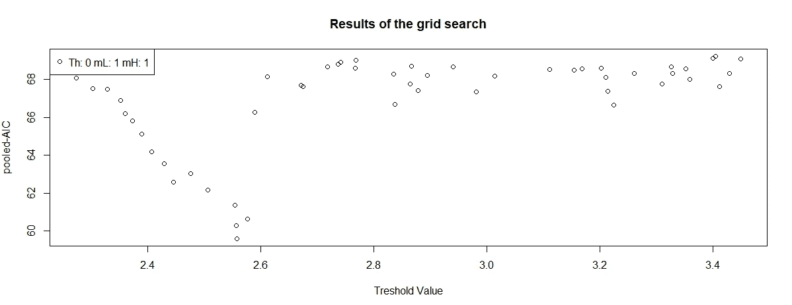*

*对 tsDyn 生成的数据集进行网格搜索*

*有一个*明确*最低一点点低于 2.6。图表越呈 V 形越好——但这并不意味着你总能得到漂亮的结果，因此解释和滞后图对你的推断至关重要。这就是*不*好看的地方:*

*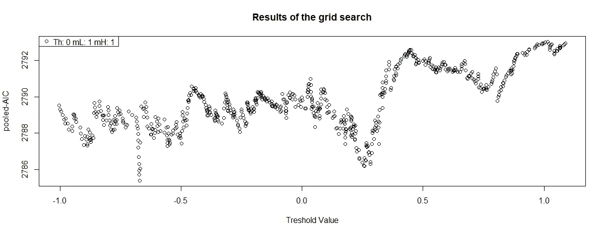*

*生成数据集的网格搜索*

*虽然这个也有一些局部最小值，但不像以前那么明显——让 SETAR 来取这个阈值，你就有过度拟合的风险。实际上，虽然它看起来从来没有这么好——你在寻找许多组合，因此会有许多像这样的线。让我们回到我们的例子:*

```
*selectSETAR(train, m=3, thDelay=1:2)*
```

```
*Using maximum autoregressive order for low regime: mL = 3 
Using maximum autoregressive order for high regime: mH = 3 
Searching on 50 possible threshold values within regimes with sufficient ( 15% ) number of observations
Searching on  900  combinations of thresholds ( 50 ), thDelay ( 2 ), mL ( 3 ) and MM ( 3 ) 
Results of the grid search for 1 threshold
   thDelay mL mH       th pooled-AIC
1        2  3  3 2.940018  -26.88059
2        2  3  3 2.980912  -26.44335
3        2  3  2 2.940018  -24.66521
4        2  3  2 2.980912  -24.43568
5        2  3  3 2.894316  -24.20612
6        2  3  3 3.399847  -22.98202
7        2  3  2 2.894316  -22.89391
8        2  2  3 2.940018  -22.15513
9        2  3  2 3.399847  -21.34704
10       2  1  3 2.940018  -20.52942*
```

*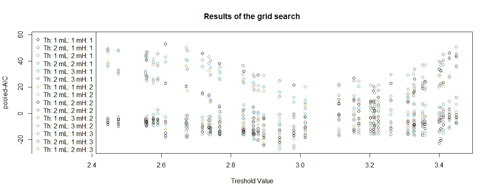*

*训练集的网格搜索*

*因此，首选系数为:*

```
*thDelay mL mH       th pooled-AIC
2        3  3 2.940018  -26.88059*
```

*太好了！是时候进行最终的模型估算了:*

```
*model <- setar(train, m=3, thDelay = 2, th=2.940018)
summary(model)*
```

```
*Non linear autoregressive model

SETAR model ( 2 regimes)
Coefficients:
Low regime:
   const.L     phiL.1     phiL.2     phiL.3 
 0.8765919  0.9752136  0.0209953 -0.2520500 

High regime:
   const.H     phiH.1     phiH.2     phiH.3 
 0.3115240  1.6467881 -1.3961317  0.5914694 

Threshold:
-Variable: Z(t) = + (0) X(t)+ (0)X(t-1)+ (1)X(t-2)
-Value: 2.94 (fixed)
Proportion of points in low regime: 55.84%   High regime: 44.16% 

Residuals:
       Min         1Q     Median         3Q        Max 
-0.5291117 -0.1243479 -0.0062972  0.1211793  0.4866163 

Fit:
residuals variance = 0.03438,  AIC = -254, MAPE = 5.724%

Coefficient(s):

         Estimate  Std. Error  t value  Pr(>|t|)    
const.L  0.876592    0.227234   3.8577 0.0002469 ***
phiL.1   0.975214    0.142437   6.8466 2.117e-09 ***
phiL.2   0.020995    0.196830   0.1067 0.9153498    
phiL.3  -0.252050    0.121473  -2.0749 0.0415656 *  
const.H  0.311524    0.685169   0.4547 0.6507163    
phiH.1   1.646788    0.172511   9.5460 2.027e-14 ***
phiH.2  -1.396132    0.277983  -5.0224 3.576e-06 ***
phiH.3   0.591469    0.272729   2.1687 0.0334088 *  
---
Signif. codes:  0 ‘***’ 0.001 ‘**’ 0.01 ‘*’ 0.05 ‘.’ 0.1 ‘ ’ 1

Threshold
Variable: Z(t) = + (0) X(t) + (0) X(t-1)+ (1) X(t-2)

Value: 2.94 (fixed)*
```

*SETAR 模型已安装。现在，由于我们正在进行预测，让我们将其与 ARIMA 模型(通过 auto-arima 拟合)进行比较:*

```
*ARIMA(4,0,1) with non-zero mean 

Coefficients:
         ar1     ar2      ar3      ar4     ma1    mean
      0.3636  0.4636  -0.4436  -0.2812  0.9334  2.8461
s.e.  0.1147  0.1290   0.1197   0.1081  0.0596  0.0515

sigma^2 = 0.0484:  log likelihood = 8.97
AIC=-3.93   AICc=-2.38   BIC=12.74

Training set error measures:
                        ME      RMSE       MAE        MPE     MAPE      MASE
Training set -0.0002735047 0.2115859 0.1732282 -0.6736612 6.513606 0.5642003
                     ACF1
Training set -0.002296863*
```

*SETAR 似乎更适合训练。现在让我们比较测试集的 MSE 和 RMSE 的结果:*

*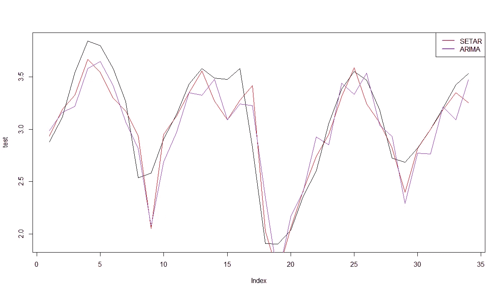*

*作者对塞塔和 ARIMA 的样本外预测*

```
*SETAR MSE: 0.04988592
SETAR RMSE: 0.2233516

ARIMA MSE: 0.06146426
ARIMA RMSE: 0.2479199*
```

*如您所见，SETAR 能够为训练集和测试集提供更好的结果。*

## *最终注释*

1.  *TAR 的平稳性——这是一个非常复杂的话题，我强烈建议您从科学资源中寻找相关信息。然而，你可以应用一个不完整的规则:**如果在任何一个机制中有一个单位根，那么整个过程是非平稳的**。*
2.  *第一个生成的模型是平稳的，但在某些条件下，TAR 也可以模拟非平稳的时间序列。当它的状态都是稳定的时候，这样做是安全的。在这种情况下，你很可能会处理结构性变化。*
3.  *制度的数量——理论上，制度的数量是不受限制的，但是根据我的经验，我可以告诉你，如果制度的数量超过 2，通常最好使用机器学习。*
4.  ***SETAR 模型经常与 TAR 混淆**——如果您在统计包中看到一个实际上是 SETAR 的 TAR 模型，请不要惊讶。每个星都是星，但不是每个星都是星。*
5.  *为了适应模型，我使用了 AIC 和 pooled-AIC(SETAR)。如果您的案例需要不同的衡量标准，您可以轻松地更改信息标准。*

## *摘要*

*阈值自回归模型曾经是过去最流行的非线性模型，但今天主要被机器学习算法取代。尽管如此，多年来它们已经被证明是有用的，而且因为你总是为任务选择工具，我希望你会发现它有用。*

*当然，SETAR 是一个可以扩展的基本模型。如果你对获得更好的结果感兴趣，请确保关注我的[个人资料](https://medium.com/@michacukrowski)！*

*你也可以在 [LinkedIn](https://www.linkedin.com/in/micha%C5%82-cukrowski/) 上找到我。*

*[链接](https://www.picostat.com/dataset/r-dataset-package-datasets-lynx)到数据(GNU)。*

*[](/nonlinear-time-series-an-intuitive-introduction-7390aae8b446) [## 非线性时间序列——直观介绍

### 为什么你的标准时间序列分析程序有时会失败？

towardsdatascience.com](/nonlinear-time-series-an-intuitive-introduction-7390aae8b446)*