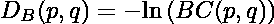
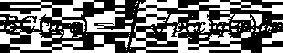
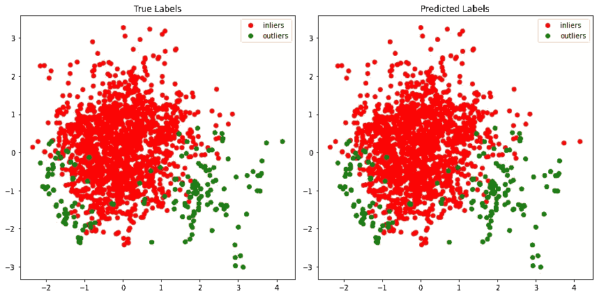

# 用 PyThresh 设定异常检测分数的阈值

> 原文：<https://towardsdatascience.com/thresholding-outlier-detection-scores-with-pythresh-f26299d14fa>

[附身摄影](https://unsplash.com/@possessedphotography?utm_source=unsplash&utm_medium=referral&utm_content=creditCopyText)在 [Unsplash](https://unsplash.com) 上拍照

## 异常值检测中取代污染水平必要性的方法

现实生活往往是混乱的，不可预测的。它似乎喜欢把隐喻的“扳手”扔进工作中，使数据通常显得令人困惑和随机。记录或提取的大多数数据通常需要在应用建模等进一步方法之前进行某种形式的清理。然而，通常很难或几乎不可能从视觉上区分哪些数据是真实的，哪些是噪音，哪些是异常。有时，异常甚至可能是必要的，这使得区分使用什么数据的行为更加复杂。这就是离群点检测技术的用武之地。

异常值检测方法可以有多种形式。但是他们检测异常值能力的关键通常是通过一组统计条件。有些方法很严格，有些方法很简单，但所有这些方法对于数据科学家在寻找与众不同的数据时都很重要。

[***PyOD***](https://github.com/yzhao062/pyod) 是众多 python 库中的一个，它包含了用于离群点检测的有用方法集合。它使用简单，比大多数其他库有更多的异常检测方法。因此，它是大多数数据科学家的最爱。然而，当试图使用大多数方法来发现异常值时，存在一个讨厌但必要的参数…污染水平*。大多数方法在应用于数据集时会返回异常值置信度得分。这个分数本身是有用的，但是就像回归对于分类一样，它缺少标签。因此，需要一个污染水平来设置边界，通过设定置信分值的阈值来区分内点和外点。*

*在 [***PyOD***](https://github.com/yzhao062/pyod) 和许多其他库中，通常在异常值检测之前设置污染水平。然而，这个输入参数提出了一个问题:在测试异常值之前，如何知道数据集的污染程度？这是一个很好的问题！这个问题的答案通常意味着在异常值检测之前必须进行某种形式的统计测试，以获得污染水平。流行的方法包括使用 z 得分或四分位数区域。虽然这些都是正确污染水平的一个很好的近似值，但它们也有自己的缺点。更好的方法是对离群值检测分数本身应用统计测试，以便从离群值中阈值化内联者。*

*下面的例子将实现[***py thresh***](https://github.com/KulikDM/pythresh)*库…这是一个用于阈值离群点检测分数的库，我参与并正在积极开发。[***PyThresh***](https://github.com/KulikDM/pythresh)由一组统计方法组成，这些方法试图设定异常值检测分数的阈值，而无需在拟合数据之前设置污染水平。这些统计方法从经典的阈值方法如 k-均值聚类和概率距离，到涉及拓扑和图论的更模糊的方法。总而言之，当涉及到异常值检测时，他们试图将污染水平的猜测(尽管他们可能受过教育)排除在等式之外。**

**让我们看看如何在无监督的异常值检测分数上实现阈值处理。对于下面的示例，将使用来自 [*异常值检测数据集(* ***赔率*** *)*](http://odds.cs.stonybrook.edu/#table1) 的*心血管*开源数据集。这个数据集是由石溪大学免费提供的，代表了真实世界的数据。**

***心脏* ( [心脏分娩图](http://odds.cs.stonybrook.edu/cardiotocogrpahy-dataset/))数据集[2][3]包含由产科专家分类的心脏分娩图上的胎儿心率和子宫收缩特征的测量值。测量结果分为正常(内值)或病理性(异常值)。**

**首先，让我们加载 *cardio* 数据集，并标准化将由异常值检测方法评分的变量。**

**如果我们快速看一下数据，我们可以看到我们将有 21 个解释变量，每个变量有 1831 个唯一的条目。在这些条目中，1655 个(~90%)属于响应变量中的内点，176 个(~10%)属于外点。**

**为了正确识别这两个类别，选择正确的异常值检测和异常值阈值方法是很重要的。对于这个数据集，由于探索变量的数量，选择了*主成分分析* ( **PCA** )无监督离群点检测方法。这种方法通过构造由特征向量生成的子空间来降低数据的维数，所述特征向量表示仍然能够解释数据的最高方差。离群值在这种维数减少过程中会变得更加明显，离群值分数是样本在所有特征向量上的投影距离的总和。对于这个数据集，我们将组件的数量从 21 个减少到 5 个。**

**异常值和阈值方法之间的协同作用通常提供更好的结果。这是由于离群值检测方法生成的分数随后被阈值方法处理的方式。这两种方法表现得越相似，出现不合理阈值的可能性就越小。然而，情况并非总是如此，选择正确的异常值检测和阈值方法可能需要在应用前后进行稳健的统计测试。**

**对于该数据集以及异常值检测方法，一个良好的对应阈值方法将是从正常 ( **DSN** )阈值的*距离偏移。该阈值的工作方式是将异常值的概率分布与正态分布进行比较，并测量两者之间的差异。使用统计距离时，选择将用于测量的度量非常重要。 **Bhattacharyya 距离**是两个概率分布之间相似性的度量，并返回它们之间存在的重叠量。从技术上来说，它不是一个指标，但是它将用于设置数据集的阈值。Bhattacharyya 距离被定义为，***

****

**其中 *p* 和 *q* 表示同一域上的两个概率分布 *X* ，连续概率分布的 Bhattacharyya 系数( *BC* )可以表示为:**

****

**最终设置异常值检测分数的阈值，使得任何大于 1 减去 Bhattacharyya 距离的分数都被标记为异常值。**

**现在有了更好的理解，我们可以将这些方法应用于数据集:**

**从 thresholder 返回的*标签*由一个二进制数组组成，其中内点用 0 表示，外点用 1 表示。在揭示这些方法的最终表现之前，让我们先来看看真实标签和预测标签的对比图。我们将再次使用 **PCA** ，但是现在通过减少维度来可视化 2D 的数据。当处理没有响应变量的真实世界数据时，这一步以及其他步骤是必不可少的，因为它提供了阈值的可视化表示。注意， **PCA** 是一个正交线性变换，因此具有非线性关系的异常值在视觉上可能不总是表现为明显的异常值。此外，将数据减少到 2 维也可以去除区分内部值和外部值所需的维度。然而，即使有这些缺点 **PCA** 可视化是一个强大的确认测试工具。**

****

**从图中我们可以看出， **DSN** 阈值和 **PCA** 异常值检测器分数能够非常准确地将异常值与内部值分开！这个例子的准确度是 99%,只有两个异常值被归类为内部值，没有内部值被归类为外部值。但是，根据数据集、应用的异常值检测器和阈值，预测精度会有所不同。尽管污染水平已被移除，以采用更具统计性的方法来确定阈值异常值，但最终，如果预测结果正确，则由数据科学家做出最终决定。**

**最后，异常值检测分数的阈值化并不是一门新的科学，并且已经有了许多成熟的实现。这些统计和数学方法增加了数据科学家的工具包，并有助于在信息和数据的奇妙世界中导航。**

**[1] *Shebuti Rayana (2016)。ODDS 库[http://ODDS . cs . stony brook . edu]。纽约州石溪市:石溪大学计算机科学系。***

**[2] C. C. Aggarwal 和 S. Sathe，“[异常值系综的理论基础和算法。](http://www.kdd.org/exploration_files/Article4.pdf)《美国计算机学会 SIGKDD 探索通讯》，第 17 卷，第 1 期，第 24–47 页，2015 年。**

**[3] Saket Sathe 和 Charu C. Aggarwal。[矿脉:局部密度符合光谱异常值检测。](https://epubs.siam.org/doi/pdf/10.1137/1.9781611974348.20)2016 年 SIAM 数据挖掘大会。**