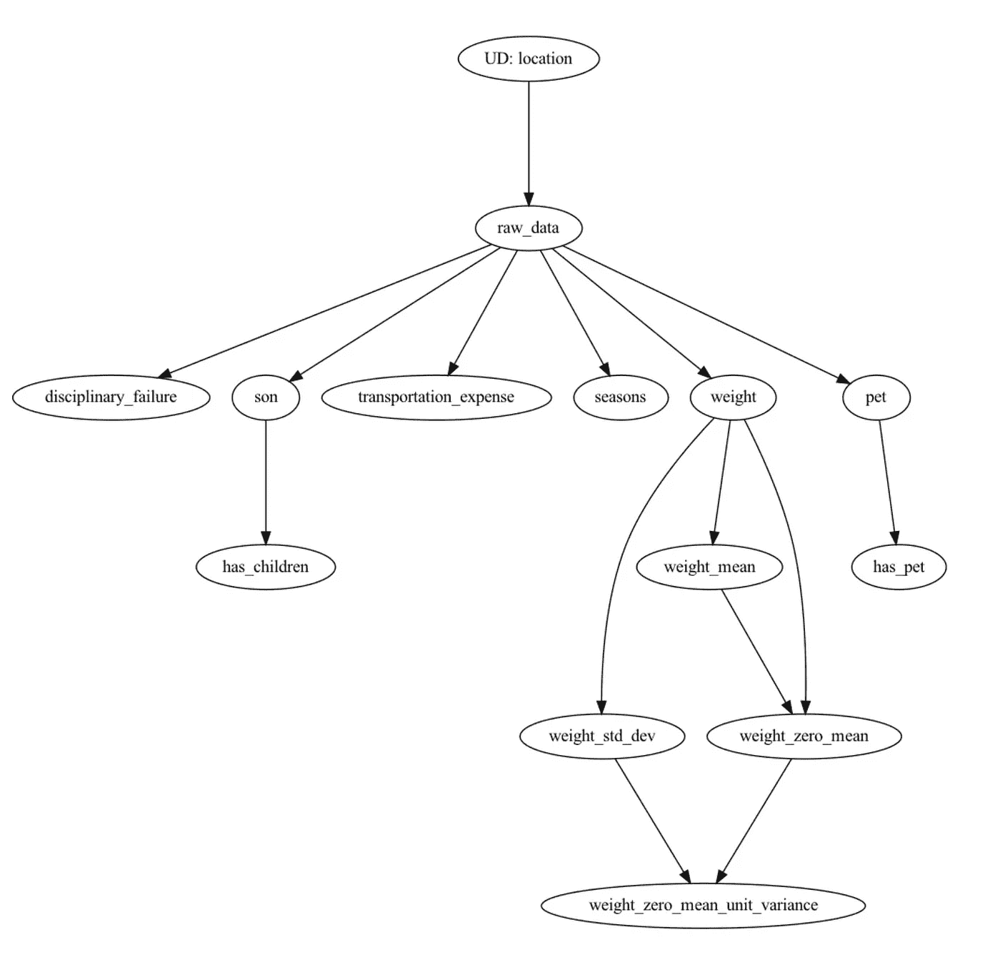

# 与汉密尔顿一起整理生产熊猫

> 原文：<https://towardsdatascience.com/tidy-production-pandas-with-hamilton-3b759a2bf562>

## 与汉密尔顿一起编写生产级熊猫代码。


你的熊猫与汉密尔顿代码。图片来自 Pixabay。

“**&[**熊猫**](https://pandas.pydata.org/) ”这两个词通常不会被联系在一起，更不用说与单词“**生产**”联系在一起了。在这篇文章中，我会说如果你在生产中使用 Pandas，你应该使用开源微框架 [Hamilton](https://github.com/DAGWorks-Inc/hamilton) ，因为它可以让你在默认情况下编写整洁的生产级代码。**

**你可能会想？这篇文章是关于熊猫的吗？是的，从整洁的代码的精神来看，但从如何实现的角度来看却不是。**

**此外，在我们开始之前，先说明一下我们的术语:**

****生产**:我们所说的生产是指为了使业务流程正常运行，需要运行这段代码。例如，为机器学习模型创建特征，或者将数据转换为仪表板工具。**

**整洁:整洁意味着代码是可读的、可维护的和可测试的。我们过分强调了你的代码长时间存活的能力；您的产品代码通常比您预期的寿命更长，所以让我们让它更容易维护。另一种思考方式是，我们希望您的熊猫代码能够方便地促进软件工程最佳实践。**

# **熊猫生产问题**

**关于熊猫代码是否应该在产品中运行，业界有很多不同意见。虽然这对于快速的原型和研究来说显然是很棒的，但是熊猫繁重的代码库经常会被自己绊倒；软件工程最佳实践很难遵循。**

**这下一节应该是所有的头点头；在生产中使用熊猫时感觉到的常见油漆点。**

## **集成测试和单元测试是一个挑战**

**熊猫代码通常被写成线性 python 脚本。这很可能是因为它最初是从一个 [Jupyterhub](https://jupyter.org/hub) 笔记本的不同单元中的代码开始的，这些单元本身是线性执行的。这种方法使得长时间测试变得困难。当然，当你开发脚本时，你也在“测试”它。但是一旦投入生产，时间可能会流逝，数据的背景可能会改变。例如，如果您需要调整正在运行的生产熊猫代码，您如何确信您所做的更改不会产生负面影响？单元测试很可能不存在，或者测试覆盖率参差不齐；编写内联 Pandas 操作很容易做到，但很难进行编程测试。而集成测试通常涉及到运行整个脚本。如果它进行大量的计算，这意味着测试所有东西的迭代周期很慢，或者可能完全跳过测试。**

## **文档不存在**

**文档对于协作和代码维护至关重要。如果您习惯于编写内联创建一堆列的 Pandas 代码(因为这很容易做到)，那么您总是会牺牲文档。文档应该容易呈现，并与代码同步。一旦你开始把文档放在代码之外，它就很容易过时…**

## **代码很难重用**

**通常会看到一个 python 文件包含所有的熊猫代码:提取数据的逻辑、执行转换的逻辑和保存输出的逻辑。这意味着这个脚本中的转换函数不容易访问或重用。有些人反驳说“我就重构”，但这种情况会发生几次呢？人们最终会剪切和粘贴代码，或者一遍又一遍地重新实现相同的逻辑。**

## **除了你，没人懂你的熊猫密码**

**作为一名前数据科学家，我切身体会到继承他人代码的可怕之处。熊猫是一个强大的工具，但每个人使用它的方式不同。考虑到上面提到的测试、文档和可重用性，至少可以说，拥有别人的 Pandas 代码是令人生畏的。**

# **哈密尔顿**

**[Hamilton](https://github.com/DAGWorks-Inc/hamilton) 就是为了解决上面引出的问题而建造的——把一个杂乱的熊猫代码库变成一个*整洁的*。不，与你可能知道和喜爱的 R tidyverse 不完全相同，但在精神上是相同的…**

## **什么是汉密尔顿？**

**Hamilton 是用于指定[数据流](https://en.wikipedia.org/wiki/Dataflow)的声明性范例。这只是学术上的说法:**

1.  **通过在函数定义中直接编码，您可以编写 python 函数来声明它们输出什么以及它们依赖什么。**
2.  **您编写这些 python 函数来指定数据和计算应该如何流动，即数据流(也称为管道/工作流)。**

**在代码中，这意味着:**

```
df['age_mean'] = df['age'].mean()
df['age_zero_mean'] = df['age'] - df['age_mean']
```

**你写作**

```
# a_function_module.py
def age_mean(age: pd.Series) -> float:
    *"""Average of age"""* return age.mean()

def age_zero_mean(age: pd.Series**,** age_mean: float) -> pd.Series:
    *"""Zero mean of age"""* return age - age_mean
```

**然后，您必须编写一些“*驱动程序*”代码来实际执行计算。“*驱动程序*”代码的职责是实例化什么函数可以并且应该被计算，以及如何计算。**

```
import pandas as pd
from hamilton import driver
import a_function_module # where your transforms liveconfig_and_inputs = {'age': pd.Series([...])}
dr = driver.Driver(config_and_inputs**,** a_function_module)# here we're constructing a data frame with only two columns
df = dr.execute(['age', 'age_zero_mean'])
```

**在这里，我们将跳过对汉密尔顿的详细介绍，而是链接到以前的介绍:**

*   **[如何在 5 分钟内对熊猫使用汉密尔顿](/how-to-use-hamilton-with-pandas-in-5-minutes-89f63e5af8f5)**
*   **[一般背景故事&汉密尔顿简介](/functions-dags-introducing-hamilton-a-microframework-for-dataframe-generation-more-8e34b84efc1d)**

**否则你只需要`pip install sf-hamilton`就可以开始了。**

## **为什么使用 Hamilton 会产生整洁的熊猫代码？**

**以下是四个主要原因:**

1.  **可测试代码，**总是**。**
2.  **文档友好代码，**总是**。**
3.  **可重用逻辑，**总是**。**
4.  **运行时数据质量检查，**总是**。**

**让我们用下面的函数来讨论这几点:**

**示例哈密尔顿函数**

## **可测试的代码，总是**

**Hamilton 迫使您编写与指定数据如何到达函数无关的函数。这意味着总是为*单元测试*提供输入是很简单的。在上面的函数中，提供`height_zero_mean`和`height_std_dev`只是为每一个拿出一个有代表性的熊猫系列来测试这个函数；在定义函数时，我们没有指定如何提供输入。**

**类似地，人们可以很容易地用 Hamilton 端到端地测试上述函数。你只需要将计算`height_zero_mean_unit_variance`指定给“*驱动*”代码，它就会执行产生`height_zero_mean_unit_variance.`所需的功能，这样即使是集成测试周期也会相对较快。您不需要运行整个脚本并计算一切来测试单个更改。即:**

```
df = dr.execute(['height_zero_mean_unit_variance'])
```

## **文档友好的代码，总是这样。**

**Hamilton 有四个有助于文档的功能:**

1.  ****功能**。通过使用函数作为抽象，人们可以自然地通过函数的 [docstring](https://www.programiz.com/python-programming/docstrings) 插入文档。然后，这可以与工具连接，如 [sphinx](https://www.sphinx-doc.org/en/master/) 来更广泛地展示这些。**
2.  ****命名**。汉密尔顿强迫*命名*成为你脑海中的焦点。由于驱动程序`.execute()` 函数请求的列名与您(或同事)编写的函数相对应，描述性的、简洁的名称逐渐成为规范。此外，从函数名到函数参数，代码读起来自然而直观；使用 Hamilton 时，很难命名任何重要的东西` [*foobar*](https://en.wikipedia.org/wiki/Foobar) `。**
3.  ****可视化**。Hamilton 可以生成一个 graphviz 文件图像，该图像可以生成函数如何联系在一起的图形表示。这是帮助人们了解全局的重要工具。例如，请参见下面的可视化示例。**
4.  ****标签**。Hamilton 使人们能够通过注释函数来分配标签(键值对)。如上例所示，`@tag(owner='Data-Science', pii='False')`提供了额外的元数据来帮助代码读者理解，例如，谁拥有代码，它是否包含个人识别信息。**

****

**汉密尔顿可以生成的示例渲染。经[https://outer bounds . com/blog/developing-scalable-feature-engineering-DAGs](https://outerbounds.com/blog/developing-scalable-feature-engineering-dags)许可拍摄。**

## **可重用逻辑，永远如此。**

**为了有用，上面的函数需要在 python 模块中管理。因为该模块没有耦合到“驱动程序”代码，所以很容易在各种上下文中引用该函数:**

1.  **多个驱动程序可以使用同一个功能。这些驱动器可以不同地构造 DAG，例如通过从不同的位置加载数据。所以从第一天起就有代码重用。**
2.  **如果你有一个 Python [REPL](https://en.wikipedia.org/wiki/Read%E2%80%93eval%E2%80%93print_loop) ，导入函数并运行它就很容易了。**
3.  **您可以发布该函数的模块并对其进行版本化，以实现重用和可重用性。**

**此外，由于 Hamilton 强制所有核心逻辑位于与“驱动程序代码”分离的功能中，因此 Hamilton 很容易提供开箱即用的方法来扩展计算。像 [Ray](https://ray.io/) 和 [Dask](https://www.dask.org/) 这样的框架很容易打开和集成。你所需要做的就是在你的“驱动程序”代码中修改几行代码。更多信息参见汉密尔顿的[雷](https://github.com/stitchfix/hamilton/tree/main/examples/ray) & [达斯克](https://github.com/stitchfix/hamilton/tree/main/examples/dask)例子。**

## **运行时数据质量检查，总是。**

**单元测试是有价值的，但是它不能代替在生产中验证假设。而不是使用单独的任务(甚至单独的函数)来检查数据。Hamilton 支持使用简单的装饰器在运行时对函数的输出进行验证:**

```
@check_output(data_type=np.float64, range=(-5.0, 5.0), allow_nans=False)
```

**这使得不了解代码上下文的人很容易理解输出的一些基本属性。因为装饰器与转换函数定义相邻，所以维护起来要简单得多。没有单独的系统需要更新—您可以在一个拉取请求中完成所有工作！**

**当函数被执行并且验证失败时，当前的选项是记录一个警告或者抛出一个异常。这是一种非常快速简单的方法，可以确保生产中运行的内容符合您的期望。**

**那些更喜欢潘德拉的力量的人，欢呼吧！Hamilton 中的数据验证是完全集成的，您可以将一个 [Pandera 模式传递给 decorator](https://github.com/DAGWorks-Inc/hamilton/tree/main/examples/data_quality/pandera) 。**

## **额外好处**

**除了使你的熊猫代码库整洁之外，Hamilton 还在你的熊猫开发工作流程的这些更宏观的方面提供帮助。**

## **更快的迭代周期。**

**一旦 Hamilton 启动并运行，添加、更改和调整代码的灵活性就很简单了。您可以:**

*   **以[测试驱动的方式开发](https://en.wikipedia.org/wiki/Test-driven_development)。**
*   **通过仅请求计算所需的内容，轻松测试您的更改**
*   **通过跟踪计算数据谱系有条不紊地进行调试。您从函数开始，调试逻辑，如果问题出在其他地方，您可以通过函数的输入迭代递归。**
*   **利用您预先定义的功能，非常容易地为多个上下文创建驱动程序。**

## **更快的入职。**

**由于编写了带有各种文档挂钩的函数，增加新员工变得简单多了。探索代码库可以用图形化的方式来完成，运行和测试代码也很容易解释。**

## **花在代码维护和保养上的时间更少**

**通过设计，Hamilton 使得遵循软件工程最佳实践变得容易。这意味着维护、继承甚至移交代码是非常容易管理的。这也意味着很容易使您的所有转换逻辑看起来统一和美观(例如参见下一节中的链接),并保持这种方式。**

# **现实的例子**

**我吹嘘了它的好处，但是代码实际上是什么样子的呢？以下是一些例子:**

**>将 Hamilton 与 [Metaflow](https://metaflow.org/) 结合:**

*   **参见 [normalized_features.py](https://github.com/outerbounds/hamilton-metaflow/blob/main/absenteeism/normalized_features.py) 和 [feature_logic.py](https://github.com/outerbounds/hamilton-metaflow/blob/main/absenteeism/feature_logic.py) 。🤔反问句:继承这段代码你会有什么感觉？**
*   **[附带博文](https://outerbounds.com/blog/developing-scalable-feature-engineering-dags)**

**>汉密尔顿知识库中的一个示例:**

*   **[数据质量](https://github.com/DAGWorks-Inc/hamilton/tree/main/examples/data_quality/simple)(基于上述示例，但包括`@check_output`注释)。有关 Pandera 的示例，请参见[本示例](https://github.com/DAGWorks-Inc/hamilton/tree/main/examples/data_quality/pandera)。**

# **最后**

**代码的寿命比你通常预期的要长得多。确保它易于编写、维护，并能被您之后的人访问，这是使熊猫在生产环境中工作的一个关键因素。汉密尔顿熊猫帮你做到这一切。将汉密尔顿与 Pandas 一起使用会产生整洁的产品代码，无论是谁编写的，都可以在计算上(例如 [Ray](https://github.com/stitchfix/hamilton/tree/main/examples/ray) 、 [Dask](https://github.com/stitchfix/hamilton/tree/main/examples/dask) )和组织上进行维护和扩展。**

**我们希望您能够:**

*   **💪如果你还没试过，试试汉密尔顿 T2。刚刚`pip install sf-hamilton`开始。**
*   **github 上的⭐️美国，**
*   **📝如果你发现了什么，给我们留个问题，**
*   **📣[加入我们的 slack 社区](https://join.slack.com/t/hamilton-opensource/shared_invite/zt-1bjs72asx-wcUTgH7q7QX1igiQ5bbdcg) —我们非常乐意帮助回答您可能有的问题或帮助您起步。**

## **您可能感兴趣的其他汉密尔顿帖子:**

*   **[如何在 5 分钟内将汉密尔顿与熊猫配合使用](/how-to-use-hamilton-with-pandas-in-5-minutes-89f63e5af8f5)**
*   **[如何在笔记本环境中使用 Hamilton](/how-to-iterate-with-hamilton-in-a-notebook-8ec0f85851ed)**
*   **[一般背景故事&汉密尔顿简介](/functions-dags-introducing-hamilton-a-microframework-for-dataframe-generation-more-8e34b84efc1d)**
*   **[开发可扩展的特征工程 DAGs](https://outerbounds.com/blog/developing-scalable-feature-engineering-dags) (Hamilton with Metaflow)**
*   **[使用汉密尔顿创建数据流的额外好处](https://medium.com/@thijean/the-perks-of-creating-dataflows-with-hamilton-36e8c56dd2a)(汉密尔顿上的有机用户帖子！)**