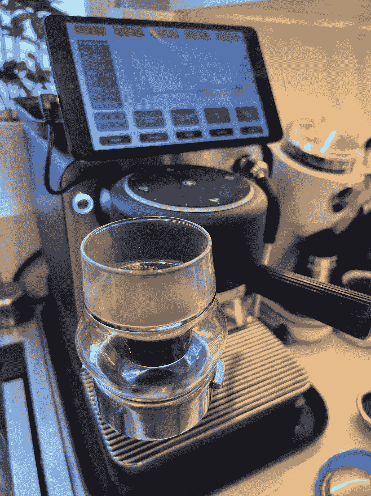
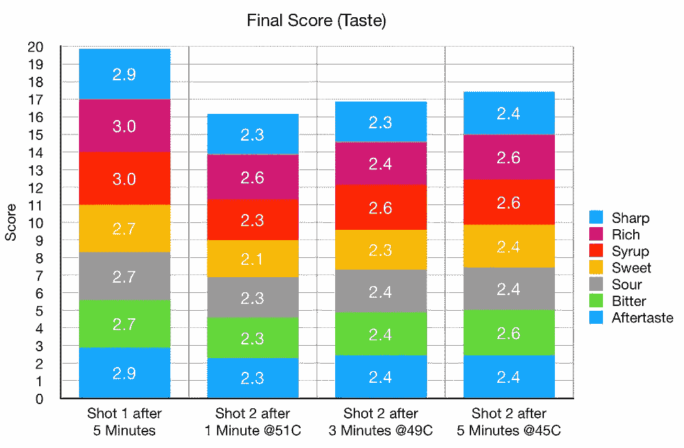
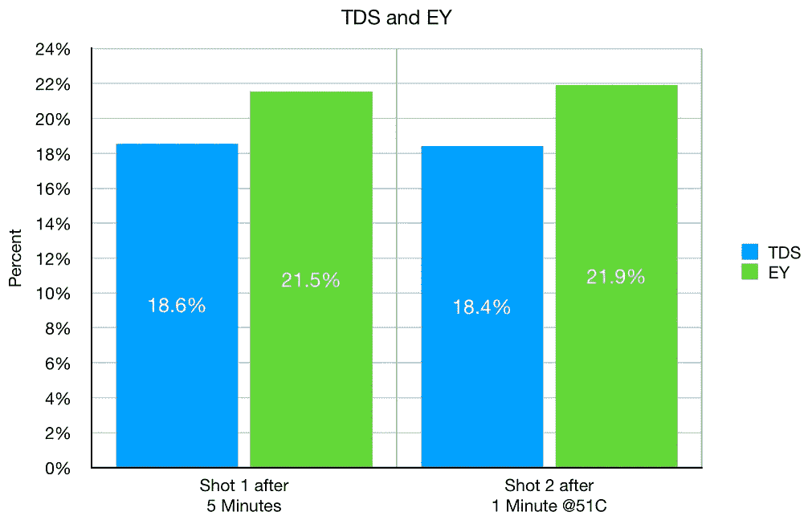

# 冲泡和饮用浓缩咖啡之间的时间

> 原文：<https://towardsdatascience.com/time-between-brewing-and-drinking-espresso-ffbeea7bcf95>

## 咖啡数据科学

## 了解饮料温度的简单测试

我曾经听说过一个咖啡师，他坚持认为一杯浓缩咖啡如果不在冲泡后一分钟内喝掉就是死的。我不相信这种推理，两年前，我开始注意浓缩咖啡的时间和温度，因为这关系到我如何体验拍摄。

我用两张照片做了一个快速测试，来探究这种差异。我之前做了一些测试，我确定 4 到 6 分钟是正确的时间，或者是饮料温度达到 47 摄氏度的时候。

所有图片由作者提供

每个杯子都不一样。对于我的海盗杯，这发生在拍摄后 4 分钟左右。对于 Kruve EQ cup，大约在拍摄后 6 分钟。

# 设备/技术

意式咖啡机:金快线(不是 DE，但画面很酷)

咖啡研磨机:韩国

咖啡:[家常烘焙咖啡](https://rmckeon.medium.com/coffee-roasting-splash-page-780b0c3242ea)，中杯(第一口+ 1 分钟)

镜头准备:[断奏夯实](/staccato-tamping-improving-espresso-without-a-sifter-b22de5db28f6)

[预灌注](/pre-infusion-for-espresso-visual-cues-for-better-espresso-c23b2542152e):长，约 25 秒

输液:[压力脉动](/pressure-pulsing-for-better-espresso-62f09362211d)

[过滤篮](https://rmckeon.medium.com/espresso-baskets-and-related-topics-splash-page-ff10f690a738) : 20g VST

其他设备: [Atago TDS 计](/affordable-coffee-solubility-tools-tds-for-espresso-brix-vs-atago-f8367efb5aa4)、 [Acaia Pyxis 秤](/data-review-acaia-scale-pyxis-for-espresso-457782bafa5d)

# 绩效指标

我使用两个[指标](/metrics-of-performance-espresso-1ef8af75ce9a)来评估技术之间的差异:最终得分和咖啡萃取。

[**最终得分**](https://towardsdatascience.com/@rmckeon/coffee-data-sheet-d95fd241e7f6) 是记分卡上 7 个指标(辛辣、浓郁、糖浆、甜味、酸味、苦味和回味)的平均值。当然，这些分数是主观的，但它们符合我的口味，帮助我提高了我的拍摄水平。分数有一些变化。我的目标是保持每个指标的一致性，但有时粒度很难确定。

**用折射仪测量总溶解固体量(TDS)，这个数字结合弹丸的输出重量和咖啡的输入重量用来确定提取到杯中的咖啡的百分比，称为**提取率(EY)** 。**

# **两杯，四种口味**

**我喝了两杯，第一杯是基线，5 分钟后喝，第二杯在几分钟内尝了几次。挑战在于品尝一杯酒会影响舌头，很难隔离变量。这将是一个更好的测试，通过多次注射和喝咖啡来完成，但这里的意图是建议在不同的休息时间尝试注射。**

**这两个镜头有相似的 TDS 和 EY。他们的品味完全不同。**

********

**随着时间的推移，味道变好了，我没有超过 5 分钟。这种味道没有任何特别之处，比其他味道特征变化更大。很难说我是如何感知味道的，但舌头是一个传感器，它有正常工作的条件。**

**这个简短测试的主要目的是倡导个人实验。很容易指望有经验的人告诉你如何享受浓咖啡或咖啡，但你可以让自己的感觉成为你的向导。**

**如果你提前花些时间去尝试，你将为一生享受更好的咖啡做好准备。**

**如果你愿意，可以在 [Twitter](https://mobile.twitter.com/espressofun?source=post_page---------------------------) 、 [YouTube](https://m.youtube.com/channel/UClgcmAtBMTmVVGANjtntXTw?source=post_page---------------------------) 和 [Instagram](https://www.instagram.com/espressofun/) 上关注我，我会在那里发布不同机器上的浓缩咖啡照片和浓缩咖啡相关的视频。也可以在 [LinkedIn](https://www.linkedin.com/in/dr-robert-mckeon-aloe-01581595) 上找到我。也可以在[中](https://towardsdatascience.com/@rmckeon/follow)关注我，在[订阅](https://rmckeon.medium.com/subscribe)。**

# **[我的进一步阅读](https://rmckeon.medium.com/story-collection-splash-page-e15025710347):**

**[我未来的书](https://www.kickstarter.com/projects/espressofun/engineering-better-espresso-data-driven-coffee)**

**[我的链接](https://rmckeon.medium.com/my-links-5de9eb69c26b?source=your_stories_page----------------------------------------)**

**[浓缩咖啡系列文章](https://rmckeon.medium.com/a-collection-of-espresso-articles-de8a3abf9917?postPublishedType=repub)**

**[工作和学校故事集](https://rmckeon.medium.com/a-collection-of-work-and-school-stories-6b7ca5a58318?source=your_stories_page-------------------------------------)**