# 时间序列分析导论 ARMA、ARIMA、SARIMA 模型的比较

> 原文：<https://towardsdatascience.com/time-series-analysis-introduction-a-comparison-of-arma-arima-sarima-models-eea5cbf43c73>

## 这些模型之间的差异，以及您应该如何使用它们

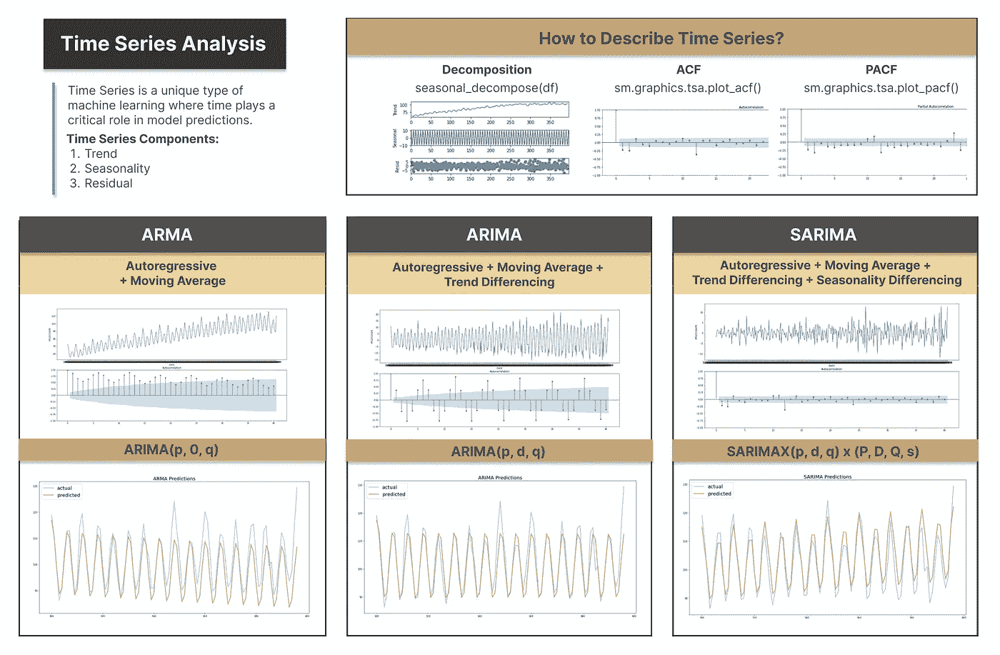

时间序列分析图(图片由[作者](https://www.visual-design.net/post/time-series-analysis-arma-arima-sarima)

# 什么是时间序列？

时间序列是机器学习中的一种独特类型的问题，其中时间组件在模型预测中起着关键作用。由于观察依赖于相邻的观察，这违反了大多数传统机器学习模型所遵循的观察彼此独立的假设。时间序列分析的常见用例是预测未来数值，例如股票定价、收入、温度，这属于回归模型的范畴。然而，时间序列模型也可以应用于分类问题，例如，脑电波监测中的模式识别，或生产过程中的故障识别是时间序列分类器的常见应用。

在本文中，我们将主要关注三个时间序列模型——ARMA、ARIMA 和 SARIMA，用于预测数值的回归问题。时间序列回归不同于其他回归模型，因为它假设数据在一段时间内是相关的，并且前期的结果可用于预测后续期间的结果。

# 如何描述时间序列数据？

首先，我们可以使用`sns.lineplot`通过折线图可视化来描述时间序列数据。如下图所示，“[发电量](https://www.kaggle.com/datasets/shenba/time-series-datasets/versions/1) [1]”时间序列数据的可视化描绘了一个具有一些重复模式的上升趋势。

```
df = pd.read_csv("../input/time-series-datasets/Electric_Production.csv")
sns.lineplot(data=df,x='DATE', y='IPG2211A2N')py
```

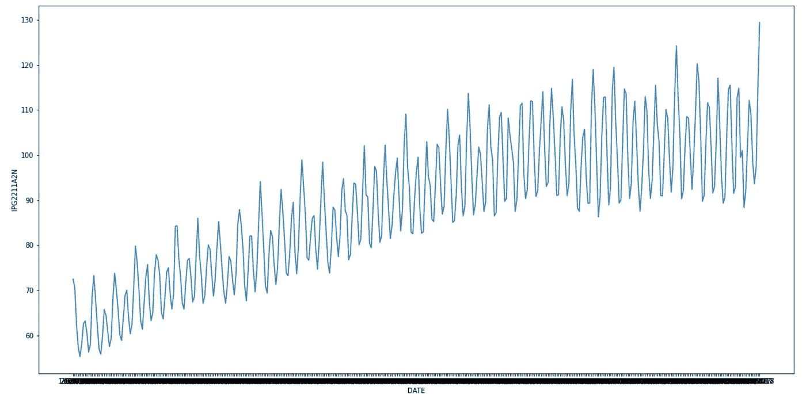

时间序列可视化(图片由作者提供)

为了更好地解释时间序列数据的特征，我们可以将其分解为三个部分:

*   **趋势–T(T)**:平均值长期向上或向下的变化。
*   **季节性–S(t)**:价值遵循可识别模式的周期性变化。
*   **残差–R(t)**:时间序列数据中不遵循任何模式的随机波动。

它们通常可以通过加法或乘法来组合:

*   加法时间序列:O(t) = T(t) + S(t) + R(t)
*   乘法时间序列:O(t) = T(t) * S(t) * R(t)

在 Python 中，我们通过`seasonal_decompose,`和`decomposition.plot()`从时间序列数据中分解出三个部分，为我们提供趋势、季节性和残差的可视化分解。在这段代码中，我们将模型指定为加法模型，并将 period = 12 指定为季节性模式。

*(要访问完整的代码片段，请看看* [*我的网站*](https://www.visual-design.net/code-snippets) *)*

```
from statsmodels.tsa.seasonal import seasonal_decompose
decomposition = seasonal_decompose(x=df['IPG2211A2N'], model='additive', period = 12) 
decomposition.plot()
```

# 平稳性

时间序列数据可以分为平稳数据和非平稳数据。平稳性是一个重要的属性，因为一些模型依赖于数据是平稳的假设。然而，时间序列数据往往具有非平稳性。因此，我们需要了解如何识别非平稳时间序列，以及如何通过各种技术(如差分)对其进行转换。

平稳数据被定义为不依赖于时间成分，具有以下特征:*均值恒定、方差随时间恒定、自相关结构恒定*(即自相关模式不随时间变化)*无周期性或季节性成分。*

## 识别平稳性的技术

最直接的方法是目视检查数据。例如，上面的时间序列可视化表明，时间序列呈上升趋势，其平均值随着时间的推移而增加，这表明数据是不稳定的。要量化它的平稳性，我们可以用以下两种方法。

首先，**ADF(Augmented Dickey Fuller)****测试**基于数据非平稳的零假设和数据平稳的替代假设来检验平稳性。如果 ADF 测试产生的 p 值小于 0.05，它提供了更强的证据来拒绝数据是非平稳的。

我们可以使用来自`statsmodels.tsa.stattools`模块的`adfuller`来执行 ADF 测试，并生成 ADF 值和 p 值。在本例中，p 值 0.29 大于 0.05，因此该数据集是不稳定的。

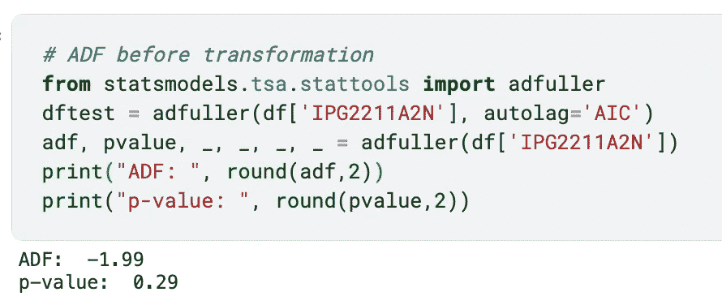

其次， **ACF(自相关函数)**总结了当前观测值与过去观测值之间的双向相关性。例如，当滞后=1 (x 轴)时，ACF 值(y 轴)大致为 0.85，这意味着所有观察值与其之前的观察值之间的平均相关性为 0.85。在后面的部分中，我们还将讨论使用 ACF 来确定移动平均参数。

下面的代码片段使用`sm.graphics.tsa.plot_acf`生成 ACF 图，显示了 40 个滞后。

```
import statsmodels.api as sm
sns.lineplot(x=df['DATE'], y=df['IPG2211A2N'], ax=subplot1)
sm.graphics.tsa.plot_acf(df['IPG2211A2N'], lags=40, ax=subplot2) 
fig.show()
```

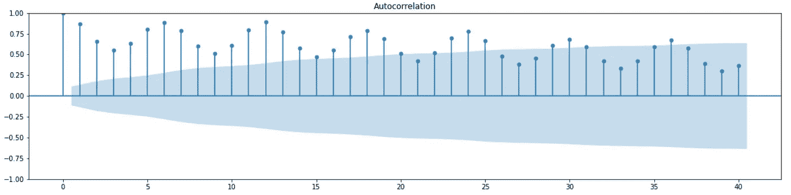

对于非平稳数据，ACF 下降到 0 的速度相对较慢，因为非平稳数据仍然可能出现与之前观测值高度相关的情况，说明时间成分仍然起着重要作用。上图显示了原始时间序列数据的 ACF，它缓慢下降，因此很可能是非平稳的。

## 平稳性和差分

差分通过计算一个观测值与其后续观测值之间的差异来消除趋势和季节性，差分可以将一些非平稳数据转换为平稳数据。

1.  **移除趋势**

我们使用`shift(1)`将原始时间序列数据(显示在左侧)向下移动一行(显示在右侧),并取差值以移除趋势成分。`dropna`是在减去 NaN 时去掉空行。

```
# remove trend component
diff = df['IPG2211A2N'] – df['IPG2211A2N'].shift(1)
diff = diff.dropna(inplace=False)
```

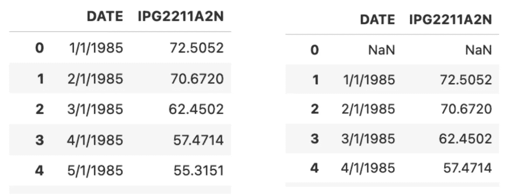

应用趋势差分后，我们可以绘制时间序列图以及 ACF 图。如下所示，趋势已从数据中移除，数据似乎具有恒定的平均值。下一步是解决季节性因素。

```
# ACF after trend differencing
fig = plt.figure(figsize=(20, 10))
subplot1 = fig.add_subplot(211)
subplot2 = fig.add_subplot(212)
sns.lineplot(x=df['DATE'], y=diff, ax=subplot1)
sm.graphics.tsa.plot_acf(diff, lags=40, ax=subplot2) 
fig.show()
```

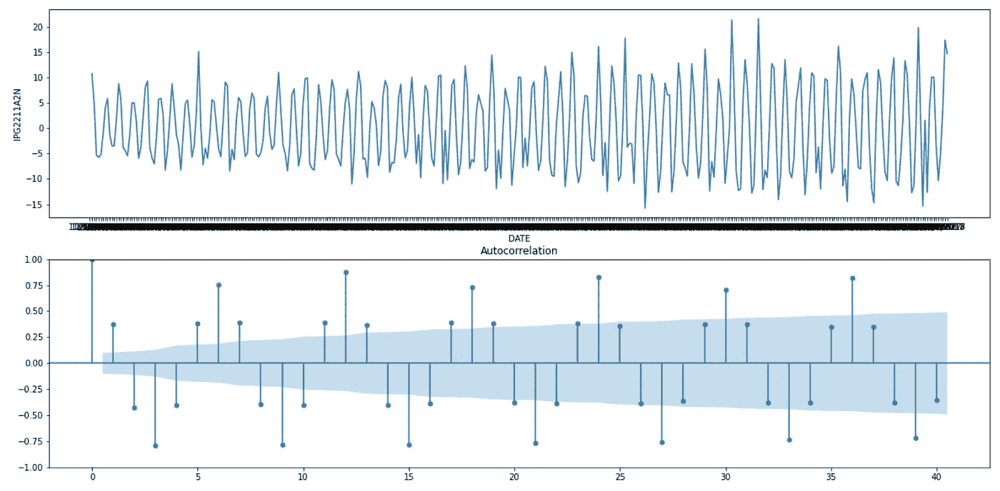

趋势差异(作者图片)

**2。去除季节性**

从上面的 ACF 图中，我们可以看到，当滞后为 12、24、36 等时，观测值更相关，因此它可能遵循滞后 12 的季节模式。让我们应用 shift(12)来消除季节性，并使用 ADF 重新测试平稳性，ADF 的 p 值约为 2.31e-12。

```
# remove seasonal component
diff = df['IPG2211A2N'] – df['IPG2211A2N'].shift(1)
seasonal_diff = diff – diff.shift(12)
seasonal_diff = seasonal_diff.dropna(inplace=False)
```

去除季节模式后，下面的时间序列数据变得更加随机，ACF 值迅速下降到一个稳定的范围。

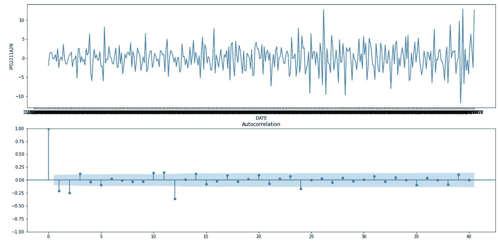

季节性差异(图片由作者提供)

# 模特——阿玛、ARIMA、萨里玛

在本节中，我们将介绍三种不同的时间序列预测模型——ARMA、ARIMA 和 SARIMA。一般来说，这些模型的功能可以总结如下:

*   ARMA:自回归+移动平均
*   ARIMA:自回归+移动平均线+趋势差分
*   SARIMA:自回归+移动平均+趋势差异+季节差异

## ARMA–基线模型

ARMA 代表**自回归移动平均线**。顾名思义，它是两部分的组合——**自回归和移动平均。**

**自回归模型–AR(p)**

自回归模型根据以前观察到的值进行预测，可以用 AR(p)表示，其中 *p* 指定要查看的以前数据点的数量。如下所述，其中 *X* 代表来自先前时间点的观测值，而 *φ* 代表权重。


例如，如果 p = 3，则当前时间点取决于前三个时间点的值。

**如何确定 p 值？**

**PACF(偏自相关函数)**通常用于确定 p 值。对于时间序列 Xt 中的给定观测值，它可能与滞后观测值 Xt-3 相关，后者也受其滞后值的影响(例如 Xt-2、Xt-1)。PACF 将过去的观察对现在的观察的直接贡献形象化。例如，下面的 PACF 当滞后= 3 时 PACF 大致为-0.60，这反映了滞后 3 对原始数据点的影响，而滞后 1 和滞后 2 对滞后 3 的复合因子在 PACF 值中没有解释。然后，AR(p)模型的 p 值由 PACF 第一次落入显著阈值(蓝色区域)的时间来确定，即在下面的示例中 p = 4。

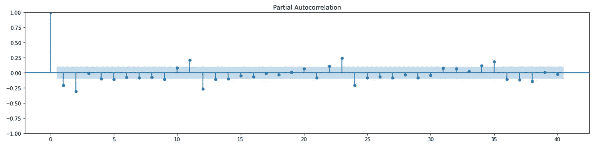

PACF(作者图片)

**移动平均模型–MR(q)**

移动平均模型，MR(q)基于来自先前的 *q* 观察的平均预测误差来调整模型，其可以陈述如下，其中 *e* 表示误差项，并且 *θ* 表示权重。 *q* 值决定移动平均窗口中包含的误差项的数量。


**如何确定 q 值？**

ACF 可用于确定 q 值。它通常被选作 ACF 第一次下降到接近 0 的第一个滞后值。例如，根据下面的 ACF 图，我们可以选择 q=4。

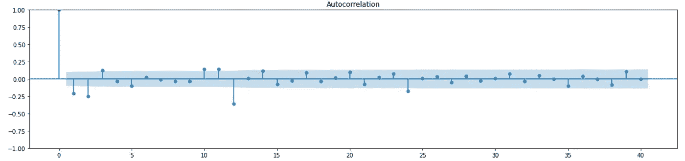

ACF(图片由作者提供)

为了建立 ARMA 模型，我们可以使用`statsmodels.tsa.arima.model`中的 [ARIMA 函数](https://www.statsmodels.org/dev/generated/statsmodels.tsa.arima.model.ARIMA.html)(将在下一节解释)并指定超参数-阶(p，d，q)。当 d = 0 时，它作为 ARMA 模型运行。这里我们将 ARIMA(p=3 和 q=4)模型与时间序列数据`df“IPG2211A2N”`进行拟合。

```
from statsmodels.tsa.arima.model import ARIMA
ARMA_model = ARIMA(df['IPG2211A2N'], order=(3, 0, 4)).fit()
```

## 模型评估

在为时间序列建模选择合适的超参数时，模型评估变得尤为重要。我们将介绍三种评估时间序列模型的方法。为了估计模型对未观察数据的预测，我使用原始数据集中的前 300 条记录进行训练，剩余的(从索引 300 到 396)进行测试。

```
df_test = df[['DATE', 'IPG2211A2N']].loc[300:]
df = df[['DATE', 'IPG2211A2N']].loc[:299]
```

1.  **可视化**

第一种方法是在同一图表中绘制实际时间序列数据和预测，并直观地检查模型性能。此示例代码首先使用 ARMA 模型生成从索引 300 到 396(与 df_test 大小相同)的预测，然后可视化实际数据与预测数据。如下图所示，由于 ARMA 模型未能捕捉到时间序列中的趋势，因此随着时间的推移，预测值会偏离实际值。

```
# generate predictions
df_pred = ARMA_model.predict(start=300, end=396)
# plot actual vs. predicted
fig = plt.figure(figsize=(20, 10))
plt.title('ARMA Predictions', fontsize=20)
plt.plot(df_test['IPG2211A2N'], label='actual', color='#ABD1DC')
plt.plot(df_pred, label='predicted', color='#C6A477')
plt.legend(fontsize =20, loc='upper left')
```

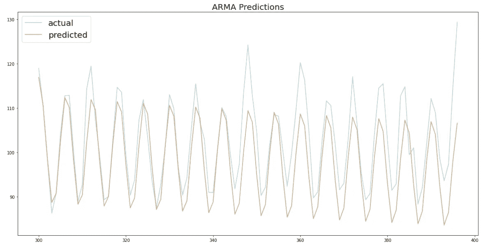

ARMA 预测(图片由作者提供)

**2。均方根误差(RMSE)**

对于时间序列回归，我们可以应用一般的回归模型评估方法，如 RMSE 或 MSE。更多详情，请看我的文章《机器学习中的 4 大线性回归变量》。

[](/top-machine-learning-algorithms-for-regression-c67258a2c0ac) [## 机器学习中的四大线性回归变量

### 初学者友好的实现和比较指南

towardsdatascience.com](/top-machine-learning-algorithms-for-regression-c67258a2c0ac) 

RMSE 越大，表明实际值和预测值之间的差异越大。我们可以使用下面的代码来计算 ARMA 模型的 RMSE——大约是 6.56。

```
from sklearn.metrics import mean_squared_error
from math import sqrt
rmse = sqrt(mean_squared_error(df['IPG2211A2N'][1:], pred_df[1:]))
print("RMSE:", round(rmse,2))
```

**3。赤池信息标准(AIC)**

第三种方法是使用 AIC，表述为*AIC = 2k–2ln(L)*，来解释模型性能，它是基于对数似然( *L* )和参数个数( *k* )来计算的。我们希望对模型进行优化，以降低 AIC，这意味着:

*   对数似然性需要很高，因此具有高预测性的模型将是首选。
*   参数的数量很少，因此模型预测由更少的因素决定，因此它不太可能过拟合并且具有更高的可解释性。

我们可以通过`summary()`函数得到 AIC 值，下面的汇总结果告诉我们，ARMA 模型有 AIC = 1547.26。

```
ARMA_model.summary()
```

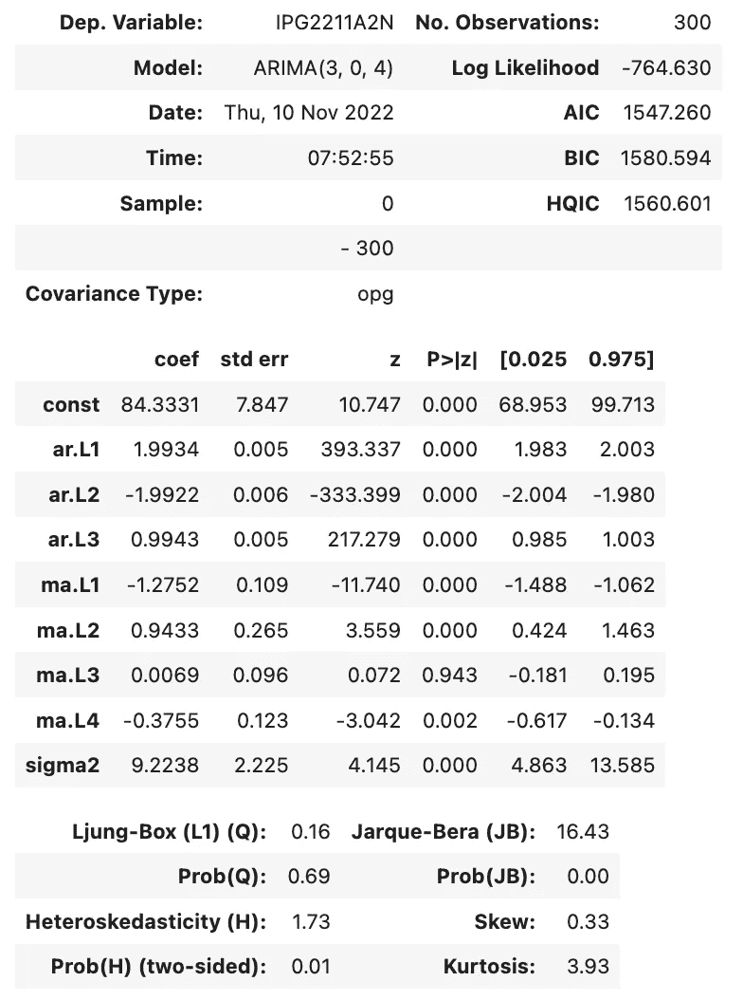

ARMA 摘要(图片由作者提供)

## ARIMA:地址趋势

ARIMA 代表**自回归综合移动平均**，它从 ARMA 模型扩展而来，并结合了**综合成分(差分的逆)。**

ARIMA 在自回归模型(AR)和移动平均模型(MA)的基础上，通过引入差异成分的程度(指定为参数 d)–[ARIMA(p，d，q)](https://www.statsmodels.org/dev/generated/statsmodels.tsa.arima.model.ARIMA.html) 。这是为了解决在时间序列数据中观察到明显趋势时的问题。如 ARMA 示例所示，该模型未能捕捉到数据中的趋势，这使得预测值偏离实际值。

在“平稳性和差异”一节中，我们解释了如何应用差异来消除趋势。现在让我们探索一下它是如何使预测更加准确的。

**如何确定 d 值？**

由于 ARIMA 在其模型构建过程中引入了差分，因此它并不严格要求训练数据是静态的。为了保证 ARIMA 模型能够很好地工作，应该选择合适的差分程度，使时间序列在去趋势化后转化为平稳数据。

我们可以首先使用 ADF 测试来确定数据是否已经是稳定的，如果数据是稳定的，则不需要差分，因此 d = 0。如前所述，差分前的 ADF 测试给出的 p 值为 0.29。

在应用趋势差分`diff = df[‘IPG2211A2N’] – df[‘IPG2211A2N’].shift(1)` 并使用 ADF 检验后，我们发现 p 值远低于 0.05。因此，这表明转换后的时间序列数据很可能是平稳的。

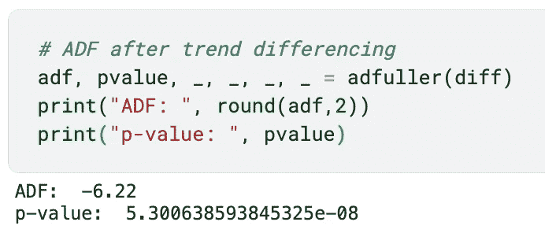

然而，如果数据仍然是不稳定的，第二级差分可能是必要的，这意味着对 diff 应用另一级差分(例如`diff2 = diff – diff.shift(1)`)。

为了建立 ARIMA 模型，我们使用了 ARMA 模型中提到的相同函数，并添加了 d 参数，在本例中，d = 1。

```
# ARIMA (p, d, q)
from statsmodels.tsa.arima.model import ARIMA
ARIMA_model = ARIMA(df['IPG2211A2N'], order=(3, 1, 4)).fit()
ARIMA_model.summary()
```


ARIMA 摘要(图片由作者提供)

从总结结果可以看出，与 ARMA 模型相比，对数似然增加，AIC 减小，表明它具有更好的性能。

可视化还表明，预测趋势与测试数据更加一致，RMSE 降至 4.35。

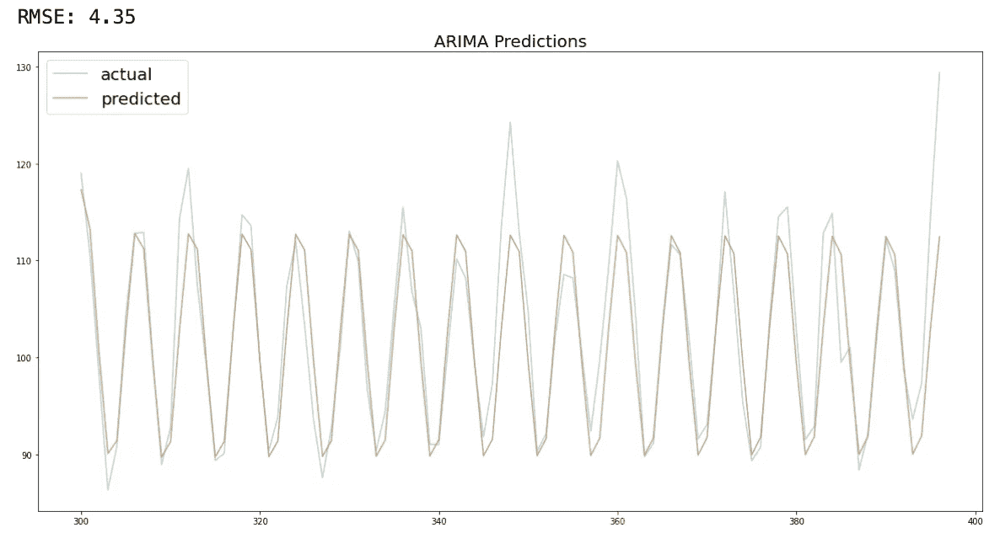

ARIMA 预言(图片由作者提供)

**萨里玛:解决季节性问题**

SARIMA 代表**季节性 ARIMA** ，它处理时间序列中观察到的周期性模式。之前我们已经介绍了如何使用季节差异来消除季节影响。SARIMA 结合了这一功能来预测季节性变化的时间序列，我们可以使用 [SARIMAX(p，D，q) x (P，D，Q，s)](https://www.statsmodels.org/dev/generated/statsmodels.tsa.statespace.sarimax.SARIMAX.html) 来实现它。第一项(P，D，Q)表示 ARIMA 模型的阶数,( P，D，Q，s)表示季节分量。 *P，D，Q* 分别是季节顺序的自回归项、差分项和移动平均项。 *s* 是每个周期的观察次数。

**如何确定 s 值？**

ACF 图为季节性提供了一些证据。如下所示，每 12 个滞后似乎与原始观察值具有更高的相关性(与 6 个滞后相比)。

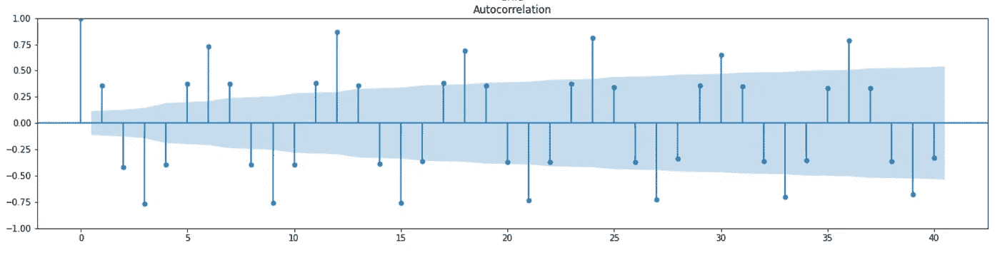

我们之前也测试过，在移动 12 个滞后的数据后，在可视化中没有观察到季节性。因此，在本例中我们指定 s=12。

```
#SARIMAX(p, d, q) x (P, D, Q, s)
SARIMA_model = sm.tsa.statespace.SARIMAX(df['IPG2211A2N'], order=(3, 1, 4),seasonal_order=(1, 1, 1, 12)).fit()
SARIMA_model.summary()
```

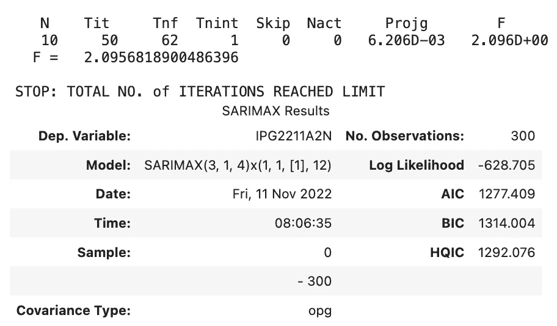

萨里玛摘要(图片由作者提供)

从汇总结果中，我们可以看到 AIC 从 ARIMA 的 1528.48 进一步下降到萨里玛的 1277.41。

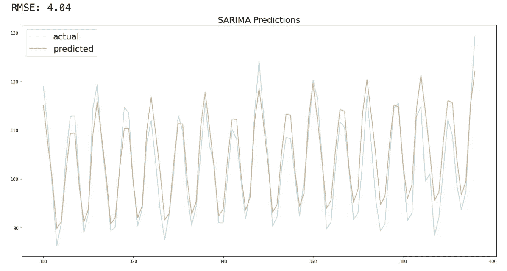

萨里玛预言(图片由作者提供)

预测现在说明了季节性模式，RMSE 进一步下降到 4.04。

感谢您到目前为止，如果您想阅读更多来自 Medium 的文章并支持我的工作，我真的很感谢您使用这个附属[链接](https://destingong.medium.com/membership)注册 Medium 会员。

# 带回家的信息

这种时间序列模型介绍解释了 ARMA，ARIMA 和萨里玛模型在一个渐进的顺序。

*   ARMA:自回归+移动平均
*   ARIMA:自回归+移动平均线+趋势差分
*   SARIMA:自回归+移动平均+趋势差异+季节差异

此外，我们探索与时间序列数据相关的概念和技术，如平稳性，ADF 测试，ACF/PACF 图和 AIC。

## 更多相关文章

[](/top-machine-learning-algorithms-for-regression-c67258a2c0ac) [## 机器学习中的四大线性回归变量

### 初学者友好的实现和比较指南

towardsdatascience.com](/top-machine-learning-algorithms-for-regression-c67258a2c0ac) 

[德斯坦贡](https://destingong.medium.com/?source=post_page-----eea5cbf43c73--------------------------------)

## EDA 和特征工程技术

[View list](https://destingong.medium.com/list/eda-and-feature-engineering-techniques-e0696974ed54?source=post_page-----eea5cbf43c73--------------------------------)9 stories

[德斯坦贡](https://destingong.medium.com/?source=post_page-----eea5cbf43c73--------------------------------)

## 机器学习实用指南

[View list](https://destingong.medium.com/list/practical-guides-to-machine-learning-a877c2a39884?source=post_page-----eea5cbf43c73--------------------------------)10 stories

## 参考

[1]原始数据集参考:美联储系统(美国)理事会，工业生产:公用事业:电力和燃气公用事业(NAICS = 2211，2) [IPUTIL]，检索自圣路易斯美联储银行弗雷德；【https://fred.stlouisfed.org/series/IPUTIL,】T42022 年 11 月 17 日。[公共领域:请求引用]。

*原载于 2022 年 11 月 17 日 https://www.visual-design.net**[*。*](https://www.visual-design.net/post/3-ux-design-principles-for-better-data-visualization)*