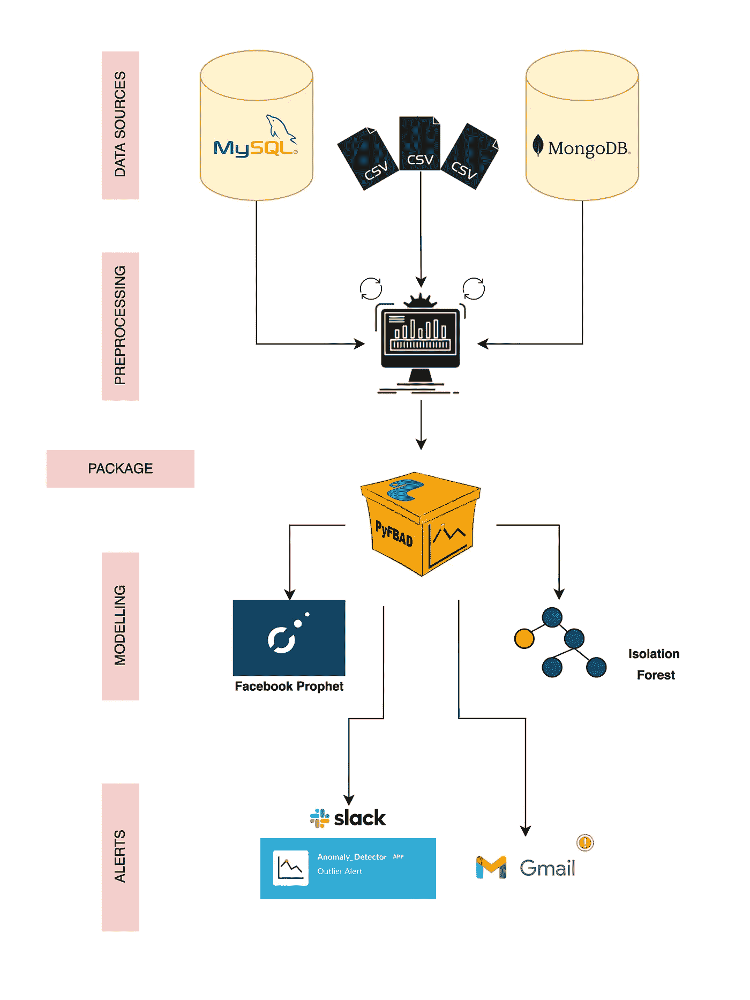
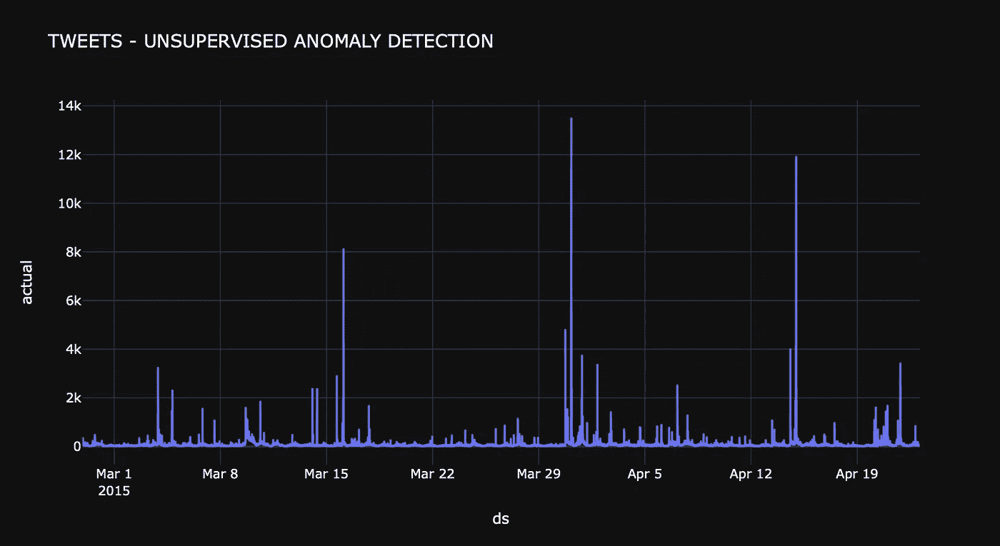
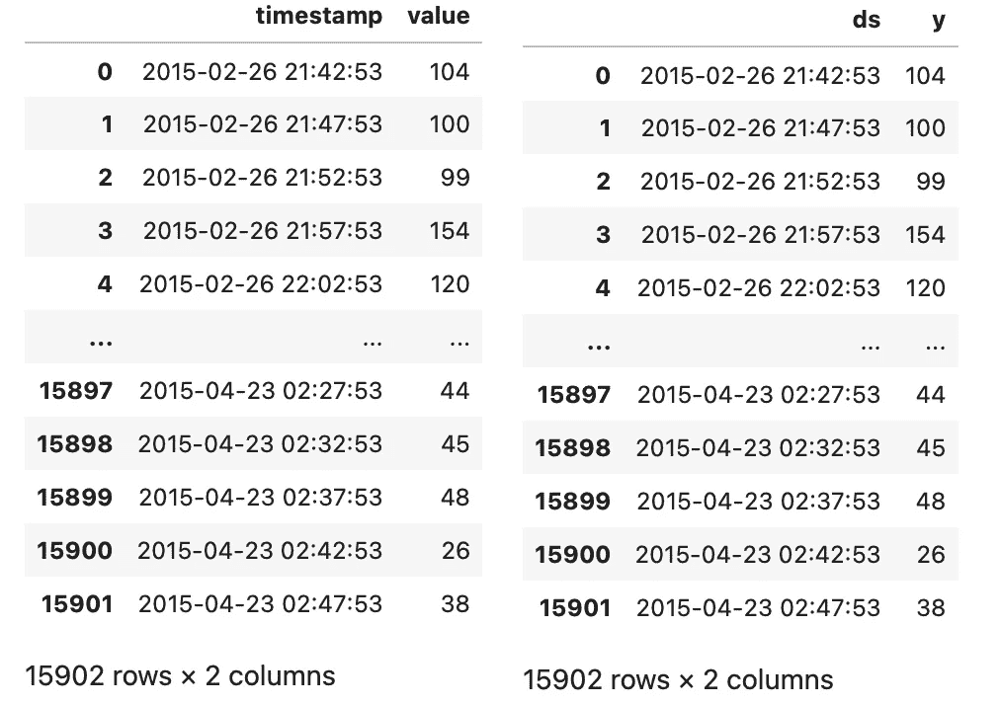
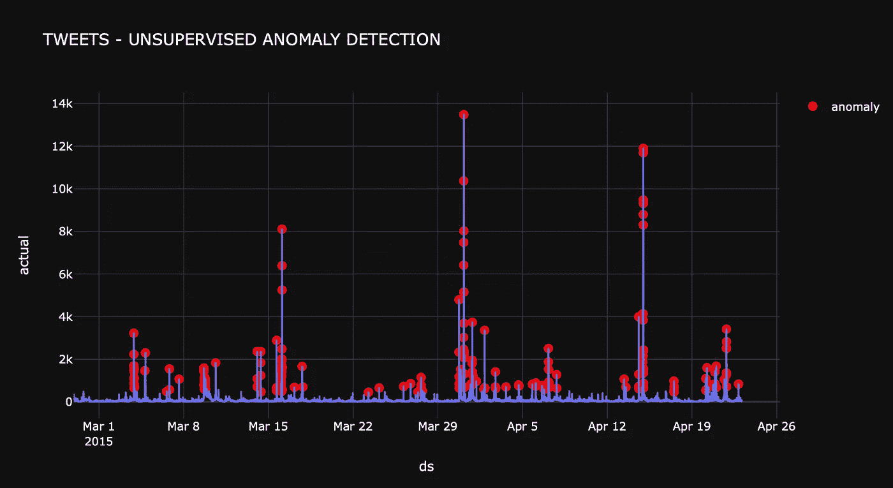

# 基于 PyFBAD 的时间序列异常检测

> 原文：<https://towardsdatascience.com/time-series-anomaly-detection-with-pyfbad-d37e5462c6c3>

## 一种端到端的无监督离群点检测

[取自 Unsplash](https://unsplash.com/photos/Fb6aY99lgF0)

机器学习项目的典型流程从读取数据开始，然后是一些预处理、训练、测试、可视化以及与通知系统共享结果。当然，所有的步骤都可以在各种开源库的帮助下轻松完成。然而，在一些特定于任务的情况下，比如时间序列数据中的异常检测，减少库和硬编码步骤的数量将更有利于可解释性。pyfbad 库就是为此而开发的。

 [## GitHub-Teknasyon-Teknoloji/pyfbad:一个由 Getcontact Data 开发的开源离群点检测包…

### pyfbad 库支持异常检测项目。可以编写一个端到端的异常检测应用程序…

github.com](https://github.com/Teknasyon-Teknoloji/pyfbad) 

***pyfbad*** 库是一个端到端的无监督异常检测包。这个包提供了前面提到的所有 ml-flow 步骤的源代码。例如，可以使用 pyfbad 通过特殊的过滤器从文件、MongoDB 或 MySQL 中读取数据。这些读取的数据可以通过预处理方法为模型做好准备。该模型可以使用不同的机器学习模型进行训练，例如 Prophet 或 Isolation Forest。异常检测结果可以通过电子邮件或 slack 报告。换句话说，项目的整个周期可以在 pyfbad 下提供的源代码的帮助下完成，而不需要使用任何其他库。

事实上，阅读 [**这篇内容丰富的文章**](https://engineering.teknasyon.com/an-end-to-end-unsupervised-anomaly-detection-c402facffee2) 将有助于理解我们为什么需要开发这个包，以及如何从总体上设计一个无监督的异常检测项目。然而，我们仍然简单地将异常检测描述为一种识别技术，用于发现导致给定数据集中突然峰值或谷值的异常观察。

图一。基于 pyfbad 的时间序列数据无监督异常检测流水线。作者图片

如图 1 所示，pyfbad 有 4 个主要模块:数据库、特性、模型和通知。在 [Cookiecutter](https://cookiecutter.readthedocs.io/en/1.7.3/index.html) 的 [Drivendata](https://drivendata.github.io/cookiecutter-data-science/) 的帮助下，这种结构在数据科学项目中几乎是标准化的。项目组织如图 2 所示。

## **数据库:**

这个模块有从各种数据库或文件中读取数据的脚本。MySQL 和 MongoDB 是目前为止添加的数据库支持。特别是在 MongoDB 中，通过 Pyfbad 使用过滤步骤变得更加用户友好。下面的代码片段可能会让您了解如何使用 pyfbad 进行数据库操作。

## **功能:**

变量时间序列异常检测的概念需要两类数据。其中一个是连续时间数据，另一个是我们想要检测异常的主数据。这两个数据应该从原始数据中提取出来作为模型数据。Pyfbad 提供了从原始数据帧中检索模型数据的可选过滤功能。下面的代码片段显示了如何使用 pyfbad 来执行此操作。

## **型号:**

该模块能够用各种算法训练模型数据。可以理解，Pyfbad 旨在检测时间序列数据上的异常。从这个意义上来说，它提供了使用模型的机会，这些模型可以被快速而稳健地应用。脸书先知和隔离福里斯特是模型支持添加到目前为止。作为一个例子，从下面的代码片段可以看出 Prophet 是如何在 pyfbad 的帮助下实现的。

## **通知:**

我们使用的所有技术的成功程度与它们如何利用其产出有关。如果产品能很好地传达给用户，并能解释如何使用它，产品就会变得可见。pyfbad 提供了各种通知系统来共享项目的结果，比如电子邮件和 slack。电子邮件选项可以用作下面的代码片段。请注意，电子邮件帐户不应该有授权的高安全性设置。

## **实现！**

让我们快速实现一下，以便更好地理解如何使用 Pyfbad。完整的笔记本可以在 Kaggle 上从[这里](https://www.kaggle.com/muhammetfurkanankaya/pyfbad-anomaly-detection)找到。这里我们只看每一步的结果。

将数据集模块导入 pyfbad 库之后，可以从 CSV 格式的文件中读取原始数据。原始数据如图 3 所示。

图 3。原始时间序列数据值。作者图片

在这个数据集中，实际上不需要预处理步骤来从原始数据集中提取准备训练的数据集。然而，在图 4 中，可以看出初始数据帧和最终数据帧之间的差异。

图 4。原始数据集在左侧，准备好训练的数据集在右侧。作者图片

在此实现中，使用 Prophet 算法来训练模型。在训练步骤之后，检测到的异常可以显示在图 5 中。

图 5。异常检测结果。作者图片

## 结论

Pyfbad 可以很好地与大多数流行的数据库一起工作，比如 MongoDB 和 MySQL，但是仍然可以添加不同种类的数据库支持。它目前使用最知名的模型，如 FB Prophet 和 Isolation Forrest，但仍需要更多的机器学习算法。项目背后的团队渴望学习，对研发充满热情，对学习新技术非常有抱负。因此，我们可以有把握地说，这是 Pyfbad 的第一个版本。正在进行研究，以弥补上述不足，并使 Pyfbad 成为一个非常全面的无监督异常检测库。

## 包创建者

*   [阿肯](https://medium.com/@akin.gunduz) [君度](https://www.linkedin.com/in/akingunduz/)
*   [富尔坎](https://medium.com/@muhammetfurkanankaya) [坎卡亚](https://www.linkedin.com/in/furkan-%C3%A7ankaya/)
*   奥詹·叶迪尔

## 参考

*   [端到端无监督异常检测](https://engineering.teknasyon.com/an-end-to-end-unsupervised-anomaly-detection-c402facffee2)
*   [FB 先知](https://github.com/facebook/prophet)
*   [隔离林](https://scikit-learn.org/stable/modules/generated/sklearn.ensemble.IsolationForest.html)