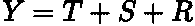
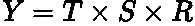
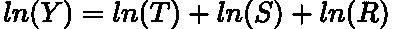
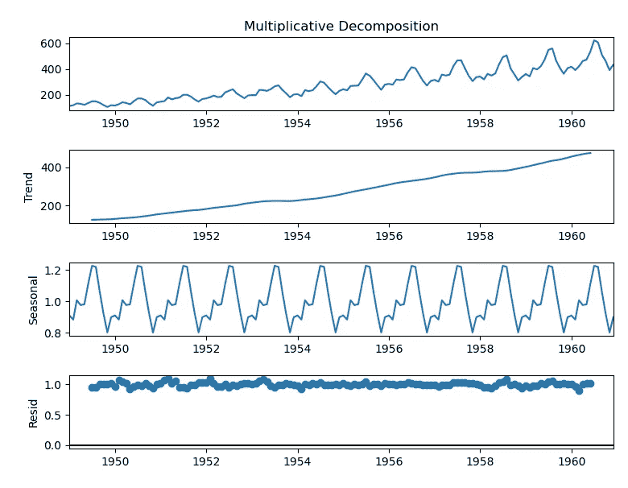
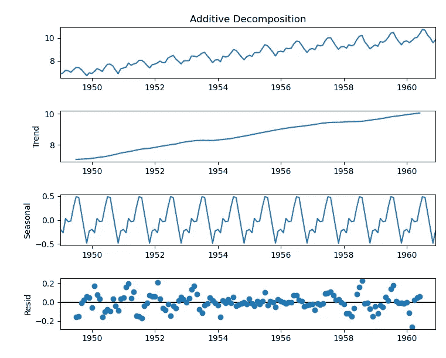

# 时间序列分解

> 原文：<https://towardsdatascience.com/time-series-decomposition-8f39432f78f9>

## 将时间序列分解成基本的构建块

奥斯曼·拉纳在 [Unsplash](https://unsplash.com?utm_source=medium&utm_medium=referral) 上拍摄的照片

# 介绍

当试图获得洞察力并找到产生未来预测的最佳模型时，理解你的 [**时间序列**](https://en.wikipedia.org/wiki/Time_series) 是最基本的。大多数时间序列可以被分解成不同的 [**成分**](https://en.wikipedia.org/wiki/Decomposition_of_time_series) 来帮助以结构化的方式对其进行诊断，提供了一个强大的分析工具。

在这篇文章中，我想讨论这些不同的组件是什么，如何获得它们，以及我们如何使用 Python 进行时间序列分解。

# 时间序列组件

时间序列是(主要)三个部分的组合:*趋势*、*季节性*和*残差/余数*。让我们逐一分析。

[**趋势**](https://en.wikipedia.org/wiki/Linear_trend_estimation) **:** 这是系列的整体运动。它可能持续增加加班时间、减少加班时间或两者兼而有之。

[**季节性**](https://en.wikipedia.org/wiki/Seasonality) **:** 序列中任何有规律的季节性模式。例如，冰淇淋的销量在夏季通常高于冬季。要了解更多关于季节性的知识，请查看我的上一篇文章:

</seasonality-of-time-series-5b45b4809acd>  

[**残差/余数**](https://otexts.com/fpp3/residuals.html) **:** 这是我们考虑了趋势和季节性之后剩下的那一点。也可以认为只是 [**统计噪声**](https://www.statisticshowto.com/statistical-noise/) 。

> 有时也有一个单独的 [**周期**](https://otexts.com/fpp2/tspatterns.html) 成分，但它经常被归入趋势成分。

# 加法与乘法模型

这些组件的组合方式取决于您的系列的性质。对于一个 [***加法***](https://en.wikipedia.org/wiki/Additive_model) 模型我们有:

作者用 LaTeX 写的方程式。

而对于一个 ***乘性*** 系列:

作者用 LaTeX 写的方程式。

其中 ***Y*** 为数列， ***T*** 为趋势， ***S*** 为季节性， ***R*** 为残差分量。

当序列变化的大小在一致的绝对数值范围内时，加法模型是最合适的。另一方面，乘法模型是当系列的波动是在一个相对的和成比例的规模。

例如，如果每年夏天的冰淇淋销售额高出 1000，那么该模型就是可加性的。如果每年夏天销售额持续增长 20%,但是绝对销售额在变化，那么这个模型就是乘法模型。我们将在后面讨论一个例子，这个例子将使这个理论更加具体。

可以通过简单的对数变换或 [**Box-Cox 变换**](https://en.wikipedia.org/wiki/Power_transform) 将乘法模型转换为加法模型:

作者用 LaTeX 写的方程式。

要了解关于 Box-Cox 变换的更多信息，您可以阅读我以前的一篇文章:

</box-cox-transform-for-time-series-cc45f26082c6>  

# 分解是怎么做的？

有多种算法和方法可以将时间序列分解为三个部分。我想回顾一下经典的<https://www.openforecast.org/adam/classical-seasonal-decomposition.html>**方法，因为这种方法经常使用并且非常直观。**

*   **使用[移动/滚动平均值](https://www.investopedia.com/terms/m/movingaverage.asp)计算趋势分量**、 *T、*、**。**
*   **去趋势系列， ***Y-T*** 为加法模型， ***Y/T*** 为乘法模型。**
*   **计算季节性成分 ***S*** ，取每个季节去趋势序列的平均值。**
*   **剩余分量 ***R*** 计算如下: ***R = Y-T-R*** 对于加法模型， ***R = Y/(TR)*** 对于乘法模型。**

**还有其他几种分解方法，如 [**STL**](/stl-decomposition-how-to-do-it-from-scratch-b686711986ec) ，[**X11**](https://otexts.com/fpp3/x11.html)**和 [**席位**](https://otexts.com/fpp3/seats.html) 。这些都是先进的方法，补充了传统方法的基本方法，并改进了其缺点。****

# ****Python 中的分解****

****让我们再次回顾一下 1948 年至 1961 年间美国航空公司的经典客运量数据:****

> ****数据[来自拥有 CC0 许可证的 Kaggle](https://www.kaggle.com/datasets/ashfakyeafi/air-passenger-data-for-time-series-analysis) 。****

****作者代码要点。****

********

****作者用 Python 制作的情节。****

****从该图中，我们观察到一个增长趋势和一个年度季节性。请注意，波动的大小随着时间的推移而增加，因此我们有一个乘法模型。****

****我们可以使用 statsmodels 函数[*seasonal _ decompose*](https://www.statsmodels.org/dev/generated/statsmodels.tsa.seasonal.seasonal_decompose.html)*分解时间序列，并在调用该函数时指定我们有一个“乘法”模型:*****

*****作者代码要点。*****

**********

*****作者用 Python 制作的情节。*****

*****从上面的图中我们可以看到，该函数确实成功地捕获了三个组件。*****

*****我们可以通过应用 [*boxcox*](https://docs.scipy.org/doc/scipy/reference/generated/scipy.stats.boxcox.html) Scipy 函数，使用 Box-Cox 变换来稳定方差，从而将我们的序列转换为加法模型:*****

*****作者代码要点。*****

**********

*****作者用 Python 制作的情节。*****

*****同样，该函数似乎很好地捕捉到了这三个组件。有趣的是，我们看到残差在早些年和晚些年有更高的波动性。在为此系列构建预测模型时，这可能是需要考虑的因素。*****

# *****结论*****

*****在这篇文章中，我们展示了如何将一个时间序列分解成三个基本部分:趋势、季节性和残差。这三个部分的组合产生了你观察到的时间序列，根据它的性质，它可以是加法的，也可以是乘法的。有几种技术来进行分解，如 STL，海豹突击队和 X11，但是我更喜欢经典的方法，因为它非常直观。能够分解时间序列有助于加深对数据的理解，从而更容易做出未来预测。*****

*****这篇文章中使用的完整代码可以在我的 GitHub 中找到:*****

*****<https://github.com/egorhowell/Medium-Articles/blob/main/Time%20Series/Time%20Series%20Tools/decomposition.py>  

# 参考资料和进一步阅读

*   *预测:原理与实践:*【https://otexts.com/fpp2/ 

# 和我联系！

*   [*要想在媒体上阅读无限的故事，请务必在这里注册！*](/@egorhowell/membership) 💜
*   [*在我发布注册邮件通知时获得更新！*T13*😀*](/subscribe/@egorhowell)
*   [*领英*](https://www.linkedin.com/in/egor-howell-092a721b3/) 👔
*   [*碎碎念*](https://twitter.com/EgorHowell) 🖊
*   [*github*](https://github.com/egorhowell)*🖥*
*   *<https://www.kaggle.com/egorphysics>**🏅***

> ***(所有表情符号由 [OpenMoji](https://openmoji.org/) 设计——开源表情符号和图标项目。许可证: [CC BY-SA 4.0](https://creativecommons.org/licenses/by-sa/4.0/#)********