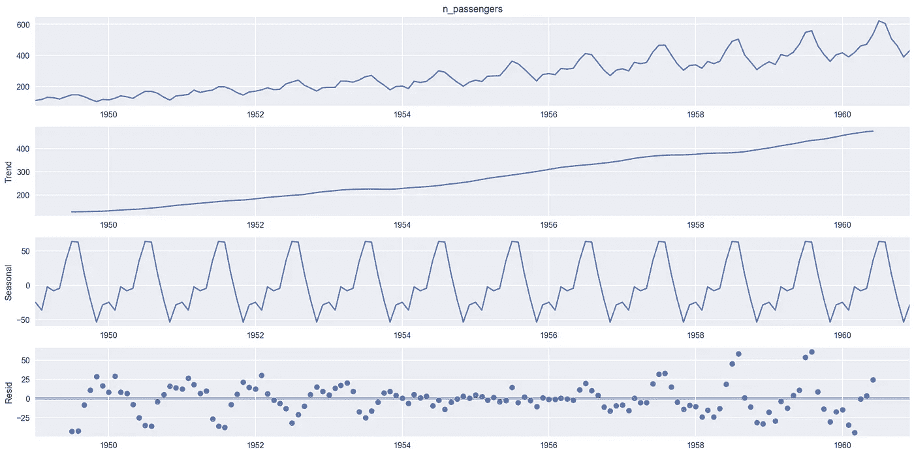
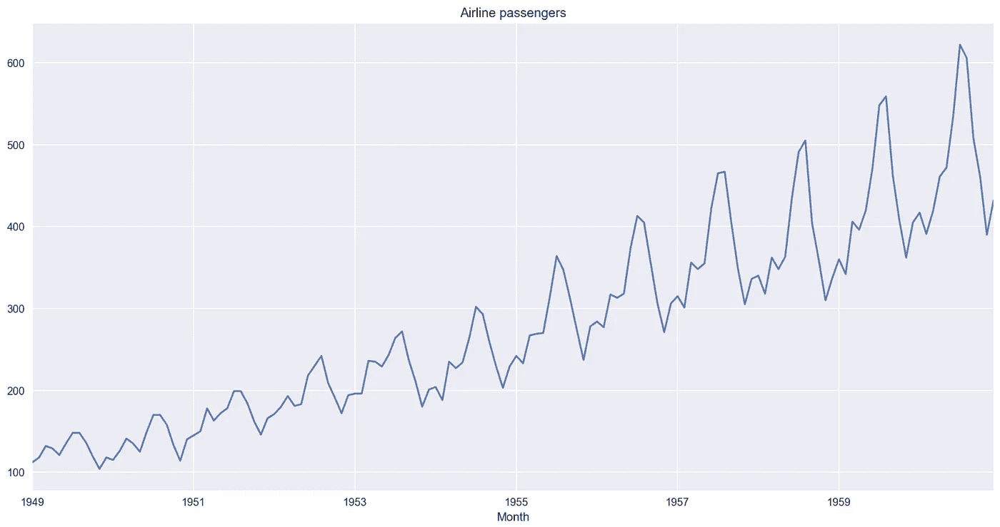
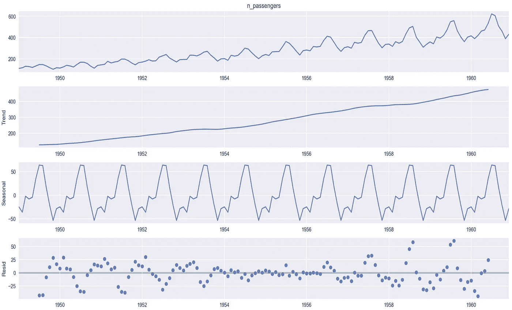
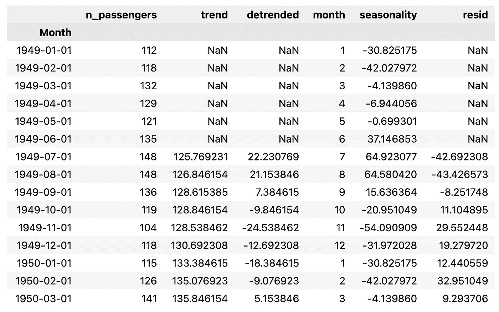
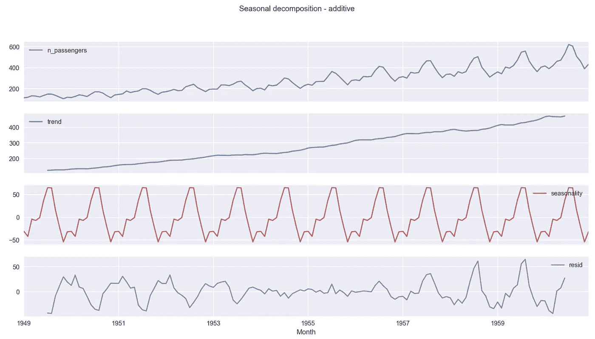
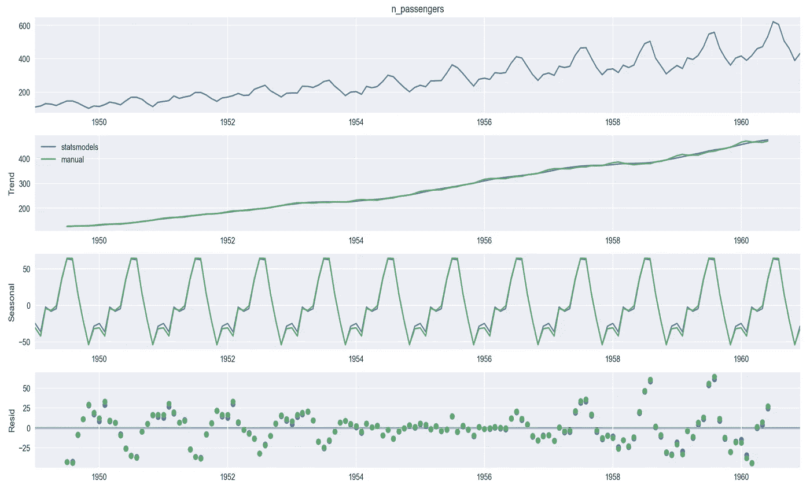

# 时间序列 DIY:季节分解

> 原文：<https://towardsdatascience.com/time-series-diy-seasonal-decomposition-f0b469afed44>

克里斯·劳顿在 [Unsplash](https://unsplash.com/s/photos/seasons?utm_source=unsplash&utm_medium=referral&utm_content=creditCopyText) 上的照片

## 了解在`statsmodel’` s `seasonal_decompose`的引擎盖下发生了什么

如果你处理过时间序列，你可能已经使用过`statsmodel`中的`seasonal_decompose`(或者 R 的等价物)。长话短说，它将时间序列分成三个部分:趋势、季节性和残差。运行该命令后，您会看到类似下图的内容。

作者图片

组件的解释也非常直观:

*   趋势——一个系列在很长一段时间内的总体方向
*   季节性——由于各种季节性因素，定期观察到的独特的重复模式。可以是每月、每周等。
*   残差——去除之前的成分后，由时间序列波动组成的不规则成分

这应该足够了。我也不会详细讨论季节分解的目标(理解数据、预测、异常值检测)。相反，我想探索一个不太受欢迎的角度——当你调用`seasonal_decompose` 函数时会发生什么。在这篇动手文章中，我们将回答这个问题:*这些组件是如何估算的？如果你好奇，请继续阅读！*

# 理论

让我们假设我们处理的是加性模型，即由一个线性趋势和具有相同频率(宽度)和振幅(高度)的季节性周期组成。对于乘法模型，你只需要用乘法代替加法，用除法代替减法。

## 趋势分量

使用时间序列的居中移动平均值计算趋势。使用对应于时间序列频率的窗口长度来计算移动平均值。例如，我们将对月度数据使用长度为 12 的窗口。

使用这种移动平均线来平滑序列也有一些缺点。首先，我们正在“丢失”系列的第一个和最后几个观察值。第二，移动平均线会使数列变得过于平滑，这使得它对趋势的突然变化或跳跃反应迟钝。

## 季节性成分

为了计算季节性成分，我们首先需要对时间序列进行去趋势分析。我们通过从原始时间序列中减去趋势分量来实现(记住，我们除以乘法变量)。

完成后，我们计算每个季节周期的去趋势序列的平均值。对于月份，我们将计算每个月的平均去趋势值。

季节性成分是简单地从整个序列的长度重复的季节性平均值构建的，这也是反对使用简单季节性分解的理由之一-季节性成分不允许随着时间的推移而变化，这对于较长的时间序列来说可能是一个非常严格且通常不切实际的假设。

另一方面，在加法分解中，去趋势序列以零为中心，因为加零不会改变趋势。相同的逻辑应用于乘法方法，不同之处在于它以 1 为中心。这是因为趋势乘以 1 也不会对其产生影响。

## 残差

最后一个部分就是从原始时间序列中去除(减去或除以)趋势和季节成分后剩下的部分。

理论到此为止，让我们编码吧！

# 循序渐进的教程

## 设置

和往常一样，我们从导入库开始。

## 数据

我们将使用可能是时间序列分析中最流行的数据集——澳大利亚航空乘客时间序列。我们从一个 CSV 文件中加载它(此处[可用](https://raw.githubusercontent.com/jbrownlee/Datasets/master/airline-passengers.csv)，但是您也可以从其他来源获取它，例如，从`seaborn`库([此处](https://github.com/mwaskom/seaborn-data/blob/master/flights.csv))。

作者图片

仅仅通过目测图表，乘法分解似乎是一个更好的选择(特别是当看到季节成分随着时间的推移而增加时)。但是我们将保持我们在介绍中的假设，并进行加法分解。我们把乘法作为一个可选的练习。

## 来自 statsmodels 的基准

在我们自己分解时间序列之前，可以用`statsmodels`得到基准。

作者图片

在图中，我们可以看到另一个提示，即加性模型在这里不是正确的选择-随着时间的推移，残差中有明显的模式。在拟合较好的情况下，我们希望残差表现随机，没有任何模式。

作为参考，我们可以很容易地从`DecomposeResult`对象中提取组件。它们存放在`trend`、`seasonal`和`resid`下。

## 人工分解

对于手工分解，我们将使用一个`pandas`数据框架来存储原始序列、提取的组件和所有中间结果。

我们已经在上面的理论部分写出了作战计划，所以让我们在一个代码片段中执行所有步骤(你可以在 GitHub 上按照笔记本中的一个单元一个单元的流程)。

运行该代码片段会生成下表:

作者图片

关于计算，有几件事值得一提:

*   我们使用了长度为 13 的滚动窗口(12 个月+ 1 使其成为居中平均值的奇数)。
*   我们使用了一种叫做`transform`的非常简便的方法来计算每组的平均值。我们使用它来避免创建一个单独的带有聚合值的数据帧，然后将它连接回原始的 DF。你可以在这里阅读更多关于它的内容(以及其他一些有用的`pandas`功能】[。](/9-useful-pandas-methods-you-probably-have-not-heard-about-28ff6c0bceee)
*   我们显示了前 15 行，这样我们就可以看到所有月份(包括那些在去趋势序列中缺少值的月份)的合计季节性成分都计算正确。

最后，我们绘制分解图。

作者图片

结果看起来和我们用`statsmodels`得到的非常相似。我们没有将残差绘制成点(而不是默认的线)，但是，我们应该仍然能够很容易地看到重叠的模式。

## 结果比较

为了比较我们是否精确匹配，我们可以查看用`seasonal_decompose`提取的组件，并将它们与我们手动计算的组件进行比较。剧透:它们非常相似，但又不相同。

我们选择了另一种方法，即直观地比较两种分解。首先，我们将手动分解的结果存储在`DecomposeResult`对象中。然后，我们借用了一个很棒的助手函数，将一个分解的结果添加到一个现有的分解图中(函数的[源)。](https://www.statsmodels.org/devel/examples/notebooks/generated/stl_decomposition.html)

作者图片

在上图中，我们看到结果非常接近。这些差异可归因于组件的计算方式——一如既往，细节决定成败。在`statsmodels`中，使用一维卷积滤波器计算用于提取趋势分量的移动平均值(使用`convolution_filter`函数计算)。如您所见，结果非常相似，但还是有点不同。这然后传播到季节性成分。

# 外卖食品

*   季节分解的基本方法是将时间序列分成三个部分:趋势、季节和残差，
*   趋势分量被计算为原始序列的居中移动平均值，
*   季节性因素是按去趋势数列的每期平均值计算的，
*   残差分量是在从时间序列中去除趋势和季节分量之后获得的。

您可以在我的 [GitHub](https://github.com/erykml/medium_articles/blob/master/Time%20Series/time_series_decomposition_diy.ipynb) 上找到本文使用的代码。此外，欢迎任何建设性的反馈。你可以在[推特](https://twitter.com/erykml1?source=post_page---------------------------)或评论中联系我。

*喜欢这篇文章吗？成为一个媒介成员，通过无限制的阅读继续学习。如果你使用* [*这个链接*](https://eryk-lewinson.medium.com/membership) *成为会员，你就支持我，不需要你额外付费。提前感谢，再见！*

您可能还会对以下内容感兴趣:

</pandas-is-not-enough-a-comprehensive-guide-to-alternative-data-wrangling-solutions-a4730ba8d0e4>  </a-step-by-step-guide-to-calculating-autocorrelation-and-partial-autocorrelation-8c4342b784e8>  </linkedins-response-to-prophet-silverkite-and-greykite-4fd0131f64cb>  

# 参考

*   Box，G. E. P .，Jenkins，G. M .和 Reinsel，G. C. (1976) *时间序列分析、预测和控制。*第三版。霍尔登日。g 系列。