# R 中的时间序列预测

> 原文：<https://towardsdatascience.com/time-series-forecast-in-r-70d51a21d6c8>

## 如何在 R 中执行时间序列预测的分步指南

您已经获得了大量的时间序列数据，您想知道如何使用这些数据来预测未来？

如果你的答案是肯定的，那么你来对地方了…

由[亨特·哈里特](https://unsplash.com/@hharritt?utm_source=unsplash&utm_medium=referral&utm_content=creditCopyText)在 [Unsplash](https://unsplash.com/s/photos/data?utm_source=unsplash&utm_medium=referral&utm_content=creditCopyText) 上拍摄的照片

在这个故事中，让我向您介绍一种易于实现的方法，使用季节性 ARIMA 模型对时间序列数据集进行预测。出于演示的目的，我们将使用麻省理工学院许可下的一个[鱼类销售数据集](https://github.com/quaesito/time-series-forecast-R/blob/main/Fish%20dataset.csv)和一个雅虎财经股票价格数据集(直接在 R 中下载)…

# 探索性数据分析

在开始任何数据科学或人工智能相关的任务之前，执行探索性数据分析(EDA)是一个好的做法。在整个 EDA 过程中，你将获得有价值的见解，这些见解可能会极大地影响你即将到来的建模策略。如果你不熟悉 EDA，我推荐你看一看我的另一个故事，我在其中执行了一个示例 EDA。

  

# 让我们开始吧…

作为第一步，我们导入时间序列预测所需的库并读取数据…

下面是我们的鱼销售数据集的*‘头’*和*‘尾’*的样子…

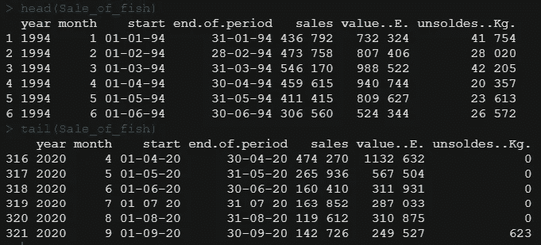

作者图片

从上面的片段中，可以注意到数据比需要的多很多。我们将为*“销售”*值创建时间序列预测。相应地，我们开始处理数据，去掉所有变量，除了' *start* 和 *'sales'* …

测井回报在变量' *logr '下计算。它们被添加到一个单独的列中，现在数据头看起来像…*

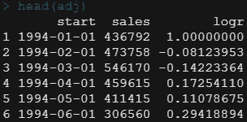

作者图片

然后数据被格式化成变量' test_ts '下的' *ts* '变量。

让我们在时间域中绘制数据，以便对我们正在处理的内容有一个大致的了解…

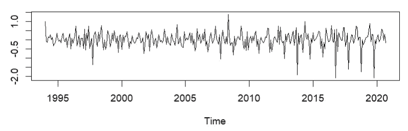

作者图片

然后将数据分解为“*原始数据*”、“*季节性*”、“*趋势*”和“*残差*”，在下一张图中从上到下绘制

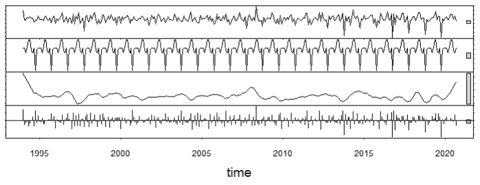

作者图片

然后对[自相关](https://en.wikipedia.org/wiki/Autocorrelation#:~:text=Autocorrelation%2C%20sometimes%20known%20as%20serial,the%20time%20lag%20between%20them.)和[部分自相关](https://en.wikipedia.org/wiki/Partial_autocorrelation_function)函数进行评估…

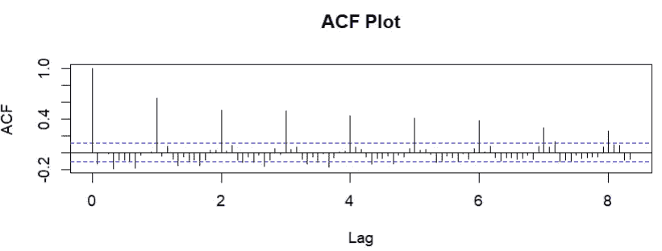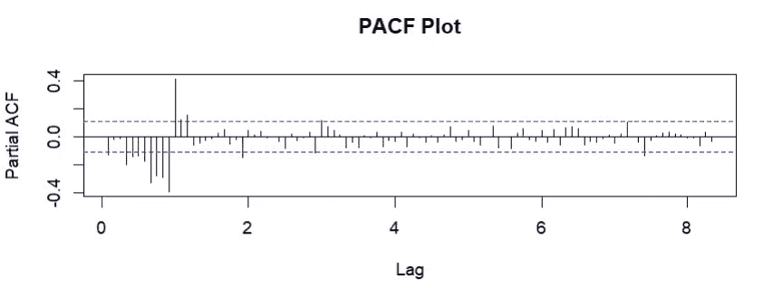

作者图片

通过上面的图表，可以区分良好的季节性以及数据中合理的相关性，但是[增强的 Dickey-Fuller](https://en.wikipedia.org/wiki/Augmented_Dickey%E2%80%93Fuller_test) 测试可以证实这一假设。获得的 p 值<为 0.05，因此可以安全地假设**数据集是静态的**。

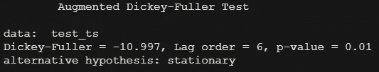

作者图片

基于这一发现，选择季节性 ARIMA 模型来创建预测。季节性 ARIMA 的系数是基于数据集显示出很强的季节性这一事实进行估计的(*季节性=真* )…

…并获得结果摘要

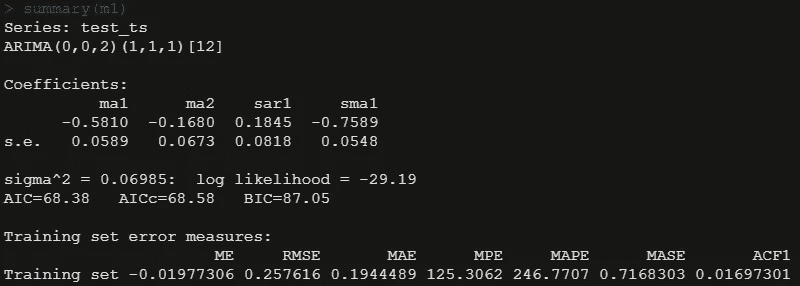

作者图片

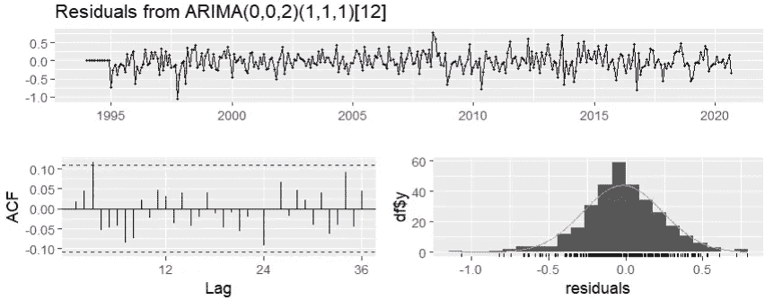

作者图片

基于平稳性假设，该模型表现相当好。让我们看看另一个数据集上的示例…

# 雅虎财务数据的时间序列预测

在第二个示例中，再次验证了数据的平稳性，数据看起来足够平稳，可以使用季节性 ARIMA 进行时间序列预测。执行与上述相同的过程…

输入数据是…

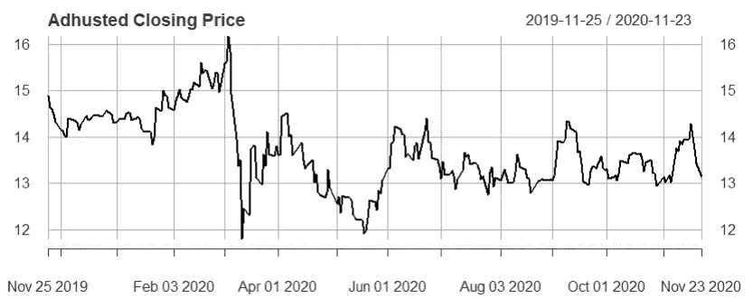

作者图片

…以及下面提供的输出和摘要。

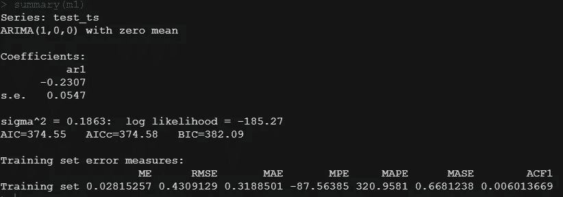

作者图片

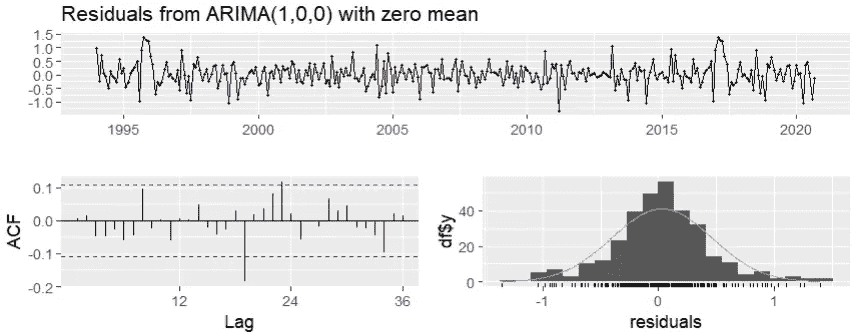

作者图片

# 讨论

总的来说，我们使用了一个 ARIMA 模型来拟合两个不同的(稳定的)时间序列数据集进行预测。然而，通过查看结果，您可以注意到第二个示例(在 Yahoo Financial 数据集上)比第一个示例(在 Fish Sales 数据集上)有更大的错误。

你认为为什么会这样？你有什么看法？

为了回答这个问题，您可能需要自己运行 Yahoo Financial Dataset 的代码(两个示例的完整代码都在我的 [repo](https://github.com/quaesito/time-series-forecast-R) 中提供)。

如果你愿意进一步尝试时间序列预测，并探索 Python 中的 SARIMAX 和 Prophet 等其他算法，那么你可以看看下面的故事。

  

如果你喜欢我的故事，并想跳到代码和完整的数据集，我已经在我个人的 git 上的 repo 中发布了它。

给[回购](https://github.com/quaesito/time-series-forecast-R)一颗星，在 [linkedin](https://www.linkedin.com/in/micheledefilippo/) 上联系我！
干杯:)