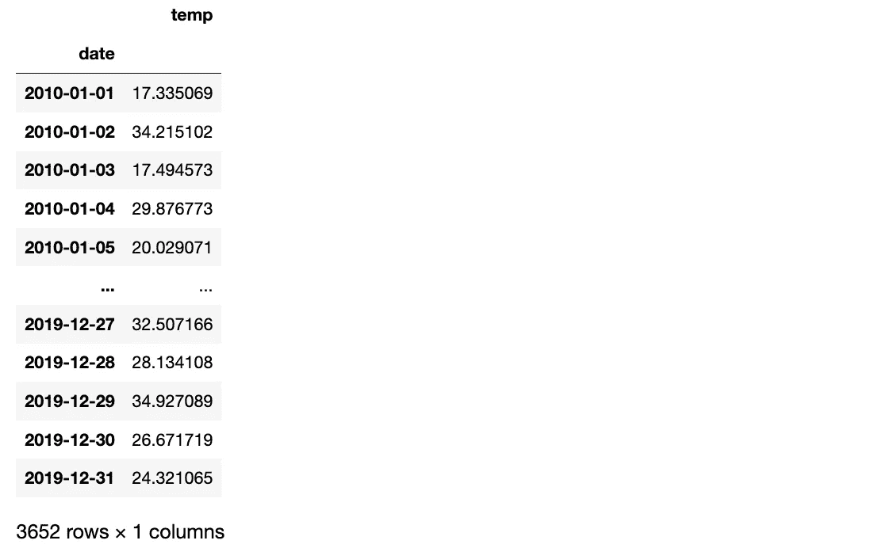
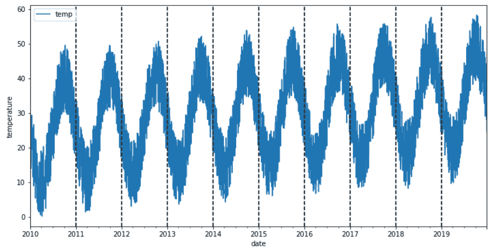
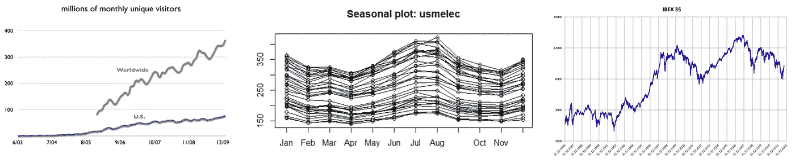
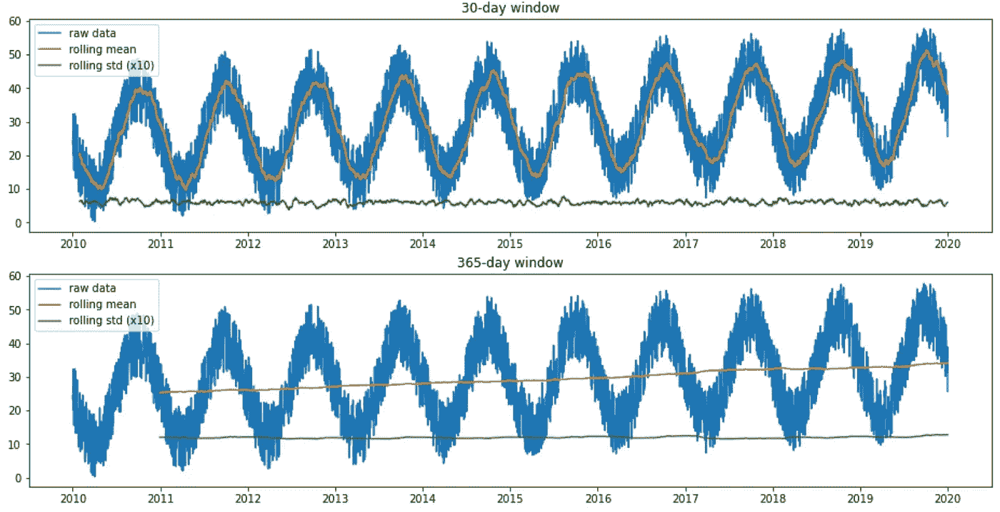
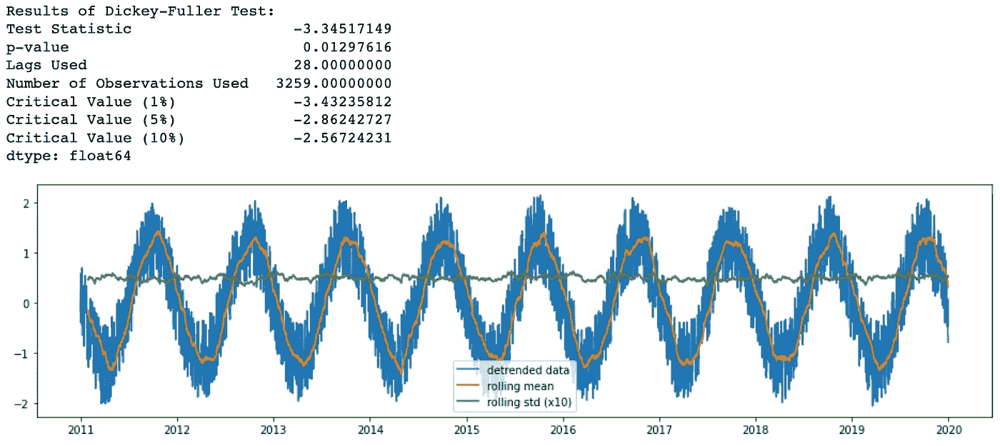
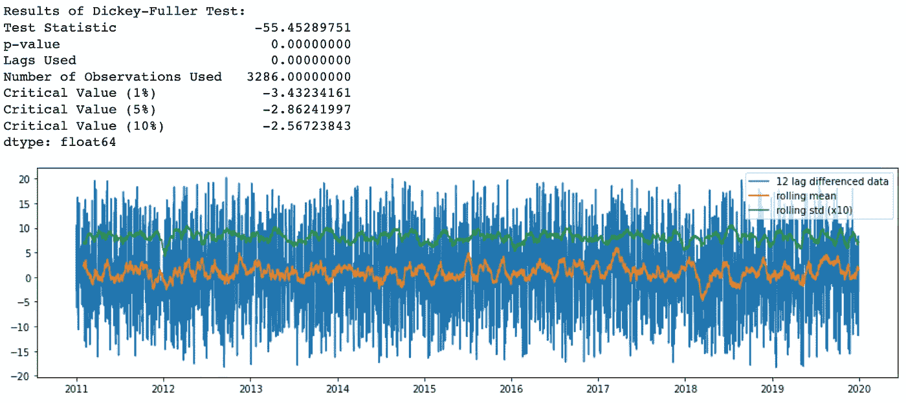
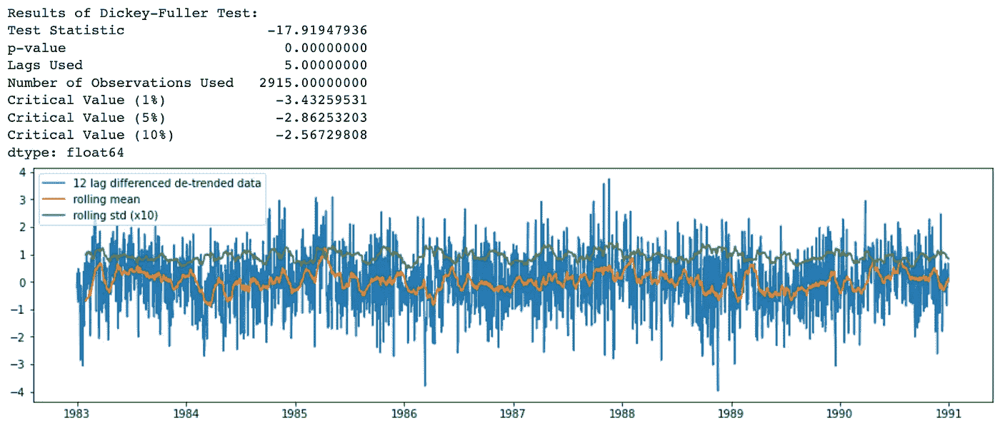
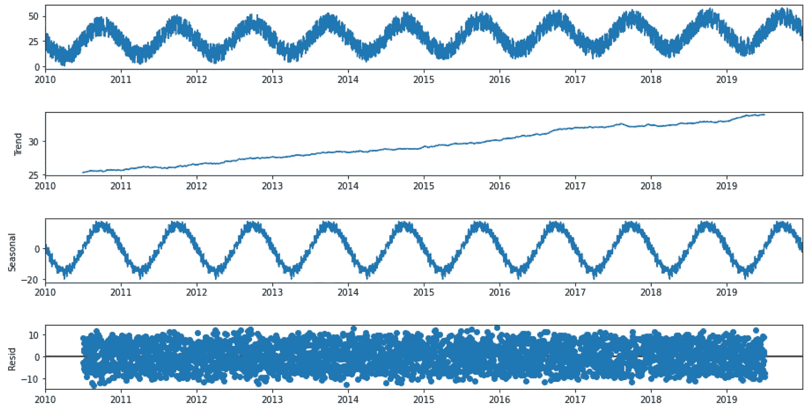

# 基于趋势和季节成分的时间序列预测

> 原文：<https://towardsdatascience.com/time-series-forecasting-based-on-the-trend-and-seasonal-components-26b92866e548>

## 分析时间序列的趋势和季节性，以分解时间序列并实现预测模型


照片由[卢卡斯](https://www.pexels.com/@goumbik)在[像素](https://www.pexels.com/photo/chart-close-up-data-desk-590022/)上拍摄

时间序列预测是基于带有时间戳的历史数据进行预测的任务。它包括建立模型以进行观察，并在天气、工程、经济、金融或商业预测等应用中推动未来的决策。

本文旨在介绍时间序列预测。结构展开如下。首先，描述任何时间序列的两个主要模式(趋势和季节性)。其次，根据这些模式对时间序列进行分解。最后，实现了一种称为 Holt-Winters 季节性方法的预测模型，适用于具有趋势和/或季节性成分的时间序列数据。

为了涵盖所有这些内容，我创建了一个数据集来模拟 2010 年至 2020 年间北半球城市(如塞维利亚)的温度。任何感兴趣的人都可以免费获得合成数据集和用于创建它的方法。代码可以在下面的 [GitHub](https://github.com/javiferfer/medium/blob/master/time_series_forecast/modeling_synthetic_dataset.ipynb) 库中找到。

## 1.导入库和数据

首先，导入运行代码所需的以下库。除了最典型的库之外，代码基于由 [statsmodels](https://www.statsmodels.org/stable/index.html) 库提供的函数，该库提供了用于估计许多不同统计模型的类和函数，例如统计测试和预测模型。

下面是创建数据集的代码。该数据由两列组成，一列是日期，另一列是 2010 年到 2020 年之间的温度。



## 2.可视化数据集

在我们开始分析时间序列的模式之前，让我们将数据可视化，其中每条垂直虚线对应于一年的开始。



**图 1** 。温度时间序列。**参考**:作者图片

在进入下一部分之前，让我们花点时间看看数据。有趣的是，这些数据似乎有季节性变化，因为冬季气温升高，夏季气温下降(南半球)。此外，温度似乎不会随着时间的推移而显著升高，因为无论哪一年，平均温度都几乎相同。

## 3.时间序列模式

时间序列预测模型使用数学方程来寻找一系列历史数据中的模式。然后，这些等式被用于将数据中的历史时间模式投射到未来[1]。

有四种类型的时间序列模式:

*   *趋势*:数据的长期增减。趋势可以是任何函数，例如线性或指数函数，并且可以随时间改变方向。
*   *季节性*:以固定频率(一天中的小时、一周、一月、一年等)在序列中重复循环。).季节性模式存在于一个固定的已知时期。
*   *周期性*:当数据上升和下降时出现，但没有固定的频率和持续时间，例如由经济条件造成的。
*   *噪声*:序列中的随机变化。

大多数时间序列数据将包含一个或多个模式，但可能不是全部。这里有一些例子，我们可以确定其中的一些时间序列模式:

1.  维基百科年度受众(左图):在该图中，我们可以发现一个增长趋势，因为受众每年都在线性增长。
2.  美国用电量的季节性曲线图(中间图):每条线对应一年，因此我们可以观察到年度季节性，因为消耗每年重复一次。
3.  IBEX 35 日收盘(右图):这个时间序列随着时间的推移有一个增加的趋势，以及一个周期模式，因为有一些时期 IBEX 35 由于经济原因而下降。



**图 2** 。从左到右，维基百科的年度观众，美国用电量的季节性图，IBEX 35 日收盘。**参考**:从左到右依次为【3】、【4】、【5】

如果我们假设这些模式的加法分解，我们可以写为:

Y[t] = T[t] + S[t] + e[t]

其中 Y[t]是数据，T[t]是趋势周期分量，S[t]是季节分量，e[t]是噪声，都在周期 T 内。

另一方面，乘法分解可以写成:

Y[t] = T[t] *S[t] *e[t]

当季节波动不随时间序列水平变化时，加法分解是最合适的。相反，当季节性成分的变化似乎与时间序列的水平成比例时，则乘法分解更合适[2]。

## 4.分解数据

平稳时间序列被定义为其性质不依赖于观察时间的时间序列。因此，具有趋势或季节性的时间序列不是平稳的，而白噪声序列是平稳的[6]。从更数学的意义上来说，如果一个时间序列有一个恒定的均值和方差，并且协方差与时间无关，则称该时间序列是平稳的。在[ [6](https://f0nzie.github.io/hyndman-bookdown-rsuite/stationarity-and-differencing.html) ]中，你有不同的说明性例子来比较平稳和非平稳时间序列。一般来说，一个平稳的时间序列不会有长期可预测的模式。

但是，为什么平稳性很重要呢？

嗯，平稳性已经成为时间序列分析中许多实践和工具的共同假设。其中包括趋势估计、预测和因果推断等。因此，在许多情况下，您需要确定数据是否是由平稳过程生成的，并将其转换为由该过程生成的样本的属性[7]。

但是，如何检验时间序列的平稳性呢？

我们可以用两种方法检查静止的。一方面，我们可以通过检查时间序列的均值和方差来手动检查它。另一方面，我们可以使用测试函数来评估平稳性[8]。

有些情况可能会令人困惑。例如，没有趋势和季节性但具有周期行为的时间序列是稳定的，因为周期不是固定长度的。

**4.1。检查趋势**

为了分析时间序列的趋势和季节性，我们首先使用 30 天和 365 天窗口的滚动平均法分析一段时间内的平均值。



**图三**。滚动平均值和标准差。 **Ref** :图片作者。

在图中，我们可以看到由于数据的季节性模式，使用 30 天窗口时的滚动平均值是如何随时间振荡的。此外，使用 365 天窗口时的滚动平均值随着时间的推移而增加，表明随着时间的推移略有增加的趋势。

这也可以使用几个测试进行评估，如迪基-富勒(ADF)和科维亚特科夫斯基、菲利普、施密特和申(KPSS):

*   ADF 测试的结果(p 值低于 0.05)表明，单位根存在的零假设可以在 95%的置信水平上被拒绝。因此，如果 p 值低于 0.05，时间序列是稳定的。
*   KPSS 检验的结果(p 值大于 0.05)表明，不存在单位根和存在单位根的零假设不能在 95%的置信水平下被拒绝。因此，如果 p 值低于 0.05，时间序列就不是稳定的。

虽然这些测试似乎是为了检查数据的平稳性，但它们对于分析时间序列的趋势而非季节性是有用的，如[9]所示。

```
Results of Dickey-Fuller Test:
Test Statistic                  -3.69171446
p-value                          0.00423122
Lags Used                       30.00000000
Number of Observations Used   3621.00000000
Critical Value (1%)             -3.43215722
Critical Value (5%)             -2.86233853
Critical Value (10%)            -2.56719507
dtype: float64
```

```
Results of KPSS Test:
Test Statistic           1.04843270
p-value                  0.01000000
Lags Used               37.00000000
Critical Value (10%)     0.34700000
Critical Value (5%)      0.46300000
Critical Value (2.5%)    0.57400000
Critical Value (1%)      0.73900000
dtype: float64
```

有趣的是，统计结果揭示了时间序列平稳性的影响。然而，两种检验的零假设是相反的。ADF 检验表明时间序列是平稳的(p 值> 0.05)，而 KPSS 检验表明它不是平稳的(p 值> 0.05)。该数据集是以轻微趋势创建的，因此结果表明 KPSS 检验对于分析该数据集更为准确。

为了降低数据集的趋势，我们可以实现以下去趋势方法:



**图 4** 。去除时间序列趋势后的滚动平均值和标准差。**参考号**:图片由作者提供。

**4.2。检查季节性**

正如之前从滚动 std 中观察到的，我们的时间序列中有一个季节性模式。因此，我们应该采用差分方法来消除时间序列中潜在的季节性或周期性模式。由于样本数据集有 12 个月的季节性，我使用了 365-滞后差异的差异:



**图 5** 。时间序列差分后的滚动平均值和标准差。 **Ref** :图片作者。

现在，滚动平均值和标准差在一段时间内基本保持不变，所以我们有一个稳定的时间序列。

去趋势和差分方法的组合实现如下:



**图 6** 。时间序列去趋势和差分后的滚动平均值和标准差。**参考**:图片由作者提供。

**4.3。分解**

基于上述模式的分解可以通过[**【stats models】包**](https://www.statsmodels.org/stable/index.html) 中的一个有用的 Python 函数[**seasonal _ decompose**](https://www.statsmodels.org/dev/generated/statsmodels.tsa.seasonal.seasonal_decompose.html)来实现:



**图 7** 。时间序列分解。**参考**:图片由作者提供。

在查看了分解图的四个部分后，我们可以说，在我们的时间序列中有一个很强的年度季节性成分，以及一个随时间推移而增加的趋势模式。

## 5.建模

时间序列数据的合适模型将取决于数据的特定特征，例如，数据集是否具有总体趋势或季节性。请务必选择最适合您的数据的模型。

时间序列数据的合适模型将取决于数据的特定特征，如趋势和季节性[10]。请确保选择最适合您的数据的模型:

1.  自回归(AR)
2.  移动平均线
3.  自回归移动平均(ARMA)
4.  自回归综合移动平均(ARIMA)
5.  季节性自回归综合移动平均(SARIMA)
6.  带有外生回归量的季节性自回归综合移动平均(SARIMAX)
7.  向量自回归(VAR)
8.  向量自回归移动平均(VARMA)
9.  带外生回归量的向量自回归移动平均(VARMAX)
10.  简单指数平滑(SES)
11.  霍尔特·温特的指数平滑法

由于我们的数据中存在季节性，实施的模型是霍尔特-温特斯指数平滑法，因为它适用于具有趋势和/或季节性成分的时间序列数据。

这种方法使用指数平滑对过去的大量值进行编码，并使用它们来预测现在和未来的“典型”值。指数平滑是指使用指数加权移动平均(EWMA)来“平滑”时间序列[11]。

在实施之前，让我们创建培训和测试数据集:

下面是使用均方根误差(RMSE)作为度量来评估模型误差的实现。

```
The Root Mean Squared Error of additive trend, additive seasonal of period season_length=365 and a Box-Cox transformation 6.27
```


**图 8** 。霍尔特-温特斯指数平滑法的结果。**参考号**:图片由作者提供。

从图中，我们可以观察到模型是如何捕捉时间序列的季节性和趋势的，在异常值的预测中有一个错误。

## 6.结论

了解主要的时间序列模式并学习如何实现时间序列预测模型是至关重要的，因为它们有许多应用。

在整篇文章中，我们通过一个基于温度数据集的实际例子介绍了趋势和季节性。除了检查趋势和季节性，我们还看到了如何减少它，以及如何创建一个基本模型，使用这些模式来推断未来几天的温度。

从这里开始，接下来的步骤是理解其他预测模型，如第 5 节中列出的模型。在这里，我留下了两个链接[ [10](https://www.bounteous.com/insights/2020/09/15/forecasting-time-series-model-using-python-part-two/) ， [12](https://medium.com/towards-data-science/find-the-order-of-arima-models-b4d99d474e7a) ]，链接到其他可以被认为是这篇文章的延伸的文章。

***如果你喜欢这篇文章，请考虑*** [***订阅***](https://javiferfer.medium.com/membership) ***。你将获得我所有的内容+所有其他来自牛逼创作者的文章！***

## 参考

[1] Science Direct，[智慧餐厅:顾客需求调查及销售预测](https://www.sciencedirect.com/science/article/pii/B9780128034545000171)

[2] Otexts，[时序组件](https://otexts.com/fpp2/components.html)

[3]维基媒体，[维基百科的年度受众](https://commons.wikimedia.org/wiki/File:Wikipedia.org_audience_trend.png)

[4]维基媒体，[美国用电量的季节性图表](https://commons.wikimedia.org/wiki/File:SeasonalplotUS.png)

[5]维基媒体，【1986 年 12 月至 2012 年 9 月的 IBEX 35(每日收盘)

[6] Otexts，[平稳性和差分性](https://otexts.com/fpp2/stationarity.html)

[7]中等，[时间序列分析中的平稳性](/stationarity-in-time-series-analysis-90c94f27322)

[8] Medium，[为什么增强的 Dickey-Fuller 检验(ADF 检验)在时间序列分析中如此重要](https://medium.com/@cmukesh8688/why-is-augmented-dickey-fuller-test-adf-test-so-important-in-time-series-analysis-6fc97c6be2f0)

[9]堆栈交换，[被 ADF 和 KPSS 检验视为平稳的季节性数据](https://stats.stackexchange.com/questions/225087/seasonal-data-deemed-stationary-by-adf-and-kpss-tests)

[10]boundous，[使用 Python 进行时间序列模型预测:第二部分](https://www.bounteous.com/insights/2020/09/15/forecasting-time-series-model-using-python-part-two/)

[11] Orangematter，[霍尔特-温特斯预测和指数平滑简化](https://orangematter.solarwinds.com/2019/12/15/holt-winters-forecasting-simplified/#:~:text=What%20Is%20the%20Holt%2DWinters,cyclical%20repeating%20pattern%20(seasonality).)

[12]中等，[找到 ARIMA 车型的订单](/find-the-order-of-arima-models-b4d99d474e7a)

其他:

*   使用 Python 使用时间序列模型进行预测:第一部分
*   中，[Python 中的时间序列分解](/time-series-decomposition-in-python-8acac385a5b2)
*   机器学习大师，[用 Python 研究时间序列的季节性](https://machinelearningmastery.com/time-series-seasonality-with-python/)
*   时间序列数据的自相关性、季节性和平稳性概述
*   中，[Python 中的时间序列分析和天气预报](https://medium.com/@llmkhoa511/time-series-analysis-and-weather-forecast-in-python-e80b664c7f71)