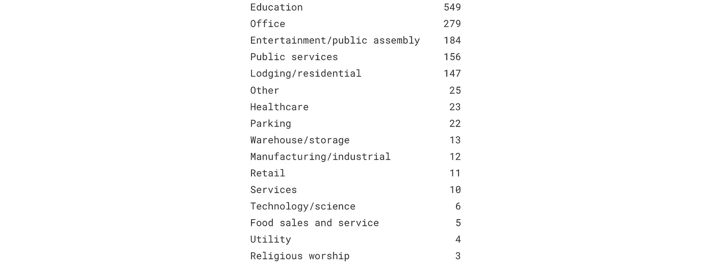
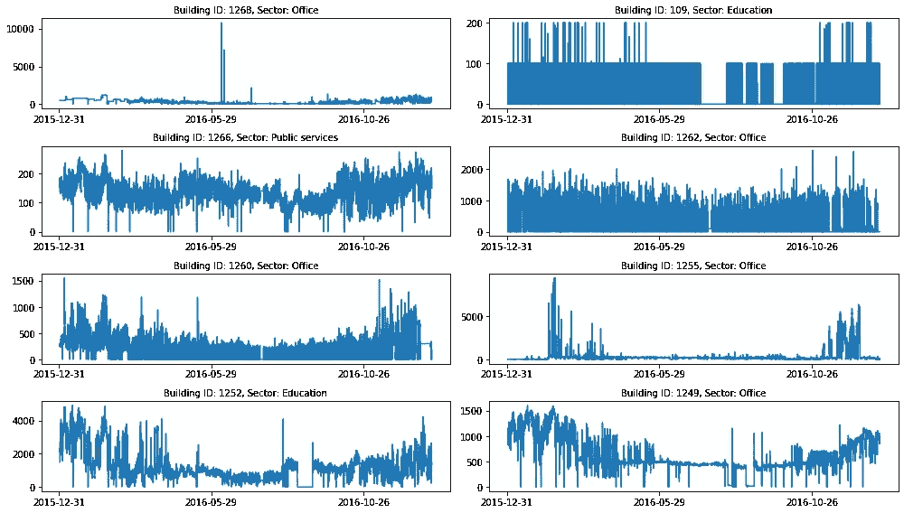
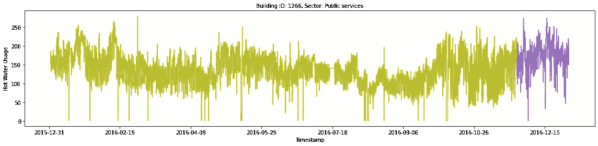
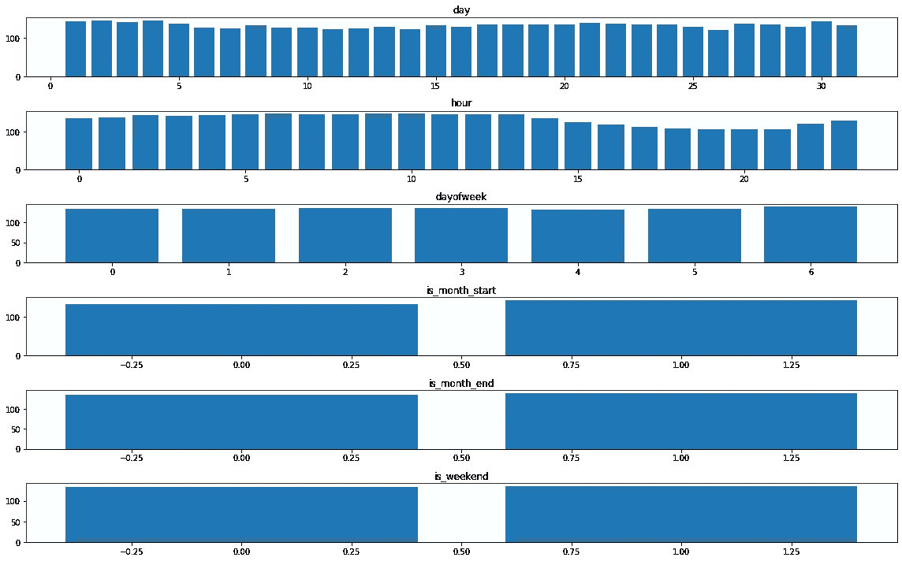
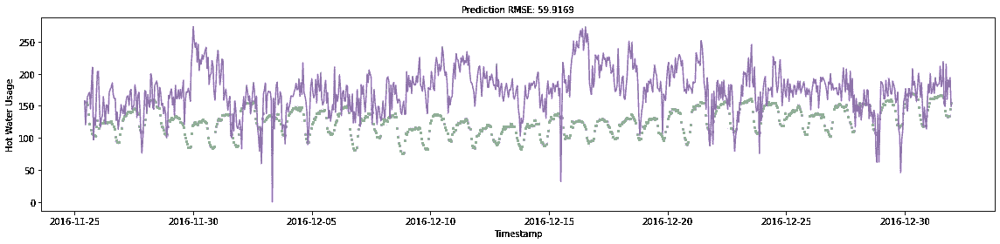
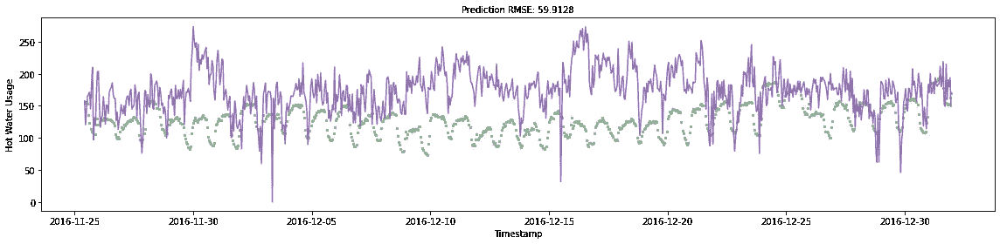
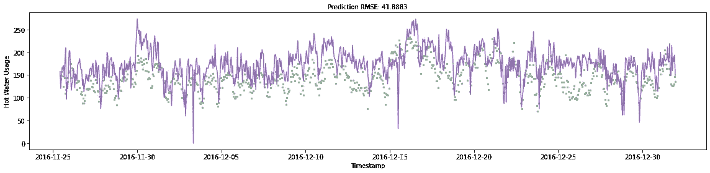
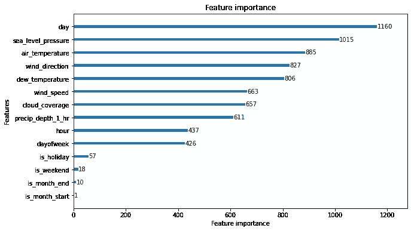
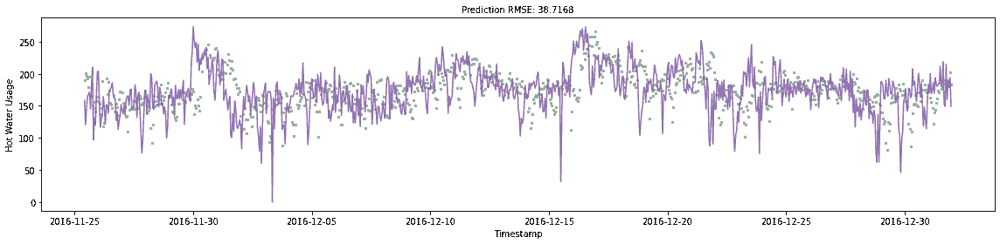
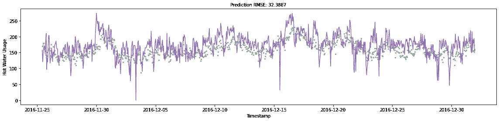

# 时间序列预测:集成学习

> 原文：<https://towardsdatascience.com/time-series-forecasting-ensemble-learning-df5fcbb48581>

## 用决策树和 ARIMA 模型展示集成学习的威力

仪表图像——作者[多丽丝·摩根](https://unsplash.com/@d_morgan)

在这篇文章中，我将展示集成学习对于时间序列预测的预测能力。集成学习导致模型具有更高的预测准确性、更低的过拟合可能性和不同的预测集。

我将使用 ASHRAE(美国供暖、制冷和空调工程师协会)提供的数据集，该数据集包含各种建筑的电力、冷冻水、蒸汽和热水的每小时计量数据。这个数据集可以在[这里](https://www.kaggle.com/competitions/ashrae-energy-prediction/overview) (CC0:公共领域)找到。在下一节中，我们将导入必要的 python 包，并加载计量和建筑数据。

## 加载数据

建筑行业—按作者

在上面的图像中，我们可以看到有大约 1400 个独特的建筑分布在不同的区域。并非所有建筑物都有干净的数据，一些建筑物的计量数据比其他建筑物包含更多缺失值。让我们设想一个缺失数据点最少的建筑样本。

建筑样本—按作者

我们可以看到大部分的情节都大相径庭。例如，即使对于办公楼，我们也可以看到每栋建筑的用水量差异很大。这表明建筑物的区域对于每次预测可能不是很有用。

在本文的剩余部分，我们将使用 1266 号建筑的热水用量数据。这似乎很少有错误或长时间没有使用。使用各种特征和外部数据集，我们将有望创建一个具有高预测准确性的模型。在下面的单元格中，我们隔离了这个建筑样本，将样本拆分为一个训练集和一个验证集，并绘制出结果。橄榄色数据是训练数据，紫色部分是验证集。

1266 号楼热水使用情况—作者

一年中热水使用量似乎有 8-10 次高峰。这可能是由于低温、特殊事件或其他完全不同的原因。还有 10–20 分的建筑热水使用量，这可能表示假期、周末或错误。这些初步的想法不能仅用可视化来证实或否认，我们将需要在开发模型时进行进一步的探索。

我们现在将使用数据中基于时间的特征来查看潜在的季节性。我们可以在 Matplotlib 中创建支线图，并获取每个可能特征值的平均计量热水用量。

潜在季节性—按作者

与下午时段(PM)相比，上午时段(AM)似乎使用了更多的热水。有趣的是，周日的热水用量似乎比一周中的任何一天都要高。星期几、星期几和其他特征可能是重要的，或者它们可能只是噪声，但是我们不能仅从可视化中确定这一点。

## 基线 LGBM 模型

通过单独使用这些特征，我们可以生成一个基线 LGBM 模型。LGBM 是一个基于决策树算法的梯度推进框架。这个框架不同于 XGB，因为它的树模型是逐叶增长的，而不是逐层增长的。这导致更快的训练时间和相当的准确性。欲了解更多关于这些模型之间的差异，请查看本文。

然后，我们可以使用训练好的模型来预测验证集中每个小时的热水用量，并用真实标签绘制预测结果。图标题还显示了预测的 RMSE(均方根误差)。这将为我们提供一个具体的度量标准，用于度量模型的准确性。请注意，我们还没有进行 n 步预测，我们纯粹是使用从时间戳特性设计而来的特性。

基线 LGBM RMSE:~ 59.9——作者

## 假期数据

在下一节中，我们将使用美国假日数据的[外部数据源](https://www.kaggle.com/datasets/donnetew/us-holiday-dates-2004-2021)(CC0:公共域)。这可能是解释热水需求低谷的有用特征，并可能提高模型的准确性。将这些数据合并到训练集中后，我们将更新模型并进行新的预测。

LGBM w/ Holiday RMSE:约 59.9 英镑——作者

这个模型比以前的 RMSE 提高了 0.0041。这是一个相当不起眼的改进，但是我们现在将保留这个特性，以防它与我们在下一节中添加的其他特性结合起来很有价值。

## 气象资料

我要添加的第二个数据源是来自 ASHRAE 数据集(CC0:公共领域)的天气数据。这提供了离数据集中的建筑物最近的塔的实时历史天气测量值。

我们必须小心，因为我们的数据来自实时测量，而不是 10 小时的预测。如果我们只是简单地使用这种天气信息作为一个功能，我们将犯数据泄漏！因此，我们将通过向每一列添加少量高斯噪声来模拟天气数据中的误差。这将使模型更少依赖于天气数据，更不容易过度拟合。

然后，我们可以用添加的特征来拟合 LGBM 模型，对新预测的 RMSE 进行评分，并根据其真实值绘制预测。

LGBM w/ Weather RMSE:约 41.8 英镑——作者

哇！与上一次迭代相比，RMSE 显著增加了约 20 个点。因为我们在这个模型的迭代中增加了 7 个特征，所以不容易看出哪个特征对准确性的提高贡献最大。幸运的是，LGBM 模型本身就具有特性重要性。在下面的图中，我们将每个特征的重要性形象化。我们可以看到，所有 7 个特征对模型都很重要，但海平面气压、气温和风向的影响最大。

要素重要性图-按作者

## ARIMA 模型

最后，我们将在预测中加入一个 ARIMA 模型。在现实世界中，在单一时间点对未来 750 小时进行预测是没有意义的。你更有可能提前 n 小时预测一个数据点。你做的预测越靠前，它就可能越不准确。

进行 n 步预测的一个好处是，您可以将更多的本地化信息合并到您的模型中。我们将通过集成 LGBM 模型和 SARIMA(季节性自回归综合移动平均)模型来实现这一点。萨里玛是基于 ARIMA 模型架构，但它纳入了季节性的组成部分。基于 ARIMA 的模型是时间序列预测的黄金标准，可以产生准确的预测。

在下一个单元格中，我们迭代地对整个验证数据集进行 10 步预测，然后观察 SARIMA 本身的表现。

萨里玛模型 RMSE: ~38.7 英镑——作者

时间序列预测的黄金标准再次来袭！该模型的 RMSE 约为 38，比 LGBM 模型高出近 3 个百分点。

有人可能会认为放弃 LGBM 模型是正确的，但是我们可以通过组合这两个模型来获得更好的模型精度。集成是指将多个模型的平均预测值进行组合，得出最终预测值。这通常会提高模型精度并减少过度拟合。

RMSE LGBM-SARIMA 合奏:~ 32.3——作者

哇！我们将 SARIMA 模型的 RMSE 提高了约 7 个点，将 LGBM 模型的提高了约 9 个点。这是一个重大的改进，展示了集成学习的力量。

## 最后的想法

集成学习在 AI/ML 中与在现实世界中一样强大。在现实世界中，当你和一群不同的人一起解决一个问题时，你可能会创造出更有效的解决方案。这是由于每个小组成员的独特经验和不同的技能组合。这和集成学习没什么区别。通过组合不同的模型架构和特性组合，您可以创建一组不同的预测。

如果你想了解更多信息，我在下面提供了一些额外的资源。这篇文章的代码可以在这里找到。

## 资源

1.  [集成学习维基](https://en.wikipedia.org/wiki/Ensemble_learning)
2.  [时间序列预测 w/ ARIMA、SARIMA 和 SARIMAX](/time-series-forecasting-with-arima-sarima-and-sarimax-ee61099e78f6)
3.  [LGBM 文件](https://lightgbm.readthedocs.io/en/latest/)
4.  [StatsModels 文档](https://www.statsmodels.org/devel/generated/statsmodels.tsa.arima.model.ARIMA.html)