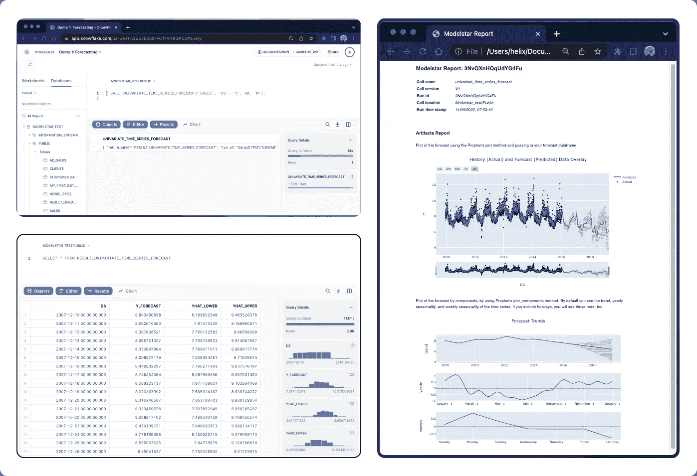
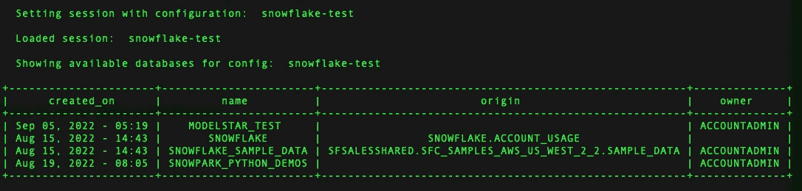
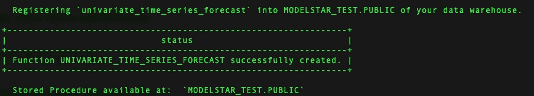
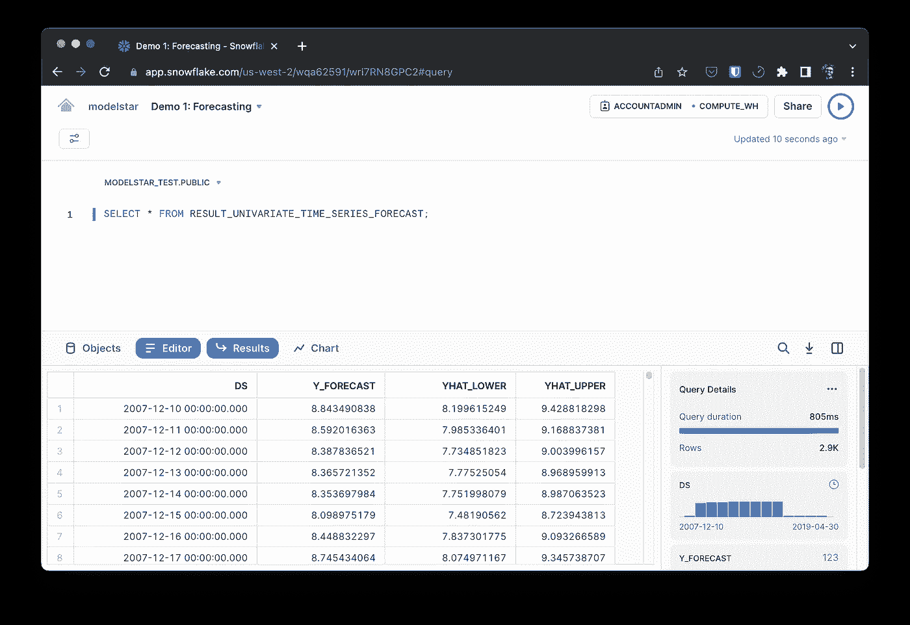
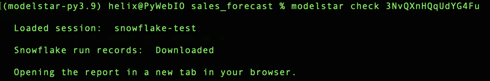
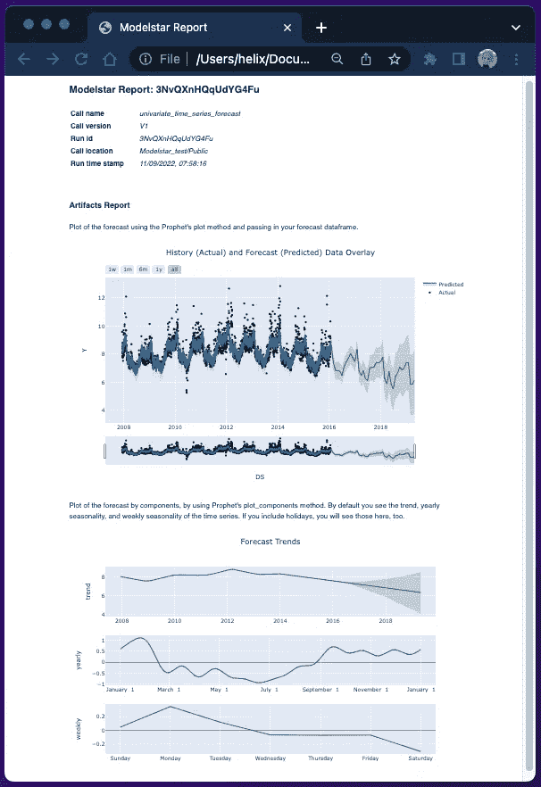
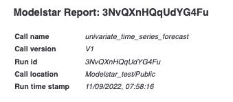
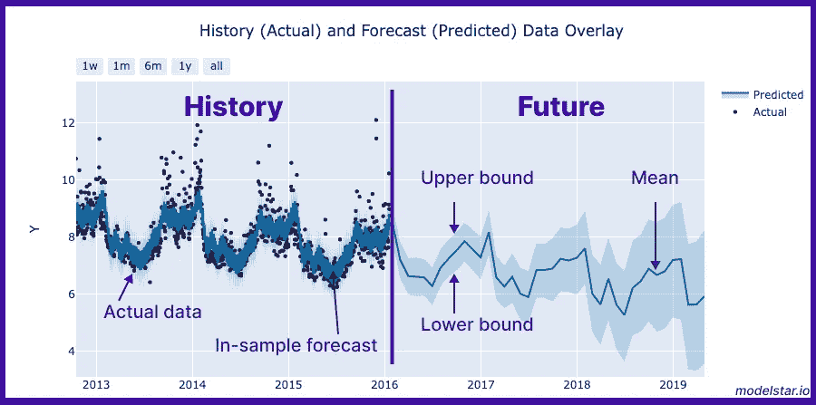
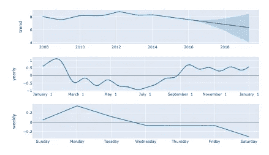

# 基于 SQL 的雪花时序预测

> 原文：<https://towardsdatascience.com/time-series-forecasting-in-snowflake-using-sql-6ce7cedce862>

## 需求预测、供应链和库存管理、财务规划对企业运营非常重要。Modelstar 让您在雪花中做到这一点，只需一行 SQL。



博客输出概述。图片作者。

# 什么是时间序列预测及其用例？

时间序列预测是一种基于历史时间采样数据预测值的技术。

## 预测是企业管理的基础<https://modelstar.io/docs/tutorials/sales-forecasting-inside-snowflake/#sales-forecasting-is-rudimentary-for-business-management>

预测可以帮助公司在供应链管理、库存管理(关于补货数量和时间)、财务规划、产品路线图和招聘策略等方面做出正确的商业决策。有了准确及时的预测结果，企业管理层可以更好地了解如何分配资源或利用顺风。

## 预测的技术挑战

预测是时间序列分析的一种应用。有几个组件需要考虑:

*   季节性:随时间的周期性变化。例如:寒暑假是每年一次，或者每天早上喝更多的咖啡。
*   趋势:持续的非周期性变化。例如:过去 5 年公司销售额的增长。
*   破坏性事件:突然的变化。它可能由可预测的因素(如假期或服务维护)和不可预测的问题(如随机错误或缺陷)共同驱动。

一个好的预测算法应该捕获大部分成分，并在统计上以一定的置信度做出预测。

## 实施的技术挑战

Python 有丰富的生态系统来实现机器学习和预测算法。雪花的新 Snowpark 功能将 Python 引入您的数据仓库，使用 UDF 在 SQL 中运行 Python，这是您可以对数据执行的转换的游戏规则改变者。但是，如果您想要实施一个端到端的解决方案来执行预测，这可能会令人望而生畏并且非常耗时。 [Modelstar](https://github.com/modelstar-labs/modelstar) 通过提供一个简化的解决方案将 Python 的强大功能引入 SQL，解决了这个问题。

> [Modelstar](https://github.com/modelstar-labs/modelstar) 是一个开源项目，建立在最近推出的雪花功能上，比如 Snowpark。它在雪花计算中自动处理依赖关系、模型人工制品和文件 I/O。

## 用于预测的 SQL 1-liner

[Modelstar](https://modelstar.io/) 让您可以发送和管理预测模型，并在雪花中用一行 SQL 可视化建模结果。在幕后，Modelstar 提供了预构建的预测算法，并将它们作为 SQL 存储过程公开在您的数据库中。在这个例子中，我们将使用`univariate_time_series_forecast` ( [API 文档](https://modelstar.io/docs/api/ml-sql-functions/univariate-time-series-forecast))。这个 API 基于一个开源库 [Prophet](https://facebook.github.io/prophet/) ，这是业界使用最广泛的预测算法之一。

本教程提供了建立时间序列预测模型和报告的步骤。它包括:

*   基本概念:关于销售预测用例及技术。
*   Modelstar CLI 工具:Modelstar 安装指南
*   `univariate_time_series_forecast` SQL 语法:进行预测的 SQL 1-liner
*   预测报告:可供业务团队使用的预测结果

在本示例结束时，您将知道如何在雪花内部训练预测模型，并生成显示模型性能的报告，如下所示:


我们的产出报告。图片作者。

# SQL ML 之旅的准备<https://modelstar.io/docs/tutorials/sales-forecasting-inside-snowflake/#preparation-for-the-sql-ml-journey>

如果您是第一次使用 Modelstar，这是一个安装 Modelstar 的快速入门指南。

## 第一步:安装型号之星<https://modelstar.io/docs/tutorials/sales-forecasting-inside-snowflake/#step-1-install-modelstar>

```
$ pip install modelstar
```

> **提示:**我们建议使用虚拟环境来管理依赖关系。下面是如何开始的快速概述: [Python 环境](https://krishadi.com/zettelkasten/python)。

通过快速版本检查来验证安装:

```
$ modelstar --version
```

这应该会在您的终端中显示版本号。

## 步骤 2:初始化一个模型星项目<https://modelstar.io/docs/tutorials/sales-forecasting-inside-snowflake/#step-2-initialize-a-modelstar-project>

```
$ modelstar init forecast_project
```

> **提示:** `modelstar init <project_name>` 是基本命令，其中`<project_name>`可以替换为您选择的名称。

现在你会看到一个`forecast_project`文件夹创建在你的工作目录中。

## 步骤#3:配置雪花会话<https://modelstar.io/docs/tutorials/sales-forecasting-inside-snowflake/#step-3-config-snowflake-session>

在`forecast_project`文件夹中，找到文件`modelstar.config.yaml`，用你最喜欢的编辑器打开它。向其中添加您的雪花帐户信息和凭据。随意用任何名称命名会话。在这个例子中，我们使用`snowflake-test`。该文件中的凭证用于连接到您的雪花数据仓库。(注意:不要将 modelstar.config.yaml 文件提交到您的 CI/CD 版本控制中。)

```
# ./modelstar.config.yaml
# MODELSTAR CONFIGURATION FILE
---
sessions:
    - name: snowflake-test
      connector: snowflake
      config:
          account: WQA*****
          username: <username>
          password: <password>
          database: MODELSTAR_TEST
          schema: PUBLIC
          stage: test
          warehouse: COMPUTE_WH
```

> **注意:**请在您的雪花仓库数据库中创建阶段，并在配置中指定它。

## 第四步:Ping 雪花<https://modelstar.io/docs/tutorials/sales-forecasting-inside-snowflake/#step-4-ping-snowflake>

我们现在可以从您的终端启动 Modelstar 会话。在新生成的 Modelstar 项目的目录中(在我们的示例中，它是`./forecast_project/`)，运行以下命令:

```
$ modelstar use snowflake-test
```

> **提示:** `modelstar use <session name>`是命令，如果你给了另一个会话名，用那个来代替`<session name>`。

一次成功的 ping 应该会导致如下结果:



控制台输出。图片作者。

## 第五步:将预测算法注册到雪花<https://modelstar.io/docs/tutorials/sales-forecasting-inside-snowflake/#step-5-register-the-forecast-algorithm-to-snowflake>

Modelstar 提供了现成的预测算法，并管理该算法的依赖关系，因此您不必这样做。要使其在您的雪花仓库中可用，请运行以下命令:

```
$ modelstar register forecast:univariate_time_series_forecast
```

成功消息如下所示:



控制台输出。图片作者。

## 步骤#6:将样本销售数据上传到雪花(可选，如果您使用自己的数据集)<https://modelstar.io/docs/tutorials/sales-forecasting-inside-snowflake/#step-6-upload-sample-sales-data-to-snowflake>

如果您想在示例销售数据集上尝试预测算法，请运行此命令在您的数据仓库中创建一个数据表。如果您想使用自己的数据，可以跳过这一步。

```
$ modelstar create table sample_data/time_series_data.csv:TS_DATA_TABLE
```

该命令将`time_series_data.csv`文件上传到雪花并创建一个名为`‘TS_DATA_TABLE’`的表。在这里找到更多关于这个 [API 的信息。](https://modelstar.io/docs/api/cli/create)

# 使用 SQL 1-linear <https://modelstar.io/docs/tutorials/sales-forecasting-inside-snowflake/#build-a-forecast-model-using-a-sql-1-linear>构建预测模型

## 在雪花工作表 <https://modelstar.io/docs/tutorials/sales-forecasting-inside-snowflake/#run-this-script-in-a-snowflake-worksheet> 中运行该脚本

在 Snowflake 中使用以下命令来构建预测模型(下面的示例使用了在步骤#6 中上传的样本数据):

```
CALL UNIVARIATE_TIME_SERIES_FORECAST('TS_DATA_TABLE', 'DS', 'Y', 40, 'M');
```

意思是:根据`TS_DATA_TABLE`表中的历史数据预测`Y`值的下一个`40` `M`(月)，其中`DS`为时间列。


雪花雪景。图片作者。

## 对您自己的数据运行预测算法<https://modelstar.io/docs/tutorials/sales-forecasting-inside-snowflake/#to-run-the-forecasting-algorithm-on-your-own-data>

在幕后，预测算法作为存储过程在雪花内部运行。它采用以下参数:

要配置您自己的预测周期，请查看[该 API 文档](https://modelstar.io/docs/api/ml-sql-functions/univariate-time-series-forecast)以获取设备别名的完整列表。

## 检查结果<https://modelstar.io/docs/tutorials/sales-forecasting-inside-snowflake/#check-the-result>

模型训练完成后，在雪花结果窗口中，一次成功的运行应该会输出如下所示的 json 字符串:

```
{
    "return_table": "RESULT_UNIVARIATE_TIME_SERIES_FORECAST",
    "run_id": "3NvQXnHQqUdYG4Fu"
}
```

表示已经创建了一个名为“RESULT _ UNIVARIATE _ TIME _ SERIES _ FORECAST”的表来物化预测数据，运行 id(“3 nvqxnhqkudyg 4 fu”)可以帮助您拉取预测报告。

## 查看[预测数据表](https://modelstar.io/docs/tutorials/sales-forecasting-inside-snowflake/#check-the-prediction-data-table)

让我们使用以下命令检查运行的结果表:

```
SELECT * FROM RESULT_UNIVARIATE_TIME_SERIES_FORECAST;
```

表格中有 4 列:

*   `DS` ( `datetime`):日期时间
*   `Y_FORECAST`、`YHAT_LOWER`、`YHAT_UPPER` (float):预测值的均值、下键和上键(其含义参见术语表部分的`Uncertainty Intervals`)。



雪花雪景。图片作者。

## 检查预测报告

使用 Modelstar 自动生成一份报告，其中记录了有关运行的信息，以及机器学习工件。要检查报告，只需在本地计算机上运行以下命令:

```
$ modelstar check <run_id>
```

您的终端应该会显示以下消息:



如前所述，一份报告将出现在您的浏览器中:



模特之星报道。图片作者。

## 报告里有什么<https://modelstar.io/docs/tutorials/sales-forecasting-inside-snowflake/#whats-in-the-report>

该报告包括 3 个部分:

*   本次运行的元信息



*   预测图:检查建模质量和预测结果。



模特之星报道。图片作者。

*   组件分析:为了说明趋势和季节性，您的模型已经“学习”了，包括总体趋势，以及每年和每周的季节性(超过 1 年/周的周期模式)。



模特之星报道。图片作者。

> **词汇**
> 
> ***样本内和样本外预测:*** *通过样本内预测，可以检查预测模型与实际数据的拟合程度。样本外预测显示对未来的预测。*
> 
> ***不确定区间:*** *上下界之间的区间。这意味着真实值有 80%的概率落在该区间内。更高的确定性要求导致更宽的频带(参见* [*巴托兹的文章*](https://www.mikulskibartosz.name/understanding-uncertainty-intervals-generated-by-prophet/) *)。不确定性也随着我们走向更远的未来而增长，导致作为时间函数的带宽变宽。*

# 结论

预测是商业管理的基础。我们的目标是为雪花提供预测功能，以训练机器学习模型并使用它进行预测。我们只用一行 SQL 就实现了所有这些。与此同时，还会生成一个运行报告，其中包含运行的详细信息以及预测分析。这是由 [Modelstar](https://github.com/modelstar-labs/modelstar) 实现的。

> *查看 Modelstar 的* [***GitHub 库:这里***](https://github.com/modelstar-labs/modelstar) *，star 它将会在最新更新。如果您的用例出现了 bug、问题或功能请求，请联系*[*Github*](https://github.com/modelstar-labs)*或在*[*Github*](https://github.com/modelstar-labs/modelstar/issues)*上打开问题。*

*   GitHub 库:[https://github.com/modelstar-labs/modelstar](https://github.com/modelstar-labs/modelstar)
*   文档:【https://modelstar.io/docs/quickstart/ 