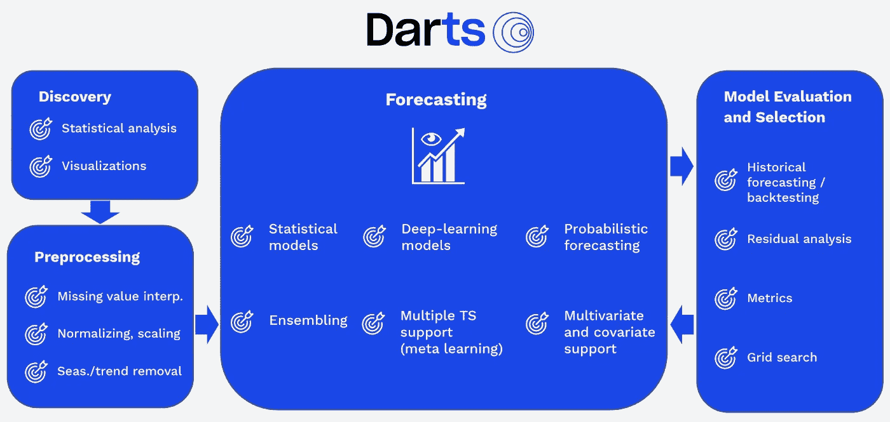
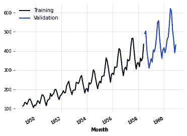
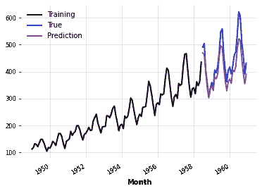

# 飞镖使时间序列预测变得简单

> 原文：<https://towardsdatascience.com/time-series-forecasting-made-easy-with-darts-3be0b8ba02f4>

## 一个用于时间序列预处理和预测的开源包，具有统一和用户友好的 API

科林·伯伦斯来自[的图片](https://pixabay.com//?utm_source=link-attribution&amp;utm_medium=referral&amp;utm_campaign=image&amp;utm_content=3068300)

时间序列预测涉及基于历史时间戳数据的模型构建，以进行科学预测并推动未来的战略决策。时间序列预测在各个领域都有很多用途，包括:

*   预测消费者对每种产品的需求
*   医疗保健中疫情传播、诊断、药物和规划的预测
*   异常检测、网络安全和预测性维护
*   预测当前的基础设施能否处理近期和远期的流量

还有很多。

时间序列预测与传统的机器学习用例略有不同，因为它涉及到在特征工程和建模过程中必须考虑的数据的时间顺序。

## 动机:

为了训练一个时间序列预测模型，您最终会遇到这样的情况:使用[熊猫](https://pandas.pydata.org/)进行预处理，使用 [statsmodel](https://www.statsmodels.org/stable/index.html) 进行季节性和统计测试，使用 [scikit-learn](https://scikit-learn.org/stable/) 或[脸书先知](https://facebook.github.io/prophet/)进行预测，并使用定制代码来实现回溯测试和模型选择。

由于不同的库有不同的 API 和数据类型，端到端的时间序列预测对数据科学家来说是一项单调乏味的任务。对于传统的机器学习用例，我们有 [scikit-learn](https://scikit-learn.org/stable/) 包，它为端到端的机器学习建模提供了一致的 API。

Darts 试图成为时间序列的 scikit-learn，其主要目标是简化整个时间序列预测方法。在本文中，我们将讨论 darts 包及其实现。

# 飞镖:

**Darts** 是一个 Python 库，可以轻松操作和预测时间序列。它提供了各种模型的实现，从 ARIMA 等经典模型到深度神经网络，这些模型的实现方式与 scikit-learn 模型相同(使用 fit 和 predict APIs)。

Darts 包的一些特点是:

*   它是围绕不可变的 TimeSeries 类构建的
*   它有一个统一且用户友好的类似 scikit-learn 的 API 接口，如 fit()和 predict()
*   它提供了从经典模型到最先进的 ML/DL 方法的各种模型
*   它为端到端时间序列预测用例提供 API，包括数据发现、数据预处理、预测以及模型选择和评估。

(来源)，Dart 包概述

# 用飞镖预测:

此外，让我们讨论、探索和实现从 1949 年到 1960 年每月航空乘客数据集的[航空乘客数据集](https://unit8co.github.io/darts/generated_api/darts.datasets.html) ( [开源](https://opendatacommons.org/licenses/dbcl/1-0/))的 Darts 包的基本功能。

## 读取时间序列:

读取航空乘客数据集，将其拆分为训练和验证数据，并进一步可视化。

(图片由作者提供)，可视化培训和验证数据

## 预测:

Darts 提供了各种经典和先进的时间序列建模技术的实施，包括 ARIMA，西塔，指数平滑，N-Beats，脸书先知等。

> 跟随 [darts.models 文档](https://unit8co.github.io/darts/generated_api/darts.models.forecasting.html)来了解每个实现的更多信息。

(图片由作者提供)，可视化训练、验证和预测数据

## 评估和调整:

Darts 提供了计算模型性能的实现，并调整估计器的超参数以获得优化的模型。

# 高级功能:

*   除了经典的时间序列模型，Darts 还提供最先进的现代 ML/DL 功能。
*   概率预测
*   针对多个系列和大型数据集的培训
*   支持多维系列。可以对多维时间序列数据执行 n 拍建模。
*   包括外部过去和未来数据。过去和未来的协变量数据可以在模型训练期间传递，以提高模型性能。

# 结论:

Darts 是一个方便的包，它提供了用户友好的现代 ML 实现，专门针对时序用例。

Darts 包的局限性可能是静态协变量、AutoML 实现、异常检测和预训练模型的不可用性。

# 参考资料:

[1]飞镖文档:[https://unit8co.github.io/darts/#](https://unit8co.github.io/darts/#)

[2]航空客运数据([开源许可](https://opendatacommons.org/licenses/dbcl/1-0/)):[https://www.kaggle.com/datasets/rakannimer/air-passengers](https://www.kaggle.com/datasets/rakannimer/air-passengers)

> 感谢您的阅读