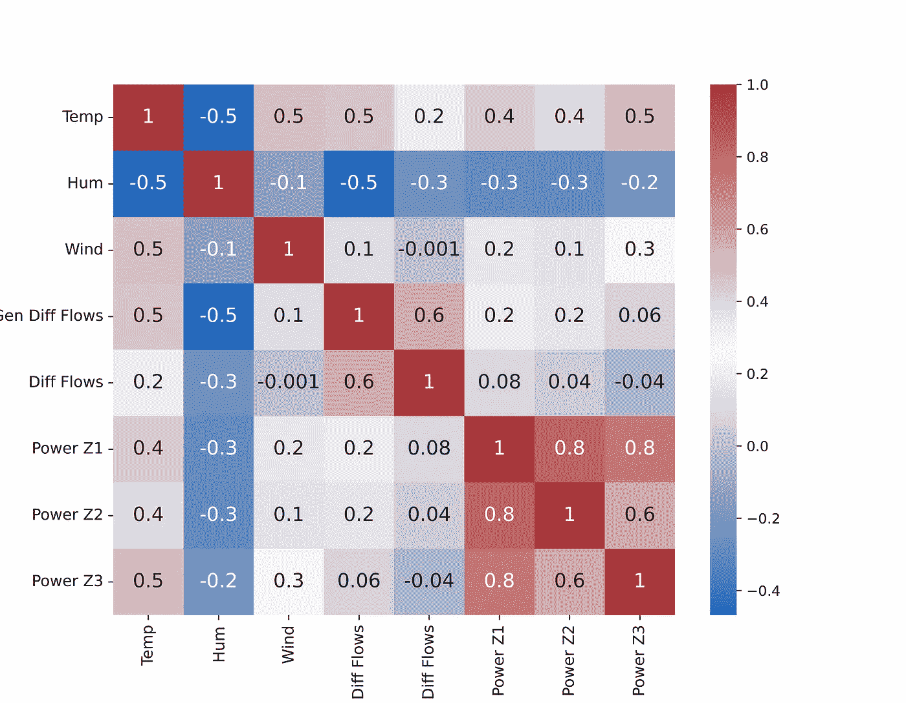
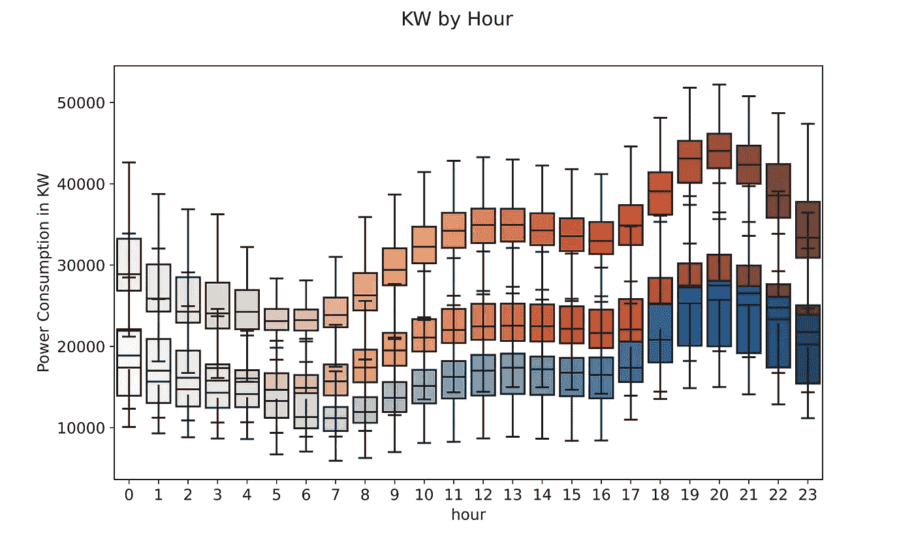
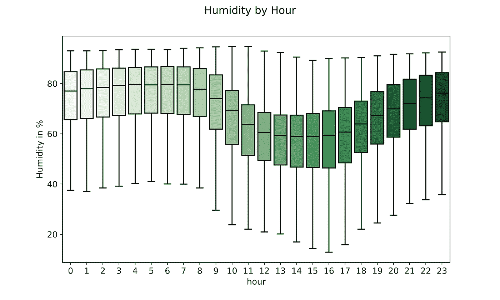
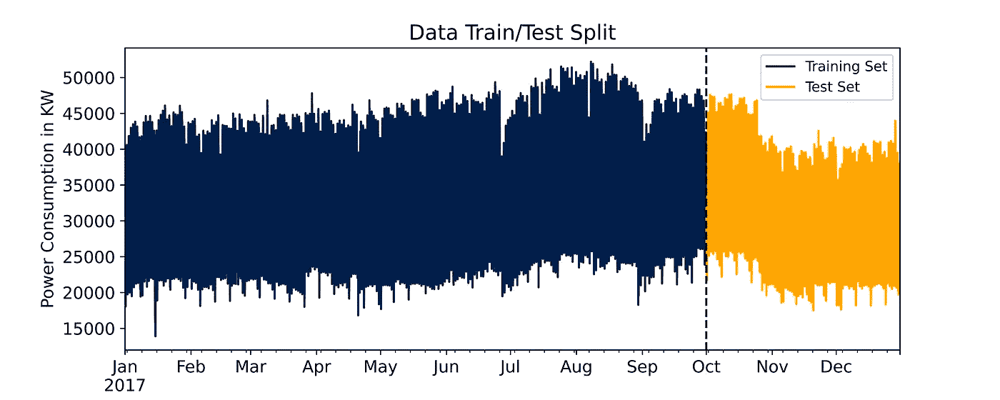
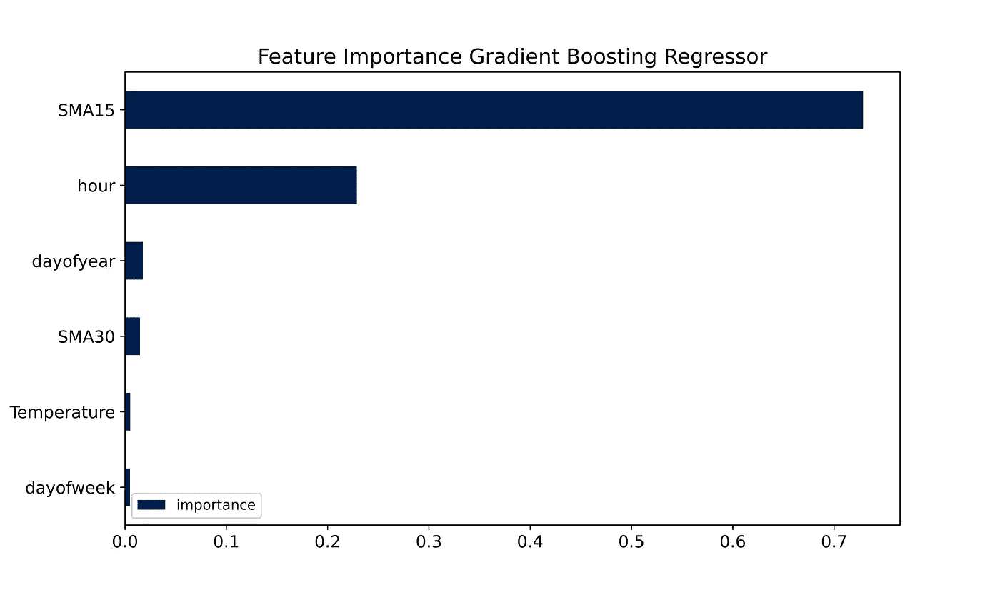
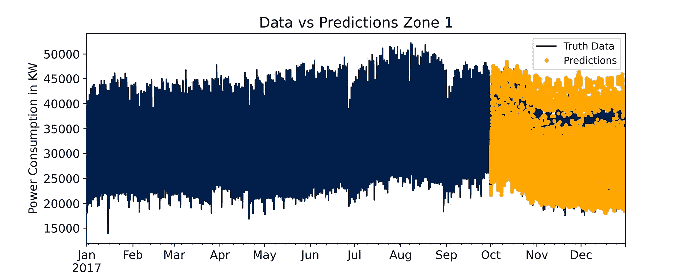
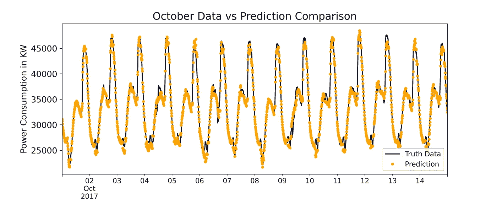
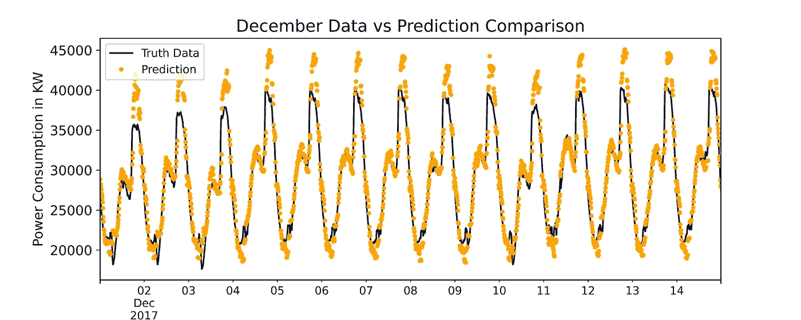

# 电力消费的时间序列预测

> 原文：<https://towardsdatascience.com/time-series-forecasting-on-power-consumption-273d56768b99>

## 本文旨在利用时间序列分析来预测摩洛哥泰图安市的电力消耗


[马太·亨利](https://unsplash.com/@matthewhenry?utm_source=medium&utm_medium=referral)在 [Unsplash](https://unsplash.com?utm_source=medium&utm_medium=referral) 上拍照

# 介绍

该项目的目标是利用**时间序列分析**来预测摩洛哥 Tétouan 市 10 分钟内的能源消耗。

## 语境

根据 2014 年的人口普查，泰图安是摩洛哥的一个城市，人口 **38 万**，面积**11570km**。这座城市位于该国的北部，面向地中海。夏天的天气特别湿热。

根据国有 **ONEE** “国家电力和饮用水办公室”的数据，摩洛哥 2019 年的能源生产主要来自煤炭(38%)，其次是水电(16%)、燃油(8%)、天然气(18%)、风能(11%)、太阳能(7%)和其他(2%) [1]。

鉴于对不可再生资源的高度依赖(64%)，预测能源消耗可以帮助利益相关者更好地管理采购和库存。最重要的是，摩洛哥的计划是通过增加可再生能源的产量来减少能源进口。众所周知，像风能和太阳能这样的能源存在一年到头都不可用的风险。从一个中等城市开始，了解该国的能源需求，可能是规划这些资源的进一步举措。

## 数据

公共服务运营商 Amendis 的监控和数据采集系统( **SCADA** )负责收集和提供项目用电数据。**配电网**由 3 个区域站供电，即:Quads、Smir 和 Boussafou。三个区域电站为城市的三个不同区域供电，这就是为什么我们有三个潜在的目标变量。

你可以在[这个链接](https://archive.ics.uci.edu/ml/datasets/Power+consumption+of+Tetouan+city)【2】【3】找到的数据，有从 2017 年 1 月 1 日开始，一直到同年 12 月 30 日(不是 31 日)的 **10 分钟窗口**中的 **52，416** 能耗观测。一些功能包括:

1.  `Date Time`:十分钟的时间窗口。
2.  `Temperature`:天气温度，单位为摄氏度
3.  `Humidity`:天气湿度百分比
4.  `Wind Speed`:风速单位为千米/小时
5.  `Zone 1 Power Consumption`单位为千瓦(KW)
6.  `Zone 2 Power Consumption`单位为千瓦
7.  `Zone 3 Power Consumption`单位为千瓦

# 代码部署

## 导入数据集

几乎每个**数据科学**项目的第一步都是导入我们将使用的数据集以及第一部分所需的库。

项目的数据导入和 EDA 部分需要的库当然是`Pandas`和`NumPy`，以及`Matplotlib`和`Seaborn`。

```
#Importing libraries
import pandas as pd
import numpy as np
import matplotlib.pyplot as plt
import seaborn as sns
```

我们可以使用下面的链接直接从 **UCI 机器学习库**加载数据。如果您在浏览器上搜索相同的链接，它会启动文件的下载。

```
# Load data from URL using pandas read_csv method
df = pd.read_csv('[https://archive.ics.uci.edu/ml/machine-learning-databases/00616/Tetuan%20City%20power%20consumption.csv'](https://archive.ics.uci.edu/ml/machine-learning-databases/00616/Tetuan%20City%20power%20consumption.csv'))df.head()
```

使用命令`df.head()`，我们可以可视化数据集所有列的前 5 行。我对它们进行了重新命名，以便在下面的章节中能够容纳它们。

```
|    | DateTime      |   Temp |   Hum |   Wind |
|---:|:--------------|-------:|------:|-------:|
|  0 | 1/1/2017 0:00 |  6.559 |  73.8 |  0.083 |
|  1 | 1/1/2017 0:10 |  6.414 |  74.5 |  0.083 |
|  2 | 1/1/2017 0:20 |  6.313 |  74.5 |  0.08  |
|  3 | 1/1/2017 0:30 |  6.121 |  75   |  0.083 |
|  4 | 1/1/2017 0:40 |  5.921 |  75.7 |  0.081 |
```

我们注意到每个特征只呈现出**数值**，因此我们可以假设一个潜在的预测任务将需要**回归技术**而不是分类。

```
|    |   Diff Fl |   Zone 1 PC |   Zone 2 PC |   Zone 3 PC |
|---:|----------:|------------:|------------:|------------:|
|  0 |     0.119 |     34055.7 |     16128.9 |     20241   |
|  1 |     0.085 |     29814.7 |     19375.1 |     20131.1 |
|  2 |     0.1   |     29128.1 |     19006.7 |     19668.4 |
|  3 |     0.096 |     28228.9 |     18361.1 |     18899.3 |
|  4 |     0.085 |     27335.7 |     17872.3 |     18442.4 |
```

由于数据集的索引是数字形式的，我可以使用`DateTime`列作为我的索引，这对于图表绘制来说会更容易。

```
#transforming DateTime column into index
df = df.set_index('DateTime')
df.index = pd.to_datetime(df.index)
```

命令`df.set_index()`允许我们用`DateTime`列替换当前索引，命令`pd.to_datetime()`将新索引的格式变为可读格式。

## 探索性数据分析

我们现在可以专注于**数据探索**和**可视化。**

让我们从使用 seaborn 绘制一个**相关矩阵**开始。相关矩阵向我们展示了数据集中每个要素与其他要素之间的单一相关性。一般来说，相关性可以是:

*   <0.3 and therefore **虚弱**
*   介于 0.3 和 0.6 之间，因此**适中**
*   介于 0.6 和 0.9 之间，因此**强**
*   > 0.9 **极强**

另一方面，**符号**表示两个因子是同向增长还是反向增长。相关性-0.9 表示随着**一个变量增加，另一个变量减少**。但是，根据环境的不确定性，范围可能会发生变化。在定量金融中，0.3 或 0.4 的相关性可以被认为是强相关性。



特征相关矩阵-按作者分类的图片

我们来分析一下与功耗相比，这些因素的总体趋势:

*   `Temperature`与所有**用电区域**正相关。更多地使用空调可能是对此的一种解释。
*   另一方面，`Humidity`显示了与所有三个区域的功耗的轻微负相关
*   **`Power Z1`、`Power Z2`、`Power Z3`相互之间呈现出**高相关性**。这表明所有地区的消费模式略有不同，但它们都趋向于同时增加和减少。**

## **特征创建**

**从这一点开始，我从由 Kaggle 的大师 Rob Mulla 出版的 [Kaggle 笔记本](https://www.kaggle.com/code/robikscube/time-series-forecasting-with-machine-learning-yt)中获取了大部分代码，并根据我的情况进行了修改。我绝对推荐看一看他的伟大作品。**

**如标题所示，结合 **EDA 的特征创建代表**第三步。在时间序列分析和预测中，“时间”可能是你可以支配的唯一特征，所以最好从中提取尽可能多的信息。下面的函数从`DateTime`索引中创建列。**

**例如，在时间`1/1/2017 0:10`，命令`df.index.hour`将提取值 0，因为现在是午夜。`df.index.dayofweek`将显示 6 为 2017 年 1 月 1 日是星期天(从 0 开始计数)，以此类推。**

**通过在我们的`df`上运行函数`create_features`，我们立即创建了**函数中定义的所有特性**。**

```
def create_features(df):
    """
    Create time series features based on time series index.
    """
    df = df.copy()
    df['hour'] = df.index.hour
    df['dayofweek'] = df.index.dayofweek
    df['quarter'] = df.index.quarter
    df['month'] = df.index.month
    df['year'] = df.index.year
    df['dayofyear'] = df.index.dayofyear
    df['dayofmonth'] = df.index.day
    df['weekofyear'] = df.index.isocalendar().week
    return dfdf = create_features(df)
```

**此时，我们可以**用方框图**表示每个特性，以查看特定时间段内的最小、第 25 个百分点、平均、第 75 个百分点和最大消耗。**

**如果我们按小时绘制图表，我们可以看到**1 区**的平均消耗量比 2 区和 3 区**高得多。最重要的是，所有三个地区的平均消耗量在晚上都会增加。****

****

**2017 年全年每小时功耗(千瓦)的箱线图—图片由作者提供**

**不出所料，温度在白天中部时段呈上升趋势，然后在晚上下降。这就是为什么只有 50%的时间消耗和温度一起变化。随着晚上头几个小时气温开始下降，耗电量突然飙升。**

****

**2017 年全年以摄氏度为单位的小时温度箱线图-图片由作者提供**

**另一方面，湿度在一天中较冷的时候增加，在最热的时候减少。**

****

**2017 年全年每小时湿度百分比箱线图-图片由作者提供**

**简单移动平均线( **SMA** )是平滑我们预测的基本信息。移动平均计算时间序列中所有数据点的**平均值，以便为预测算法提取有价值的信息。****

```
#Calculating moving averagedf['SMA30'] = df['Zone 1 Power Consumption'].rolling(30).mean()
df['SMA15'] = df['Zone 1 Power Consumption'].rolling(15).mean()
```

**用户可以使用命令`rolling(n_days).mean()`指示 SMA 中包含的天数。**

## **列车测试分离**

**在这个阶段，**数据集**可以在**训练**和**测试**之间分割。在正常情况下，我们会随机选择新的记录来训练算法，并在剩下的记录上进行测试。在这种情况下，在训练和测试记录之间保留一个**时序**是很重要的。**

**70%的可用数据是从 1 月 1 日的**到 10 月 10 日的**，因此这将是我们的训练集，而从 10 月 2 日的**到 12 月 30 日的**(可用的最后一个数据点)将是我们的测试集。**

**您会注意到`Temperature`、`dayofyear`、`hour`、`dayofweek`、`SMA30`和`SMA15`列已经被选择作为模型的输入。在启动**最终训练阶段**之前，我计算了每一列的特性重要性，并排除了返回值为 0 的特性。如果你想看我应用这种技术的项目，请看一下[这篇文章](/feature-importance-to-predict-mushrooms-edibility-in-python-5aa133fea3f8)中更深入的解释。**

**我最初只选择`Zone 1 Power Consumption`作为目标变量，因为在这种情况下逐区域进行更有意义，因为每个区域都有其特定的电力需求。另一个解决问题的方法是创建第四列**合计**三个区域的能源需求。**

```
#defining input and target variableX_train = df.loc[:'10-01-2017',['Temperature','dayofyear', 'hour', 'dayofweek', 'SMA30', 'SMA15']]y_train = df.loc[:'10-01-2017', ['Zone 1 Power Consumption']]X_test = df.loc['10-01-2017':,['Temperature','dayofyear', 'hour', 'dayofweek', 'SMA30', 'SMA15']]y_test = df.loc['10-01-2017':, ['Zone 1 Power Consumption']]
```

****

**训练和测试数据集分割-按作者分类的图像**

**从图表中，你可以看到**用电量**在八月底达到峰值，并在一月份达到最低点，我再次看到温度趋势在这里发挥了重要作用。这确实是我们在模型中包含的特性之一。**

## **预言**

**为了预测我们测试集中的记录，我决定使用的算法是**梯度提升**，我在我以前的[文章](/feature-importance-to-predict-mushrooms-edibility-in-python-5aa133fea3f8)中简要解释了它是如何工作的以及它做得最好。**

**在以下代码部分中设置的超参数中，我认为最相关的是:**

*   **`n_estimators`:XGBoost**算法将尝试从训练数据中学习的学习轮数****
*   **`max_depth`:一棵树可以拥有的**最大深度**，越深的树越容易造成过度拟合**
*   **`learning_rate`:或**收缩因子**，当创建新的树来纠正残差时，学习率(< 1.0)“减慢”模型拟合数据的能力，因此随着树的数量增加而学习**
*   **`verbose`:模型在控制台上打印结果的频率，我们在这里设置 100 为`n_estimators`相当高。默认值为 1。**

```
import xgboost as xgb
from sklearn.metrics import mean_squared_error reg = xgb.XGBRegressor(base_score=0.5, booster='gbtree',    
                       n_estimators=1500,
                       early_stopping_rounds=50,
                       objective='reg:linear',
                       max_depth=6,
                       learning_rate=0.03, 
                       random_state = 48)reg.fit(X_train, y_train,         
        eval_set=[(X_train, y_train), (X_test, y_test)],
        verbose=100)
```

**我们感兴趣的列是右边的一列，因为 **RMSE** 值与测试集相关联，而左边的一列与训练集相关联。您可以清楚地看到**均方根误差**在每次迭代中快速下降，直到在 600 个估计器阈值后达到最小值。**

```
[0]    validation_0-rmse:32788.2     validation_1-rmse:30041.3
[100]  validation_0-rmse:1909.16     validation_1-rmse:2153.27
[200]  validation_0-rmse:902.714     validation_1-rmse:2118.83
[300]  validation_0-rmse:833.652     validation_1-rmse:2061.93
[400]  validation_0-rmse:789.513     validation_1-rmse:1952.1
[500]  validation_0-rmse:761.867     validation_1-rmse:1928.96
[600]  validation_0-rmse:737.458     validation_1-rmse:1920.88
[700]  validation_0-rmse:712.632     validation_1-rmse:1921.39
[800]  validation_0-rmse:694.613     validation_1-rmse:1920.75
[900]  validation_0-rmse:676.772     validation_1-rmse:1917.38
[1000] validation_0-rmse:662.595     validation_1-rmse:1920.73
[1100] validation_0-rmse:647.64      validation_1-rmse:1925.71
[1200] validation_0-rmse:634.896     validation_1-rmse:1927.89
[1300] validation_0-rmse:620.82      validation_1-rmse:1932.68
[1400] validation_0-rmse:609.903     validation_1-rmse:1937.36
[1499] validation_0-rmse:599.637     validation_1-rmse:1935.59XGBRegressor(early_stopping_rounds=50, learning_rate=0.03, max_depth=6,n_estimators=1500, random_state=48)
```

**通过绘制出**重要性**每个**特征**在预测正确结果中的作用，我们可以清楚地注意到一些相关的模式。**

```
fi = pd.DataFrame(data=reg.feature_importances_,
             index=X_train.columns,
             columns=['importance'])
```

**两个最重要的因素是特定测量的 **15 天 SMA** 和**小时**。不出所料，**温度**是**预测能源消耗相对重要的唯一外部因素**。正如预期的那样，初始数据集中的所有其他因素在项目的预测部分几乎不起作用，它们的重要性实际上是 0。**

****

**特征重要性 XGBoost 回归器-按作者分类的图片**

**一旦我将它与初始数据集合并，我们最终可以看到模型的整体性能。**

```
y_test = pd.DataFrame(y_test)
y_test['prediction'] = reg.predict(X_test)
df = df.merge(y_test[['prediction']], how='left', left_index=True, right_index=True)
```

**总体而言，预测遵循了**冷季**的**典型下降趋势**，尽管该模型在识别 11 月和 12 月的峰值时有些困难。**

****

**实际记录与预测的全面比较—作者提供的图片**

**如果我们放大到 10 月的前 15 天，我们可以清楚地看到预测与该月的测试数据有多接近。**

****

**10 月 15 日的实际记录与预测对比——图片由作者提供**

**但是在**12 月**，峰值预测与实际记录**相差很远**。这可以在未来的模型中通过调整超参数或改进特征工程以及许多其他选项来改进。**

****

**12 月 15 天的实际记录与预测对比—作者图片**

**准确性度量突出了回归器的良好但不优秀的性能。 **R** 表示由回归模型解释的目标变量中观察到的可变性的百分比。在这种情况下， **91%** 的观测数据可以用模型来解释，这是一个很好的结果。**

**平均绝对误差**(MAE)简单计算为绝对误差的平均值。分数告诉我们，模型从实际记录中平均偏离 **1354.63 KWs** ，这样不好吗？就电力支出而言，每 10 分钟提供大约比所需多(或少)1300 千瓦的电力需要多少钱？下面是你如何评价它的好坏。****

******均方误差** (MSE)的计算类似于 MAE，但它将平方与实际 vs 预测差相加。平均来说，我们的模型是好的，MAE 告诉我们，但是 MSE 表明这个模型可能有很大的误差。事实上,**平方差**倾向于通过增加加权因子来放大模型所犯的更大错误。****

****最后，**均方根误差** (RMSE)就是 MSE 的平方根。你会注意到 3746515.40 的平方根是 1935.59。在这种情况下，RMSE 比 MSE 有用得多。我们知道，1935 年的**比 1354.63 年的 MAE 略高**，这表明我们的模型**平均预测得很好**，但在具体记录上往往“**错误**”得有点多，实际值与预测值相差太远。****

****理想的情况是让 MAE、MSE 和 RMSE**尽可能接近 0**，但不是精确的 0，我们仍然希望避免过度拟合。****

```
**r2:                      0.9101
MAE:                  1354.6314
MSE:               3746515.4004
RMSE:                 1935.5917**
```

# ****结论****

****我希望你喜欢这个项目，并希望它对你需要做的任何时间序列分析都有用！****

******超参数调整**和**特征工程**是未来项目的两个主要改进领域。除此之外，部署一个**简单回归器**并因此将准确度分数与基准进行比较通常是一个很好的实践。****

******未来任务**包括收集 2018 年途安电力消耗的实际数据，并预测这些记录。****

****如果你想更深入地挖掘代码，这里有一个[链接](https://www.kaggle.com/code/gvaldata/time-series-forecasting-on-power-consumption-z1)到一个 Kaggle 笔记本，上面有该项目的从头到尾的版本。为这个伟大的建议大声喊出来！****

*****最后一点，如果您喜欢该内容，请考虑添加一个关注，以便在新文章发布时得到通知。如果你对这篇文章有什么要考虑的，写在评论里吧！我很想读读它们:)谢谢你的阅读！*****

*****PS:如果你喜欢我写的东西，如果你能通过* [*这个链接*](https://giovanni-valdata.medium.com/membership) *订阅一个中等会员，那对我来说就是全世界。有了会员资格，你就获得了媒体文章提供的惊人价值，这是支持我的内容的一种间接方式！*****

****[1] (2019).摩洛哥——能源。2022 年 9 月 25 日检索，来自国际贸易管理局 www.trade.gov 网站:[https://www . Trade . gov/country-commercial-guides/Morocco-energy #:~:text = Per % 20 the % 20 state % 2d owned % 20 power，%2C%20others%20(2%20percent)。](https://www.trade.gov/country-commercial-guides/morocco-energy#:~:text=Per%20the%20state%2Downed%20power,%2C%20others%20(2%20percent).)****

****[2] Salam，a .，& El Hibaoui，A. (2018 年 12 月)。http://archive.ics.uci.edu/ml 的 UCI 机器学习知识库。加州欧文:加州大学信息与计算机科学学院。‌****

****[3]萨拉姆，a .，&埃尔希巴乌伊，A. (2018 年 12 月)。电力消耗预测的机器学习算法比较:铁头市案例研究。在 *2018 第六届国际可再生与可持续能源大会(IRSEC)* (第 1–5 页)。IEEE。****

****[4] robikscube。(2022 年 7 月 5 日)。用机器学习进行时间序列预测。2022 年 9 月 29 日检索，来自 kaggle.com 网站:[https://www . ka ggle . com/code/robikscube/time-series-forecasting-with-machine-learning-yt](https://www.kaggle.com/code/robikscube/time-series-forecasting-with-machine-learning-yt)****