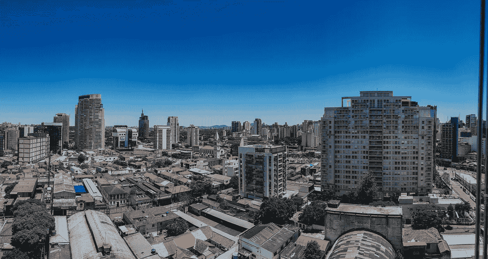
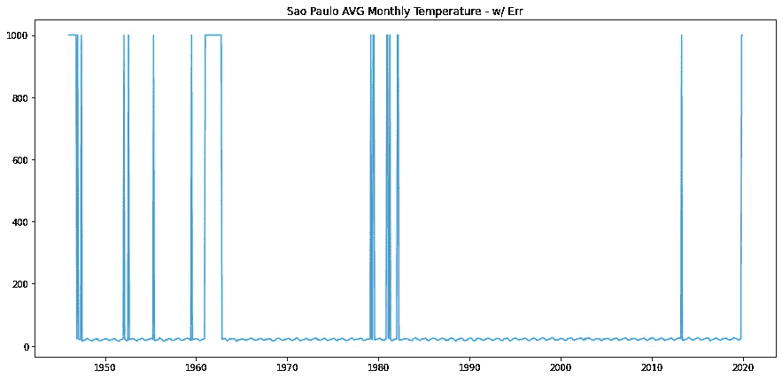
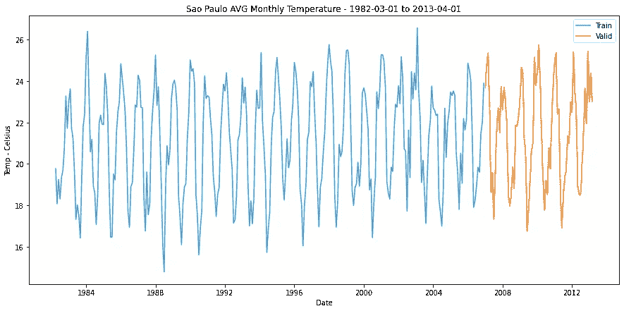
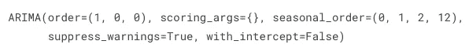
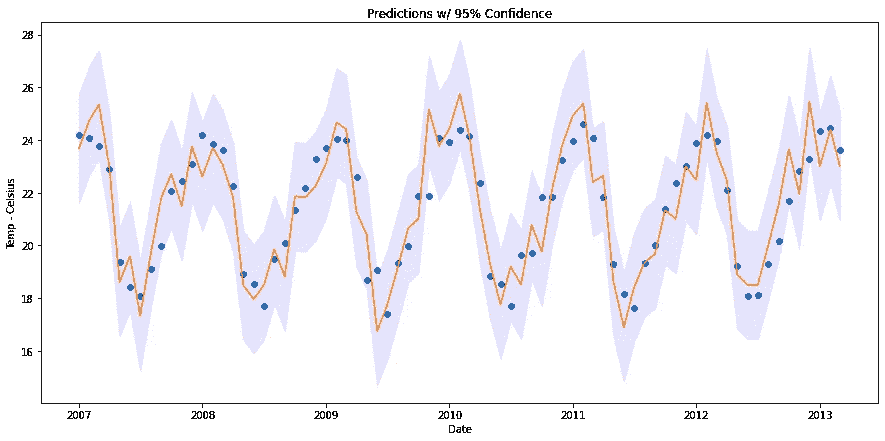
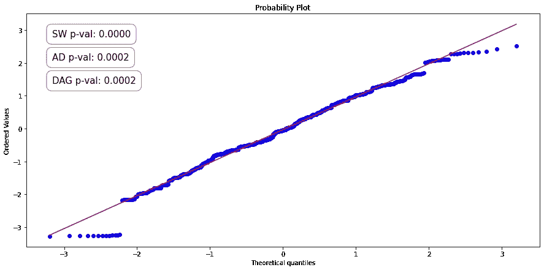
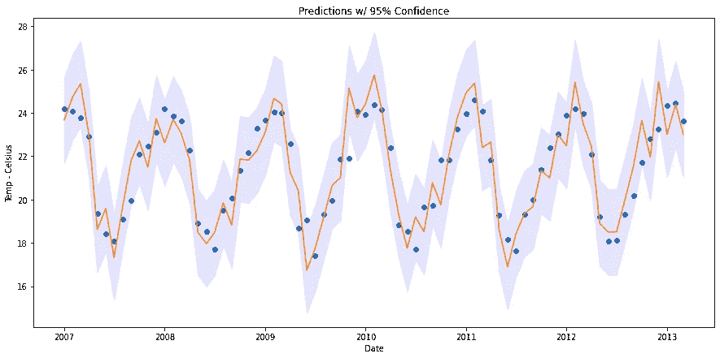
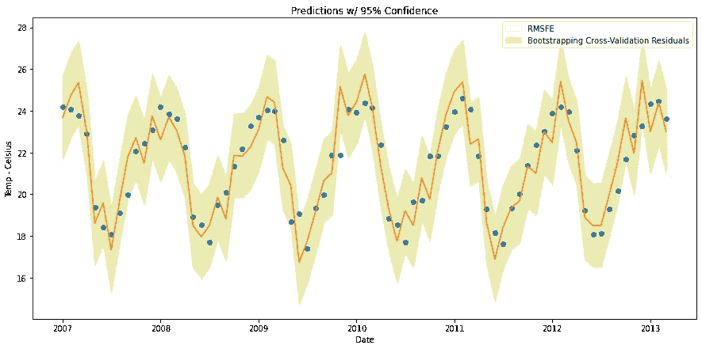

# 时间序列预测:预测间隔

> 原文：<https://towardsdatascience.com/time-series-forecasting-prediction-intervals-360b1bf4b085>

## 满怀信心地估计未来观测的范围

目标图像—由 [Afif Kusuma](https://unsplash.com/@javaistan)

在现实世界中预测是一项重要的任务。考虑预测能源需求、温度、食物供应和健康指标等等。在这些情况下获得不准确的预测会对人们的生活产生重大影响。

这就是预测间隔的用处。预测区间用于提供一个范围，在该范围内，预测可能具有特定的置信度。例如，如果您以 95%的置信度进行了 100 次预测，那么 100 次预测中会有 95 次落在预测区间内。通过使用预测间隔，您可以考虑预测中的不确定性和数据的随机变化。

## 加载温度数据

在本文中，我们将预测巴西圣保罗的月平均气温。[数据集](https://www.kaggle.com/datasets/volpatto/temperature-timeseries-for-some-brazilian-cities)由 NCEI⁶和 NASA⁷.收集和策划感谢所有参与分享这个数据集的人！(许可证:CC0 —公共领域)

圣保罗皮涅罗斯——作者[威尔肯·卡多萨](https://unsplash.com/@wylkon)

不幸的是，在现实世界中，数据从来都不是您想要的格式。在下面的单元格中，我们使用 Pandas 将其转换为两列。日期和温度。使用 Matplotlib 将结果数据可视化。

未清除的温度数据—按作者

在上图中，我们可以看到数据集有缺失值和错误。这些点充满了 999.9 的温度。我们可以简单地对大约 1980 年到大约 2015 年之间的 372 个数据点进行采样，其中不包含错误。在本文的其余部分，我们将使用这个数据样本。

温度数据的干净样本—作者

## 创建模型

我曾与许多时间序列模型，但我总是回来 ARIMA 模型。这些模型是可靠的，并且通常优于竞争模型类型(NeuralProphet、指数平滑、最后值)。

我们将使用 ARIMA 的修改版，名为萨里玛。萨里玛为 ARIMA 增加了一个滞后项，用于跟踪数据中的季节性。使用名为 pmdarima⁹的软件包，我们可以自动调整模型参数。关于 ARIMA 车型更详细的解释，请点击这里查看这篇精彩的文章[。](/time-series-forecasting-with-arima-sarima-and-sarimax-ee61099e78f6)

最佳 ARIMA 参数—作者

上面的单元格给出了适合我们的 ARIMA 模型的最佳订单和季节性订单。在下面的单元格中，我们就是这样做的，并在验证数据集上迭代地进行一步预测。

# 预测区间

## 方法 1: RMSFE

我们可以使用的第一种方法称为 RMSFE(均方根预测误差)。RMSFE 与 RMSE 非常相似。唯一的区别是 RMSFE 必须根据对未知数据(即验证或测试集)。

需要注意的是，只有假设验证预测的残差呈正态分布，我们才能使用这种方法。为了验证这一点，我们将使用 PP 图，并用 Anderson-Darling、Kolmogorov-Smirnov 和 D'Agostino K 平方检验来检验其正态性。

PP 图(概率对概率)根据正态分布图绘制数据样本，如果正态分布，数据点将形成一条直线。

三个正态性检验使用 p 值确定数据样本来自正态分布总体的可能性。每个检验的零假设是“样本来自正态分布的总体”。这意味着，如果得到的 p 值低于选定的α值，则拒绝零假设。因此，有证据表明数据来自非正态分布。对于本文，我们将使用 0.01 的 Alpha 值。

PP 图和正态性检验——作者

太好了！所有三个测试都返回了大于 alpha 值 0.01 的 p 值。这意味着不能拒绝零假设，并且数据点很可能来自正态分布。我们现在可以使用 RMSFE 在我们的预测中生成预测间隔。

这里的第一步是选择我们想要提供的置信度。我们希望我们的预测落在 75%、95%或 99%的预测区间内吗？我们将使用 95%的预测区间。在正态分布中，95%的数据点落在平均值的 1.96 个标准偏差内，因此我们用 RMSFE 乘以 1.96 来获得预测区间大小。如下图所示。

RMSFE 预测区间-按作者

这种方法的缺点是预测区间高度依赖于验证预测的残差。这并不是世界末日，但是预测区间很可能过度适应验证集中的变化。

## 方法 2: BCVR(自举交叉验证残差)

*注意:BCVR 是我提出的一种理论方法！*

我们姑且称这种方法为 BCVR(自举交叉验证残差)。BCVR 试图获得交叉验证和引导的好处。自举残差是一种生成预测区间的常用方法，通常与具有正态分布残差的 RMSFE 方法产生相似的结果，但在非正态残差上的表现略好于 RMSFE。此外，通过使用交叉验证，BCVR 应该生成更能代表整个数据集的残差分布。

我们可以从执行交叉验证来生成残差开始。我们随机选择一个长度在 250 到 372 点之间的训练样本，进行一步预测。然后，我们计算该预测的残差，并重复该过程 1000 次。

然后，我们可以检验残差分布的正态性。

PP-Plot BCVR 方法—作者

哦不！我们的 p 值远低于 Alpha 阈值，因此应该拒绝零假设？不用担心，我们可以使用一种叫做 bootstrapping 的技术来获得剩余方差的度量。为了做到这一点，我们采取交叉验证的残差，并执行随机抽样替换。然后，我们计算重采样集的标准偏差，并将其存储在一个数组中。我们重复这个过程几次，然后取存储的自举标准偏差的平均值/中值。

关于应该引导多少次，数学家们并没有达成共识，但是我在这个实现中使用了提前停止来减少计算需求。在下面的单元格中，我们每 200 次迭代检查一次自举样本的平均标准差。如果平均标准偏差与先前测量值的偏差不超过 0.001%，则我们终止循环。在我们的例子中，早期停止发生在第 7500 次迭代。

BCVR 预测间隔-按作者

BCVR 方法的缺点是对于一台机器来说计算量很大。幸运的是，这种方法非常适合集群计算。这意味着可以在多台机器之间分配工作负载。例如，如果我们有一个包含 10 个节点的集群，并且想要执行 1000 个引导样本，我们可以让每个节点同时执行 100 个样本。这将大大减少计算时间，并允许我们增加自举样本的数量。

## RMSFE 与 BCVR

这两种方法如何比较？

BCVR 与 RMSFE 预测区间对比——作者

在这两种情况下，所有 75 个点都落在预测区间内。虽然不太可能(各有 2%的机会)，但有些点非常接近边界。这两种方法的区间范围略有不同。BCVR 方法产生的预测区间范围比 RMSFE 方法稍窄(见上面 BCVR 预测区间周围的淡蓝色线)。

## 最后的想法

该示例表明，所提出的 BCVR 实现可用于生成更能代表整个群体的预测区间。看到它应用于不同的场景会很有趣。

这篇文章的代码可以在这里找到。

## **参考文献**

1.  [预测:原则与实践——罗布·J·海曼和乔治·阿萨纳索普洛斯](https://otexts.com/fpp2/prediction-intervals.html)
2.  [预测值的置信区间和预测区间— Charles Zaiontz](https://www.real-statistics.com/regression/confidence-and-prediction-intervals/#:~:text=The%20confidence%20interval%20consists%20of,concept%20called%20a%20prediction%20interval)
3.  [将预测区间添加到您的预测模型中— Marco Cerliani](/add-prediction-intervals-to-your-forecasting-model-531b7c2d386c)
4.  [引导预测区间—丹·萨图普·尼尔森](https://saattrupdan.github.io/2020-03-01-bootstrap-prediction/)
5.  常态测试的温和介绍——杰森·布朗利
6.  [NCEI(国家环境信息中心](https://www.ncei.noaa.gov/)
7.  [美国宇航局 GISS(戈达德太空研究所)](https://data.giss.nasa.gov/gistemp/)
8.  [夏皮罗-维尔克测试—维基百科](https://en.wikipedia.org/wiki/Shapiro%E2%80%93Wilk_test)
9.  [Pmdarina](http://alkaline-ml.com/pmdarima/1.8.3/modules/classes.html)