# 用 ARIMA、萨里玛和萨里马克斯进行时间序列预测

> 原文：<https://towardsdatascience.com/time-series-forecasting-with-arima-sarima-and-sarimax-ee61099e78f6>

## 深入探讨时间序列预测的黄金标准

时间序列图——作者[艾萨克·史密斯](https://unsplash.com/@isaacmsmith)

时间序列预测是一个没有简单答案的难题。有数不清的统计模型声称优于彼此，但从来不清楚哪个模型是最好的。

也就是说，基于 ARMA 的模型通常是一个很好的开始模型。他们可以在大多数时间序列问题上获得不错的分数，并且非常适合作为任何时间序列问题的基线模型。

这篇文章是一个全面的、初学者友好的指南，帮助您理解基于 ARIMA 的模型。

# 介绍

ARIMA 模型的首字母缩写代表“自回归综合移动平均线”，在本文中，我们将把它分解为 AR、I 和 MA。

**自回归分量— AR(p)**

ARIMA 模型的自回归部分用 AR(p)表示，p 参数决定了我们使用的滞后序列的数量。

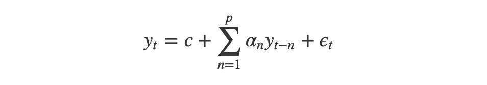

AR 公式-按作者

*AR(0):白噪声*

如果我们将 p 参数设置为零(AR(0))，没有自回归项。这个时间序列只是白噪音。每个数据点都是从平均值为 0 且方差为σ-平方的分布中采样的。这会产生一系列无法预测的随机数。这真的很有用，因为它可以作为一个零假设，保护我们的分析不接受假阳性模式。

*AR(1):随机游走和振荡*

在 p 参数设置为 1 的情况下，我们考虑由乘数调整的前一个时间戳，然后添加白噪声。如果乘数为 0，我们得到白噪声，如果乘数为 1，我们得到随机游走。如果乘数在 0 < α₁ < 1, then the time series will exhibit mean reversion. This means that the values tend to hover around 0 and revert to the mean after regressing from it.

*AR(p)之间:高阶项*

进一步增加 p 参数只是意味着进一步返回并添加更多由它们自己的乘数调整的时间戳。我们可以追溯到我们想要的那么远，但是当我们追溯到更远的时候，我们更可能应该使用额外的参数，例如移动平均线(MA(q))。

## 移动平均线— MA(q)

"这个分量不是滚动平均值，而是白噪声中的滞后."—马特·索斯纳

*马(q)*

MA(q)是移动平均模型，q 是预测中滞后预测误差项的数量。在 MA(1)模型中，我们的预测是一个常数项加上前一个白噪声项乘以一个乘数，再加上当前的白噪声项。这只是简单的概率+统计，因为我们正在根据以前的白噪声条件调整我们的预测。

## ARMA 和 ARIMA 模型

ARMA 和 ARIMA 架构只是 AR(自回归)和 MA(移动平均)组件的组合。

*ARMA*

ARMA 模型是一个常数加上 AR 滞后及其乘数之和，再加上 MA 滞后及其乘数之和加上白噪声。这个等式是接下来所有模型的基础，也是跨不同领域的许多预测模型的框架。

*ARIMA*

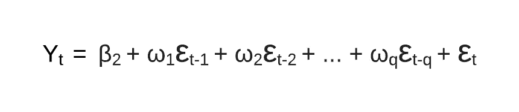

ARIMA 公式—作者

ARIMA 模型是一个 ARMA 模型，但在我们用 I(d)表示的模型中包含了一个预处理步骤。I(d)是差序，它是使数据稳定所需的转换次数。因此，ARIMA 模型就是差分时间序列的 ARMA 模型。

## SARIMA、ARIMAX、SARIMAX 型号

ARIMA 模型是伟大的，但在模型中包括季节性和外生变量可能会非常强大。由于 ARIMA 模型假设时间序列是平稳的，我们需要使用不同的模型。

*萨里玛*

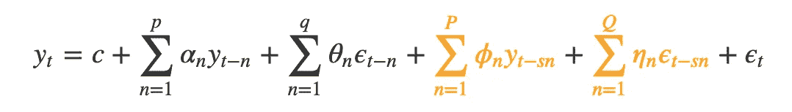

萨里玛公式—作者

输入萨里玛(季节性 ARIMA)。这个模型非常类似于 ARIMA 模型，除了有一个额外的自回归和移动平均组件。额外的滞后被季节性的频率抵消(例如每月 12 天，每小时 24 天)。

SARIMA 模型允许按季节频率进行数据差异分析，也允许按非季节差异分析。通过自动参数搜索框架，例如 [pmdarina](http://alkaline-ml.com/pmdarima/) ，可以更容易地知道哪些参数是最好的。

## ARIMAX 和 SARIMAX

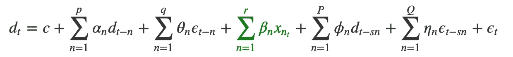

Sarimax 公式——作者

以上是 SARIMAX 模型的。这个模型考虑了外生变量，换句话说，在我们的预测中使用外部数据。一些外生变量的真实例子包括黄金价格、石油价格、室外温度、汇率。

有趣的是，在历史模型预测中，所有外生因素仍然在技术上被间接建模。也就是说，如果我们包括外部数据，模型对其影响的反应会比我们依赖滞后项的影响快得多。

# 代码示例

让我们通过一个简单的 Python 代码示例来看看这些模型的运行情况。

## 加载数据

对于这个例子，我们将使用[航空乘客数据集](https://www.kaggle.com/rakannimer/air-passengers)。该数据集包含从 1949 年初到 1960 年底的航空旅行乘客人数。

该数据集具有积极的趋势和年度季节性。

一旦数据集被读取，索引就被设置为日期。这是在 Pandas 中处理时间序列数据时的标准做法，并使实现 ARIMA、萨里玛和萨里玛更容易。

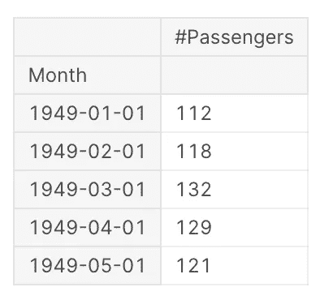

单元格输出-按作者

**趋势**

数据随时间变化的大致方向。例如，如果我们正在观察一个新生婴儿的身高，他们的身高会随着上升趋势进入青少年时期。另一方面，减肥计划成功的人会发现他们的体重随着时间的推移呈下降趋势。

**季节性+周期**

任何具有固定频率的季节性或重复模式。可以是每小时、每月、每天、每年等。这方面的一个例子是，冬季夹克的销量在冬季月份增加，在夏季月份减少。另一个例子是你的银行账户余额。在每个月初的 10 天里，随着你支付每月的租金、水电费和其他账单，你的余额呈下降趋势。

**不规则+噪音**

这是数据中任何大的峰值或谷值。一个例子是你跑 400 米时的心率。当您开始比赛时，您的心率与一整天的心率相似，但在比赛过程中，它会在一小段时间内达到一个更高的水平，然后恢复到正常水平。

在下面的航空公司乘客数据的可视化中，我们可以找到这些组件。乍一看，数据集中似乎有积极的趋势和某种季节性或周期性。数据中似乎没有任何重大异常或噪声。

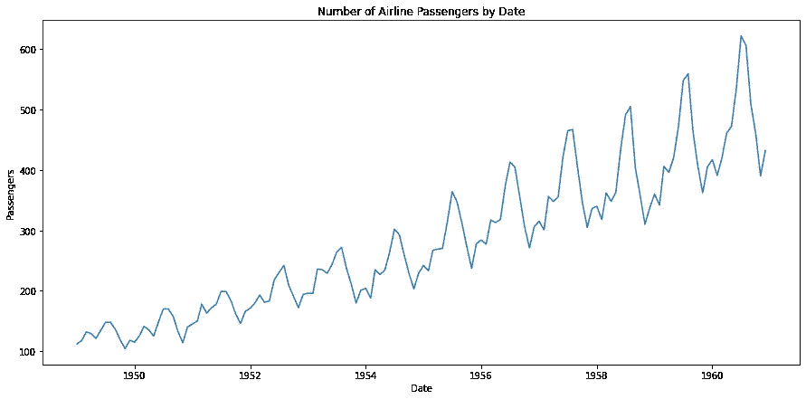

航线乘客图—作者

# 滚动统计

滚动平均是直观显示数据集趋势的好方法。由于数据集按月提供计数，窗口大小为 12 将为我们提供年度滚动平均值。

我们还将包括滚动标准差，以查看数据与滚动平均值的差异。

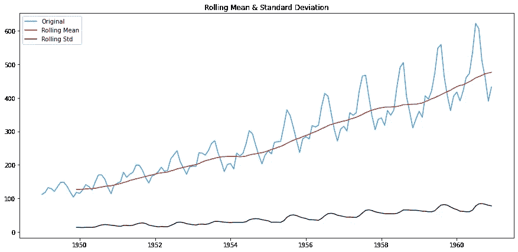

滚动统计图-按作者

## 增强迪基-富勒试验

扩展的 Dickey-Fuller 检验用于确定时间序列数据是否是平稳的。与 t 检验类似，我们在检验前设置显著性水平，并根据所得的 p 值对假设做出结论。

**零假设:**数据不是平稳的。

**备选假设:**数据是平稳的。

对于静止的数据(即拒绝零假设)，ADF 测试应该具有:

*   p 值< =显著性水平(0.01，0.05，0.10 等。)

如果 p 值大于显著性水平，那么我们可以说数据很可能不是稳定的。

我们可以在下面的 ADF 测试中看到，p 值为 0.991880，这意味着数据很可能不是平稳的。

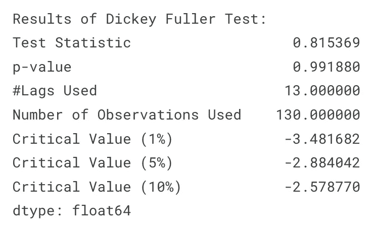

ADF 测试输出—按作者

## ARIMA 车型选择，带自动 ARIMA

虽然我们的数据几乎肯定不是稳定的(p 值= 0.991)，但让我们看看标准 ARIMA 模型在时间序列上的表现如何

使用`pmdarima`包中的 auto_arima()函数，我们可以对模型的最优值进行参数搜索。

# 模型诊断

plot_diagnostics 函数产生四个图。标准化残差、直方图加 KDE 估计、正态 q-q 和相关图。

基于以下条件，我们可以将该模型解释为非常适合。

**标准化残差**

残差中没有明显的模式，值的均值为零，方差一致。

**直方图加上 KDE 估计**

KDE 曲线应该非常类似于正态分布(在图中标为 N(0，1))

**普通 Q-Q**

大多数数据点应该位于直线上

**相关图(ACF 图)**

大于零的滞后的 95%的相关性应该是不显著的。灰色区域是置信带，如果数值超出此范围，则它们在统计上是显著的。在我们的例子中，有一些值在这个区域之外，因此我们可能需要添加更多的预测值以使模型更加准确

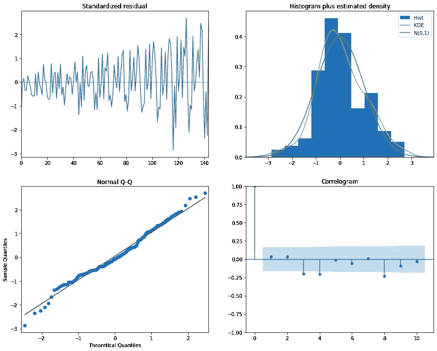

Arima Diagnostics —作者

然后，我们可以使用该模型预测未来 24 个月的航空乘客数量。

从下面的图中我们可以看到，这似乎不是一个非常准确的预测。也许我们需要改变模型结构，以便它考虑到季节性？

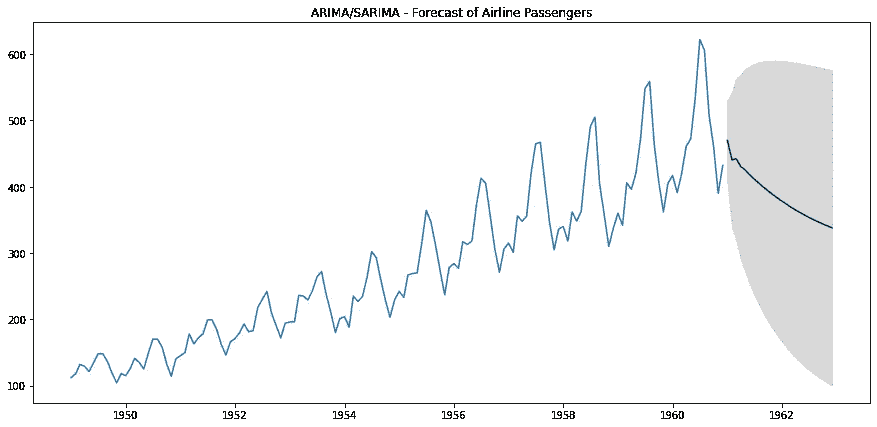

ARIMA 预测—作者

# 萨里玛模型

现在，让我们尝试与上面相同的策略，只是让我们使用一个 SARIMA 模型，以便我们可以考虑季节性。

看一下模型诊断，我们可以看到与标准 ARIMA 模型相比的一些显著差异。

**标准化残差**

标准化残差在整个图表中更加一致，这意味着数据更接近稳定。

**直方图加上 KDE 估计值**

KDE 曲线类似于正态分布(这里没有太大变化)。

**正常 Q-Q**

与 ARIMA 诊断图相比，数据点更靠近直线聚集。

**相关图(ACF 图)**

灰色区域是置信带，如果数值超出此范围，则它们在统计上是显著的。我们需要这个区域内的所有值。加上季节性因素就做到了这一点！所有点现在都在 95%的置信区间内。

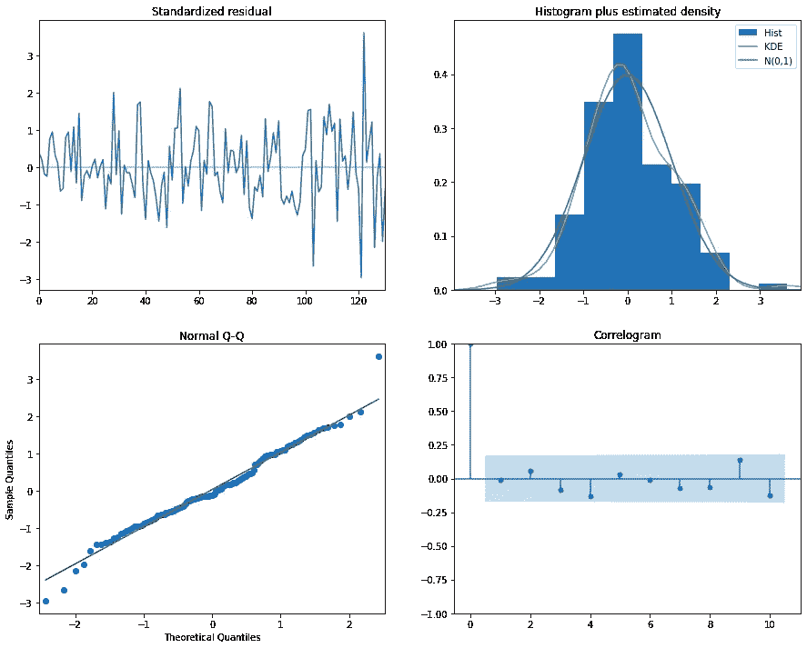

萨里玛诊断公司

然后，我们可以像以前一样，使用该模型预测未来 24 个月的航空乘客数量。

从下面的图中我们可以看到，这似乎比标准的 ARIMA 模型要精确得多！

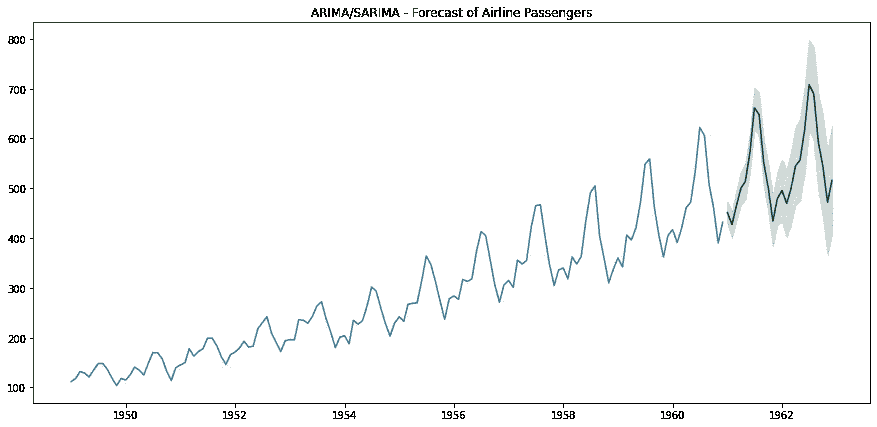

萨里玛预测-作者

# SARIMAX 型号选择

现在让我们练习加入一个外生变量。在这个例子中，我将简单地添加月份数作为外生变量，但这并不是非常有用，因为这已经通过季节性传递了。

请注意，我们在传递到 SARIMAX 模型的数据周围添加了额外的方括号。

我们可以从下面的预测中看到，我们得到了一些非常好看的预测，并且预测置信区间的宽度已经减小。这意味着该模型对其预测更有把握。

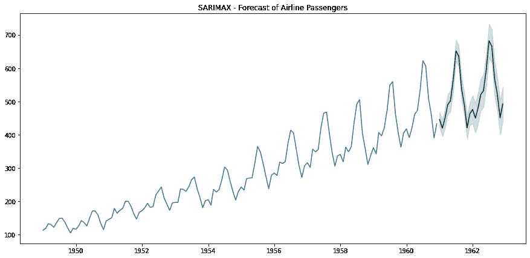

SARIMAX 预测-按作者

## 结束语

请在这里找到这篇文章的代码。

用我自己的话来表达想法并实践 ARIMA 模型是最好的学习方式。希望这篇文章能激励其他人也这样做。

ARIMA 模型架构比 RNN 模型架构提供了更多的可解释性，然而 RNN 模型架构被认为能产生更准确的预测。现在我已经很好地掌握了 ARIMA 模型架构，我需要研究 LSTM 和 RNN 深度学习模型来预测时间序列数据！

## **延伸阅读**

在整个笔记本中，我实现并改写了以下来源的想法。谢谢大家的分享！

[深入探究 Arima 模型](/a-deep-dive-on-arima-models-8900c199ccf)——马特·索斯纳←必读！

[初学 ARIMA 的时间序列](https://www.kaggle.com/freespirit08/time-series-for-beginners-with-arima/notebook) —作者 [@Arindam Chatterjee](https://www.kaggle.com/freespirit08)

[时间序列预测的 Arima 模型](https://www.kaggle.com/prashant111/arima-model-for-time-series-forecasting#14.-SARIMA-model-in-python-) —作者 [@Prashant Banerjee](https://www.kaggle.com/prashant111)

[StatsModels ADF 文档](https://www.statsmodels.org/stable/examples/notebooks/generated/stationarity_detrending_adf_kpss.html?highlight=augmented%20dickey%20fuller%20test)

[去除趋势和季节性文章](https://machinelearningmastery.com/remove-trends-seasonality-difference-transform-python/) —作者杰森·布朗利

贾森·布朗利温和地介绍了萨里玛