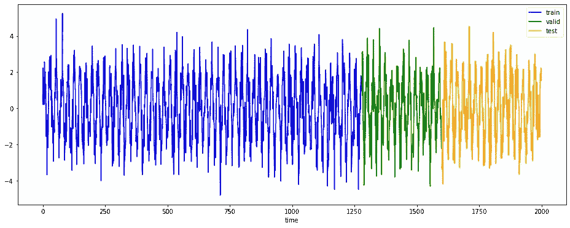
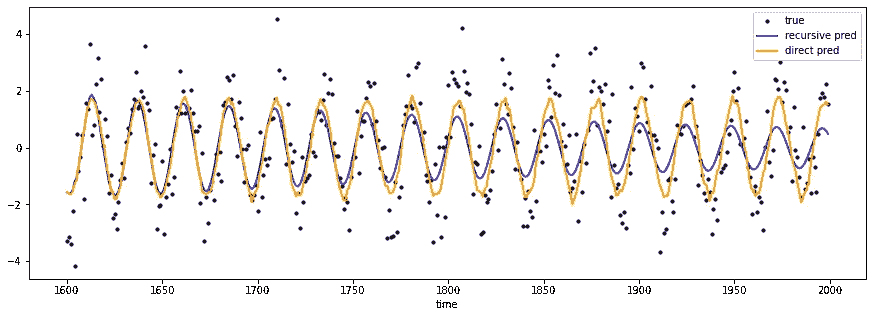
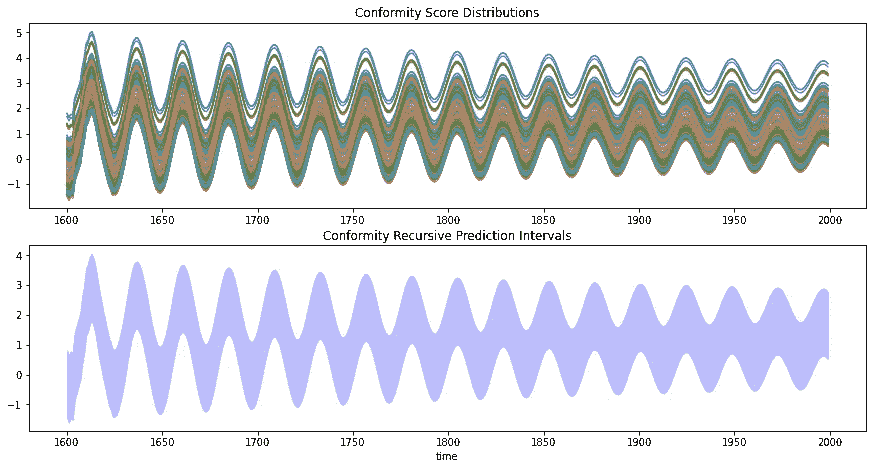
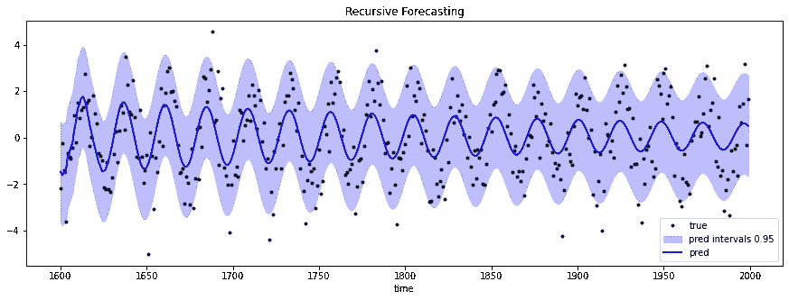
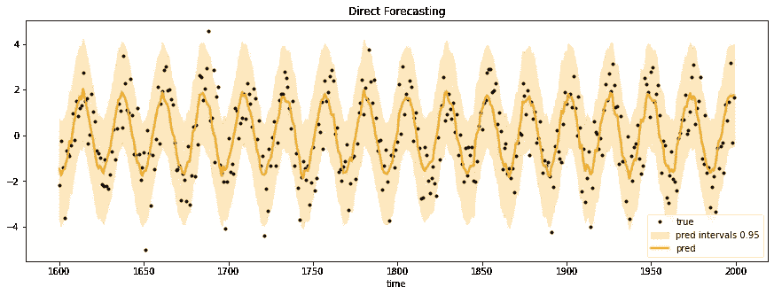
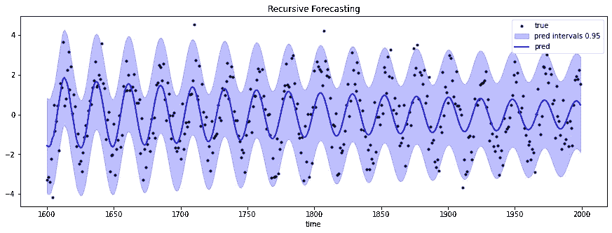
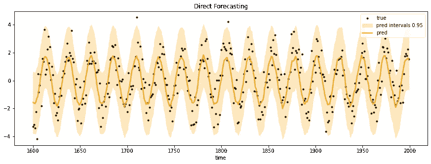

# 具有保形预测区间的时间序列预测:Scikit-Learn 是您所需要的

> 原文：<https://towardsdatascience.com/time-series-forecasting-with-conformal-prediction-intervals-scikit-learn-is-all-you-need-4b68143a027a>

## 使用 MAPIE 和 TSPIRAL 进行精确的不确定性量化


卢卡斯·乔治·温迪特在 [Unsplash](https://unsplash.com?utm_source=medium&utm_medium=referral) 上的照片

当执行时间序列预测任务时，我们习惯于开发对未来观测值进行逐点估计的解决方案。这是正确的，如果经过适当的验证，它们可能会对业务结果产生积极的影响。有可能做得更好吗？**我们能通过简单地添加更多信息来提供更详细的预测吗？**

用预测区间丰富我们的预测是关键。实际上，一个预测区间由几个数字表示。这些值分别是未来观测可能发生的下限和上限。未来值落在给定范围内的可能性由 0 和 1 之间的浮点数( *alpha* )表示。其中α接近 1 意味着我们更有信心这种情况会发生。

很容易理解在我们的预测中附加一个预测区间的附加价值。**提供不确定性评估是一项古老的需求，可以通过多种方式解决。如果采用得当，所有方法都很棒，但有些方法更好。我们试着细说一下。**

每个人都知道自举是一种重采样技术。**常见的是将自举应用于预测残差，以获得未来预测的不确定性度量**。尽管当[第一次接近不确定性量化](/add-prediction-intervals-to-your-forecasting-model-531b7c2d386c)时，残差自举可能是一个很好的起点，但它可能会导致较差的性能，因为它只关注数据不确定性。不确定性的另一个来源存在。我们指的是建模不确定性。建模不确定性考虑了在训练阶段可能遇到的知识缺乏，这可能会影响预测。**一个好的预测不确定性度量应该包括数据和建模不确定性**。

在这篇文章中，我们介绍保形预测作为一种技术来估计不确定性。具体来说，**我们演示了如何在时间序列预测场景**中产生预测区间。使用 [**tspiral**](https://github.com/cerlymarco/tspiral) ( *一个使用 scikit-learn 估计器*进行时间序列预测的 python 包)结合 [**MAPIE**](https://github.com/scikit-learn-contrib/MAPIE) ( *一个用于估计预测间隔*的 scikit-learn 兼容模块)，我们展示了如何解决一个时间预测任务**，提供精确的不确定性估计，而不移动到 scikit-learn 生态系统**之外。

# 设置预测

生成预测区间的第一步是选择要使用的预测模型。这似乎不太合理，但这是**保形预测**的主要好处之一，因为**它是一种基于模型的技术**(即，它可以用在任何预测算法的任何环境中)。

在这篇文章中，我们关注机器学习生态系统中采用的两种最著名的预测技术。我们指的是递归和直接预测。它们都是已知的方法，各有优缺点，可以使用 [**tspiral**](https://github.com/cerlymarco/tspiral) 以 scikit-learn 格式访问(要了解关于这个主题的更多信息，我建议使用[我以前的一篇文章](/how-to-improve-recursive-time-series-forecasting-ff5b90a98eeb))。



模拟正弦系列分为训练、验证和测试[图片由作者提供]

让我们想象使用模拟的正弦序列生成了下面描述的预测。如何给我们的预测增加可靠的预测区间？



在测试中比较递归(蓝色)和直接(橙色)预测[图片由作者提供]

# 生成保形预测区间

为了解决这个问题，我们可以使用保形预测。**通过研究残差的分布建立保形预测区间**。没有任何秘密收据或任何魔法。

```
alpha = 0.95

conformity_scores = np.abs(np.subtract(y_val, y_pred_val))
estimated_distributions = np.add(y_pred_test[:, None], conformity_scores)

lower_q, upper_q = np.quantile(
    estimated_distributions, 
    [(1-alpha)/2, 1-(1-alpha)/2], axis=1
)
```

给定验证集上的预测值和真值，我们必须:

*   计算绝对残差(*一致性分数*)。
*   将一致性分数添加到测试预测中。这将为每个逐点测试预测生成分布(*估计分布*)。
*   计算每个逐点预测分布的上限和下限分位数，以获得预测区间。



逐点递归一致性分数分布(上图)。递归一致性分数分布的分位数(较低)。[图片由作者提供]

尽管很简单，但是可以使用<https://github.com/scikit-learn-contrib/MAPIE>**自动计算保形预测间隔。让我们看看它在递归和直接预测中的作用。**

## **递归预测的共形区间**

```
forecaster = ForecastingCascade(
    Ridge(), 
    lags=range(1,24+1),
    use_exog=False,
)

forecaster.fit(None, y_train)
model = MapieRegressor(
    forecaster, cv="prefit",
).fit(X_val, y_val)

forecaster.fit(None, y_train_val)
model.single_estimator_ = forecaster

forecasts = model.predict(X_test, alpha=0.05)
```

****

**递归预测加上保形预测区间。[图片由作者提供]**

## **直接预测的共形区间**

```
forecaster = ForecastingChain(
    Ridge(),
    n_estimators=len(y_test),
    lags=range(1,24+1),
    use_exog=False,
)

forecaster.fit(None, y_train)
model = MapieRegressor(
    forecaster, cv="prefit",
).fit(X_val, y_val)

forecaster.fit(None, y_train_val)
model.single_estimator_ = forecaster

forecasts = model.predict(X_test, alpha=0.05)
```

**在这种简单的形式中， [**MAPIE**](https://github.com/scikit-learn-contrib/MAPIE) 可以简单地给定一个验证集和一个拟合模型(如上所述)来估计预测区间。为了提高稳健性，可以使用交叉验证的方法或更复杂的技术进行不确定性估计。**

****

**直接预报加上保形预报间隔。[图片由作者提供]**

## **递归预测加交叉验证的共形区间**

```
forecaster = ForecastingCascade(
    Ridge(),
    lags=range(1,24+1),
    use_exog=False,
)

model = MapieRegressor(
    forecaster, 
    cv=TemporalSplit(20, test_size=len(y_test)),
    method='base', agg_function=None, n_jobs=-1,
).fit(X_train_val, y_train_val)

forecasts = model.predict(X_test, alpha=0.05, ensemble=False)
```

****

**使用交叉验证的递归预报加上保形预报间隔。[图片由作者提供]**

## **直接预测加交叉验证的共形区间**

```
forecaster = ForecastingChain(
    Ridge(),
    n_estimators=len(y_test),
    lags=range(1,24+1),
    use_exog=False,
)

model = MapieRegressor(
    forecaster, 
    cv=TemporalSplit(20, test_size=len(y_test)),
    method='base', agg_function=None, n_jobs=-1,
).fit(X_train_val, y_train_val)

forecasts = model.predict(X_test, alpha=0.05, ensemble=False)
```

****

**使用交叉验证的直接预报加共形预报区间。[图片由作者提供]**

****保形预测生成可信的预测区间，因为已经证明在估计过程中考虑了数据和建模不确定性**。其他方法显示出对理清不确定性来源的良好反应(线性模型的一个例子在我以前的文章的[中有报道)。然而，共形预测的适应性及其通过](/forecasting-uncertainty-with-linear-models-like-in-deep-learning-bc58f53938) [**MAPIE**](https://github.com/scikit-learn-contrib/MAPIE) **，**的可达性使得该技术在接近不确定性量化时是必须的。**

# **摘要**

**在这篇文章中，我们发现了保形预测在估计预测区间方面的强大功能。我们将重点放在时间序列预测任务上，为我们的预测增加预测间隔。将可信的保形预测区间添加到通过递归或直接预测生成的预测中是可行且简单的。得益于 [**tspiral**](https://github.com/cerlymarco/tspiral) 和 [**MAPIE**](https://github.com/scikit-learn-contrib/MAPIE) 的组合使用，只需使用 scikit-learn 就可以一次性完成时间序列预测和不确定性量化。**

**[**查看我的 GITHUB 回购**](https://github.com/cerlymarco/MEDIUM_NoteBook)**

**保持联系: [Linkedin](https://www.linkedin.com/in/marco-cerliani-b0bba714b/)**