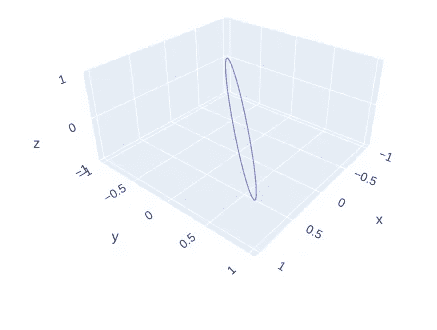
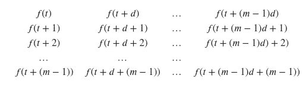
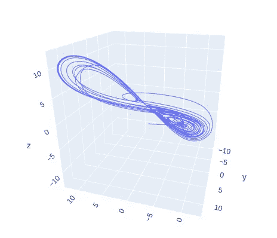
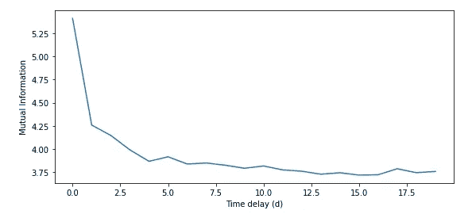
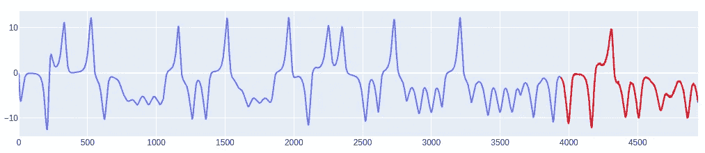
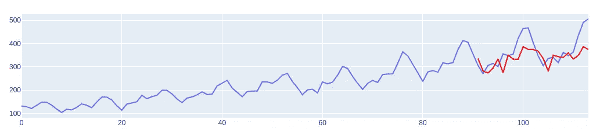

# 用动力系统方法进行时间序列预测

> 原文：<https://towardsdatascience.com/time-series-forecasting-with-dynamical-systems-methods-fa4afdf16fd0>

## 如何使用动态系统通过标准的经典机器学习算法来预测时间序列数据


照片由[约尔戈斯·恩特拉哈斯](https://unsplash.com/@yiorgosntrahas?utm_source=medium&utm_medium=referral)在 [Unsplash](https://unsplash.com?utm_source=medium&utm_medium=referral) 拍摄

时间序列预测是数据科学家在日常工作中面临的另一种任务。正因为如此，将这种工具添加到我们的工具箱中非常重要。这将是今天帖子的重点。

有很多方法可以解决这个问题，在这篇文章中，我将重点讨论一些我们可以用来将标准学习算法(如 SVM 或梯度推进)应用于时间序列数据的动力系统方法。进行这种预测的其他可能性有:

*   预测的统计方法，如 ARIMA
*   深度学习方法论，如 LSTM 和 RNN

首先，让我们理解为什么获取我们的时间序列数据并将其直接应用于回归变量不是一个好主意。

在我的 [GitHub](https://github.com/TNanukem/paper_implementations/blob/main/Takens%20Embedding%20Theorem.ipynb) 和 [Kaggle](https://www.kaggle.com/tiagotoledojr/taken-s-embedding-theorem) 中可以找到用于生成这篇文章(以及更多)结果的代码。

## 为什么默认算法通常不尽如人意

统计学习理论是从数学上证明我们的机器学习模型实际上具有学习能力的基础。为了让这些保证成立，必须对我们试图建模的数据进行一些假设[1]，其中之一是:

*   样品必须以 i.i.d .的方式取样

当我们处理一个时间序列时，我们的数据集的例子是相互独立的(如果是，那么你的序列可能是一个随机序列)。

因此，动力系统理论有一些方法可以用来打破我们数据点之间的时间依赖性，这样我们就可以使用标准的机器学习算法来进行预测。我们现在来谈谈多恩嵌入定理。

## 多恩嵌入定理

这个定理是由 Takens [2]在 80 年代提出的，它讨论了如何将我们的时间序列嵌入(从一个空间到另一个空间)其时间滞后的空间，我们称之为相位空间，消除序列实例之间的时间依赖性。

级数越确定，我们就会越清楚地看到相空间上形成的吸引子。吸引子可以被看作是时间序列在相空间上产生的“画”。例如，如果我们有一个随时间变化的周期函数，这个周期依赖将被视为相空间上的一个椭圆。请看下面的例子，当我们嵌入正弦函数时会发生什么:



正弦函数相空间表示。由作者开发。

当然，并不是所有的时间序列都是确定的，因此相空间中的吸引子不会被很好地定义。

好了，现在我们知道我们可以把我们的级数嵌入到相空间中，以消除时间依赖性，但是怎么做呢？为此，我们必须定义两个参数:

*   m ->称为嵌入维数，这个参数将告诉我们相空间的维数
*   d ->称为时间延迟，这将告诉我们相空间的每个轴将代表多少时间滞后

听起来有点抽象，对吧？让我们以方程式的形式来看，让事情变得清楚明白。

设 f(t)为我们的时间序列。给定 *m* 和 *d* ，我们的相空间嵌入将是如下矩阵:



这意味着我们空间的每一个 *m* 轴都将被表示为我们定义的时滞的倍数。

## 实现镜头的嵌入

让我们实现一些代码来将时间序列转换到我们的相空间。首先，让我们导入所需的库:

```
import numpy as np
import pandas as pd
import matplotlib.pyplot as pltfrom nolitsa import dimension, delayimport plotly.express as px
import plotly.graph_objects as gofrom sktime.datasets import load_airline, load_shampoo_sales, load_lynxfrom sklearn.ensemble import RandomForestRegressor
from sklearn.metrics import r2_score, mean_squared_error
from sklearn.model_selection import train_test_splitfrom gtda.time_series import SingleTakensEmbedding, takens_embedding_optimal_parameters
from openml.datasets.functions import get_dataset
```

对于 Taken 的实现，我们只能使用 numpy:

```
def takens(data, m=2, d=1):
    emb = np.array([data[0:len(data) - d*m]])
    for i in range(1, m):
        emb = np.append(emb, [data[i*d:len(data) - d*(m - i)]], axis=0)

    return emb.T
```

让我们从乔托-TDA 包中得到一个洛伦兹函数:

```
lorenz = get_dataset(42182).get_data(dataset_format='array')[0][0:, 0]
t = [i for i in range(len(lorenz))]emb = takens(lorenz, m=3, d=5)fig = go.Figure()
fig.add_trace(go.Scatter3d(
    x=emb[:, 0], y=emb[:,1], z=emb[:, 2], mode='lines'
))
fig.show()
```

代码生成了以下图形:



洛伦兹函数相空间表示。由作者开发。

正如我们所看到的，我们有一个定义非常明确的吸引子，许多人称之为蝴蝶吸引子。

当然，你可能会奇怪，我怎么知道我应该为 *m* 和 *d* 使用哪些参数？洛伦兹函数已经被很好的研究过了，这些值是很多年前发现的。

然而，如果你有一个新的时间序列，你如何找到这些值？我们有一些试探法，可以用来尝试找到好的候选人。

## 查找 *m* 和 *d*

为了找到这些参数，我们将使用 python 的 NoLiTSA 包中的一些实现。这个软件包实现了几个非线性时间序列分析的函数和算法。如果您尚未安装此软件包，您可以使用以下软件进行安装:

```
pip install git+https://github.com/manu-mannattil/nolitsa.git
```

我们必须首先找到我们的时间延迟。为此，通常使用互信息图。该图表示时间序列中两个实例的相关程度。换句话说，它可以被看作是通过观察其他实例而获得的关于一个实例的信息量。

以下代码片段将生成正弦的互信息并绘制出来:

```
t = [i for i in np.arange(0, 20, 0.1)]
y = [np.sin(i) for i in t]plt.figure(figsize=(9,4))
plt.xlabel('Time delay (d)')
plt.ylabel('Mutual Information')
plt.plot(delay.dmi(y, maxtau=20))
```

给了我们情节:



正弦函数的互信息。由作者开发

启发式方法是选择互信息的第一个局部最小值作为时间延迟。我们可以通过使用以下代码来实现这一点:

```
def find_optimal_delay(x, maxtau=50):
    mi = delay.dmi(x, maxtau=maxtau)
    diffmi = np.diff(mi)return np.where(diffmi > 0)[0][0]
```

既然我们已经定义了时间延迟，我们可以继续研究给定时间延迟的嵌入维数。为此，我们将使用伪最近邻。

这个度量告诉我们，给定一个维度，我们的点的邻居中有多少是“假邻居”。伪邻居是在给定维度上的给定点附近的点，但是当我们将空间展开到另一个维度后，它就不再存在了。

我们可以使用以下公式绘制假最近邻的比例:

```
dim = np.arange(1, 10)
f1, f2, f3 = dimension.fnn(y, tau=4, dim=dim)plt.figure(figsize=(9,4))
plt.xlabel('Dimension (m)')
plt.ylabel('False Nearest Neighbors')
plt.plot(f1)
```

情节是:


正弦函数的假最近邻比例

在这种情况下，启发是，任何 FNN 结果小于 20%的维度都是好的候选。所以我们可以创建函数来找到它:

```
def find_optional_dimension(x, tau, max_dim=10):
    dim = np.arange(1, max_dim)
    f1, f2, f3 = dimension.fnn(x, tau=tau, dim=dim)return np.where(f1 < 0.2)[0][0] + 1
```

请注意，这些都是经验试探法，因此不能保证找到最佳值。此外，如果使用乔托-TDA 包(已经实现了 Taken)中的自动搜索，也不能保证值会匹配。

现在让我们看看如何使用所有这些来预测我们的时间序列。

## 用嵌入法预测时间序列

好的，这里的想法是，在嵌入完成后，我们有一个 X 矩阵，把时间序列的延迟放入一个新的空间。我们可以使用这个矩阵上的前 m-1 个条目作为我们的回归函数的特征来预测最后一列。

让我们看看这在代码中是怎样的，我们将使用一个维持集:

```
def forecast_on_phase_space(y, m, d, forecast_horizon):
    emb = takens(y, m, d)

    # Divide into train and test
    X = emb[:, :m-1]
    y = emb[:, m-1]

    X_train = X[:len(X)-forecast_horizon, :]
    y_train = y[:len(y)-forecast_horizon]
    X_test = X[len(X)-forecast_horizon:, :]
    y_test = y[len(y)-forecast_horizon:]

    # Fit the regressor on the training data
    rf = RandomForestRegressor()
    rf.fit(X_train, y_train)

    # Predict the test data
    preds = rf.predict(X_test)

    print(f'R²: {r2_score(y_test, preds)}')
    print(f'RMSE: {mean_squared_error(y_test, preds, squared=False)}')

    # Plot the result
    preds_ = [np.nan for i in range(len(y)-forecast_horizon)] + list(preds)
    t = [i for i in range(len(y))] fig = go.Figure()
    fig.add_trace(go.Scatter(
        x=t, y=y, mode='lines'
    ))
    fig.add_trace(go.Scatter(
        x=t, y=preds_, mode='lines', line=dict(color='red')))
    fig.show()
```

以下代码将生成以下预测:



洛伦兹函数预测。由作者生成。

看起来不错，对吧？让我们看看，如果我们使用一个不那么确定的真实数据集，会发生什么。为此，让我们安装 sktime 库，并使用库中免费提供的航空公司数据:

```
!pip install sktimeairline = load_airline()
forecast_on_phase_space(airline, 3, 1, 50)
```

这会产生:



航线数据集预测。由作者生成

不太好吧？嗯，我们没有对这个系列做任何类型的预处理，我们可以做很多事情来进一步改进它，但是，这将在随后的情节中探索。

现在，有人可能会问:好吧，但是如果我想从一个未知的序列中预测几个新的值，而没有延迟呢？在您的示例中，您使用了一个保持，但是在真实的场景中，我现在将有 X 来支持回归变量。预测()。

这是正确的。在真实的场景中，您需要使用您拥有的数据来预测下一个点，然后反馈它以生成新的延迟来预测下一个点。请注意，您将在每个后续预测中传播错误。这是处理时间序列的一个很大的缺点。

## 结论

这篇文章旨在介绍图森的嵌入定理，它可以作为一种工具来帮助时间序列预测任务。像其他方法一样，它也有一些缺点，可以改进。

我希望写更多关于我们如何对未来做出更好预测的帖子。现在，我希望这对你有用。

这里使用的每一个数据集都来自公共领域，可以在 post 上使用的开源包中免费获得。

## 感谢

我必须在这里感谢圣保罗大学的前教授 Rodrigo Mello，他在 2019 年的一次大学课堂上首次向我介绍了这些概念。

[1] Pagliosa，Lucas & Mello，Rodrigo .(2016).对依赖于时间的数据应用核函数以提供监督学习保证。专家系统及其应用。71.10.1016/j.eswa

[2] Takens F. (1981)在紊流中检测奇怪的吸引子。在:兰德 d，年轻的 LS。动力系统和紊流，沃里克，1980 年。数学讲义，第 898 卷。斯普林格，柏林，海德堡。[https://doi.org/10.1007/BFb0091924](https://doi.org/10.1007/BFb0091924)

[3] Box，G. E. P .，Jenkins，G. M .和 Reinsel，G. C. (1976 年)时间序列分析、预测和控制。第三版。霍尔登日。g 系列。