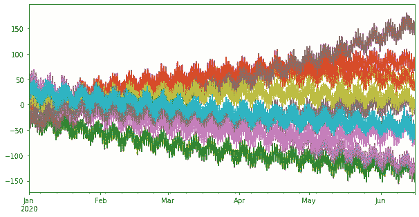
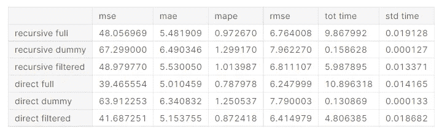
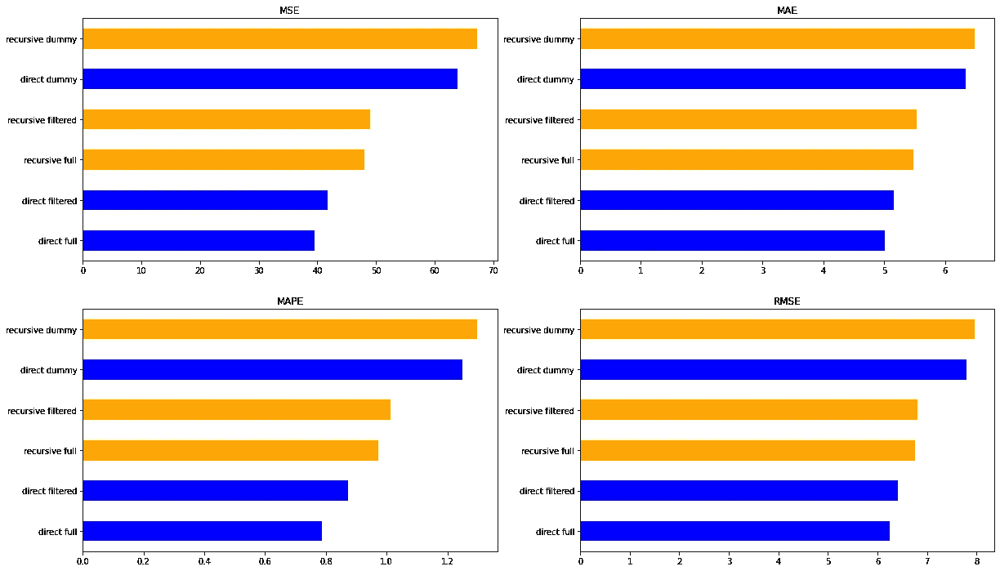
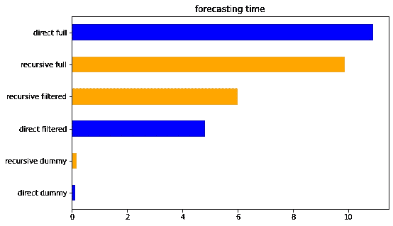

# 具有特征选择的时间序列预测:为什么你可能需要它

> 原文：<https://towardsdatascience.com/time-series-forecasting-with-feature-selection-why-you-may-need-it-696b23ecc329>

## 在保持性能的同时加快预测速度


照片由[你好我是尼克](https://unsplash.com/@helloimnik?utm_source=medium&utm_medium=referral)在 [Unsplash](https://unsplash.com?utm_source=medium&utm_medium=referral)

当第一次处理预测任务时，开始采用标准和基线解决方案是一个好的做法。在项目的第一部分，**我们必须花时间了解业务需求并进行充分的探索性分析**。如果我们迫不及待地要建立一个预测模型，最好的选择就是拟合天真的模型。这听起来也不错，因为它可能有助于理解数据、采用适当的验证策略或引入新奇的想法。

在这个初步阶段之后，**当我们对取得的结果更有信心时，我们可以更加关注工程选择**来开发最合适的解决方案。我们可以优化许多活动。从数据处理到模型推断，我们必须考虑许多方面，以使我们的解决方案发挥最佳作用。

**有时，以快速有效的方式提供预测可能是一种需要**。在这种情况下，我们必须配置管道，以最快的方式提供预测，同时保持足够的性能水平。从头开始重新训练模型是重要的，但不是强制性的。因为它可能不会提高性能/稳定性，所以每次我们必须进行预测时，我们都有浪费宝贵时间进行再培训的风险。重用模型和**进行预测而无需强制拟合的可能性这是加速预测的第一个优势**。

同时，**我们可以用一些简单而有效的技巧来提高预测的速度**。例如，每个人都知道特征选择是一种减少预测模型输入的特征维数的技术。特征选择是大多数机器学习流水线中的重要步骤，主要用于提高性能。**排出特征时，我们降低了模型的复杂性，从而减少了推理时间**。

在本帖中，**我们展示了特征选择在减少预测推理时间的同时避免性能显著下降的有效性**。为了促进和规范每个机器学习模型的预测，我开发了 [**tspiral**](https://github.com/cerlymarco/tspiral) 。 [**tspiral**](https://github.com/cerlymarco/tspiral) 是一个 python 包，它超越了经典的递归预测，提供了各种预测技术。它与 scikit-learn 的完美集成使得基于 scikit-learn 构建的丰富生态系统也可以应用于时间序列领域。

# 实验设置

我们以每小时一次的频率和双重季节性(每天和每周)来模拟多个时间序列。我们还添加了一个从平滑随机游走中获得的趋势，以引入随机行为。



模拟时间序列(图片由作者提供)

该系列的最后部分用作测试集，我们在其中测量预测误差和做出预测所需的推断时间。在我们的实验中，我们模拟了 100 个独立的时间序列。我们说“独立”是因为尽管所有的系列表现出非常相似的行为，但它们并不相互关联。通过这种方式，我们对它们进行单独建模。

递归和直接预测策略都进行了测试。这些方法使用目标的滞后值作为输入来预测时间序列。换句话说，为了预测下一个小时的值，我们使用以前可用的每小时观察值，以更友好的表格格式重新排列。**为时间序列预测进行特征选择与标准表格监督任务**一样简单。选择算法简单地对滞后的目标特征进行操作。下面是一个使用递归预测进行特征选择的示例。

```
from sklearn.linear_model import Ridge
from sklearn.pipeline import make_pipeline
from sklearn.feature_selection import SelectFromModel
from tsprial.forecasting import **ForecastingCascade**max_lags = 72
recursive_model = **ForecastingCascade**(
    make_pipeline(
        SelectFromModel(
            Ridge(), threshold='median',
            max_features=max_lags,
        ), 
        Ridge()
    ),
    lags=range(1,169),
    use_exog=False
)recursive_model.fit(None, y)**selected_lags** = recursive_model.estimator_['selectfrommodel'].get_support(indices=True)
```

我们使用元估计量的重要性权重(线性模型情况下的系数)从训练数据中选择重要特征。这是一种简单而快速的选择特征的方法，但是**时间序列的特征选择可以使用通常应用于表格回归任务**的相同技术进行。

在直接预测的情况下，我们必须为每一个预测步骤安装一个单独的估计器，其过程是完全相同的。我们为每个预测步骤做出选择。每个估计器选择重要滞后的不同子集。为了汇总结果并只产生一组独特的有意义的滞后，我们选择那些更频繁选择的。

```
from sklearn.linear_model import Ridge
from sklearn.pipeline import make_pipeline
from sklearn.feature_selection import SelectFromModel
from tsprial.forecasting import **ForecastingChain**max_lags = 72
direct_model = **ForecastingChain**(
    make_pipeline(
        SelectFromModel(
            Ridge(), threshold='median',
        ), 
        Ridge()
    ),
    n_estimators=168,
    lags=range(1,169),
    use_exog=False,
    n_jobs=-1
)direct_model.fit(None, y)**selected_lags** = np.argsort(np.asarray([
     est.estimator_['selectfrommodel'].get_support() 
     for est in direct_model.estimators_
]).sum(0))[-max_lags:]
```

# 结果

滞后的选择与模型性能密切相关。在纯自回归背景下，如果没有额外的外生变量，滞后目标值是提供良好预测的唯一有价值的信息。使用特征选择来期望误差度量的显著改善可能过于乐观。让我们检查结果。



以表格形式预测业绩。时间以秒计算(图片由作者提供)

我们适合递归和直接方法的三种变体。首先，我们考虑过去 168 小时内的所有滞后(*满*)。然后，我们只使用周期性滞后(*哑元*)。最后，我们拟合我们的模型，仅考虑在训练数据上选择的有意义的滞后(*过滤*)

直接方法是最准确的方法。正如所料，*完全*方法比*虚拟*和*过滤*方法更有性能。然而，差异并不明显。*完全*和*过滤*方法的行为方式几乎相同。考虑到推理时间，同样的差异也存在吗？



以图形格式预测误差指标。橙色:递归预测。蓝色:直接预测(图片由作者提供)

*虚拟*方法是最快的方法，因为它考虑的特征数量很少。出于同样的原因，*过滤*方法比*完全*方法更快。令人惊讶的是*过滤*接近的速度是*满*一个*的一半。这可能是一个很好的结果，因为我们可以通过简单的特征选择以更快的方式得到好的预测。*



以图形格式预测推理时间。橙色:递归预测。蓝色:直接预测(图片由作者提供)

# 摘要

在这篇文章中，我们利用了 [tspiral](https://github.com/cerlymarco/tspiral) 的能力，简单地使用 scikit-learn 来处理时间序列。这简化了有意义的自回归滞后的识别，并给予时间序列操作特征选择的可能性。最后，我们发现如何通过简单地应用适当的滞后选择来减少预测的推断时间。

[**查看我的 GITHUB 回购**](https://github.com/cerlymarco/MEDIUM_NoteBook)

保持联系: [Linkedin](https://www.linkedin.com/in/marco-cerliani-b0bba714b/)