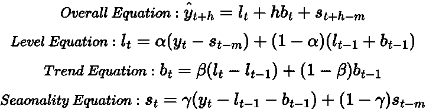
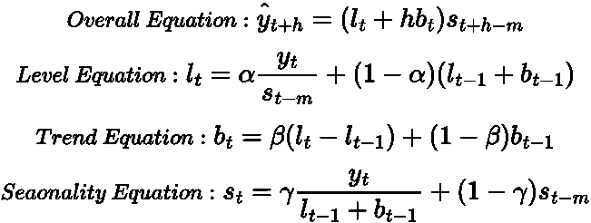
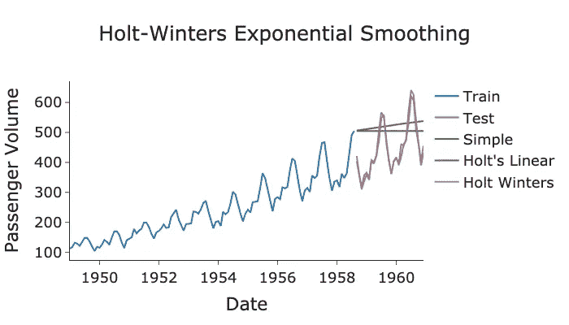
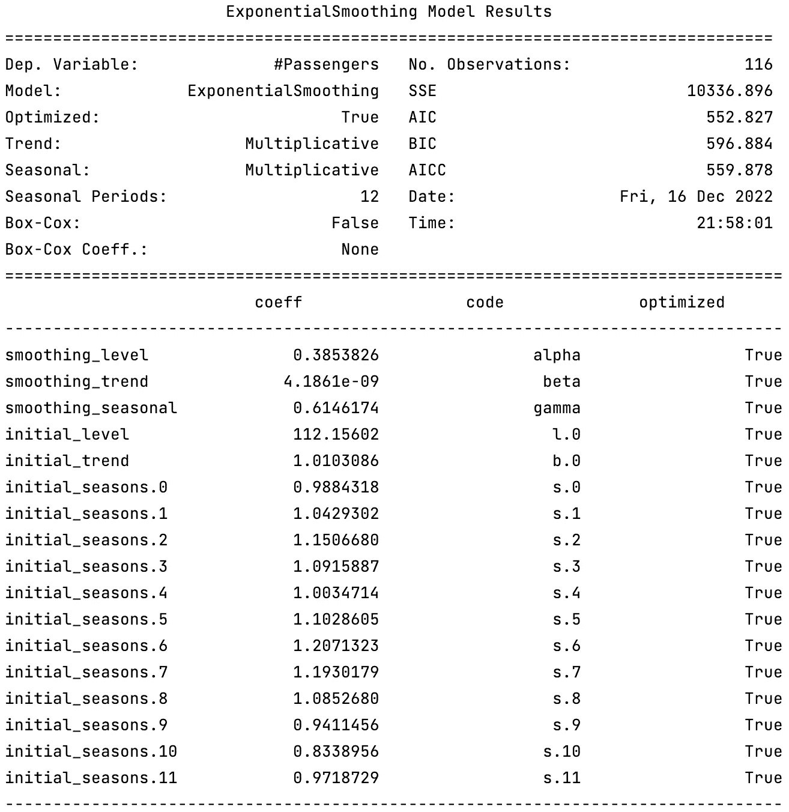

# 霍尔特·温特斯的时间序列预测

> 原文：<https://towardsdatascience.com/time-series-forecasting-with-holt-winters-b78ffc322f24>

## 最强大和最有用的指数平滑模型的讨论和实现


丹尼斯·德吉奥安尼在 [Unsplash](https://unsplash.com?utm_source=medium&utm_medium=referral) 上拍摄的照片

# 背景

在我最近的帖子中，我们一直在讨论一个非常著名的预测模型家族，*指数平滑*。指数平滑法的基本原理是，作为预测时间序列的一种手段，更重视最近的观测值，而不重视历史观测值。

最基本的指数平滑模型是(有趣的是)*简单指数平滑*也被称为*单一指数平滑。*该模型只是预测时间序列的水平，没有考虑[趋势](https://medium.com/towards-data-science/time-series-stationarity-simply-explained-125269968154)或[季节性](https://medium.com/towards-data-science/seasonality-of-time-series-5b45b4809acd)。要了解这个模型的更多信息，请查看我之前的帖子:

</forecasting-with-simple-exponential-smoothing-dd8f8470a14c>  

这个简单模型的下一步是*霍尔特的线性趋势方法*，也称为*双指数平滑。*顾名思义，这款车型融合了潮流和水平。如果你想了解更多关于霍尔特的方法，请参考这里:

</forecasting-with-holts-linear-trend-exponential-smoothing-af2aa4590c18>  

最后，霍尔特方法的下一步是找到一种将季节性纳入指数平滑模型的方法。这就是 [*霍尔特·温特斯*](https://en.wikipedia.org/wiki/Exponential_smoothing#Triple_exponential_smoothing_(Holt_Winters)) *(三重指数平滑)*的用武之地！

在本帖中，我们将回顾指数平滑的理论，深入研究 Holt Winters 的模型如何包含季节性的数学，最后通过 Python 中的一个真实例子。

# 霍尔特·温特斯模型理论

## 简单指数平滑重述

让我们快速回顾一下简单的指数平滑是如何工作的:

> 关于简单指数平滑的完整解释，请参考我以前的文章[这里](https://medium.com/towards-data-science/forecasting-with-simple-exponential-smoothing-dd8f8470a14c)。


作者在 LaTeX 中生成的方程。

其中***【ŷ_{t+1}】***是我们要预测的值， ***y_t*** 是最近的观测值， ***ŷ_{t-1}*** 是我们之前的预测， ***α*** 是平滑因子(***0≤α≤1*【t19)***。*****

该组件形式的模型是:


作者在 LaTeX 中生成的方程。

这里 ***h*** 是我们预测的时间步长***l _ t****=****【ŷ_{t+1}】***明确说明这是模型的水平分量。

## 霍尔特线性趋势法概述

霍尔特的线性趋势模型在预测中加入了趋势成分:


作者在 LaTeX 中生成的方程。

这里 ***b_t*** 是预测的趋势，****b _ { t-1 }***是之前预测的趋势， ***β*** 是趋势平滑因子( ***0 ≤ β ≤ 1*** )。*

> *关于霍尔特的线性趋势方法的完整解释，请参考我以前的文章[这里](https://medium.com/towards-data-science/forecasting-with-holts-linear-trend-exponential-smoothing-af2aa4590c18)。*

## *霍尔特·温特斯*

*如上所述，霍尔特温特斯模型通过在预测中加入季节性因素，进一步扩展了霍尔特的线性趋势方法。季节性的加入产生了两种不同的霍尔特温特斯模型，*加法*和*乘法*。*

*两个模型的区别在于季节性波动的大小。对于加性模型，季节性波动通常是恒定的。然而，对于乘法模型，波动与给定时间的时间序列值成比例。要了解更多关于加法和乘法时间序列模型的信息，请查看我之前的博文:*

*</time-series-decomposition-8f39432f78f9>  

现在让我们回顾一下霍尔特·温特斯两个模型的[方程](https://otexts.com/fpp3/holt-winters.html):

**添加剂:**



作者在 LaTeX 中生成的方程。

其中 ***m*** 为时间序列的季节性， ***s_t*** 为季节性预测分量， ***s_{t-m}*** 为上一季度的预测， ***γ*** 为季节性分量平滑因子(***0≤γ≤1α***)。

如果你想了解更多关于季节性的知识，请点击这里查看我之前的博文:

</seasonality-of-time-series-5b45b4809acd>  

**乘法:**



作者在 LaTeX 中生成的方程。

不去研究这些方程的麻烦，他们试图做的是计算时间序列的趋势线，并用季节变化加权趋势线上的值。

> 请注意，还有其他形式的包含阻尼参数的方程。我们不会在本文中涉及这些，但是感兴趣的读者可以在这里了解关于这个[的更多信息。](https://www.bauer.uh.edu/gardner/docs/pdf/Why-the-damped-trend-works.pdf)

厌倦了这些无聊的数学，让我们用 Python 实现这个模型吧！

# Python 示例

我们将一如既往地使用美国航空数据集，并使用 *statsmodel* 库中的 [*指数平滑*](https://www.statsmodels.org/dev/generated/statsmodels.tsa.holtwinters.ExponentialSmoothing.html) 类来拟合霍尔特温特斯预测模型。

> 数据[来自拥有 CC0 许可证的 Kaggle](https://www.kaggle.com/datasets/ashfakyeafi/air-passenger-data-for-time-series-analysis) 。

作者 GitHub 要点。



作者用 Python 生成的图。

从上面的图中我们可以看出，Holt Winters 的预测是迄今为止最好的，因为它捕捉到了时间序列的趋势和季节性。

当调用模型时，我们将参数`seasonal_periods`、`trend`和`seasonal`传递给模型 obejct。从上面的图来看，很明显有一个年度季节性，所以我们设置`seasonal_periods=12`。此外，趋势并不完全是直线，所以它是乘法，因此`trend='multi'`。最后，季节性波动不是某个设定的一致值，而是与时间序列成正比，因此季节性是倍增的`seasonal='multi'`。

霍尔特温特斯模型可通过制定*总结*方法进一步诊断:

```
print(model_holt_winters.summary())
```



由作者用 Python 生成的图片。

`smoothing_level`、**、 *α* 、`smoothing_seasonal`、**、 *γ* 、**参数相对较高，说明季节性和水平分量变化频繁。然而，`smoothing_trend`、**、 *β、*、**值非常小，意味着趋势变化不大。**

# 总结和进一步的思考

通过讨论可能是最有用的模型，霍尔特·温特斯的模型，这将我们带到指数平滑系列的末尾。该模型同时考虑了趋势和季节性因素，因此可以有效地用于大多数时间序列的建模。如我们的 Python 示例所示，它很好地捕捉了季节性和趋势性成分。

本文中使用的全部代码可以从我的 GitHub 获得，网址是:

<https://github.com/egorhowell/Medium-Articles/blob/main/Time%20Series/Exponential%20Smoothing/holt_winters.py>  

# 参考资料和进一步阅读

*   *预测:原理与实践:*[https://otexts.com/fpp2/](https://otexts.com/fpp3/holt-winters.html)
*   [https://en.wikipedia.org/wiki/Exponential_smoothing](https://en.wikipedia.org/wiki/Exponential_smoothing)
*   【http://www.exponentialsmoothing.net/】

# 和我联系！

*   要在媒体上阅读无限的故事，请务必在这里注册！ 💜
*   [T32*😀*](/subscribe/@egorhowell)
*   [*LinkedIn*](https://www.linkedin.com/in/egor-howell-092a721b3/)*👔*
*   *[*推特*](https://twitter.com/EgorHowell) 🖊*
*   *[*github*](https://github.com/egorhowell)*🖥**
*   **<https://www.kaggle.com/egorphysics>**🏅****

> ***(所有表情符号都是由 [OpenMoji](https://openmoji.org/) 设计的——开源的表情符号和图标项目。执照: [CC BY-SA 4.0](https://creativecommons.org/licenses/by-sa/4.0/#)****