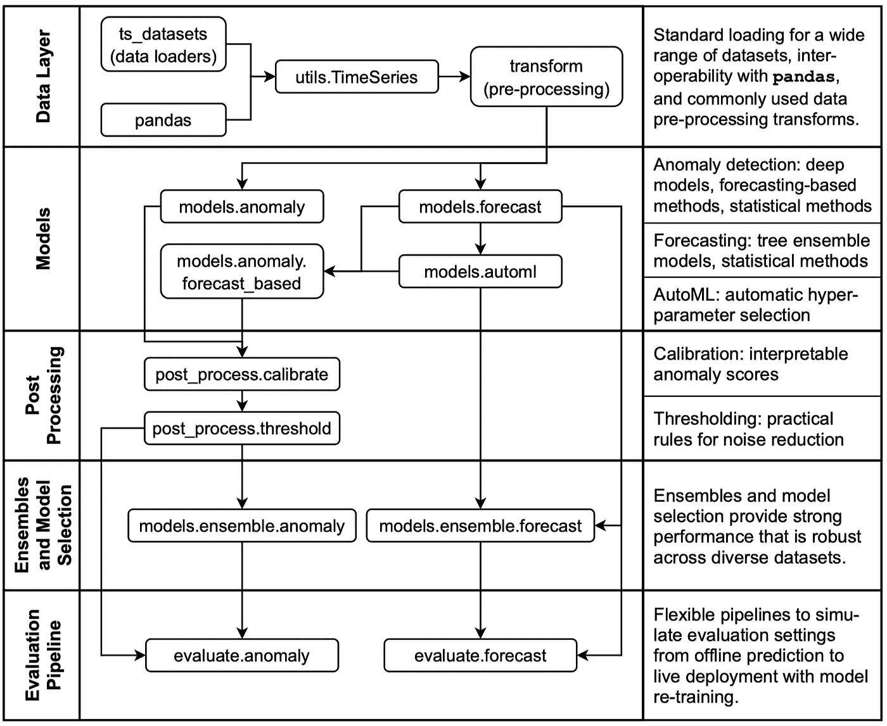
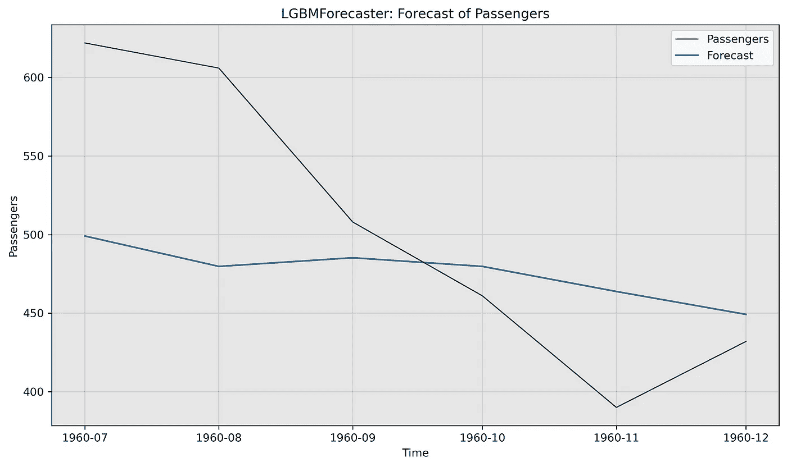

# 用 Salesforce 的 Merlion 进行时间序列预测

> 原文：<https://towardsdatascience.com/time-series-forecasting-with-salesforces-merlion-9fffd7c80ff4>

## 用于时间序列预测的 ML 库 Merlion 简介

照片由[作者](https://medium.com/@konstantin-rink)拍摄。

扩展您的时序解决方案可能是一项具有挑战性的任务。幸运的是，像优步或 LinkedIn 这样的公司让他们的解决方案像 [Orbit](https://eng.uber.com/orbit/) 或 [Greykite](https://engineering.linkedin.com/blog/2021/greykite--a-flexible--intuitive--and-fast-forecasting-library) 开源。我发现的一个相对较新的是 Merlion，由 Salesforce 的研发团队开发。

它是用 Python 编写的，为**时间序列预测**和**异常检测**提供了一个**端到端的 ML 框架**。鱼尾狮声称包括**数据加载**和**转换**，**构建**和**训练** **模型**，**后处理**模型输出，以及**评估**你的预测。

鱼尾狮支持**单变量**和**多变量**时间序列。该框架旨在提供**一站式解决方案**以**快速开发**时序需求模型，并在多个时序数据集上对其进行基准测试。

# 你将从这篇文章中学到什么

这篇文章向你展示了 Merlion 为**时间序列预测**提供的**关键特性**。您将了解它的架构，并理解它的不同部分如何协同工作。

如果您对进一步的技术信息感兴趣，您可以查看鱼尾狮的最新📘[文档](https://opensource.salesforce.com/Merlion/latest/)和📑[白皮书](https://arxiv.org/abs/2109.09265)。

# 装置

鱼尾狮配备了一系列不同的时间序列预测模型。当我安装它的时候，我面临着一些模型依赖的小挑战(见下文)。

基本上你只需要**运行下面的命令** `pip install salesforce-merlion`。

使用命令`pip install "salesforce-merlion[all]"`安装它所有的模型，如 lightgbm 或脸书的 Prophet

如果您是 mac 用户或遇到任何错误，请参阅📘[此处](https://github.com/salesforce/Merlion#Installation)了解更多详情。

> 请注意:我和 Prophet 和 Arima 之间有些矛盾。有所帮助的是降低了《预言家》中 pystan 和《ARIMA》中 scipy 的等级。

# 鱼尾狮的建筑

在深入研究代码之前，我们先来看看鱼尾狮的架构。图 1 按时间顺序展示了不同的模型，以及它们是如何协同工作的。

图一。鱼尾狮的建筑(Bhatnagar 等人，2021 年)。

在本文中，我们涵盖了除*后处理*块之外的所有部分，因为这一部分仅用于异常检测。

# 数据加载

Merlion 自带的数据结构**叫做`TimeSeries`。该结构或类支持**多变量**和**单变量**时间序列。从技术上来说，它充当了`UnivariateTimeSeries`的**系列**的**包装**。**

为了将数据放入所需的数据结构中，我们使用了 TimeSeries 的方法`.from_pd()`。这个方法需要一个带有*日期时间索引*的 pandas *数据帧*。默认情况下，它检查每个索引是否唯一，以及是否设置了频率 *freq* (默认 *1h* )。

以下示例显示了如何从 pandas 数据框架中加载单变量时间序列。

如果我们处理一个**单变量**时间序列，并且面临**缺失或 nan 值**，Merlion 会**自动删除**它们和它们的相关指数。这意味着在我们将数据帧转换成鱼尾狮的数据结构之前，我们必须考虑插补**。**

然而，当处理**多元**时间序列时，情况就不同了。在这种情况下，鱼尾狮带来了一个叫做*对准*的概念。鱼尾狮**检查**我们的多元时间序列**是否包含任何缺失值**或者每个变量的指数**是否没有对齐**。

为了检查*对齐*，我们可以调用`TimeSeries`对象的`.is_aligned`属性。万一我们得到`False`，我们可以调用`.align()`方法来修复它。

默认情况下，该方法将获取任何单个变量中存在的所有时间戳的联合，并使用**线性插值**来估算缺失值。

## 切片和分割

除了方法之外，鱼尾狮还有另外两种简便的方法。

`.window(t0, tf)`允许在范围`t0`和`tf`之间切出一个子集。这些参数可以是任何合理的日期时间格式，也可以是 Unix 时间戳。

`.bisect(t)`类似于`.window()`。它将时间序列分成左右两部分。

## 预处理

Merlion 提供常见的数据预处理转换技术**，如最小-最大归一化、幂转换(box-cox)或指数移动平均。可以找到完整的列表📘[此处](https://opensource.salesforce.com/Merlion/latest/merlion.transform.html#module-merlion.transform.moving_average)。**

以下示例向您展示了如何在建模步骤之前使用最小-最大归一化。

> 请注意，也可以在模型初始化步骤中设置一个转换器。点击📘[此处](https://opensource.salesforce.com/Merlion/latest/merlion.models.forecast.html)了解更多详情。

# 模型

鱼尾狮提供了一系列不同的模型:

*   **ARIMA** (自回归综合移动平均)
*   **萨里玛** (ARIMA，具有用户指定的季节性)
*   **ETS** (误差、趋势、季节性)
*   **先知**(脸书先知的包装)
*   **平滑器**(用于单变量时间序列预测的多尺度指数平滑器)
*   **向量自回归**模型用于多元时间序列预测
*   **套袋**(随机林)**助推**树(lightgbm)
*   **LSTM**

然而，**也可以**定义或包含您的**自己的型号**。你可以找到更多关于它的信息📘[此处](https://opensource.salesforce.com/Merlion/latest/examples/forecast/3_ForecastNewModel.html)。

以下示例显示了如何使用**航空乘客** [**数据集**](https://pkg.robjhyndman.com/fma/reference/airpass.html) 用 LGBM 模型进行训练和预测。

但是在我们开始建模之前，我们必须加载航空公司乘客的数据，并以正确的形状和格式将其带入。我建议确保*日期时间索引*和*频率*设置正确(`lines 6-9`)。

将数据转换成正确的 DataFrame 格式后，我们将其转换成 Merlion 的数据结构(`line 12`)。在`line 13`中，我们简短地检查数据集是否对齐(例如，没有遗漏索引)。最后，我们可以将数据分成一个训练集和测试集(`line 17`)。

有了正确的数据结构，我们准备配置(`lines 3-5`)和初始化(`line 7`)我们的 lgbm 模型。在这一步之后，我们准备好拟合或训练我们的模型(`line 9`)并预测接下来的 6 个月(`line 11`)。

`.forecast()`方法**需要时间戳**来表示要做出的预测数量。因此，我们通过使用**训练集**的`.time_stamps`属性来提供所需的时间戳。

为了可视化我们的预测，鱼尾狮的模型为我们提供了两种方法:`.plot_forecast()`和`.plot_forecast_plotly()`。下面的例子显示了如何绘制我们的预测和地面真相。

可视化应该看起来像这样(图 2)。

图二。plot_forecast 方法的结果。

坦率地说，这不是最佳性能，进一步的调整(例如，不同的参数或变换)将是必要的。然而，其目的是展示如何使用内置的可视化方法。

# AutoML

谈到尝试不同的参数，鱼尾狮还附带了一个 AutoML 包。它支持:

*   SARIMA 的自动超参数选择
*   自动季节性检测
*   脸书先知的自动(多)季节性检测
*   ETS 的自动季节性检测

下面的例子使用了与上面相同的数据集，并展示了如何对 SARIMA 模型使用 AutoML。

类似于现有的例子，我们必须首先配置我们的 AutoML 模型(`lines 3-5`)。随后，我们训练我们的模型并预测未来 6 个月。与 lgbm 示例不同，我们还在`lines 9-10`中定义了一个`train_config`来加强我们的 SARIMA 模型的稳定性和可逆性。

# 系综和型号选择

鱼尾狮提供了两种常用的合奏技术。首先，它支持传统的**系综**，报告所有模型在每个时间戳预测的**均值**或**中值** **值**。其次，它还支持**自动型号选择**。

基于上面的数据，下面的例子展示了如何使用这些技术。下面介绍第一个传统合奏团。

我们首先配置和初始化我们的两个模型(`lines 13-21`)。然后我们在`lines 25-27`中定义系综。这里我们描述**我们想要如何组合不同模型(`combiner=Mean()`)的结果**，以及哪些模型将在集合中“扮演”(`[lgbm,sarima]`)。

由于我们使用 autosarima，我们还提供了关于**如何训练模型** ( `lines 30-34`)的集合信息。`per_model_train_configs`接受每个型号的**字典列表。如果我们想使用默认配置，我们只需为相应的单一型号提供`None`。默认情况下，集合采用训练数据集的 20% ( `valid_frac=0.2`)进行验证。**

下面的第二个例子展示了如何利用自动模型选择。与上面的例子类似，我们必须首先配置我们的两个模型(`lines 13-21`)。

然后我们配置模型选择器(`lines 24-28`)。作为一个选择标准，我们在这里设置了 **sMAPE** 。

除了 sMAPE 之外，Merlion 还支持许多其他误差指标，如 MAE 或 RMSE。完整的列表可以在📘[此处](https://opensource.salesforce.com/Merlion/latest/merlion.evaluate.html#module-merlion.evaluate.forecast)。

> 如果您需要关于时间序列误差度量的更多信息，请查看我的文章📑[你应该知道的时间序列预测误差指标](/time-series-forecast-error-metrics-you-should-know-cc88b8c67f27?source=your_stories_page----------------------------------------)。

# 存储和加载模型

如果你想存储你训练过的模型或者加载现有的模型，Merlion 的所有模型都有一个`.save()`和`.load()`类方法。您还可以在 *modelFactory* 包的帮助下加载模型，该包适用于任意模型。`.save()`方法在给定的路径下创建一个新的目录，其中存储了模型的配置(json)和状态(二进制)。

下面的例子显示了我们如何从上面的集合例子中保存和加载模型。

默认情况下，`.save()`方法会将所有已定义的模型存储在我们的集合中。在这个例子中，我们设置了`save_only_used_models=True`(第`7`行)，所以我们只存储具有最佳 sMAPE 值的模型。然而，创建的配置文件包含了所有集合模型的元信息。

# 评估管道

最后但同样重要的是，Merlion 提供了一个非常酷的特性来模拟实时模型部署。这允许我们根据(多个)评估标准来评估我们开发的预测器的质量。模拟了以下场景:

*   根据过去的数据训练模型
*   以固定的间隔节奏(`cadence`)获取模型对某个范围(`horizon`)的预测
*   定期重新训练模型(`retrain_freq`)
*   可选:指定一个`train_window`来根据最大数据量重新训练模型

这种模拟或评估与滚动交叉验证非常相似，在时间序列建模中非常推荐使用滚动交叉验证。

下面的示例向您展示了如何使用我们在上面的示例中开发的 lgbm 模型来模拟部署场景。

由于评估器使用了`to_timedelta`函数，我们可以使用周、天、小时、分钟和(毫/微/毫微)秒作为单位。在本例中，我们将频率设置为`90d`，表示每 3 个月将使用该模型预测接下来的 6 个月(horizon = `180d`)。此外，该模型每 3 个月重新训练一次(retrain_freq `90d`)，并使用 12 个月(train_window=360)的训练数据。

最后我们计算 *RMSE* 来评价我们模型的性能。

# 结论

试用鱼尾狮一段时间后，我对它的架构和可能性印象深刻。它评估管道是一个很好的工具，可以模拟您的模型在部署场景中的表现。此外，autoML 功能也非常支持。

在这篇文章中，我只触及了表面。我们没有深入研究如何在建模过程中使用变压器，或者如何用多元时间序列进行预测。然而，现在您应该对鱼尾狮的架构以及如何使用它有了很好的理解。请随意查看他们的[文档](https://opensource.salesforce.com/Merlion/latest/)或[白皮书](http://arxiv.org/abs/2109.09265)。

# **来源**

**Merlion:时间序列的机器学习库** ( [GitHub](https://github.com/salesforce/Merlion) )

**鱼尾狮的文档** ( [链接](https://opensource.salesforce.com/Merlion/latest/))

巴特纳加尔公司；卡西亚尼克，p。刘；兰；杨；卡修斯河；Sahoo，d；Arpit，d；萨勃拉曼尼亚；吴；萨哈，A 杰戈塔，又名:戈帕拉克里希南；辛格，m；K. C .克里蒂卡；Maddineni，s。Cho，d；宗；周；熊；萨瓦雷塞；Hoi，s；王，H. 2021。 **Merlion:时间序列的机器学习库**。arXiv:2109.09265。[http://arxiv.org/abs/2109.09265](http://arxiv.org/abs/2109.09265)