# 使用轨道 101 进行时间序列建模

> 原文：<https://towardsdatascience.com/time-series-modeling-with-orbit-101-f6a262c1eaf6>

## 轨道入门教程(面向对象 **-** O **r** 面向**B**ayes**I**an**T**ime 序列预测)


图片来自 unsplash.com[艾萨克·史密斯](https://unsplash.com/photos/6EnTPvPPL6I)

# 目录

*   **什么是轨道？**
*   **有哪些用例？**
*   **弄脏你的手！**
    -轨道模型的区别(DLT vs LGT)
    -数据
    - EDA
    -用轨道建立模型
    -更多关于回溯测试
    -进入未知——预测未来
*   **数据来源**
*   **参考文献**

特别感谢 Orbit 的首席开发者和建筑师 Edwin Ng 回顾了这个故事并提供了宝贵的建议。

# 什么是轨道？

[轨道](https://github.com/uber/orbit)是面向对象**对象**对象**对象**对象**对象**对象**对象**对象**对象**对象**对象**对象**对象**对象对象对象对象对象**对象**对象**对象**对象【时间】对象**对象【】对象**对象【时间】对象它是一个开源的 python 包，具有面向对象的设计，使用结构化贝叶斯时间序列模型来产生时间序列推理和预测。在后端，Orbit 利用概率编程语言(PPL)如 [Stan](https://mc-stan.org/) 和 [Pyro](https://pyro.ai/) 进行后验近似。


Orbit Github 首页(作者截图)

与具有类似目的的其他包/接口(如 Prophet by Meta、pyro、pymc3 等)相比，Orbit 更容易实现，使用更灵活，功能更多，同时还能产生准确的估计。Orbit 提供了一个端到端的建模解决方案，包括 EDA 功能、多种类型的模型、各种后验估计方法(MAP、MCMC、SVI)、基于核的时变回归、高级特征选择方法、回溯测试功能、模型诊断和验证功能以及可视化、Orbit 主题绘图风格和调色板，并且它正在扩展。

此外，在优步内部数据和 M4 M3 的竞争数据上，Orbit 都优于流行的时间序列模型，如[萨里玛](https://en.wikipedia.org/wiki/Autoregressive_integrated_moving_average)和[先知](https://facebook.github.io/prophet/)。(关于所用模型、测试指标和数据的更多细节可以在这篇[文章](https://arxiv.org/pdf/2004.08492.pdf)中找到。)这是一个高性能的软件包，将严格的统计方法和具有挑战性的业务问题联系起来。

# 有哪些用例？

Orbit 由优步营销数据科学团队开发，是优步营销组合模型背后的核心引擎。在优步，它主要用于对推动业务 KPI 的营销渠道的增量和效率进行公正的测量。Orbit 还可以帮助预测未来的 KPI，这是规划未来营销预算和优化不同地区和渠道的预算分配的重要组成部分。借助贝叶斯模型和动态系数，Orbit 可以优先吸收不同时间的实验结果，将提升测试与真实世界的数据相结合，并提供数据驱动的见解，帮助提高优步营销活动的投资回报率。如果你有兴趣了解更多关于营销组合模型(MMM)的知识，请查看我的另一个故事[这里](/marketing-mix-modeling-101-d0e24306277d)是关于 MMM 的非技术性介绍。

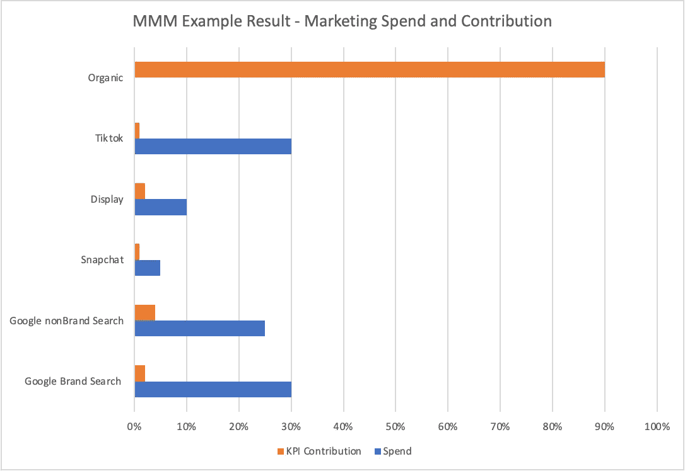

示例 MMM 结果—营销支出和贡献(图片由作者提供)

优步的其他使用案例包括支付欺诈检测和基础设施容量规划。优步的风险团队利用 Orbit 从早期检测和预防支付欺诈。优步的容量规划团队已经利用 Orbit 为工程团队规划了未来几年的计算和存储容量。

在外部，Orbit 团队还与包括 Meta、Spotify、Pinterest 在内的企业合作，解决 Orbit 具有挑战性的预测问题。

# 把手弄脏！

在深入研究代码之前，让我们看一下 Orbit 支持的两个主要模型:阻尼局部趋势模型(DLT)和局部全球趋势模型(LGT)。两种模型都使用指数平滑法，并将时间序列分解成不同的部分:趋势、季节性、回归和误差项。这两个模型之间的主要区别是，DLT 使用阻尼趋势因子，而不是 LGT 的混合趋势因子，DLT 引入了回归分量，这在外生回归变量已知时很有帮助。哪种模型结构在预测中表现更好取决于数据和使用情况。虽然数学不是本文的重点，但以下函数可能有助于您理解。更多细节可以在这篇[文章](https://arxiv.org/pdf/2004.08492.pdf)中找到。

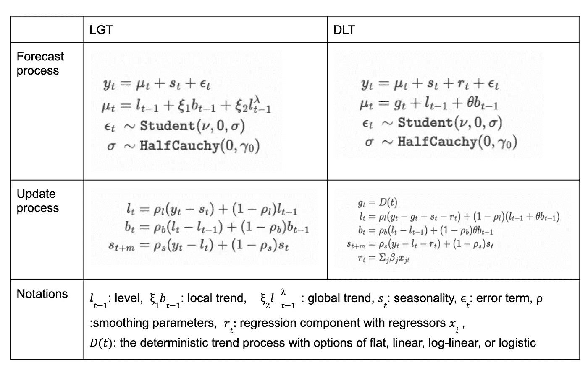

轨道模型的数学(表格由作者使用优步营销数据科学团队发表的论文中的信息制作)

现在让我们真的把手弄脏吧！在本教程中，我将只使用 DLT。本文中的数据和分析仅用于演示如何使用 Orbit，我并不追求学术严谨性或帮助任何数据驱动的决策。

## 1.数据

经济与我们所做的一切都息息相关，所以我想预测一下未来几年美国的经济会是什么样子。国内生产总值被认为是经济整体表现的良好指标。国内生产总值也是一个周期性和流行的指标，很容易从公共数据来源获得，是时间序列分析的良好候选对象。我将尝试使用 Orbit 来预测美国的实际 GDP 和其他一些被认为是经济指标的特征，包括 CPI(消费者价格指数)、失业率、短期利率(3 个月到期的国债的市场收益率)和长期利率(10 年到期的国债的市场收益率)。在数据集中，所有变量都汇总到季度级别，并进行对数转换。我从 1982 年到 2021 年总共有 160 个数据点。

***数据来源*** :本文中我使用的所有数据均来自经济数据聚合平台 [FRED](https://fred.stlouisfed.org/) 。请看这个故事结尾的详细数据来源和引用。

## 2.电子设计自动化(Electronic Design Automation)

首先，让我们导入分析所需的所有模块和函数。

我从 orbit 导入了一些方便的绘图功能来做 ed a、模型诊断和 Orbit 自己的主题风格和调色板。我还导入了 DLT，我将使用的模型，以及一些用于回溯测试和计算评估所需度量的辅助函数。

导入模块的要点(作者的要点)

我们来看看数据。我的目标是真实 GDP `real_gdp_log`的日志版本，特征是下面变量的日志版本。

```
# Target
# ‘real_gdp’: real GDP# Features
# ‘dgs_3m’: short term interest rate 
# ‘gs_10y’: long term interest rate
# ‘unemp_rate’: unemployment rate
# ‘cpi’: Consumer Price Index
```

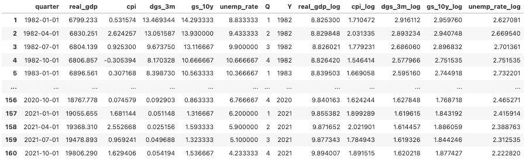

我的数据一览(按作者排列的表格)

Orbit 有一些方便的 EDA 功能来帮助可视化数据和检查数据模式。`eda_plot`模块中的`warp_plot_ts`可以方便地在一行代码中绘制所有变量的时间序列图。

```
eda_plot.wrap_plot_ts(df, 
                      date_col = 'quarter', 
                      var_list=['quarter', 'real_gdp', 
                                'cpi', 'dgs_3m', 'gs_10y', 
                                'unemp_rate']
)
```

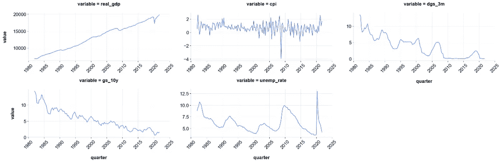

变量的数据模式(按作者分类的图表)

另一个有用的 EDA 图表在同一图表中以不同的比例绘制了两个变量，这使我们能够直观地显示两个变量之间的关系，即使变量的值处于非常不同的比例，例如 GDP(非常大的数字)与失业率(范围为 0-1)。

```
for i in ['cpi_log','dgs_3m_log','gs_10m_log','unemp_rate_log']:
    eda_plot.dual_axis_ts_plot(df=df, 
                               var1='real_gdp_log', var2=i, 
                               fig_width=10, fig_height=3, 
                               date_col='quarter')
```

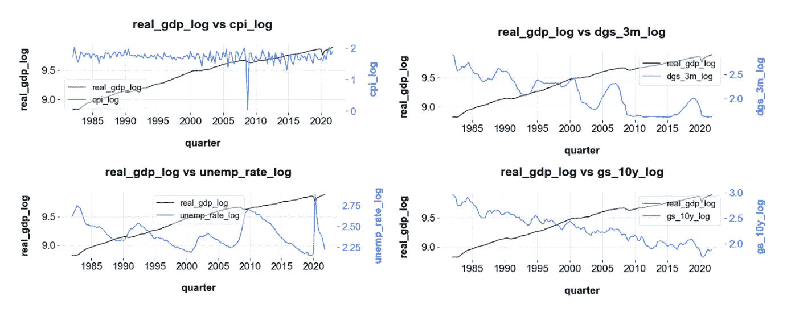

功能与目标(按作者分类的图表)

从图表中我们可以看到，该目标有明显的上升趋势，在 20 世纪 90 年代初、互联网泡沫破裂、2008 年大衰退和 2020 年 COVID 爆发前后有一些较大的下降。所有其他变量也有一些明显的趋势，并根据简单的相关性分析与目标高度相关。还有其他类型的 EDA 可以用于时间序列分析。为了这个故事的目的，我不会深究它们。

## 3.用轨道建立模型

我将我的数据分为两部分:训练和测试，测试规模为 16(我的总数据集的 10%，因为它是季度数据，所以是 4 年)，并实例化了一个 DLT 模型。主要有两种估计量可供选择:`‘stan-mcmc’`(马尔可夫链蒙特卡罗)和`‘stan-map’`(最大后验概率)，以及四种 global_trend_option to 可供选择:`‘linear’, ‘loglinear’, ‘flat’, ‘logistic’`。在对所有 8 个组合进行回溯测试后，趋势为`‘linear’`的`‘stan-mcmc’`在该数据集上表现最佳。`Seasonality`设为 4 是因为我认为应该有年度季节性，而且我有季度数据。

使用`regressor_col`参数，我指定了我想要添加到模型中的所有回归量，并使用`regressor_sign`参数以与`regressor_col`相同的顺序指定了预期符号。我不确定 CPI 是否应该正面影响 GDP，因为通货膨胀可能会提振经济，所以我将其设置为`‘=’`，这意味着模型和数据将决定后续迹象。我设置了`seed`以便结果是可重复的。

实例化、拟合和预测 DLT 模型(作者要点)

拟合和预测功能与 sklearn 和其他流行的统计软件包非常相似。我将我的 test_df 传递到预测中，并将`decompose`指定为`True`，这样在预测结果中，我会将趋势、季节性和回归量组件与预测结果一起分解。

正如您在下面的预测数据框中所看到的，对于每个组件，我们也获得了平均值、95%和 5%的百分比。与许多其他软件包不同，Orbit 还提供完整的参数分布。要获得参数分布，请对训练好的模型对象使用`.get_posterior_samples()`。(`dlt_model.get_posterior_samples()`)

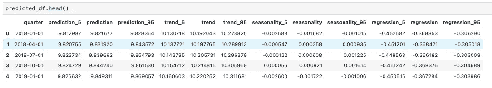

predicted_df 的前 5 行(按作者排列的表格)

我用`.get_regressor_coefs()`检查了回归变量的系数。看起来这些迹象是意料之中的，失业率正在发挥更大的作用。

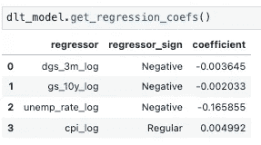

特征系数(作者列表)

我喜欢的两个方便的模型结果绘图函数是用于绘制分解序列的`plot_predicted_components()`和用于检查预测与实际的`plot_predicted_data()`。

`plot_predicted_components(predicted_df, ‘quarter’)`产生以下分解系列。我们可以看到一个上升趋势，第三季度的年度季节性高于其他季度，以及 covid 导致的回归下降。

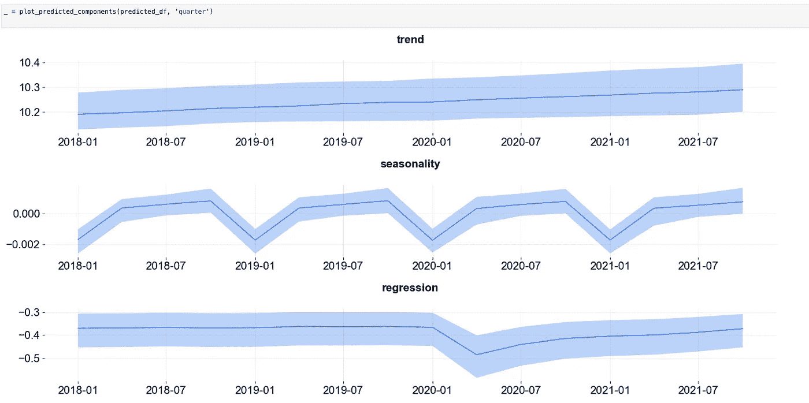

分解趋势、季节性和回归(按作者绘制)

在下面的函数中，我指定了 train_df 来提供训练期间的实际目标，predicted_df 用于预测目标，test_actual 用于测试期间的实际目标，以及 target 列和 date 列。基于这个回溯测试样本，我的预测看起来很棒，MAPE 小于 1%(平均绝对百分比误差)。

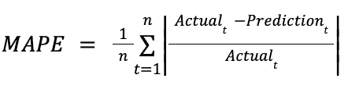

MAPE 公式(作者图片)

```
plot_predicted_data(training_actual_df=train_df, 
                    predicted_df=predicted_df,
                    date_col='quarter', 
                    actual_col='real_gdp_log',
                    test_actual_df=test_df)
```

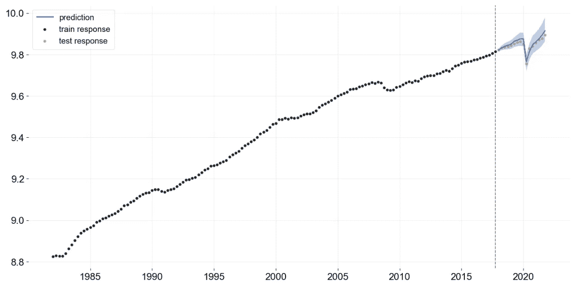

培训和测试期间的预测与实际(由作者绘制)

**具有信息先验的回归**

Orbit 还支持贝叶斯时间序列建模，并允许用户使用外部信息作为回归变量的先验。例如，用户可以使用基于以前的研究、实验结果、类似产品的信息或以前模型的结果的行业基准。当与观测数据一起工作时，先验非常强大，尤其是当数据稀疏或质量低时。我们可以设置 sigma 来控制从先验到后验的变化水平。这样，模型可以利用以前从观测数据中获得的知识和信息，并且模型结果将保持在合理的范围内。

使用 regressor_beta_prior 和 regressor_sigma_prior 参数，可以很容易地将先前的 beta 和 sigma 传递给 DLT。两个参数都接受一个长度和顺序与 regressor_col 和 regressor_sign 相同的数值列表，如下例所示。我计划用一个模拟数据集写另一个关于未来使用轨道先验的故事。

使用先验知识实例化、拟合和预测 DLT 模型(作者要点)

**4。关于回溯测试的更多信息**

如果您想要多个回测样本或使用回测来调整超参数，来自 Orbit 的`BackTester`非常有用。

为了创建一个`BackTester`，我需要之前实例化的模型对象和完整的数据框作为输入。`min_train_len`定义了训练时间段的最小长度。`incremental_len`定义每个回溯测试样本的增量步骤。`forecast_len`定义回溯测试的预测长度。
`window_type`有`‘expanding’`和`‘rolling’`两个选项。`'expanding’`扩展窗口并为每个训练样本增加更多的训练时间，`‘rolling’`创建滑动窗口，训练样本保持相同大小。

```
# create a backtester based on the model we instantiated earlier 
backtest = BackTester(model = dlt_model, 
                      df = df, 
                      min_train_len = 100, 
                      incremental_len = 12, 
                      forecast_len=12, 
                      window_type = 'expanding')ts_splitter = backtest.get_splitter()
_ = ts_splitter.plot()
```

在我的例子中，第一个训练样本是我的数据中的前 100 个数据点，接下来的 12 个数据点是我的第一个回溯测试样本。然后，窗口将扩展 12 个数据点，这使我的第二个训练样本成为数据中的前 112 个数据点，然后接下来的 12 个数据点将成为我的第二个回溯测试样本，依此类推。对于我的数据长度，我有 5 个回测样本。`.get_splitter()`功能有助于可视化训练和回测样本分割。在下图中，蓝色表示训练样本，橙色表示测试样本。

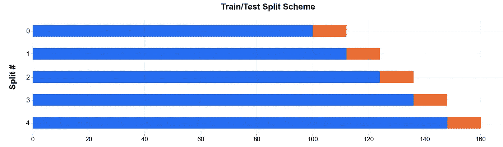

在我们拆分数据之后，我们可以使用`.fit_predict()`来拟合和预测，并使用`.score()`来检查跨回溯测试样本平均的不同评估指标。对于不同的回测样本，该模型也表现良好。

```
backtest.fit_predict()
bt_predicted_df = backtest.get_predicted_df()
backtest.score()
```

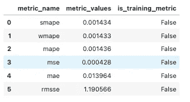

回溯测试平均分数(按作者列出的表格)

另一个有趣的可视化多重回溯测试性能的功能是 gif maker。(这需要安装`imageio`包。)它生成一个很酷的 gif 图，依次展示所有样本的性能。
看起来在某些时间段，我的模型确实倾向于过度预测。作为一个潜在的下一步，我可以做一些其他的测试，如其他趋势选项，但现在我对整体结果还满意。

```
plot_bt_predictions2(bt_pred_df=bt_predicted_df, metrics=wmape, 
                     figsize=(16, 8), is_visible=False,
                     fig_dir='result/', export_gif=True,
                     markersize=80, imageio_args={'fps': 2.5})
```

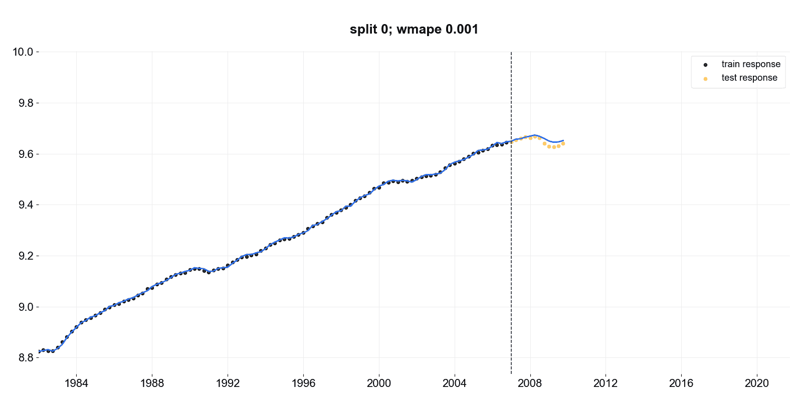

使用不同回测样本的预测(图片由作者提供)

您可以使用`BackTester`和轨道网格搜索功能`.grid_search_orbit()`来调整超参数。我对默认设置的模型很满意，我不想让这篇文章太冗长，所以我没有包括这一部分。这里可以找到一个[的例子。](https://orbit-ml.readthedocs.io/en/latest/tutorials/backtest.html)

## 5.走向未知——预测未来

最后，我用自己有限的知识和乐观的经济前景为这些特征创建了一个未来输入数据框架。我假设 CPI 会略有上升，因为我们一直面临着高通胀，失业率会相当平稳，因为 COVID 后，人们应该回到工作岗位，利率将在未来 4 年内增长更高。

使用相同的 DLT 函数，但拟合全部历史数据，并使用我编造的 forecast_input_df 进行预测，对未来 4 年美国实际 GDP 的预测看起来很有希望。

实例化、拟合和预测 DLT 模型(作者要点)

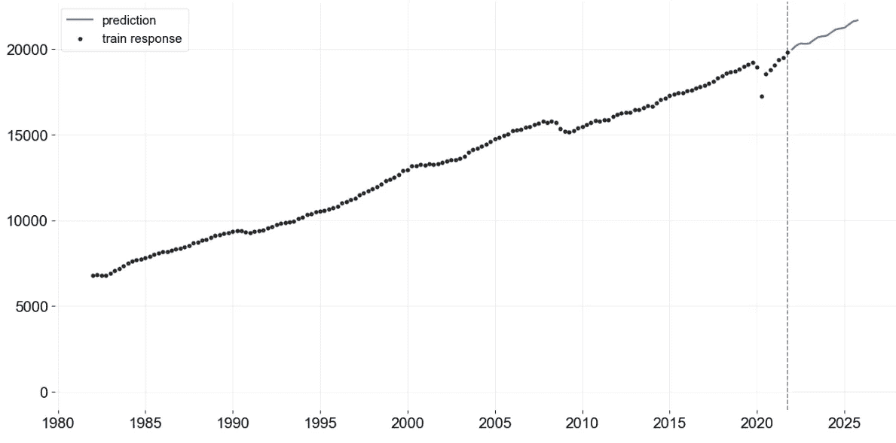

预测(由作者绘制)

# 谢谢你，并关注我更多！

感谢您阅读到目前为止，并了解轨道。我计划为 Orbit 编写更多教程，深入演示其他用例及功能。敬请关注，关注我，并订阅电子邮件以获取更多关于数据科学和其他有趣主题的故事！

# 数据源

*   **实际 GDP** :美国经济分析局，实际国内生产总值【GDPC1】，检索自圣路易斯美联储银行弗雷德；https://fred.stlouisfed.org/series/GDPC1,2022 年 4 月 26 日。
*   **CPI** :美国劳工统计局，所有城市消费者的消费价格指数:美国城市平均值中的所有项目【CPIAUCSL】，检索自圣路易斯美联储银行 FRED[https://fred.stlouisfed.org/series/CPIAUCSL,](https://fred.stlouisfed.org/series/CPIAUCSL,)2022 年 4 月 26 日。
*   **3 个月到期的国债市场收益率**:美联储系统(美国)理事会，3 个月固定到期的美国国债市场收益率【DGS3MO】，从圣路易斯美联储银行 FRED 处检索；https://fred.stlouisfed.org/series/DGS3MO, 2022 年 4 月 26 日
*   **10 年期国债的市场收益率:**美联储系统(美国)理事会，10 年期恒定到期美国国债的市场收益率[DGS10]，从圣路易斯美联储银行 FRED 处检索；https://fred.stlouisfed.org/series/DGS10,2022 年 4 月 26 日[。](https://fred.stlouisfed.org/series/DGS10,)
*   **失业率:**美国劳工统计局，失业率【UNRATE】，检索自圣路易斯美联储银行弗雷德；https://fred.stlouisfed.org/series/UNRATE,2022 年 4 月 26 日。

# 参考

[1][Orbit:Orbit 开发团队使用指数平滑法](https://arxiv.org/abs/2004.08492)进行概率预测
【2】Orbit[github](https://github.com/uber/orbit)
[介绍 Orbit，Orbit 开发团队在优步工程博客
【4】](https://eng.uber.com/orbit/)[上发布的用于时间序列推断和预测的开源包](https://arxiv.org/abs/2106.03322)Bayesian 时变系数模型及其在营销组合建模中的应用Orbit 开发团队发布的
【5】[Orbit 文档中心](https://orbit-ml.readthedocs.io/en/latest/index.html)