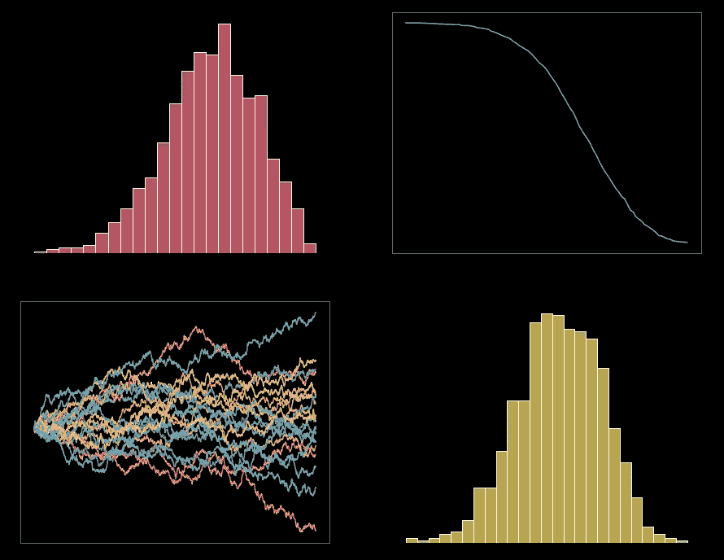
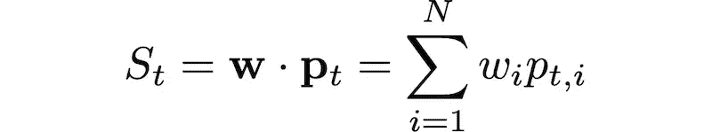
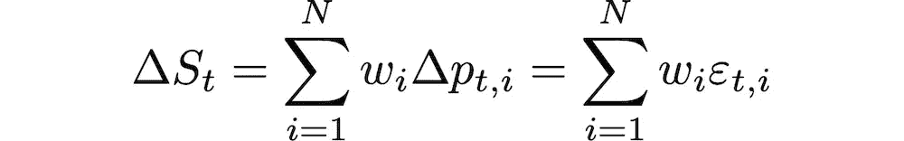
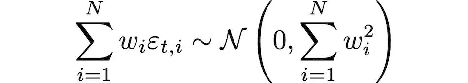
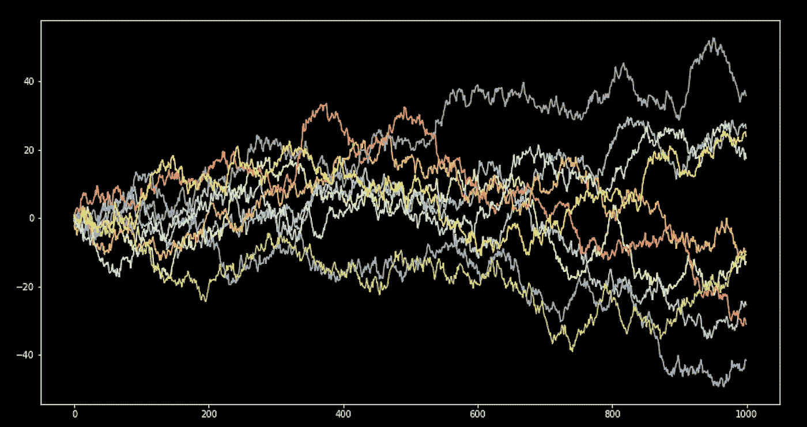
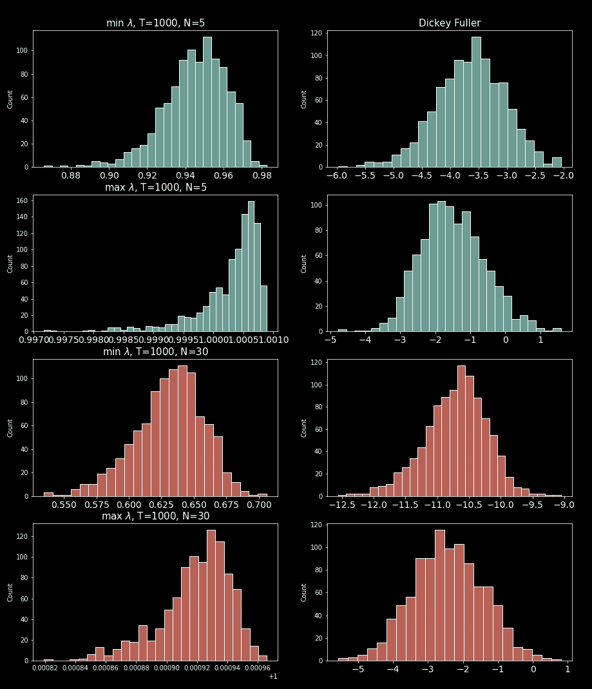
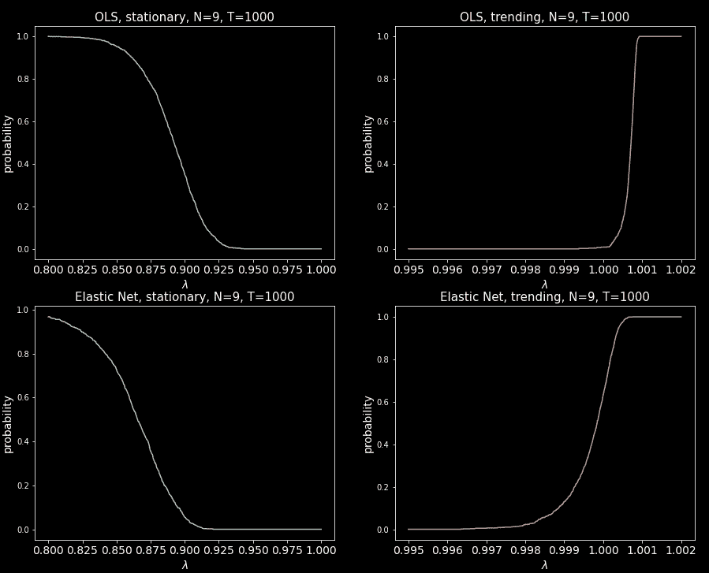

# 时间序列的可预测性——协整是统计上的侥幸吗？

> 原文：<https://towardsdatascience.com/time-series-predictability-is-cointegration-a-statistical-fluke-9aa6b9f9076e>

## Python 中蒙特卡罗模拟的盒条正则分解λ统计量

图片作者。

在这个故事中，我们将揭示一些关于时间序列整合的令人不安的事情，即模型过度拟合。通常，我们会将过度拟合与其他类型的模型联系在一起，但不会与整合联系在一起，毕竟，如果我们找到一个平稳的线性组合，这还不够吗？事实证明并非如此。

当我们增加用于寻找协整关系的时间序列数量时，在大多数情况下，我们看到得到的时间序列不断得到更低的 Dickey-Fuller 检验值，因此这样的时间序列越来越有可能是平稳的。

例如，如果我们使用几个布朗运动(AR(1)单位根过程),很容易得到大约-10 的 Dickey-Fuller 结果。我们无法拒绝这样一个时间序列是平稳的假设。但是 AR(1)单位根过程的非平凡线性组合也是 AR(1)单位根过程，其定义是非平稳的但不是趋势性的。

我们大多数人可能得出的逻辑是这样的，输入到模型中的序列越多，就意味着产生的时间序列是平稳的可能性越大；那么，如果我们用整个 S&P500 作为这样一个模型，会发生什么呢？我们会变得富有吗？答案大概是不会；除了试图交易如此大的投资组合的一些实际问题，我们可能会过度适应噪音。即使我们得到的投资组合在大多数平稳性测试中是平稳的，这个投资组合在样本外也很可能表现不佳。免责声明，这不是交易建议，只是举例说明一个观点。

如果你还在这里，而上述简陋的现实并没有让你对这样的模型失去所有的兴趣，那就让我们继续吧。

我们寻找协整向量所用的方法是典型分解，由 G. Box 和 G. Tiao(简称 BTCD)进行；但这里的核心论点可以代表任何一种为时间序列的线性组合寻找系数的方法，这种方法会产生一个平稳的时间序列。看看这个 [BTCD](/canonical-decomposition-a-forgotten-method-for-time-series-cointegration-and-beyond-4d1213396da1) 的故事，其中详细介绍了该方法以及实现它所需的所有代码。我们将使用这里概述的核心功能。

BTCD 的酷之处在于，我们还可以获得潜在的趋势关系，而不仅仅是静态关系。

## 目录

*   问题设置(正式讨论)。
*   BTCD 中λ的含义(均值回复参数)。
*   多重单位根 AR(1)过程。
*   BTCD 的蒙特卡罗模拟。
*   累积分布函数。
*   λ的概率。
*   把所有的放在一起
*   结束语。

## 问题设置

我们想找到一个权重向量 ***w*** 来形成一个线性组合 *N* 时间序列的 *S* ，即

使得 *S* 是静止的(或者在 BTCD 的情况下是趋向的)。BTCD 通过建立一个模型 ***q*** 来实现这一点，该模型用于 N 维时间序列 ***p*** 使用高达 *k* 的先前时间滞后到 *t:*

其中ε是 i.i.d。

Box 和 Tiao 定义了一个他们称之为可预测性的量λ，可预测性较高意味着 *S* 更可能是一个趋势时间序列，而可预测性较低的 a *S* 更可能是一个平稳时间序列。

其中 T 上标表示矩阵转置和

我们可以通过解决一个特征值问题找到λ的最小值和最大值，更多细节请查看概述 [BTCD](/canonical-decomposition-a-forgotten-method-for-time-series-cointegration-and-beyond-4d1213396da1) 的主要故事全文。

## λ在 BTCD 中的意义

λ量化了时间序列中均值回复的水平，它类似于奥恩斯坦-乌伦贝克过程方程中均值回复参数的倒数。

在这种情况下，较小的λ意味着更倾向于均值回复(更有可能是稳定的)，而较大的λ意味着均值回复较少(更有可能是趋势性的)。

λ的问题在于它是依赖于模型的，当我们改变 *N* (时间序列的数量)、样本大小( *T* )、模型中包含的最大滞后( *k* )时，实际数字会改变，并且还会根据我们用来建立模型的回归方法而改变。因此，λ仅适用于相同的模型、相同的回归、相同的设置；比较不同的模型是没有用的。

那我们怎么知道λ的什么值是可接受的呢？

这就是我们在接下来的部分要做的，我们将做一些蒙特卡罗模拟，并使用结果来做一个λ统计。

## 多重单位根 AR(1)过程

对于我们的蒙特卡罗模拟，我们将使用 N 个布朗运动(维纳过程)，因为我们知道我们不应该从这些过程的线性组合中找到除了噪声之外的任何东西。

多个单位根 AR(1)过程不能有稳定关系(协整)也不能有趋势关系，即考虑单位根过程:

其中，ε是 i.i.d .，平均值为零。这个过程是非平稳的，非趋势性的；此外，让我们假设ε的分布是标准正态分布，在这一点上，没有理由假设该分布不是标准正态分布。然后

以便

很明显， *S* 又是一个单位根 AR(1)过程，因为

即 *S* 的增量是独立的，它们的分布是正态分布。线性组合简单地重新调整了 *S* 的方差。

为了生成样本量为 *T* (观察次数)的 *N* 布朗运动:

例如:

图片作者。离散采样的多重布朗运动

## BTCD 的蒙特卡罗模拟

在本节中，我们将使用主要 [BTCD](/canonical-decomposition-a-forgotten-method-for-time-series-cointegration-and-beyond-4d1213396da1) 故事中所示的代码，该模块公开公开一个函数、一个包含结果的数据类和一个回归模型接口(协议):

为了跟踪本节中的结果，在尝试重现下面的示例之前，将主要 BTCD 故事中的代码作为 btcd.py 保存在运行该代码的文件夹中(如果保存在其他地方，则必须更改 import 语句)。

我们的蒙特卡罗模拟包括将“n_MC”试验的 BTCD 应用于不同的随机集合的 *N* 布朗运动，对于每个试验，我们存储最小λ和最大λ的结果(我们丢弃所有其他λ解，因为我们只对极端平稳和趋势解感兴趣)。我们还应用 Dickey-Fuller 检验来确定除λ之外的模型之间的一些可比数量。

我们将结果存储在“LambdaSimResult”数据类的实例中，然后将该数据模型分别存储在 min λ和 max λ的“BTCDMonteCarloResult”(我们主要的面向公众的结果对象)的实例中。

让我们进行模拟。注意，如果你输入一个大的“n_MC”、大的 *T* 和大的 *N* 可能需要一段时间。

图片作者。两种 BTCD 模型设置的蒙特卡罗模拟结果直方图。

查看 Dickey-Fuller 结果，趋势关系(max λ)的结果看起来一点也不令人印象深刻。然而，静态关系(最小λ)看起来很有希望，N = 5 时约为-3.5，N = 30 时约为-10.5，T=1000。Dickey-Fuller 的结果-3.5 已经是平稳性的 99%置信度，-10.5 是 *S* 是平稳的实际确定性。

但是等等，我们不应该能够建立一个稳定的线性组合，记住单位根过程的线性组合也是一个单位根过程，它是不稳定的。

此外，请注意λ的范围因型号而异。我们现在要做的是将这些结果用于λ，并获得 CDF(累积分布函数),这样我们就可以根据我们的模型将概率分配给λ的值。

简而言之，如果我们观察到布朗运动的λ结果不应该是稳定的/趋势的，那么当我们将 BTCD 应用于真实数据时，使用用于运行蒙特卡罗模拟的相同模型，我们应该观察到更小/更大的λ以认真对待我们的结果，否则，我们会过度拟合噪声。CDF 会告诉我们λ应该有多大/多小，这样我们就不会拒绝这个结果。

## 累积分布函数（Cumulative Distribution Function 的缩写）

CDF(累积分布函数)是这样的，如果我们为λ输入一个值，它将返回一个与之相关的概率，它是一个递增函数，因此根据 CDF，更大的λ意味着更大的概率。

Statsmodels 很好地实现了经验累积分布函数(ECDF)。它是一个带有 __call__ 方法的类，所以一旦类被实例化，它的行为就像一个函数。我们将使用 ECDF 作为蒙特卡罗数据的λ。

这就是我们蒙特卡洛模拟中试验次数“n_MC”发挥作用的地方，试验次数越多，越接近真实的 CDF。

实现这一点的代码非常简单，我们只需返回两个 ECDFs 的元组，一个用于最小λ模拟值，另一个用于最大λ模拟值。

## λ的概率

在实践中，给定一些模型设置，我们将需要计算得到的“S”是稳定的或趋势的概率。

为了做到这一点，我们将把蒙特卡罗模拟和上一节的 CDF 封装在一个类中，这样我们就可以很好地简单地存储结果并重用它们。

正如我们在上一节中讨论的，CDF 是一个递增函数，这有时会导致一些令人困惑的概率。对于一些统计测试，低 p 值实际上是您正在寻找的，但对于其他测试，大 p 值是您需要寻找的。

我们将对此进行简化，使其更加直观，为概率计算分配两种类型，“稳定”和“趋势”。

对于“平稳”概率，较低的λ值实际上会导致序列平稳的概率较高。

对于“趋势”概率，较高的λ值意味着更高的趋势概率。

在任何情况下，我们得到的概率要么是稳定的，要么是趋势的，我们不必记住低 p 值是好事还是坏事。

注意，为了计算“稳定”概率，我们使用最小λ模拟结果，而对于“趋势”概率，我们使用最大λ模拟结果。

因此，使用我们到目前为止编写的所有代码，并将其包装在“BTCDProbTable”类中:

这是低代码部分，在这里我们使用我们已经建立的工具。工作流程是这样的，用你需要的模型设置实例化一些 BTCDProbTable，调用“run_simulation”方法，在你等待的时候去喝杯咖啡(或茶)(注意“n_MC”的大值，它可能需要一段时间):

然后使用“get_prob”方法计算给定模型设置的概率，例如

图片作者。OLS 和弹性网络的概率与λ、平稳和趋势。

## 把所有的放在一起

为了完整起见，让我们把前面几节的所有代码放在一起，这样您就可以复制、粘贴、保存它，并结合 [BTCD](/canonical-decomposition-a-forgotten-method-for-time-series-cointegration-and-beyond-4d1213396da1) 算法使用它:

## 结束语

正如单位根检验(平稳性检验)所检验的那样，我们已经看到协整方法可以产生具有高度确定性的平稳时间序列。然而，这可能会误导我们认为我们已经找到了一个真正稳定的(或趋势)关系，而事实上我们只是过度拟合了纯噪声。

在可能的情况下，对你肯定找不到任何有意义的结果的数据进行一些蒙特卡洛模拟，并用它们来比较和对比从真实数据中获得的结果。

## 参考

[1] G. E. P. Box 和 G. C. Tiao，[，](http://...) (1977)，Biometrika 64，2，第 355-65 页

我希望这个故事对你有用。如果我错过了什么，请让我知道。如果你想知道更多这样的故事，请关注我的[媒体](https://medium.com/@diego-barba)。

 [## 每当迭戈·巴尔巴出版时，就收到一封电子邮件。

### 每当迭戈·巴尔巴出版时，就收到一封电子邮件。通过注册，您将创建一个中型帐户，如果您还没有…

medium.com](https://medium.com/subscribe/@diego-barba) 

喜欢这个故事吗？通过我的推荐链接成为媒体会员，可以无限制地访问我的故事和许多其他内容。

 [## 通过我的推荐链接加入 Medium-Diego Barba

### 作为一个媒体会员，你的会员费的一部分会给你阅读的作家，你可以完全接触到每一个故事…

medium.com](https://medium.com/@diego-barba/membership)