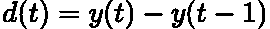
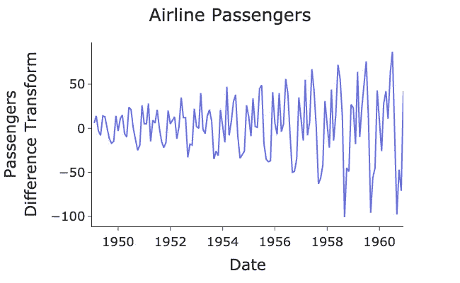
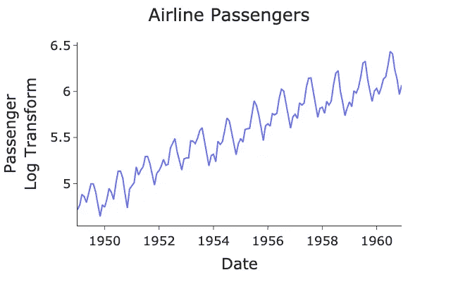
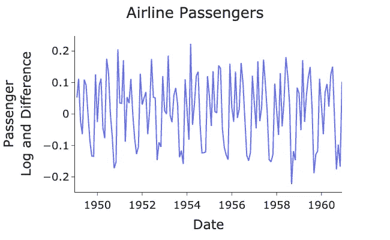

# 时间序列平稳性的简单解释

> 原文：<https://towardsdatascience.com/time-series-stationarity-simply-explained-125269968154>

## 时间序列建模中平稳性需求的简单而直观的解释。


[m.](https://unsplash.com/@m_____me?utm_source=medium&utm_medium=referral) 在 [Unsplash](https://unsplash.com?utm_source=medium&utm_medium=referral) 上拍照

# 介绍

当试图预测天气、股票市场或产品销售时，我们必须考虑一些时间因素。例如，当预测英国明天是否会下雪时，我们知道冬天的概率会比夏天高很多。

使用 [**时间序列**](https://en.wikipedia.org/wiki/Time_series) **可以最好地表示这种类型的时间相关数据。**这是每个数据点在时间上向前排序或索引的地方。预测时间序列中的下一个数据点非常有价值，称为 [**预测**](https://www.influxdata.com/time-series-forecasting-methods/) **。**

准确预测下一个数据点的一个要求是保证时间序列是 [**平稳**](https://en.wikipedia.org/wiki/Stationary_process) 。在本文中，我们将讨论:

*   什么是平稳时间序列
*   如何使时间序列平稳
*   如何检验一个时间序列确实是平稳的
*   为什么我们需要平稳的时间序列

> 如果你想了解更多关于时间序列和预测的知识，可以参考我在参考资料部分链接的书:预测原理和实践。

# 什么是平稳性？

一般来说，如果一个时间序列没有表现出任何长期趋势或明显的季节性，它就是平稳的。数学上我们有:

*   恒定的**T21 方差**穿越时间
*   **不变*表示*穿越时间**
*   时间序列的统计特性不会改变

例如，考虑作为时间函数的航班乘客数量，使用简单的 Python 脚本绘制如下:

> 数据[来自拥有 CC0 许可证的 Kaggle](https://www.kaggle.com/datasets/ashfakyeafi/air-passenger-data-for-time-series-analysis) 。

作者代码 GitHub 要点。


作者用 Python 生成的图。

这个时间序列是平稳的吗？号码

很明显，随着时间的推移，航空乘客的数量有增加的趋势。此外，差异和波动也随着时间的推移而增加。我们现在将研究产生平稳时间序列的方法。

# 使时间序列平稳

为了使时间序列稳定，我们可以对数据进行变换。

## 差分变换

最常见的变换是将 [**差分**](https://www.statistics.com/glossary/differencing-of-time-series/) 的时间序列。这是计算每个连续数据点之间的数值变化。从数学上来说，这可以写成:



作者在 LaTeX 中创建的方程。

其中 ***d(t)*** 是数据点***【y(t)***和***【y(t-1)***在时间**的差值。**

**我们可以通过使用[***diff()***](https://pandas.pydata.org/docs/reference/api/pandas.DataFrame.diff.html)pandas 方法来绘制差异数据，从而简单地将差异数据计算为我们的数据框的一列:**

**作者代码 GitHub 要点。**

****

**作者用 Python 生成的图。**

**数据现在是静止的吗？号码**

**平均值现在是常数，并在零附近振荡。然而，我们可以清楚地看到，随着时间的推移，方差仍在增加。**

## **对数变换**

**为了稳定方差，我们对原始数据应用自然对数变换:**

**作者代码 GitHub 要点。**

****

**作者用 Python 生成的图。**

**现在波动的规模是一致的，但仍然有一个趋势。因此，我们现在必须再次应用差分变换。**

## **对数和差分变换**

**应用对数变换和差分变换:**

**作者代码 GitHub 要点。**

****

**作者用 Python 生成的图。**

**数据现在是静止的吗？是啊！**

**正如我们所见，均值和方差现在是常数，没有长期趋势。**

# **平稳性测试**

**从视觉上看，数据现在是静止的。然而，有更多的定量技术来确定数据是否确实是平稳的。**

**一种这样的方法是**增强的 Dickey-Fuller (ADF)测试。**这是一种统计假设检验，其中零假设是序列是非平稳的(也称为 [**单位根检验**](https://en.wikipedia.org/wiki/Unit_root_test) )。**

**[statsmodels](https://www.statsmodels.org/dev/generated/statsmodels.tsa.stattools.adfuller.html) 包为执行 ADF 测试提供了一个简单易用的功能:**

**作者代码 GitHub 要点。**

**运行这个函数，我们得到以下输出:**

```
ADF Statistic: -2.717131
P-Value: 0.071121
Critical Values:
        1%: -3.48
        5%: -2.88
        10%: -2.58
```

**我们的 ADF P 值(7.1%)介于 5%和 10%之间，因此根据您设置的显著性水平，我们拒绝或未能拒绝零假设。**

**如果我们愿意的话，我们也许可以进行进一步的差分，使它更加稳定。**

> **如果您有兴趣深入了解 ADF 测试的数学原理，请参考我在参考资料部分提供的链接。**

**ADF 测试不是唯一可用于平稳性的测试，还有 [**科维亚特科夫斯基-菲利普斯-施密特-申(KPSS)测试**](https://en.wikipedia.org/wiki/KPSS_test) 。然而，在这个测试中，零假设是趋势是稳定的。**

> **要了解有关假设检验过程的更多信息，请参阅参考资料部分。**

# **为什么我们需要平稳性？**

**问题仍然在于为什么我们需要确保我们的时间序列是平稳的？**

**嗯，有几个原因:**

*   **大多数预测模型都假设数据是平稳的**
*   **平稳性有助于使每个数据点独立**
*   **总的来说，使数据更容易分析**

# **结论**

**在本文中，我们描述了什么是平稳时间序列，以及如何应用各种变换使数据平稳。对数变换有助于稳定方差，差分变换有助于稳定均值。然后，我们可以使用 ADF 测试来测试平稳性。平稳性的主要重要性在于，大多数预测模型都假设数据具有这种性质。在我的下一篇文章中，我们将讨论其中一个预测模型。**

**本文中生成数据、图表和 ADF 测试的完整代码可在此处查看:**

**<https://github.com/egorhowell/Medium-Articles/blob/main/Time%20Series/Time%20Series%20Tools/stationary.py>  

# 参考资料和进一步阅读

*   *预测:原理与实践:*[https://otexts.com/fpp2/](https://otexts.com/fpp2/)
*   *ADF 测试:*[https://www . machine learning plus . com/time-series/augmented-dickey-fuller-Test/](https://www.machinelearningplus.com/time-series/augmented-dickey-fuller-test/)
*   *假设检验*:[https://towards data science . com/z-test-simple-explained-80b 346 e0e 239](/z-test-simply-explained-80b346e0e239)

# 和我联系！

*   要在媒体上阅读无限的故事，请务必在此注册！ 💜
*   </subscribe/@egorhowell>😀
*   [*领英*](https://www.linkedin.com/in/egor-howell-092a721b3/) 👔
*   [*碎碎念*](https://twitter.com/EgorHowell) 🖊
*   [*github*](https://github.com/egorhowell)*🖥*
*   *<https://www.kaggle.com/egorphysics>**🏅***

> ***(所有表情符号都是由 [OpenMoji](https://openmoji.org/) 设计的——开源的表情符号和图标项目。执照: [CC BY-SA 4.0](https://creativecommons.org/licenses/by-sa/4.0/#)*****