# Google Data Studio 中的时间序列可视化

> 原文：<https://towardsdatascience.com/time-series-visualizations-in-google-data-studio-e8fff21e86d3>

## 包括带有累计和缺失数据的可视化。

珍妮·罗亚尔在 [Unsplash](https://unsplash.com/s/photos/time?utm_source=unsplash&utm_medium=referral&utm_content=creditCopyText) 上的照片

当人们需要使用文字处理器或电子表格，但不想为微软 word 或 Excel 付费时，他们通常会转向谷歌文档和谷歌表单。同样，如果你需要制作数据可视化的仪表板，但不想注册 Power BI 或 Tableau，你可以使用已经拥有的谷歌账户使用[谷歌数据工作室](https://datastudio.google.com/)。

在这篇文章中，我将使用 Google Data Studio 创建一些时间序列可视化，包括带有运行总数和缺失数据的可视化。

# 跟踪财产检查

## 数据

假设我在一家物业管理公司工作，我的部门需要在 2022 年 1 月至 2 月 15 日的第一个工作日检查 134 处物业。该公司已经雇佣了四个团队在全市范围内开展这项工作。

在电子表格中，每个属性占一行；每一行都包括地址、平方英尺以及其他财产信息，一旦检查完成，还有空的单元格需要填写。这些空白单元格将包含检查日期、进行检查的团队名称，以及关于评估的单元格。

## 目标

假设此时此刻，我们正在进行项目的一部分，我们的目标是跟踪项目整体和团队的进展。假设今天是 1 月 31 日，从 1 月 3 日到今天，检查记录在电子表格中。

这是顶部，两个与此目标相关的列按检查日期排序。(所有值都是随机生成的。)

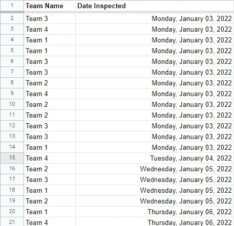

作者图片

## 启动仪表板

理想情况下，这个电子表格应该放在 Google Drive 上的 Google Sheets 中，因为 Google 产品通常与其他 Google 产品配合得最好。但是，您可以上传文件。

前往 datastudio.google.com 的[，打开空白报告开始。系统将提示您添加数据源。然后，您可以导航到 Google Sheets 文件。](https://datastudio.google.com/)

# 可视化 1:跟踪整体项目进度

工具栏上有一个**按钮可以*添加一个图表*** 。点击它，你会看到各种图表选项。我选择第一个时间序列图表。

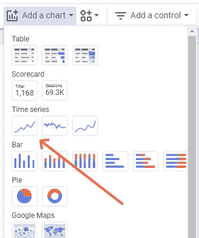

作者图片

图表是自动创建的。

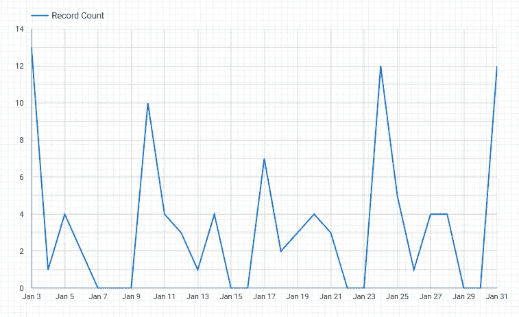

每当您添加图表并选中它时，右侧会打开一个属性面板，其中有两个选项卡:*数据*和*样式*。在这种情况下，默认指标是*记录计数*，它累加了每天的检查总数。

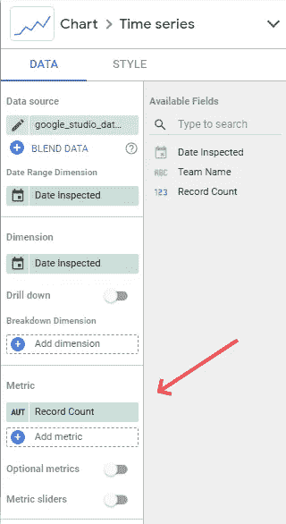

作者图片

但是我不想要一个日线图的起伏。我想要一张记录项目迄今进展的图表。

我点击【T2 指标】、下的*记录计数*，它会打开一个新窗口，我可以在这里定制东西。我更改了*的运行计算*，在那里它有*无*，并将其更改为*运行总和*，我还将指标重命名为“运行总和”。现在我得到了这张图表:

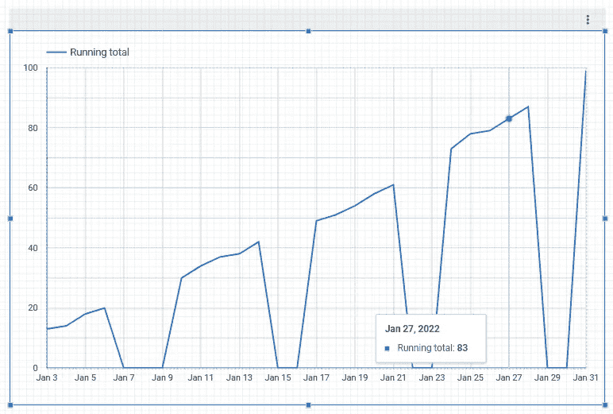

作者图片

这个图表看起来更像我想要的，但是因为团队周末不工作，所以在没有完成任何事情的日子里，这条线下降到零。这看起来很奇怪。

我可以在面板的*样式*标签中修复这个问题。在*通用*下，默认*线归零*被选择为*缺失数据*。

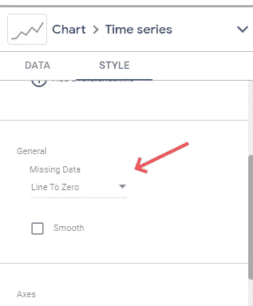

作者图片

这可以更改为*线性插补*。我做了改变，瞧:

作者图片

我差不多到了我想去的地方，但是记住，我用这个图表来跟踪项目的整体进展。同样，该项目将于 2 月 15 日结束，届时团队必须完成 134 项检查。

我还需要做两件事:

1.  在*数据*选项卡中，我将默认日期范围从*自动*更改为*自定义*。打开一个日历，我选择现有的开始日期和结束日期为 2 月 15 日。
2.  在*样式*标签中，有一个叫做*参考线*的部分。我选择*加一条参考线*，赋一个常数值 134，标签改为“Goal-134”。

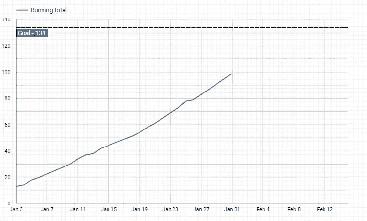

作者图片

这些团队似乎正朝着我们的目标前进。

# 可视化 2:跟踪每日团队活动

之前的可视化关注的是整个项目的进展，但是现在我想看看团队有多忙。

我在 Google 工作表的另一个选项卡中创建了一个数据透视表，其中包含参数*行:检查日期*、*列:团队名称*和*值:检查日期计数*。这给了我一张这样的表格:

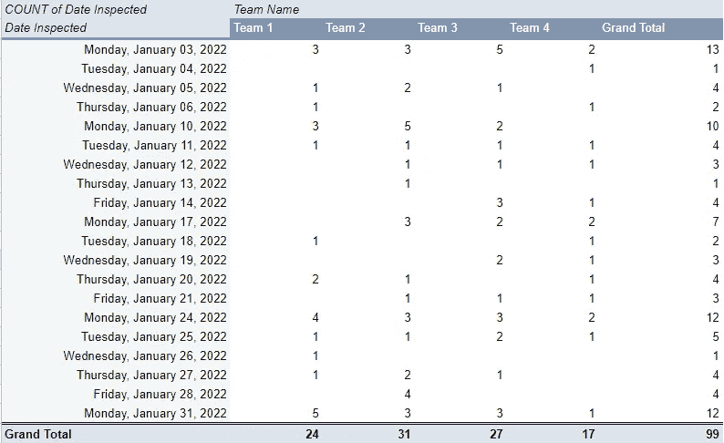

作者图片

Data Studio 将工作表文件中的每个选项卡或工作表视为自己的数据源。为了在 Data Studio 中使用这个新表，我必须使用工具栏中的 ***添加数据*** 按钮来添加它。

Data Studio 可以很容易地识别标题行，但是因为数据透视表在实际数据之上有两个标题行，所以可能会有点混乱。以下是解决任何问题的几种方法:

*   添加数据时，您可以找到一个选项，在该选项中您可以手动选择要使用的单元格区域。(对于我在这篇文章中创建的可视化效果，我不会选择总计行。)
*   您可以在另一个选项卡中引用所需的单元格，并在添加数据时选择该选项卡。

对于这个可视化，我使用四个指标，每个团队一个:

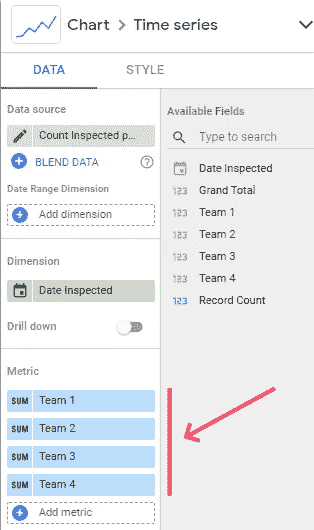

作者图片

我得到了下面的图表:

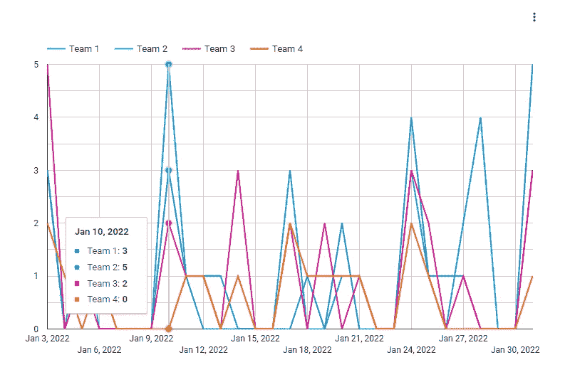

作者图片

在这个截图中，我将鼠标悬停在 1 月 10 日，图表弹出了当天的团队细分。

# 可视化 3:跟踪每个团队的进展

我知道有些时候团队可能会很忙，但其他时候不会那么忙。总的来说，这四支车队相比之下表现如何？

我复制了之前的可视化效果，并将其粘贴到仪表板上的另一个位置。然后，在*数据*选项卡中，我可以通过单击显示*总和*的位置来编辑每个指标。注意它是如何变成铅笔符号的。

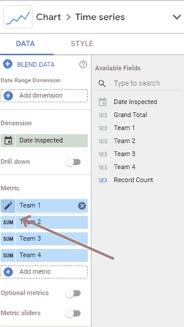

作者图片

打开那个窗口，我现在转到*运行计算*下拉菜单并选择*运行总和*:

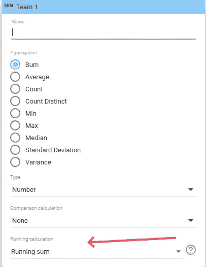

作者图片

正如我在上面的第一个可视化中所做的，我在*样式*选项卡中选择*线性插值*来解决周末数据的缺乏。我对所有四个团队重复这个过程，我得到这个图表来直观地了解所有团队在一段时间内的表现:

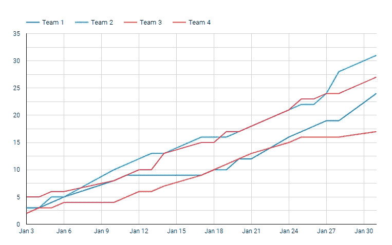

作者图片

在这篇文章中，我主要关注时序图，但是自然地，我也可以制作条形图、饼图、地图、仪表和其他类型的可视化。