# 修补美国农业部的食品数据库

> 原文：<https://towardsdatascience.com/tinkering-with-the-usda-food-database-5db92f7f044f>

## 为机器学习算法和进一步的统计分析准备美国农业部食品数据中心数据库。

在 [Unsplash](https://unsplash.com?utm_source=medium&utm_medium=referral) 上由 [Bruno Scramgnon](https://unsplash.com/@brunoschagas?utm_source=medium&utm_medium=referral) 拍摄的照片

我们大多数人都熟悉食品上的营养标签。即使我们没有真正读它们，我们也知道它们在那里。情况并不总是如此。直到 20 世纪 70 年代初，大多数食品中都没有营养标签。直到 20 世纪 90 年代初，它们才成为强制性的。今天，一些食物甚至在营养标签上标明了必需氨基酸的含量。现在有一种明显的趋势，那就是对我们放进嘴里的食物的成分和化学成分有更多的了解。

如果你想知道，这个故事不是关于营养建议的。我不会告诉你什么该吃，什么不该吃。如果你正在寻找这样的建议，这个故事不适合你，抱歉。

营养标签在一定程度上是有帮助的，但是如果我们想了解更多呢？作为数据科学家，如果我们想更深入地挖掘营养数据会怎样？嗯，我们首先需要数据。 [**美国农业部食品数据中心**](https://fdc.nal.usda.gov) 数据库是一个很好的选择。

数据科学家和开发人员为制造分析工具以使消费者更容易获得营养信息所做的一切努力都会产生重大影响。

在这个故事中，我与你分享我在不得不修补这个数据库的几天中构建的工具。我希望这些工具可以帮助你分析食物数据库，如果运气好的话，还可以在营养领域创建你自己的模型和工具。故事的主要范围是**将**数据**构造成简单的**平面数据帧**，以用于使用**机器学习和优化算法的进一步分析。****

## 故事结构

*   数据库版本和文档
*   数据库许可
*   形成原始营养数据
*   营养细节数据
*   营养 *id* vs. *营养 _ 编号*
*   搜索营养名称
*   搜索食物名称
*   活力
*   大量要素
*   质量守恒
*   阿特沃特通用因子系统
*   最大无 NaN 数据框架
*   结构化数据创建
*   最后的话

**数据库版本和文档**

可通过以下链接查阅美国农业部食品数据中心数据库:

[https://fdc.nal.usda.gov](https://fdc.nal.usda.gov)

并可在此下载:

[https://fdc.nal.usda.gov/download-datasets.html](https://fdc.nal.usda.gov/download-datasets.html)

这个故事中使用的数据库是 2021 年 10 月**的 CSV 版本，所有数据类型的完整下载**。

在下载的目录(`FoodData_Central_csv_2021–10–28`)中，有一个文件:

`Download & API Field Descriptions October 2021.pdf`

…它描述了每个表以及表之间的关系。我们在下文中将该文件称为**文档**，并将下载的目录称为**数据库目录**。

**数据库许可**

该数据库是在**公共领域，**因此它是[没有版权](https://fdc.nal.usda.gov/api-guide.html)。然而，

> 如果开发者将 FoodData Central 列为数据来源，美国农业部将不胜感激。而且，如果可能的话，美国农业部希望看到使用这些数据的产品，或者被告知它们的用途
> 
> [美国农业部食品数据中心许可](https://fdc.nal.usda.gov/api-guide.html)

**格式化原始营养数据**

这个故事的主要目标是为数据挖掘和机器学习算法创建食物营养结构化数据。换句话说，我们希望生成以食物项目为索引的平面数据框架，以营养成分为特征(列)。

数据库目录中有一个名为`food_nutrient.csv`的文件。该文件包含对我们很重要的三列:

*   `fdc_id`:数据库中每种食品的唯一通用 id。
*   `nutrient_id`:营养素相关表中每种营养素的 id。
*   `amount`:每 100 克食物的营养素含量。营养素的单位在另一个表中，可以使用`nutrient_id`查阅。我们将在后面的故事中这样做。

让我们加载表:

在此定义您的目录路径。

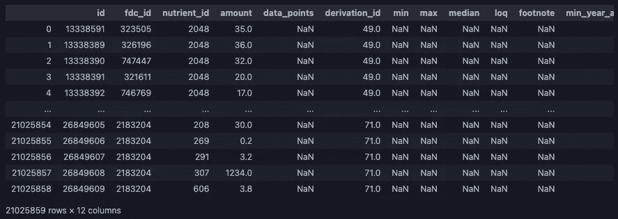

这个表有重复的 fdc _ ids，因为一种食物有很多营养成分。所以我们用`fdc_id`和`nutrient_id`对营养成分进行分组:

这是一个`pandas MultiIndex`，所以现在我们拆分`MultiIndex`，在多索引的第二层创建营养列:

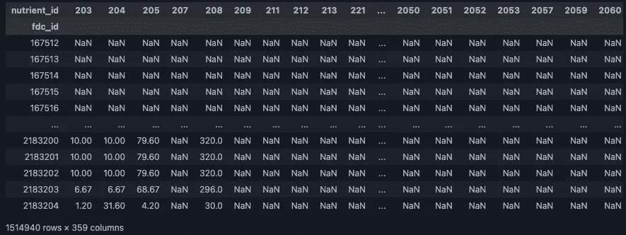

这个数据帧是我们想要的原始数据，大概是我们想要的格式。索引是每种食物的 id——`fdc_id`,每一列是一个`nutrient_id`。我们必须理解它，并开发工具来使用它。

如你所见，有很多`NaN`价值观。因此出现了第一个问题:

`NaN`值是指零营养测量值还是简单的缺失测量值？

让我们检查数据帧中是否有实际的零:

> 真实的

我们可以断定**零测量值被报告为 0** ，`**NaN**` **值为缺失测量值**。我可能已经猜到了，但这是很好的彻底。

**营养详细数据**

我们需要理解上一节的`df_nutrients`中的列 id。为此，我们将加载描述每种营养素的表格。该表在`nutrient.csv`下的数据库目录中:

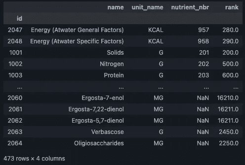

我们将这个数据帧命名为`df_nutrients_details`。该数据框包含营养物的`name`，用于测量的单位(`unit_name`)两个不同的标识符`id`和`nutrient_nbr`。

**营养 *id* vs. *营养 _ 编号***

根据文件，`food_nutrient.csv`表中的`nutrient_id`应为`df_nutrient_details`中的`id`。但是还有其他的可能性。`df_nutrient_details`中还有一个`nutrienr_nbr`，这个有点混乱。

`nutrient_id`有三种可能，可能是:

1.  来自`df_nutrients_details`的`id`索引。
2.  `nutrient_nbr`出自`df_nutrients_details`。
3.  `id`和`nutrient_nbr`都有。

我们需要在进一步行动前搞清楚这一点。

在得出结论之前，我们需要解决一些问题。

首先，营养素 _ ids 的范围是什么？

> (203, 2063)

`df_nutrients_details`中`id`的范围是什么？

> (1001, 2064)

`nutrient_nbr`的范围是什么？

> (200, 958)

看来`nutrient_id`既是`id`又是`nutrient_nbr`。让我们进一步调查一下。

`df_nutrients`列中的所有假设 id 都在实际 id 中吗？

> 真实的

`df_nutrients`栏中所有假设的营养素参考值都在实际营养素参考值中吗？

> 真实的

我们假设，其实`id`和`nutrient_nbr`可以互换使用。如果是这种情况，对于给定的食物，假定的 id 列和假定的 nutrient_nbr 列之间不能有重叠。换句话说，一个单一的营养测量要么通过它的`id`要么通过它的`nutrient_nbr`来说明，但不能同时通过两者来说明。

所以，问题来了:营养素 _nbrs 和 id 有重叠吗:

> 错误的

因此，我们可以假设`id`和`nutrient_nbr`是可以互换的。因此，我们将把`nutrient_nbr`列转换成 id，并在下文中将这些 id 称为`nutrient_id`:

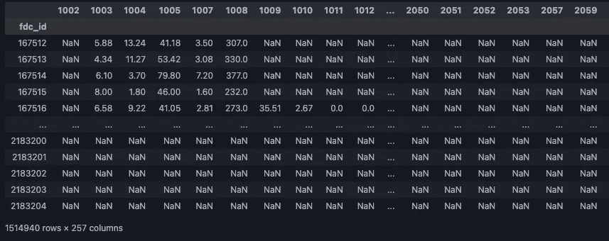

我们还会将`df_nutrients`列转换为整数类型，并删除任何没有营养测量的食物:

**搜索营养素名称**

现在是时候写一些真正的代码了。我们想开始理解营养数据框架。到目前为止，`nutrient_id`专栏并没有对我们说太多。我们需要能够通过名称搜索营养物质，然后获得它们的`nutrient_id`。

我们可以使用复杂的`pandas`链式方法来搜索和过滤`df_nutrients_details`中的数据，从而搜索营养名称。然而，最好编写一个类来以简单的方式处理它，并避免每次我们想要执行搜索时编写熊猫链。一开始，编写我们自己的类可能看起来比较长，但是相信我，它会简化以后的事情。

下面是`NutrientSearch`类:

让我们来看看它是做什么的，它是如何做到的，以及为什么。

该类用`df_nutrients_details`和`df_nutrients`初始化。这就是我们需要的全部信息。只有两个公共方法，`search_nutrient`，它允许我们按名称搜索养分:

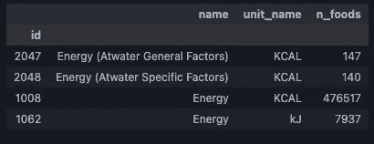

还有`get_all_nutrients`法，列出了所有营养成分:

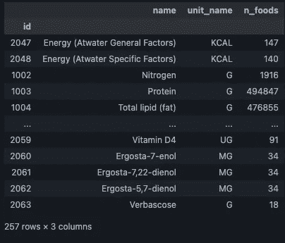

这两种方法都有两个可选的布尔夸尔:

*   `valid_nutrient`:如果`True`，我们检查营养素是否在`df_nutrients`栏中。毕竟，对于一种数据中不存在的营养物质，我们没有多大用处。
*   `n_foods`:如果`True`，则在返回的数据帧中添加一列，列出每种营养没有`NaN`测量的食物数量。

返回的数据帧由`id`索引，这是上一节描述的`nutrient_id`。它有一个营养物栏`name`和描述测量单位的`unit_name`。记住，所有的测量都是以每 100 克食物为单位的。最后，前面讨论过的可选`n_foods`列。

类中的其他方法只是帮助处理实际的搜索、验证和计算`n_foods`。

**搜索食物名称**

我们需要执行的下一个搜索是关于食物名称的。到目前为止，我们知道了`df_nutrients`的每一行的 fdc_id，但是这并不是很有用，除非我们给每个 fdc_id 分配一个食品名称。

也就是说，我们导入包含每种食物描述的`food.csv`表:

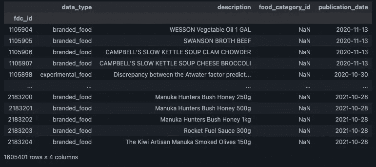

我们必须注意此后的食品描述或食品名称，因为有重复的:

> 真实的

让我们找出每个`data_type`的计数:

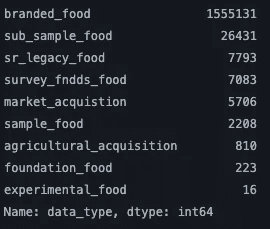

大部分食物来自`branded_food`。因此，我们将导入`branded_food.csv`表以了解更多信息:

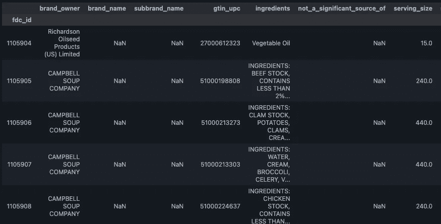

现在我们需要编写另一个类来搜索食物名称。同样，我们会经常搜索食物名称，所以最好编写一次工具代码，简化我们的生活。

下面是`FoodNameSearch`类:

让我们来看看它是做什么的，它是如何做到的，以及为什么。

首先用`df_foods`、`df_branded_foods`和`df_nutrients`初始化该类。它有三个公共方法。`search_by_name`，它允许我们输入一个字符串(或正则表达式)并返回一个`pandas Series`:

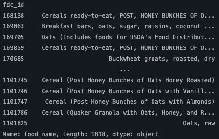

`search_single_fdc_id`将 fdc_id 映射到 food_name，它返回一个字符串:

> 愚蠢的山羊和切达山羊奶酪通心粉和山羊奶酪，比萨饼和冰淇淋形状的意大利面，愚蠢的山羊和切达奶酪|纳什芬奇公司

最后，`search_fdc_ids`接受 fdc_ids 的 iterable 并返回一个`pandas Series`:

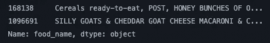

除了位置参数之外，所有方法都有一个可选的布尔参数:`valid_nutrients`。此标志控制是否仅包括无`NaN`营养测量的 fdc _ ids。毕竟，没有营养测量的食物对我们来说没有更多的用处。

其他方法，私有方法，是助手。他们验证 fdc _ ids 并将`brand_owner`数据添加到`branded_food`名称中。对于品牌食品，在食品名称和品牌所有者之间插入一个“|”。这样做是为了帮助消除歧义，但仍然不能保证产生不重复的食品名称。

**能量**

事不宜迟，让我们开始数据清理的第一步。在本节中，我们将了解能量测量的意义。目标是通过由`fdc_id`索引的`Series`产生食物的单一能量测量。

我们将使用我们闪亮的新`NutrientSearch`类来寻找能量营养素:

数据库中有四个能量测量值。普通能量*千卡，这是大多数食物使用的热量。另一个*能量*以 kJ(千焦)为单位。最后，两份[阿特沃特](https://en.wikipedia.org/wiki/Atwater_system)能量，很少的食物。*

也就是说，让我们创建一个只有能量测量值的数据框架:

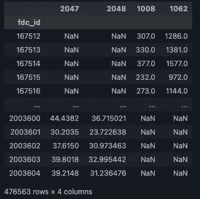

并将千焦能量转化为千卡能量:

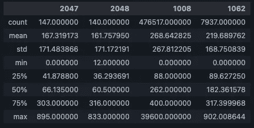

多少千焦能量测量值与千卡测量值重叠？

> 7934

因此，几乎所有以 kJ 为单位的测量都是多余的。

现在，我们希望放弃过高的能量测量值。根据[阿特沃特通用因子系统](https://en.wikipedia.org/wiki/Atwater_system)，每克能量最大的营养素是脂肪，9 千卡/克，这些能量是针对 100 克食物测得的；因此，任何比 900 千卡大得多的测量值都可能是错误的，应该丢弃:

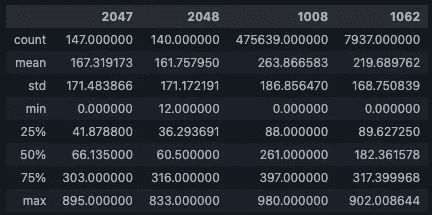

我们将选择使用`nutrient_id` 1008 的能量测量作为能量的基础:

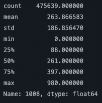

**宏量营养素**

提供能量的三种最著名的常量营养素是:

*   碳水化合物
*   脂肪
*   蛋白质

酒精在技术上被认为是提供能量的宏量营养素，但目前，我们将忽略它。

在本节中，我们希望为这三种宏量营养素生成三个`Series`地面实况。

我们先搜索一下脂肪:

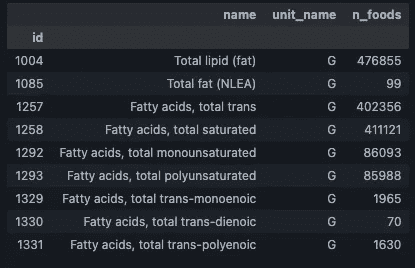

显然，`nutrient_id` 1004 正是我们想要的，因为它存在于大多数食物中:

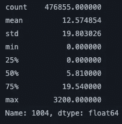

那么，蛋白质呢:

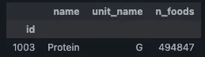

这里没有太多选择:

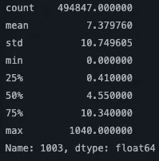

最后，让我们搜索碳水化合物:

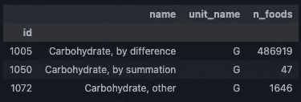

大多数食物中都含有 1005，所以我们将使用它:

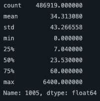

**质量守恒**

为了进一步清理数据，我们希望找出大于 100 克的质量测量值。记住，所有的测量都是以每 100 克食物为单位的。因此任何测量的报告质量都不能超过这个值。

[食物质量](http://toolbox.foodcomp.info/ToolBox_Carbohydrate.asp)由上一节讨论的三种常量营养素的质量加上下列物质的质量组成:

*   酒精
*   纤维
*   水
*   灰

寻找这些营养物质:

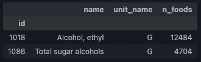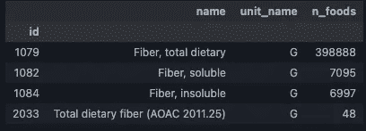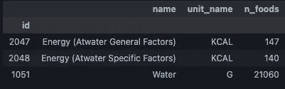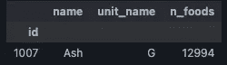

我们生产他们的`Series`:

请注意，所有这些系列的测量单位都是克。

我们将假设这些序列的‘T2’值实际上为零。这样做没有害处，因为如果未测量的值大于零，这将增加质量，而不是减少质量。

我们将连接上一节的碳水化合物、脂肪和蛋白质系列，然后将酒精、纤维、水和酒精的质量设置为零，除非它们不是`NaN`:

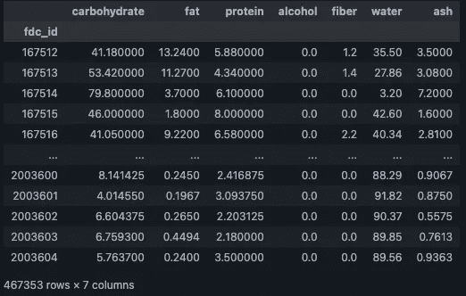

让我们对每行的质量求和:

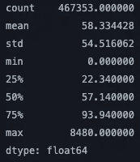

显然，有些质量差得很远。

让我们删除所有质量大于 100 的 fdc _ ids:

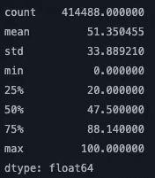

下面是总质量的分布情况:

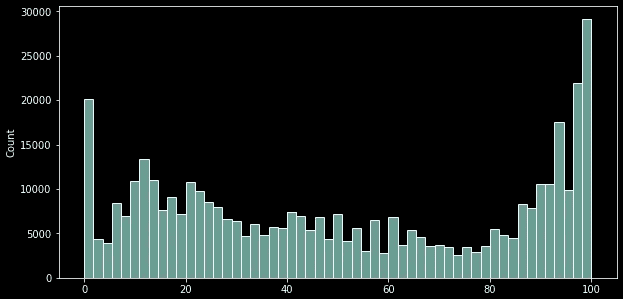

总质量直方图[图片由作者提供]。

还有很多质量不是 100。这可能有许多原因:

*   也许有一些质量营养素被我们忽略了，或者我们使用了不同的[质量术语](http://toolbox.foodcomp.info/ToolBox_Carbohydrate.asp)。
*   也许一些质量测量是错误的。

我们将假设前者并继续下去。如果我们假设是后者，我们最终会放弃很多食物。

为了清理数据，我们需要从先前生成的数据中删除任何没有通过质量守恒过滤器的 fdc _ ids:

**阿特沃特通用因子系统**

食物中能量的计算方法有很多。最简单的，也许是最常用的，是[阿特沃特通用因子系统](https://en.wikipedia.org/wiki/Atwater_system)。该系统为每克碳水化合物、脂肪、蛋白质和酒精分配固定的能量值，并认为总能量是这些能量的总和。这些因素如下:

*   碳水化合物:4 千卡/克
*   脂肪:9 千卡/克
*   蛋白质:4 千卡/克
*   酒精:7 千卡/克(大约。)

其他系统包括作为能量项的纤维；其他人使用特定的因素。然而，为了简单起见，我们坚持使用通用因子系统。

考虑到这些营养成分，让我们创建一个包括它们的数据框架，以及报告的能量:

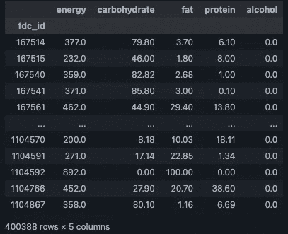

让我们使用阿特沃特通用因子系统来估算能量:

这些是能量、报告能量和估计能量的描述性统计数据:

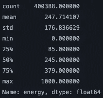

能源的描述性统计。

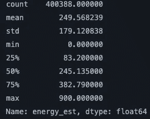

使用阿特沃特通用因子进行能量估算的描述性统计。

这是两种能量的直方图和另一种能量差的直方图:

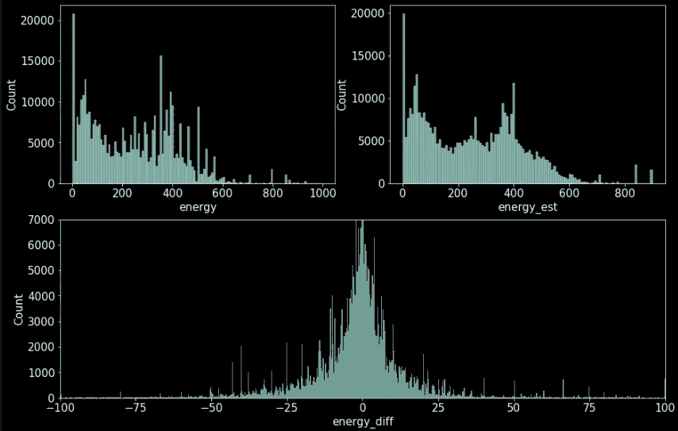

报告的能量直方图，使用阿特沃特通用因子系统估算的能量直方图，以及它们之间的差异直方图[图片由作者提供]。

我们可以看到，大多数报道的能量倾向于与阿特沃特估计的能量一致，但不完全一致。

为了使进一步的宏量营养素计算更容易，我们将放弃报告的能量，而使用阿特沃特能量。

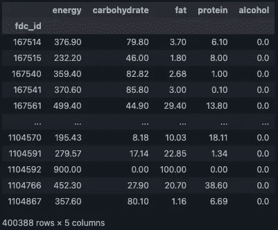

我们制作了一个名为`df_emacros`的数据框架，包含能量和常量营养素(能量常量营养素)的基本事实。

所有食物都必须有能量和常量营养素的测量值。因此，我们将删除所有先前生成的数据中不在`df_emacros`中的所有 fdc _ ids:

最后，我们从`df_nutrients`中删除能量、碳水化合物、脂肪、蛋白质和酒精的所有营养标识。因为我们现在在`df_emacros`中已经有了这些测量值

在这一节和上一节中，我们已经对数据做了许多更改，所以现在应该重新实例化我们的搜索类，以包含最新的数据:

**最大无 NaN 数据帧**

当试图从“df_nutrients”中去除 NaN 值时，我们将面临一个问题。问题是，我们可以很容易地在数据帧的所有行和列中找到由任何给定的营养成分创建的 nan。

让我们稍微偏离一下数据，使用简单的数据框架来关注这个问题。考虑这个数据框架:

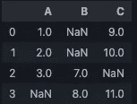

如果我们对列或行使用`dropna`方法，我们将得到一个空的数据帧。相反，我们想要一种算法，以这样一种方式删除列，即保持列最大化非`NaN`行的数量。

在这个例子中，如果我们删除`B`列，我们将得到一个 2x2 的数据帧。

我们提出了一种贪婪算法来实现这一点:

函数`get_maximal_no_nan_df`实现算法。其他函数只是助手。`get_maximal_no_nan_df`服用

*   作为位置参数的数据帧。
*   `min_data_size`夸尔格。它控制我们想要保留的最小行数。如果我们试图保留大多数行，该算法将丢弃许多列。相反，如果我们将其设置为较低的值，它将保留许多列。该值可以是大于或等于 1 的整数，也可以是小于 1 的浮点数。在前一种情况下，它被认为是行的字面数量；在后者中，它被视为总行数的一部分。

事不宜迟，我们来测试一下算法:

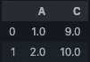

它像预期的那样工作。

**结构化数据创建**

最后，我们拥有了创建适合进一步分析的结构化数据的所有元素。

让我们获取所有的营养，只保留那些存在于一百多种食物中的营养:

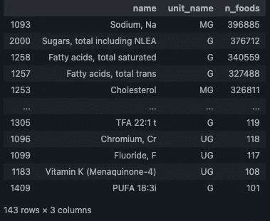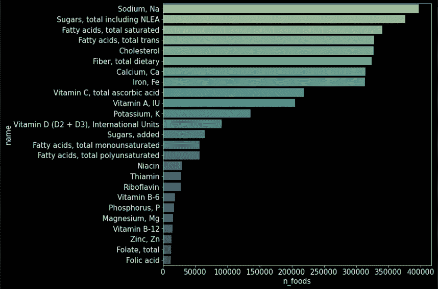

出现次数最多的营养素、大量营养素和能量不包括在内[图片由作者提供]。

我们需要再编写一个类来创建我们想要的数据帧，也就是说，具有选定营养成分的数据帧。我保证这是我们编写的最后一个类。这个类将使用上一节中的最大 no `NaN`算法:

这个类用`df_emacros`、`NutrientSearch`类的一个实例和`FoodNameSearch`类的一个实例初始化。所以它几乎使用了我们迄今为止开发的所有东西。

它只有一个公共方法，`create_data`。这个方法只有一个位置参数，一个可迭代的营养标识(任一列表，熊猫索引元组)。有许多夸尔格:

*   `no_nans`:如果设置为`True`，则使用最大编号`NaN`算法来保留尽可能多的列。否则，它会保留所有列以及所有的`NaN`值。
*   `with_nutrient_names`:是否将营养素 id 更改为实际营养素名称的列名。
*   `include_food_name`:是否包含食品名称列。在这两种情况下，生成的数据帧都由 fdc_id 进行索引。
*   `shallow_valid_mass`:如果`True`，将验证以克为单位测量的位置参数 iterable 中没有任何营养素大于 100 克。如果一些食物含有这种无效的营养成分，它将从结果数据框中被丢弃。
*   `min_data_size`:与上一节`get_maximal_no_nan_df`功能相同。

所有的私有方法都是帮助者。

最后，我们可以创建我们想要的格式的数据。让我们实例化该类并使用来自`df_all_nutrient`"的所有索引(nutrient _ ids)；即大多数营养物质，至少是一百多种食物中的营养物质:

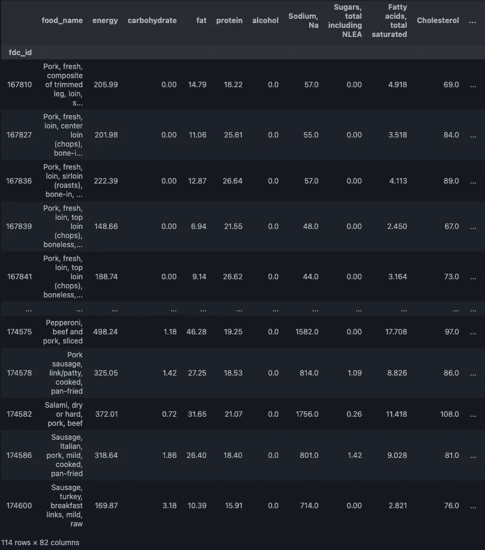

这个数据帧没有`Na`，我们设法保留了 114 行 84 列。减少营养元素的数量可能会创建具有更多行(食物项目)的数据帧。

**最后的话**

我们停止了对实际食物营养成分的进一步分析。那是故意的。首先，这个故事的想法不是告诉你什么该吃，什么不该吃。此外，这个故事太长了。

我希望这里开发的工具可以帮助您在第一次清理和结构化数据时节省大量时间。从这里开始的路线图是生成含有选定营养成分的数据帧，以进一步分析食物成分。食物集群、食谱的食物元素推荐器和每日营养摄入优化器只是我头脑中的一些想法

***注:*** *故事通篇所有数据帧和系列图像均为作者原创图像。*

我希望这个故事对你有用。 [*订阅*](https://medium.com/subscribe/@diego-barba) *到我的邮件列表如果你想知道更多这样的故事。*

*喜欢这个故事吗？通过我下面的推荐链接成为一个媒体成员来支持我的写作。无限制地访问我的故事和许多其他内容。*

<https://medium.com/@diego-barba/membership> 