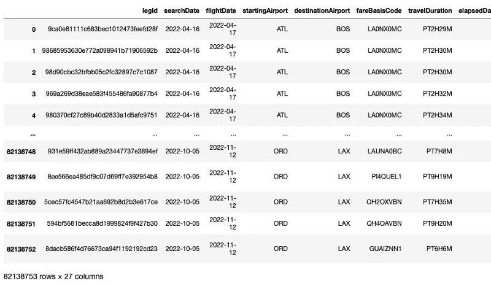
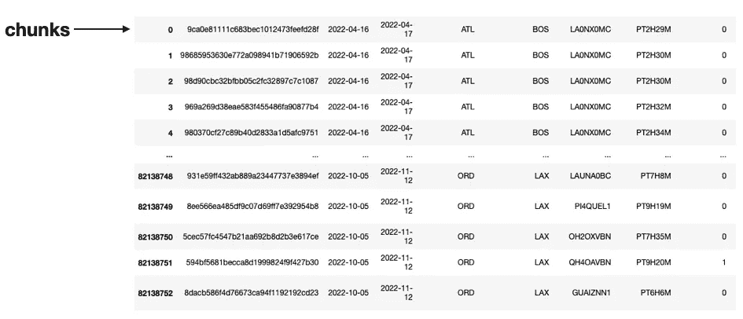
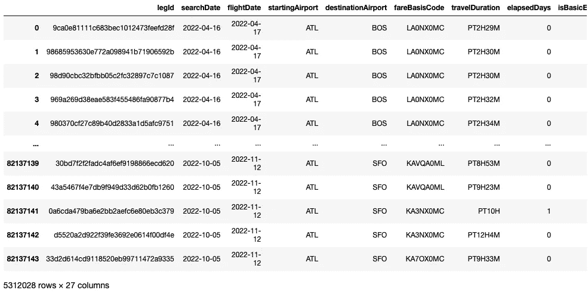
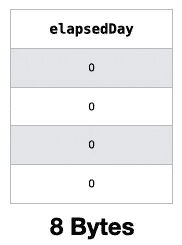
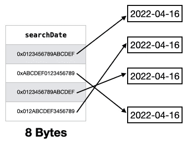
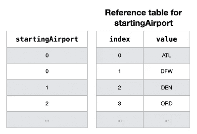
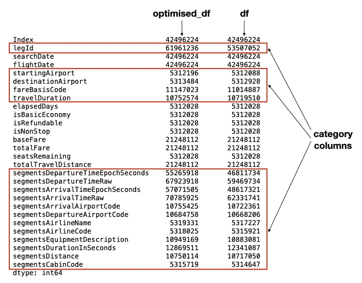

# 将大型 CSV 文件加载到 Pandas 数据帧的提示和技巧—第 2 部分

> 原文：<https://towardsdatascience.com/tips-and-tricks-for-loading-large-csv-files-into-pandas-dataframes-part-2-5fc02fc4e3ab>

## 了解如何有选择地将 CSV 文件的一部分加载到数据帧中，同时减少其内存占用


由 [Unsplash](https://unsplash.com?utm_source=medium&utm_medium=referral) 上的 [Shubham Dhage](https://unsplash.com/@theshubhamdhage?utm_source=medium&utm_medium=referral) 拍摄的照片

在我的上一篇文章——**将大型 csv 文件加载到 Pandas DataFrames 的提示和技巧——第 1 部分**([https://towards data science . com/Tips-and-Tricks-for-load-Large-CSV-Files-into-Pandas-data frames-Part-1-fac 6 e 351 Fe 79](/tips-and-tricks-for-loading-large-csv-files-into-pandas-dataframes-part-1-fac6e351fe79))中，我分享了一些如何将大型 CSV 文件中的特定列和行加载到 Pandas DataFrames 中的技巧。在本文中，我想继续叙述，但这一次我想把重点放在非常大的数据集上，这些数据集要么太大，无法一次性加载所有内容，要么加载时间太长，以至于无法实际处理这些数据集。一旦您成功加载了数据集，我还将向您展示如何优化数据帧的内存占用，从而使您更容易执行数据分析。

# 我们的数据集

对于本文中的例子，我使用的是来自 https://www.kaggle.com/datasets/dilwong/flightprices[的**航班价格**数据集。数据集中的每一行都是 2022 年 4 月 16 日至 2022 年 10 月 5 日之间 Expedia 上的可购买机票，往返于以下机场:ATL、DFW、DEN、ORD、LAX、CLT、MIA、JFK、EWR、SFO、DTW、BOS、PHL、LGA、IAD、OAK。](https://www.kaggle.com/datasets/dilwong/flightprices)

> 许可证类型:归属 4.0 国际版(CC BY 4.0)

选择这个数据集的主要原因是它非常大——31GB，包含 8200 多万行和 27 列。因此，对于那些机器内存有限的人来说，这应该是一个很好的现实挑战。

# 将整个 CSV 文件加载到数据帧中

我想尝试的第一件事是将 CSV 文件正常加载到数据帧中。我想对加载过程计时，看看加载这样一个文件需要多长时间:

```
import time
import pandas as pd

start = time.time()

df = pd.read_csv('itineraries.csv')

print(time.time() - start, 'seconds')
```

所以我等了又等。最终，将整个 CSV 文件加载到 Pandas 数据帧需要 1164 秒(接近 20 分钟)。

> 作为参考，我的机器是 32GB 内存的 Mac Studio。上面的代码片段甚至无法在我的 8GB 内存的老式 M1 Mac Mini 上运行(内核在试图加载 CSV 文件时死亡)。

让我们看看数据框:

```
display(df)
```



数据帧有 82，138，753 (> 8，200 万)行和 27 列。要查看数据帧使用了多少内存，使用`info()`函数并将`memory_usage`参数设置为`deep`:

```
display(df.info(memory_usage='deep'))
```

从下面的结果中，您可以看到 dataframe 的内存占用为 110.5 GB！

```
<class 'pandas.core.frame.DataFrame'>
RangeIndex: 82138753 entries, 0 to 82138752
Data columns (total 27 columns):
 #   Column                             Dtype  
---  ------                             -----  
 0   legId                              object 
 1   searchDate                         object 
 2   flightDate                         object 
 3   startingAirport                    object 
 4   destinationAirport                 object 
 5   fareBasisCode                      object 
 6   travelDuration                     object 
 7   elapsedDays                        int64  
 8   isBasicEconomy                     bool   
 9   isRefundable                       bool   
 10  isNonStop                          bool   
 11  baseFare                           float64
 12  totalFare                          float64
 13  seatsRemaining                     int64  
 14  totalTravelDistance                float64
 15  segmentsDepartureTimeEpochSeconds  object 
 16  segmentsDepartureTimeRaw           object 
 17  segmentsArrivalTimeEpochSeconds    object 
 18  segmentsArrivalTimeRaw             object 
 19  segmentsArrivalAirportCode         object 
 20  segmentsDepartureAirportCode       object 
 21  segmentsAirlineName                object 
 22  segmentsAirlineCode                object 
 23  segmentsEquipmentDescription       object 
 24  segmentsDurationInSeconds          object 
 25  segmentsDistance                   object 
 26  segmentsCabinCode                  object 
dtypes: bool(3), float64(3), int64(2), object(19)
**memory usage: 110.5 GB**
```

# 按块加载数据帧

显然，加载如此大的 CSV 文件是一件费时费力的事情(如果一开始就有可能的话)。因此，必须有更好的方法来优化流程。

问自己的第一个问题是:您真的需要 CSV 文件中的所有行和列吗？例如，您可能只需要起始机场为 ATL 的所有行，而忽略其余的行。但是，将整个 CSV 文件加载到一个数据帧中，只删除所有不需要的行，这种做法是不可取的，因为您的计算机可能甚至没有足够的内存来容纳整个数据帧。这就是*分块*有用的地方。

分块允许您以较小的块(因此得名)加载数据帧，而不是一次性加载所有数据帧。每个块都是您正在加载的整个数据帧的子集，每个块的大小可以根据您的需要进行定制。当加载每个块时，您有机会过滤数据帧中的行或列，并仅保留那些您需要进行进一步分析的行或列。

要对数据帧进行分块，使用`read_csv()`函数中的`chunksize`参数:

```
import time
import pandas as pd

start = time.time()
chunks = pd.read_csv('itineraries.csv', chunksize=100000)
print(time.time() - start, ' seconds')

# result is a TextFileReader object
chunks
```

在上面的代码中，当您运行它时，控件几乎立即返回，输出显示`chunks`变量的类型是`pandas.io.parsers.readers.TextFileReader`。

将`chunks`想象成一个指向 CSV 文件中第一行的文件指针，它准备开始读取前 100，000 行(如`chunksize`参数中所指定的)。



事实上，`chunks`是一个 *iterable* ，您可以遍历它将 CSV 文件中的所有行加载到一个 dataframe 中，一次 100，000 行。

为了查看如何遍历`chunks`变量，让我们定义一个名为`process_chunk()`的函数，其中我将只获取`startingAirport`列的值为“ **ATL** ”的所有行:

```
def process_chunk(df):
    df = df.query('startingAirport == "ATL"') 
    print(df.shape)
    return df
```

> 如果您愿意，也可以在此函数中过滤列。

以下代码片段显示了如何使用`chunks` iterable 加载整个 CSV 文件:

```
chunk_list = []                # used for storing dataframes
for chunk in chunks:           # each chunk is a dataframe    
    # perform data filtering 
    filtered_chunk = process_chunk(chunk)

    # Once the data filtering is done, append the filtered chunk to list
    chunk_list.append(filtered_chunk)
```

对于`chunks`变量的每次迭代，`chunk`迭代器将包含一个包含 100，000 行的数据帧。然后数据帧被传入`process_chunk()`，在那里进行过滤。当过滤后的数据帧返回时，它被附加到一个名为`chunk_list`的列表中。

要组合列表中的所有数据帧，使用`concat()`函数:

```
# concat all the dfs in the list into a single dataframe 
df_concat = pd.concat(chunk_list)
```

让我们打印出加载的最终数据帧:

```
display(df_concat)
```



您将看到最终的数据帧包含 5，312，028 行。

> 通过使用分块，您现在可以有选择地将 CSV 的一部分加载到数据帧中，而不是尝试从整个 CSV 文件中加载所有内容。

# 检查数据帧的内存占用

我们的数据帧现在有 500 万行，而不是原来的 8200 万行，这是一个更易于管理的大小。让我们看看它使用了多少内存:

```
df_concat.info()
```

注意输出的最后一行:

```
<class 'pandas.core.frame.DataFrame'>
Int64Index: 5312028 entries, 0 to 82137143
Data columns (total 27 columns):
 #   Column                             Dtype  
---  ------                             -----  
 0   legId                              object 
 1   searchDate                         object 
 2   flightDate                         object 
 3   startingAirport                    object 
 4   destinationAirport                 object 
 5   fareBasisCode                      object 
 6   travelDuration                     object 
 7   elapsedDays                        int64  
 8   isBasicEconomy                     bool   
 9   isRefundable                       bool   
 10  isNonStop                          bool   
 11  baseFare                           float64
 12  totalFare                          float64
 13  seatsRemaining                     int64  
 14  totalTravelDistance                float64
 15  segmentsDepartureTimeEpochSeconds  object 
 16  segmentsDepartureTimeRaw           object 
 17  segmentsArrivalTimeEpochSeconds    object 
 18  segmentsArrivalTimeRaw             object 
 19  segmentsArrivalAirportCode         object 
 20  segmentsDepartureAirportCode       object 
 21  segmentsAirlineName                object 
 22  segmentsAirlineCode                object 
 23  segmentsEquipmentDescription       object 
 24  segmentsDurationInSeconds          object 
 25  segmentsDistance                   object 
 26  segmentsCabinCode                  object 
dtypes: bool(3), float64(3), int64(2), object(19)
**memory usage: 1.0+ GB**
```

1+ GB 的内存使用量只是一个估计。要查看完整的内存使用情况，您需要将`memory_usage`参数设置为`deep`:

```
df_concat.info(memory_usage='deep')
```

结果现在显示实际内存占用为 7.1 GB:

```
<class 'pandas.core.frame.DataFrame'>
Int64Index: 5312028 entries, 0 to 82137143
Data columns (total 27 columns):
 #   Column                             Dtype  
---  ------                             -----  
 0   legId                              object 
 1   searchDate                         object 
 2   flightDate                         object 
 3   startingAirport                    object 
 4   destinationAirport                 object 
 5   fareBasisCode                      object 
 6   travelDuration                     object 
 7   elapsedDays                        int64  
 8   isBasicEconomy                     bool   
 9   isRefundable                       bool   
 10  isNonStop                          bool   
 11  baseFare                           float64
 12  totalFare                          float64
 13  seatsRemaining                     int64  
 14  totalTravelDistance                float64
 15  segmentsDepartureTimeEpochSeconds  object 
 16  segmentsDepartureTimeRaw           object 
 17  segmentsArrivalTimeEpochSeconds    object 
 18  segmentsArrivalTimeRaw             object 
 19  segmentsArrivalAirportCode         object 
 20  segmentsDepartureAirportCode       object 
 21  segmentsAirlineName                object 
 22  segmentsAirlineCode                object 
 23  segmentsEquipmentDescription       object 
 24  segmentsDurationInSeconds          object 
 25  segmentsDistance                   object 
 26  segmentsCabinCode                  object 
dtypes: bool(3), float64(3), int64(2), object(19)
**memory usage: 7.1 GB**
```

为什么会有巨大的差异？为了理解为什么，让我们使用`memory_usage()`函数来看看每一列使用了多少内存:

```
df_concat.memory_usage()
```

有趣的是，似乎所有的列(除了三个`bool`列——**是基础经济**、**是可归还的**和**是不停止的**)都使用相同数量的内存:

```
Index                                42496224
legId                                42496224
searchDate                           42496224
flightDate                           42496224
startingAirport                      42496224
destinationAirport                   42496224
fareBasisCode                        42496224
travelDuration                       42496224
elapsedDays                          42496224
isBasicEconomy                        5312028
isRefundable                          5312028
isNonStop                             5312028
baseFare                             42496224
totalFare                            42496224
seatsRemaining                       42496224
totalTravelDistance                  42496224
segmentsDepartureTimeEpochSeconds    42496224
segmentsDepartureTimeRaw             42496224
segmentsArrivalTimeEpochSeconds      42496224
segmentsArrivalTimeRaw               42496224
segmentsArrivalAirportCode           42496224
segmentsDepartureAirportCode         42496224
segmentsAirlineName                  42496224
segmentsAirlineCode                  42496224
segmentsEquipmentDescription         42496224
segmentsDurationInSeconds            42496224
segmentsDistance                     42496224
segmentsCabinCode                    42496224
dtype: int64
```

通过一些简单的计算，可以看到所有这些列(除了三个`bool`列)中的每一行都使用了 8 个字节(42496224 字节/ 5312028 行)。为什么会这样呢？对于类型为`int64`和`float64`的列，这是合理的，因为 64 位等于 8 个字节。例如，**elapseday**列的每个值将占用 8 个字节(`int64`):



那些`object`栏目怎么样？在内部，对象列将它们的值分别存储在其他内存位置。所以为一个`object`列存储的实际值实际上是存储`object`值的位置的内存地址。下面是一个**搜索日期**列的示例，它属于`object`类型:



为了准确地找出一个`object`列使用了多少存储，您需要将`memory_usage()`函数中的`deep`参数设置为`True`:

```
df_concat.memory_usage(deep=True)
```

输出现在更准确地显示了每一列使用了多少内存:

```
Index                                 42496224
legId                                472770492
searchDate                           355905876
flightDate                           355905876
startingAirport                      318721680
destinationAirport                   318721680
fareBasisCode                        343071603
travelDuration                       339818490
elapsedDays                           42496224
isBasicEconomy                         5312028
isRefundable                           5312028
isNonStop                              5312028
baseFare                              42496224
totalFare                             42496224
seatsRemaining                        42496224
totalTravelDistance                   42496224
segmentsDepartureTimeEpochSeconds    403417584
segmentsDepartureTimeRaw             579572987
segmentsArrivalTimeEpochSeconds      403417584
segmentsArrivalTimeRaw               579572987
segmentsArrivalAirportCode           338518225
segmentsDepartureAirportCode         338518225
segmentsAirlineName                  410952127
segmentsAirlineCode                  329246888
segmentsEquipmentDescription         438243766
segmentsDurationInSeconds            350013948
segmentsDistance                     341426543
segmentsCabinCode                    357085873
dtype: int64
```

例如， **searchDate** 列中的每个值使用 **67** 字节(355905876 字节/ 5312028 行)， **startingAirport** 列中的每个值使用 **60** 字节(318721680 字节/ 5312028 行)。

# 转换类型

从上一节可以看出，两列使用的内存— **searchDate** 和 **flightDate** ，每个值(这是一个日期)在存储为`object`类型时占用 67 个字节。由于这些列包含日期，将它们存储为`object`类型是低效的，因为以后操作它们会很困难。与其这样，不如把它们转换成`datetime64`型。这样做还可以节省内存，因为它们现在每个只占用 8 个字节。

现在让我们将这些列转换成`datetime64`类型:

```
df_concat["searchDate"] = df_concat["searchDate"].astype('datetime64')
df_concat["flightDate"] = df_concat["flightDate"].astype('datetime64')
```

现在，您可以检查每一列的内存使用情况:

```
df_concat.memory_usage(deep=True)
```

您现在可以看到两列的内存使用都减少到了 42496224 字节。每个值按预期占用 8 个字节(42496224 个字节/ 5312028 行):

```
Index                                 42496224
legId                                472770492
**searchDate                            42496224
flightDate                            42496224** startingAirport                      318721680
destinationAirport                   318721680
fareBasisCode                        343071603
travelDuration                       339818490
elapsedDays                           42496224
isBasicEconomy                         5312028
isRefundable                           5312028
isNonStop                              5312028
baseFare                              42496224
totalFare                             42496224
seatsRemaining                        42496224
totalTravelDistance                   42496224
segmentsDepartureTimeEpochSeconds    403417584
segmentsDepartureTimeRaw             579572987
segmentsArrivalTimeEpochSeconds      403417584
segmentsArrivalTimeRaw               579572987
segmentsArrivalAirportCode           338518225
segmentsDepartureAirportCode         338518225
segmentsAirlineName                  410952127
segmentsAirlineCode                  329246888
segmentsEquipmentDescription         438243766
segmentsDurationInSeconds            350013948
segmentsDistance                     341426543
segmentsCabinCode                    357085873
dtype: int64
```

我们现在想知道数据帧的内存占用量:

```
df_concat.info(memory_usage='deep')
```

它现在已从 7.1 GB 减少到 6.5 GB:

```
<class 'pandas.core.frame.DataFrame'>
Int64Index: 5312028 entries, 0 to 82137143
Data columns (total 27 columns):
 #   Column                             Dtype         
---  ------                             -----         
 0   legId                              object        
 **1   searchDate                         datetime64[ns]
 2   flightDate                         datetime64[ns]**
 3   startingAirport                    object        
 4   destinationAirport                 object        
 5   fareBasisCode                      object        
 6   travelDuration                     object        
 7   elapsedDays                        int64         
 8   isBasicEconomy                     bool          
 9   isRefundable                       bool          
 10  isNonStop                          bool          
 11  baseFare                           float64       
 12  totalFare                          float64       
 13  seatsRemaining                     int64         
 14  totalTravelDistance                float64       
 15  segmentsDepartureTimeEpochSeconds  object        
 16  segmentsDepartureTimeRaw           object        
 17  segmentsArrivalTimeEpochSeconds    object        
 18  segmentsArrivalTimeRaw             object        
 19  segmentsArrivalAirportCode         object        
 20  segmentsDepartureAirportCode       object        
 21  segmentsAirlineName                object        
 22  segmentsAirlineCode                object        
 23  segmentsEquipmentDescription       object        
 24  segmentsDurationInSeconds          object        
 25  segmentsDistance                   object        
 26  segmentsCabinCode                  object        
dtypes: bool(3), datetime64[ns](2), float64(3), int64(2), object(17)
**memory usage: 6.5 GB**
```

> 将与日期相关的列转换为`datetime64`类型不仅可以节省内存，还可以更容易地执行数据分析。

# 向下浇铸的柱子

我们可以对 dateframe 进行的下一个改进是向下转换所有的数字字段。考虑一下**座位保留**栏。如果您检查该列中的值范围(最小和最大)，您将看到最小值为 0，最大值为 10:

```
df_concat['seatsRemaining'].min() # 0 
df_concat['seatsRemaining'].max() # 10
```

然而，一个`int64`类型被用来存储这个列。一个`int64`列可以存储从-(2⁶-1)到 2⁶的值。显然，这种数据类型对于该列来说是一种大材小用，因为它只存储非负值，并且最大值不超过 10。这同样适用于其他列，例如**基本费用**、**总费用**，以及**总行程距离**。为了减少这种内存浪费，我们需要将这种列使用的类型向下转换为仅足以保存它们的值的类型。例如， **seatsRemaining** 列可以很好地处理`uint8`数据类型，它可以保存从 0 到(2⁸-1)或 0 到 255 的值。

现在让我们尝试向下转换所有的数字列(整数和浮点)。

首先，定义一个名为`memory_usage()`的函数来接收 Pandas 数据帧或序列，并返回其总内存使用量:

```
def mem_usage(obj):
    if isinstance(obj, pd.DataFrame):
        usage_b = obj.memory_usage(deep=True).sum()
    else: # we assume if not a df then it's a series
        usage_b = obj.memory_usage(deep=True)

    usage_mb = usage_b / 1024 ** 2     # bytes to megabytes    
    return "{:03.2f} MB".format(usage_mb)
```

接下来，定义一个名为`downcast_type()`的函数来接收一个数据帧，并将一种类型的列转换为一种新的类型:

```
def downcast_type(df, old_type, new_type):
    # get all the columns with the specified type – old_type
    df_oldtype = df.select_dtypes(include=[old_type])

    # convert all the columns from old_type to new_type
    df_newtype = df_oldtype.apply(pd.to_numeric, downcast=new_type)

    # print out the memory usage of old_type and new_type
    print(f'{old_type} memory usage: {mem_usage(df_oldtype)}')
    print(f'{new_type} memory usage: {mem_usage(df_newtype)}')

    return df_newtype
```

`apply()`函数中的`downcast`参数根据以下规则将结果数据向下转换为可能的最小数字数据类型:

*   `integer`或`signed`’:最小有符号整数类型(min。:np.int8)
*   `unsigned`':最小的无符号整型数据类型(min。:np.uint8)
*   `float`':最小浮点数据类型(min。:np.float32)

> **来源**:[https://pandas . pydata . org/docs/reference/API/pandas . to _ numeric . html](https://pandas.pydata.org/docs/reference/api/pandas.to_numeric.html)

让我们尝试将所有整数列向下转换为无符号的:

```
df_converted_int = downcast_type(df_concat, "int", "unsigned")
```

> 对于 Windows，将上述语句中的“`int`”替换为“`int64`”

您将看到以下输出:

```
int memory usage: 121.58 MB
unsigned memory usage: 50.66 MB
```

这意味着数据帧中所有整数列的内存已从 121.58 MB 减少到 50.66 MB。

让我们也向下转换所有浮点列:

```
df_converted_float = downcast_type(df_concat, "float", "float")
```

输出显示了这些浮点列的内存使用量的减少:

```
float memory usage: 162.11 MB
float memory usage: 101.32 MB
```

我现在将在`df_concat`中创建一个 dataframe 的副本，然后替换所有已经向下转换的列:

```
# make a copy of the dataframe and replace the columns with the downcasted types
optimized_df = df_concat.copy()
optimized_df[df_converted_int.columns] = df_converted_int
optimized_df[df_converted_float.columns] = df_converted_float
```

您可以检查类型已向下转换的各种列:

```
optimized_df.info(memory_usage='deep')
```

以下粗体输出显示了已向下转换的列:

```
<class 'pandas.core.frame.DataFrame'>
Int64Index: 5312028 entries, 0 to 82137143
Data columns (total 27 columns):
 #   Column                             Dtype         
---  ------                             -----         
 0   legId                              object        
 1   searchDate                         datetime64[ns]
 2   flightDate                         datetime64[ns]
 3   startingAirport                    object        
 4   destinationAirport                 object        
 5   fareBasisCode                      object        
 6   travelDuration                     object        
 **7   elapsedDays                        uint8** 
 8   isBasicEconomy                     bool          
 9   isRefundable                       bool          
 10  isNonStop                          bool          
 **11  baseFare                           float32       
 12  totalFare                          float32       
 13  seatsRemaining                     uint8**      
 **14  totalTravelDistance                float32** 
 15  segmentsDepartureTimeEpochSeconds  object        
 16  segmentsDepartureTimeRaw           object        
 17  segmentsArrivalTimeEpochSeconds    object        
 18  segmentsArrivalTimeRaw             object        
 19  segmentsArrivalAirportCode         object        
 20  segmentsDepartureAirportCode       object        
 21  segmentsAirlineName                object        
 22  segmentsAirlineCode                object        
 23  segmentsEquipmentDescription       object        
 24  segmentsDurationInSeconds          object        
 25  segmentsDistance                   object        
 26  segmentsCabinCode                  object        
dtypes: bool(3), datetime64[ns](2), float32(3), object(17), uint8(2)
**memory usage: 6.4 GB**
```

内存占用进一步减少到 6.4 GB。

> 向下转换通过自动检查每一列中的值的范围并将该列转换为足以容纳现有值的数据类型来帮助您节省内存。

# 将对象类型转换为类别

数据帧的内存占用仍然相对较大。真正的罪魁祸首是我们前面看到的那些类型为`object`的列。

让我们找到所有这些`object`列，并更详细地检查它们:

```
# get all the columns with the Object type
df_obj = optimized_df.select_dtypes(include=['object']).copy()
df_unique_objs = df_obj.describe()

print(df_unique_objs)
```

以下是输出结果:

```
 legId startingAirport destinationAirport  \
count                            5312028         **5312028**            **5312028**   
unique                            362460               **1**                 **15**   
top     3c18dd8a485f8f15b31e68982f53db00             ATL                LAX   
freq                                  60         5312028             709809   

       fareBasisCode travelDuration segmentsDepartureTimeEpochSeconds  \
count        5312028        5312028                           5312028   
unique          6035           1480                            320710   
top         KAUOA0MQ        PT2H15M                        1663672500   
freq          107336          79204                               377   

             segmentsDepartureTimeRaw segmentsArrivalTimeEpochSeconds  \
count                         5312028                         5312028   
unique                         321658                          344387   
top     2022-09-20T07:15:00.000-04:00                      1661900340   
freq                              377                             237   

               segmentsArrivalTimeRaw segmentsArrivalAirportCode  \
count                         5312028                    5312028   
unique                         348155                       1439   
top     2022-08-30T18:59:00.000-04:00                        LGA   
freq                              237                     192573   

       segmentsDepartureAirportCode segmentsAirlineName segmentsAirlineCode  \
count                       5312028             5312028             5312028   
unique                          637                  59                  59   
top                             ATL               Delta                  DL   
freq                        1754883             1031841             1031841   

       segmentsEquipmentDescription segmentsDurationInSeconds  \
count                       5155578                   5312028   
unique                         2514                     24456   
top                     Airbus A321                      8100   
freq                         427699                     79204   

       segmentsDistance segmentsCabinCode  
count           5312028           5312028  
unique             1352                34  
top          None||None      coach||coach  
freq             556848           3168404 
```

这样做是为了查看每个`object`列中唯一值的数量。例如，考虑只有 1 个唯一值的 **startingAirport** 列(这是 ATL)。

> 你甚至可能会争辩说，我们可以完全删除这个**开始机场**专栏！但是为了清楚起见，我将保留这个专栏。

在这种情况下，在 dataframe 中存储字符串" **ATL"** 5312028 次并不是一个非常明智的选择。同样，对于 **destinationAirport** 列，只有 15 个唯一值，因此该列中存储了大量重复值。

与其存储所有这些重复值，不如将像 **startingAirport** 和 **destinationAirport** 这样的列转换为`category`数据类型。在`category`数据类型中，列中的唯一值存储在单独的引用表中，值的索引存储在该列中。下图说明了这一概念:



通过将`object`列转换为`category`类型，可以*节省大量的*内存。然而，有一个警告。如果一个列包含许多唯一值，那么将它转换成一个`category`字段不会节省任何内存——事实上它会使用更多的内存。因此，我想计算每个`object`列的唯一值的百分比:

```
df_unique_objs.iloc[1,:] / df_unique_objs.iloc[0,:] * 100
```

如果一列中超过 50%的值是唯一的，继续使用`object`类型比将它们转换为`category`类型更可行。以下输出显示没有一个`object`列具有超过 50%的唯一性:

```
legId                                6.823383
startingAirport                      0.000019
destinationAirport                   0.000282
fareBasisCode                         0.11361
travelDuration                       0.027861
segmentsDepartureTimeEpochSeconds    6.037431
segmentsDepartureTimeRaw             6.055277
segmentsArrivalTimeEpochSeconds      6.483155
segmentsArrivalTimeRaw               6.554088
segmentsArrivalAirportCode           0.027089
segmentsDepartureAirportCode         0.011992
segmentsAirlineName                  0.001111
segmentsAirlineCode                  0.001111
segmentsEquipmentDescription         0.048763
segmentsDurationInSeconds            0.460389
segmentsDistance                     0.025452
segmentsCabinCode                     0.00064
dtype: object
```

我们现在可以将`object`列转换为`category`数据类型:

```
df_obj_cat = df_obj.astype('category')
```

一旦列被转换，将其分配回`optimized_df`数据帧:

```
optimized_df[df_obj_cat.columns] = df_obj_cat
```

我们现在可以检查每一列的内存使用情况:

```
optimized_df.memory_usage(deep=True)
```

我们可以直接看到，以前的各种- `object`列现在使用的内存要少得多:

```
Index                                42496224
legId                                61961236
searchDate                           42496224
flightDate                           42496224
**startingAirport                       5312196
destinationAirport                    5313484
fareBasisCode                        11147023
travelDuration                       10752574**
elapsedDays                           5312028
isBasicEconomy                        5312028
isRefundable                          5312028
isNonStop                             5312028
baseFare                             21248112
totalFare                            21248112
seatsRemaining                        5312028
totalTravelDistance                  21248112
**segmentsDepartureTimeEpochSeconds    55265918
segmentsDepartureTimeRaw             67923918
segmentsArrivalTimeEpochSeconds      57071505
segmentsArrivalTimeRaw               70785925
segmentsArrivalAirportCode           10755425
segmentsDepartureAirportCode         10684758
segmentsAirlineName                   5319331
segmentsAirlineCode                   5318025
segmentsEquipmentDescription         10949169
segmentsDurationInSeconds            12869511
segmentsDistance                     10750114
segmentsCabinCode                     5315719**
dtype: int64
```

例如， **startingAirport** 列的每个值现在平均使用大约 1 个字节(5312196 字节/ 5312028 行)。

让我们检查一下优化数据帧的最终占用空间:

```
optimized_df.info(memory_usage='deep')
```

我们的数据帧的最终内存占用是 605.9 MB，而它的初始大小是 7.1 GB！

```
<class 'pandas.core.frame.DataFrame'>
Int64Index: 5312028 entries, 0 to 82137143
Data columns (total 27 columns):
 #   Column                             Dtype         
---  ------                             -----         
 0   legId                              category      
 1   searchDate                         datetime64[ns]
 2   flightDate                         datetime64[ns]
 3   startingAirport                    category      
 4   destinationAirport                 category      
 5   fareBasisCode                      category      
 6   travelDuration                     category      
 7   elapsedDays                        uint8         
 8   isBasicEconomy                     bool          
 9   isRefundable                       bool          
 10  isNonStop                          bool          
 11  baseFare                           float32       
 12  totalFare                          float32       
 13  seatsRemaining                     uint8         
 14  totalTravelDistance                float32       
 15  segmentsDepartureTimeEpochSeconds  category      
 16  segmentsDepartureTimeRaw           category      
 17  segmentsArrivalTimeEpochSeconds    category      
 18  segmentsArrivalTimeRaw             category      
 19  segmentsArrivalAirportCode         category      
 20  segmentsDepartureAirportCode       category      
 21  segmentsAirlineName                category      
 22  segmentsAirlineCode                category      
 23  segmentsEquipmentDescription       category      
 24  segmentsDurationInSeconds          category      
 25  segmentsDistance                   category      
 26  segmentsCabinCode                  category      
dtypes: bool(3), category(17), datetime64[ns](2), float32(3), uint8(2)
**memory usage: 605.9 MB**
```

随着数据帧的内存占用大大减少，现在对数据帧执行数据分析应该会更加容易和快速。

> 将对象列转换为类别类型通常会节省大量内存。

# 持久化优化的数据帧

如果您费尽心思过滤数据帧并优化其内存占用，那么您最不想做的事情就是使用 CSV 格式将数据帧保存回存储器！如果您这样做，下次您将 CSV 加载回数据帧时，您辛苦执行的所有优化都将付诸东流。更聪明的方法是通过`to_pickle()`函数使用 Pickle 保存它:

```
optimized_df.to_pickle('optimized_df.pkl')
```

> Pickle 使用二进制模式将您的数据帧序列化到存储中，不像另存为 CSV 那样将数据保存为纯文本。

要验证所有优化都没有浪费，请加载回 pickle 文件，并验证新加载的数据帧的数据类型:

```
df = pd.read_pickle('optimized_df.pkl')
df.info(memory_usage='deep')
```

您将意识到，现在产生的内存占用比以前更小(605.9 MB):

```
<class 'pandas.core.frame.DataFrame'>
Int64Index: 5312028 entries, 0 to 82137143
Data columns (total 27 columns):
 #   Column                             Dtype         
---  ------                             -----         
 0   legId                              category      
 1   searchDate                         datetime64[ns]
 2   flightDate                         datetime64[ns]
 3   startingAirport                    category      
 4   destinationAirport                 category      
 5   fareBasisCode                      category      
 6   travelDuration                     category      
 7   elapsedDays                        uint8         
 8   isBasicEconomy                     bool          
 9   isRefundable                       bool          
 10  isNonStop                          bool          
 11  baseFare                           float32       
 12  totalFare                          float32       
 13  seatsRemaining                     uint8         
 14  totalTravelDistance                float32       
 15  segmentsDepartureTimeEpochSeconds  category      
 16  segmentsDepartureTimeRaw           category      
 17  segmentsArrivalTimeEpochSeconds    category      
 18  segmentsArrivalTimeRaw             category      
 19  segmentsArrivalAirportCode         category      
 20  segmentsDepartureAirportCode       category      
 21  segmentsAirlineName                category      
 22  segmentsAirlineCode                category      
 23  segmentsEquipmentDescription       category      
 24  segmentsDurationInSeconds          category      
 25  segmentsDistance                   category      
 26  segmentsCabinCode                  category      
dtypes: bool(3), category(17), datetime64[ns](2), float32(3), uint8(2)
**memory usage: 564.7 MB**
```

如果您比较每一列的内存使用情况(见下文)，请注意所有的`category`列现在使用的内存(从 pickle 文件重新加载后)比以前少得多。这很可能是由于 category 列从 pickle 文件直接加载时在内存中的加载和组织方式。



## 如果你喜欢阅读我的文章，并且认为它对你的职业/学习有所帮助，请考虑注册成为一名灵媒会员。每月 5 美元，你可以无限制地访问 Medium 上的所有文章(包括我的)。如果你使用下面的链接注册，我会赚一小笔佣金(不需要你额外付费)。你的支持意味着我将能够投入更多的时间来写这样的文章。

[](https://weimenglee.medium.com/membership) [## 加入媒介与我的介绍链接-李伟孟

### 阅读李维孟(以及媒体上成千上万的其他作家)的每一个故事。您的会员费直接支持…

weimenglee.medium.com](https://weimenglee.medium.com/membership) 

# **总结**

在本文中，我介绍了一些技术，您可以在处理非常大的 CSV 数据文件时使用这些技术。具体来说，您了解到可以使用分块来按部分加载数据帧，而不是将整个 CSV 文件加载到数据帧中。这使您可以灵活地有选择地加载分析所需的行和列。此外，有几种技术可以用来减少数据帧的内存占用。通常，使用以下步骤来减少内存使用:

*   将与日期相关的列转换为`datetime64`类型
*   将所有数值类型向下转换为宽度足以容纳这些列中的值的类型
*   如果可行，将所有的`object`列转换为`category`类型

使用这三个简单的技巧将会大大节省数据帧的内存使用。在自己的数据集上尝试一下，你会大吃一惊的！