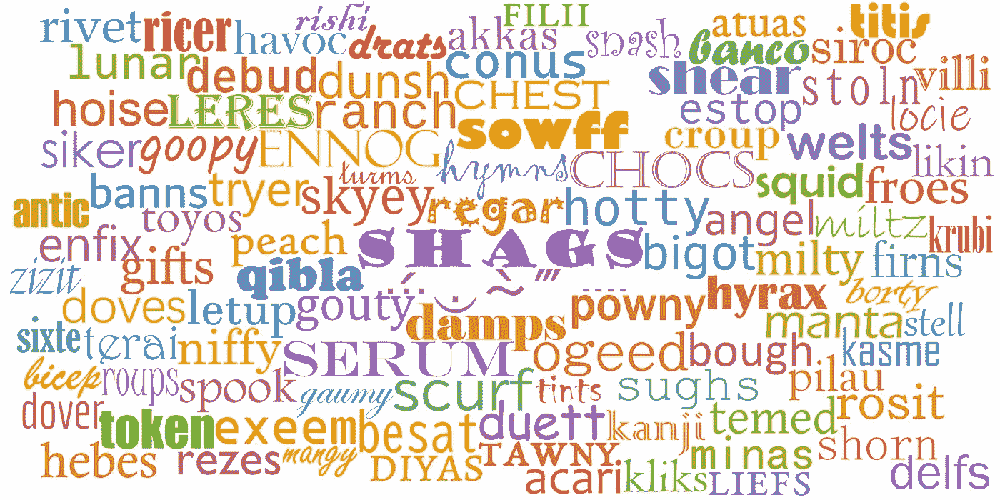
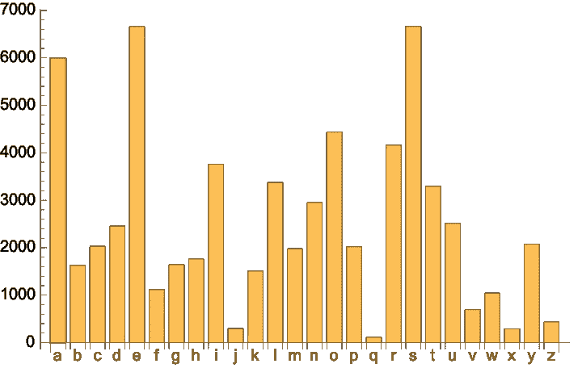
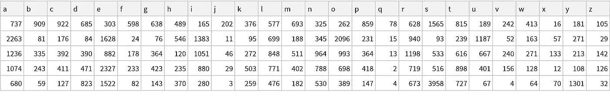
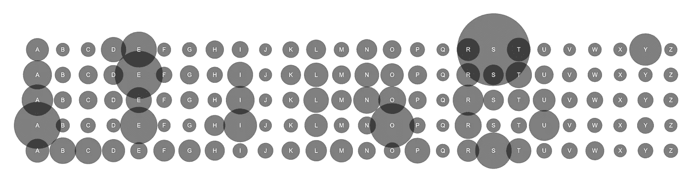
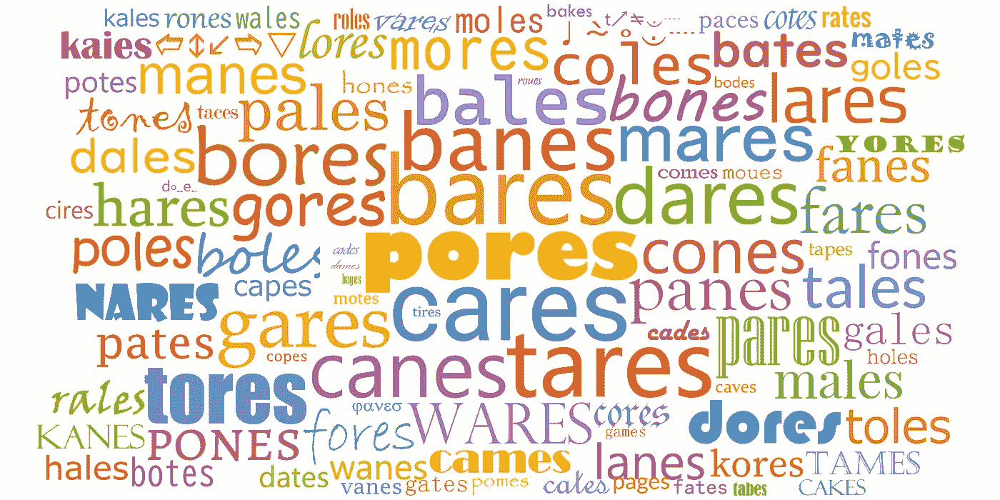
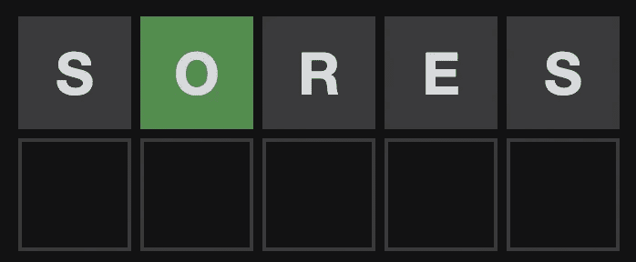
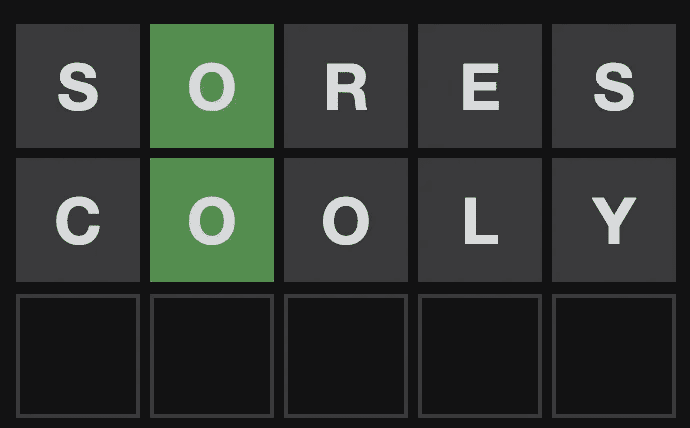
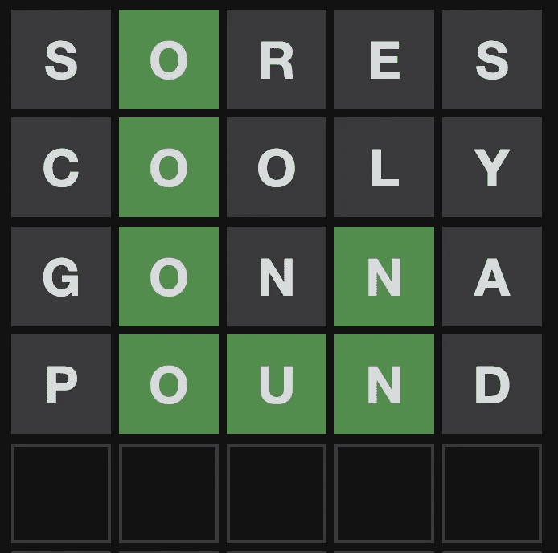
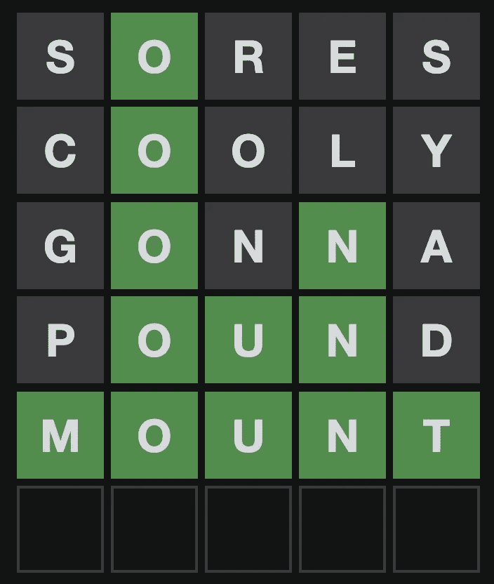

# 有效解决 Wordle 的提示和技巧

> 原文：<https://towardsdatascience.com/tips-and-tricks-for-solving-wordle-efficiently-28ab67a52dbf>

## 使用 Wolfram 语言



随机选择的单词(图片由作者提供)

每次我玩 Wordle 的时候，我都会想起亚瑟·柯南·道尔笔下的夏洛克·福尔摩斯在解决另一个神秘难题时所说的话:

> 我跟你说过多少次了，当你排除了不可能，剩下的，不管多么不可思议，一定是事实。—夏洛克·福尔摩斯

Wordle 是一个新的[日常文字游戏](https://www.powerlanguage.co.uk/wordle/)，挑战你在六轮或更少的回合中猜出一个五个字母的单词。输入一个猜测后，游戏会告诉你哪些字母是正确的，并且用绿色高亮显示在正确的位置。正确但不在正确位置的字母用黄色表示。使用这些信息，您可以消除大量的单词，并在每一轮中做出更好的猜测来解决游戏。和夏洛克·福尔摩斯一样，你也在和时间赛跑，因为你必须在六个回合中解决这个游戏。

在这篇文章中，我将使用计算方法来探索有效解决这个游戏的方法。虽然我自己不直接使用这些方法来解决日常的 Wordle 游戏(那有什么乐趣呢？！)，做这个分析让我对游戏如何在“幕后”运作有了深入的了解。因此，我觉得这些见解帮助我更好地玩游戏，并给我更好的结果。

每一轮 Wordle 都会对你的猜测给出反馈，所以你将能够推断出越来越多的关于解决方案的信息。具体来说，您将了解以下信息:

*   溶液中的字母
*   不在溶液中的字母
*   某些字母出现的地方
*   某些字母没有出现的地方
*   一个字母在解决方案中出现的次数

解释这个列表上的最后一项:如果你猜单词“RADAR ”,而 Wordle 用一个标有绿色或黄色的“A”来回答，那么你就知道这个解决方案中只有一个“A”。用一个有五个不同字母的单词开始你的第一次猜测是一个很好的策略，可以覆盖尽可能多的范围。但是解决单词经常包含重复的字母，所以在游戏的某个时候，你需要切换到猜测一个可能重复的字母。

解决 Wordle 的方法有很多。我认识的大多数人都是从一个随机的词开始，然后根据你得到的线索继续下去。其他人使用相同的两个初始猜测，例如“RAISE”和“CLOUD”包含许多在英语中很常见的字母。

从包含英语中常见字母的单词开始，依赖于字母频率表。例如，单词“RATES”比单词“EPOXY”包含更多的普通字母。从一个有共同字母的单词开始是一个好方法，因为它可以让你快速消除许多单词:

> 如果你用最常见的字母来选一个单词，而这些字母中有一个或多个不在答案中，那么你已经确定了大量不可能的答案。这大大减少了可能的解决方案的数量，这使得在下一轮中更有可能选择正确的解决方案。

所以关注字母频率应该是获胜策略的一部分。

英语(或任何其他语言)中的任意单词都有字母频率表，但这里我们只需要考虑英语词典中一个非常特殊的子集:Wordle 接受的五个字母单词。

Wordle 有自己独特的五个字母的单词字典，包含 12，972 个单词。通过从下面的[数据仓库对象](https://datarepository.wolframcloud.com/resources/Wordle-Word-List/)加载数据，您可以方便地获得这个用 [Wolfram 语言](https://www.wolfram.com/featureset/data-science/)编写的单词列表:

```
words = ResourceData[
  ResourceObject["Wordle Word List"]
]
```

我们可以检查这个列表中有哪些单词:

```
RandomSample[words,10] Out[] = {
  "mawns", "alary", "maare", 
  "lower", "cesta", "muggy", 
  "mayed", "broth", "taler", 
  "brags"
}
```

有一些显而易见的英语单词，如“lower”、“muggy”、“broth”和“brags”，但这个单词列表还包括一些非常模糊的单词，如“maare”和“alary”。我不知道这个 Wordle 单词列表的来源，所以我们只从表面上看这个列表，并用它来玩游戏。我应该指出，这个列表中有一个子集包含了未来几年的实际解决方法。在这篇文章中，我选择忽略解决词的子集，因为我认为这太“欺骗”了。

使用 [Wolfram 语言](https://www.wolfram.com/language/)，我们可以通过将所有单词连接成一个非常长的 64，860 个字母的字符串(12，972 个单词，每个单词有 5 个字母)并使用 [CharacterCounts](https://reference.wolfram.com/language/ref/CharacterCounts.html) 函数查看每个字母出现的频率来获得单词的整体字母分布:

```
KeySort[CharacterCounts[StringJoin[words]]] Out[] = <|
  "a" -> 5990, "b" -> 1627, "c" -> 2028, "d" -> 2453, 
  "e" -> 6662,  "f" -> 1115, "g" -> 1644, "h" -> 1760, 
  "i" -> 3759, "j" -> 291,  "k" -> 1505, "l" -> 3371, 
  "m" -> 1976, "n" -> 2952, "o" -> 4438,  "p" -> 2019, 
  "q" -> 112, "r" -> 4158, "s" -> 6665, "t" -> 3295,  
  "u" -> 2511, "v" -> 694, "w" -> 1039, "x" -> 288, 
  "y" -> 2074,  "z" -> 434
|>
```

因此:[string join](https://reference.wolfram.com/language/ref/StringJoin.html)s 将所有 12，972 个单词放在一个字符串中，然后[characters counts](https://reference.wolfram.com/language/ref/CharacterCounts.html)计算每个字母出现的次数。然后[键排序](https://reference.wolfram.com/language/ref/KeySort.html)函数将结果按字母顺序排序。

我们可以看到，字母 Q 并不常见(在所有单词中只出现了 112 次)，字母 E 非常常见(出现了 6662 次)。这里有一个[条形图](https://reference.wolfram.com/language/ref/BarChart.html)显示所有的字母计数:



(图片由作者提供)

我们可以更进一步，看看在一个五个字母的单词中，每个字母在特定的位置上有多常见。比如第三个位置的字母“E”有多常见？下面是实现这一点的 Wolfram 语言代码:

```
Dataset[
  Map[  
    Join[
      AssociationThread[CharacterRange["a", "z"] -> 0], 
      Counts[#]
    ] &,   
    Transpose[Map[Characters, words]]
  ], 
  Alignment -> Right,  
  MaxItems -> {All, All}
]
```

这段代码看起来有点复杂，但它只是计算了每个字母在一个五个字母的单词中的特定位置出现的次数。它在[笔记本](https://www.wolfram.com/notebooks/)中给出以下输出:



(图片由作者提供)

例如，给定单词列表，字母“E”出现在第三个位置的次数是 882 次。这是该表的一个视觉上更吸引人的版本:



(图片由作者提供)

现在我们有了这个值表，我们可以根据每个字母在特定位置的常见程度给每个五个字母的单词打分。例如，单词“RAISE”的得分为 628+2263+1051+516+1522=5980。这是通过在表格的相应行中查找字母来计算的。例如，单词 S 中的第四个字母在表的第四行中的值为 516。

> 给每个单词分配一个分数给你一个排列单词的方法。得分高的单词在它们出现最多的地方有普通字母。

我们可以对任何五个字母的单词列表中的每个单词进行这种“得分”计算，下面的 Wolfram 语言代码就是这样做的。它看起来有点复杂，但它所做的只是查看列表中的每个单词，并计算其分数:

```
wordScores[words_] := Module[{letters, a, e},  
  letters = CharacterRange["a", "z"];  
  a = Map[    
    Values[      
      Join[
        AssociationThread[CharacterRange["a", "z"] -> 0],
        KeySort[Counts[#]]]] &, 
    Transpose[Map[Characters, words]]
  ];  
  Echo[Grid[a]];  
  Map[   
    Function[{word},    
      e = Transpose[{
        Range[5],        
        Flatten[Position[letters, #] & /@ Characters[word]]
      }];    
      word -> Total[Extract[a, e]]    
    ],   
    words
  ]  
]
```

当我们用初始单词列表调用这个“wordScores”函数时，我们得到如下结果:

```
wordleScores = wordScores[words];
Take[ReverseSortBy[wordleScores, Last], 25] Out[] = {
  "sores" -> 11144, "sanes" -> 11077, "sales" -> 10961,  
   "sones" -> 10910, "soles" -> 10794, "sates" -> 10729,  
   "seres" -> 10676, "cares" -> 10668, "bares" -> 10655,  
   "sames" -> 10624, "pares" -> 10605, "tares" -> 10561,  
   "sades" -> 10503, "cores" -> 10501, "bores" -> 10488,  
   "sages" -> 10477, "sabes" -> 10448, "senes" -> 10442,  
   "mares" -> 10439, "pores" -> 10438, "canes" -> 10434,  
   "sires" -> 10431, "dares" -> 10431, "banes" -> 10421,  
   "tores" -> 10394
}
```

得分最高的单词是“疮”,这是有意义的，因为所有的字母都非常常见，并且出现在非常常见的地方(例如，许多单词都以字母 S 结尾)。在这篇文章中，我没有过滤掉重复字母的单词，比如“疮”。有些人在最初的猜测中更喜欢五个不同的字母，这只是我在这里采用的方法的一个微小的变化。没有重复字母的得分最高的词是“关心”。



好的开头词，字母得分高，没有重复的字母(图片由作者提供)

所以现在我们可以用“疼痛”作为一个实际的单词游戏的起点:



(图片由作者拍摄)

我们从游戏反馈中可以得出的结论是，单词中没有出现字母 S、R、E，但是字母 O 确实出现了，而且出现在第二个位置。我们可以编写一小段代码来删除所有不可能的解决方案，并得到一个 520 个单词的列表，它仍然可以是一个解决方案:

```
words2 = Select[words,    
  And[
    Not[StringContainsQ[#, "s" | "r" | "e"]],      
    StringTake[#, {2}] == "o"
  ] &
]; 
Length[words2] Out[]= 520
```

我们可以再次计算得分最高的单词，但现在基于剩余的 520 个单词:

```
scores2 = wordScores[words2]; 
Take[ReverseSortBy[scores2, Last], 25] Out[] = {
  "cooly" -> 882, "booay" -> 862, "colly" -> 856,  
  "cooky" -> 853, "mooly" -> 850, "dooly" -> 849, 
  "conky" -> 848,  "copay" -> 845, "gooly" -> 844, 
  "coomy" -> 844, "ponty" -> 842,  "hooly" -> 841, 
  "booty" -> 839, "moony" -> 836, "monty" -> 834,  
  "polly" -> 832, "coaly" -> 831, "bonny" -> 831, 
  "loony" -> 830,  "hooty" -> 830, "goony" -> 830, 
  "donny" -> 830, "pongy" -> 829,  "poncy" -> 829, 
  "wooly" -> 827
}
```

这将产生以下结果:



(图片由作者拍摄)

没有新的“好”字母，但现在我们可以另外删除字母 C、L 和 y。我们现在还知道单词中只有一个 O:

```
words3 = Select[words2, 
  And[
    Not[StringContainsQ[#, "c" | "l" | "y"]], 
    StringCount[#, "o"] == 1
  ] &
]; 
Length[words3] Out[]= 117
```

因此，我们进一步将可能的单词列表减少到 117 个。现在最佳得分猜测是:

```
scores3 = wordScores[words3]; 
Take[ReverseSortBy[scores3, Last], 25] Out[]= {
  "gonna" -> 210, "donna" -> 208, "gonia" -> 201,  
  "ponga" -> 199, "donga" -> 196, "tonga" -> 195, 
  "honan" -> 194,  "honda" -> 193, "gonad" -> 192, 
  "downa" -> 191, "wonga" -> 190,  "tonka" -> 189, 
  "pound" -> 189, "monad" -> 189, "hound" -> 189,  
  "bonza" -> 187, "podia" -> 186, "fonda" -> 186, 
  "mound" -> 185,  "bound" -> 185, "donah" -> 184, 
  "douma" -> 183, "zonda" -> 182,  "tomia" -> 182, 
  "found" -> 182
}
```

我们选择得分最高的单词“goto”，这给了我们以下反馈:


(图片由作者拍摄)

附加信息是字母 G 和 A 没有出现在单词中。字母 N 出现在第四个位置，也是单词中唯一的字母 N。这给我们留下了 13 个可能的单词:

```
words4 = Select[words3,   
  And[
    Not[StringContainsQ[#, "g" | "a"]], 
    StringTake[#, {4}] == "n",     
    StringCount[#, "n"] == 1
  ] &
] Out[] = {
  "boink", "bound", "found", "fount", 
  "hound", "joint", "mound", "mount", 
  "poind", "point", "pound", "pownd", 
  "wound"} Length[words4] Out[] = 13
```

得分最高的词是:

```
scores4 = wordScores[words4]; 
ReverseSortBy[scores4, Last] Out[]= {
  "pound" -> 46, "mound" -> 44, "found" -> 44, 
  "bound" -> 44,  "wound" -> 43, "hound" -> 43, 
  "poind" -> 42, "mount" -> 40,  "fount" -> 40, 
  "pownd" -> 39, "point" -> 38, "joint" -> 35,  
  "boink" -> 33
}
```

所以让我们用“英镑”作为下一个猜测:



(图片由作者拍摄)

我们现在有三个已知的字母(OUN)和两个可以排除的字母(P 和 D)。这就把可能性归结为两个词:

```
words5 = Select[words4,    
  And[
    Not[StringContainsQ[#, "p" | "d"]],      
    StringTake[#, 2 ;; 4] == "oun"
  ] &
] Out[]= {"fount", "mount"}
```

两个单词的得分都是 9，所以我们可以选择其中一个:

```
scores5 = wordScores[words5]; 
ReverseSortBy[scores5, Last] Out[]= {"mount" -> 9, "fount" -> 9}
```

通过“安装”，我们得到了最终的解决方案:



(图片由作者拍摄)

如果“山”是错的，我们将只剩下“泉”作为最后的可能性，所以无论哪种方式，我们都将在六个回合内解决这个游戏！

就是这样！

> “太棒了！我哭了。”初级，”他说。—华生医生和夏洛克·福尔摩斯

总结一下这个策略:我们将允许的 Wordle 单词列表加载到 Wolfram 语言中。然后我们计算了一个数值表，它代表了一个特定的字母在一个五个字母单词的特定位置出现的频率。使用这个表格，我们计算出一个高分数单词的列表，希望优化我们猜测这个单词的机会(或者确定尽可能多的字母)。

在每一轮游戏中，我们根据游戏的反馈机制删除“不可能”的单词，然后根据剩余的单词列表生成一个新的“最有可能”的单词。使用这种方法，我们系统地将可能性从 12972 减少到 520、117、13，最后减少到 2 个得分相等的单词。看看第一次猜测有多重要，很有意思。它排除了 95%以上的可能性。即使你的第一次猜测令人失望(根本没有匹配的字母)，你仍然在排除很多很多单词。

虽然不能保证这种方法在六轮游戏中总能成功，但它确实在每轮系统地去除大量单词方面做得很好。


来自 [Pexels](https://www.pexels.com/photo/man-in-brown-knitted-scarf-looking-at-the-magnifying-glass-6033828/?utm_content=attributionCopyText&utm_medium=referral&utm_source=pexels) 的 [cottonbro](https://www.pexels.com/@cottonbro?utm_content=attributionCopyText&utm_medium=referral&utm_source=pexels) 摄影