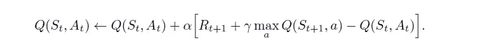
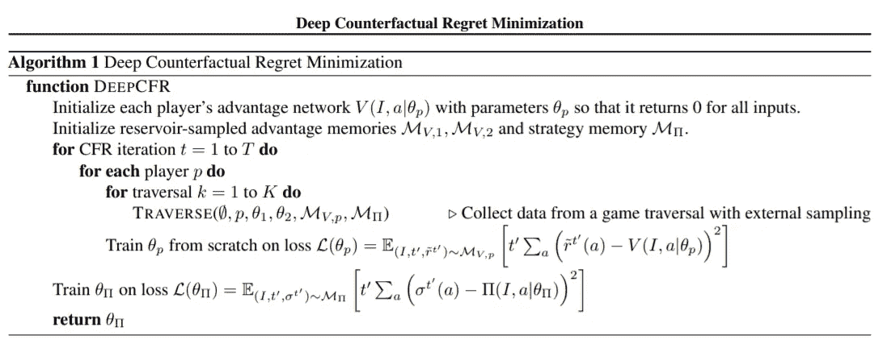
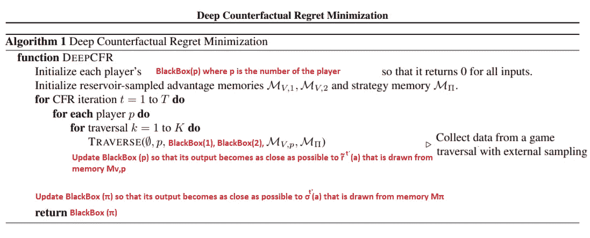
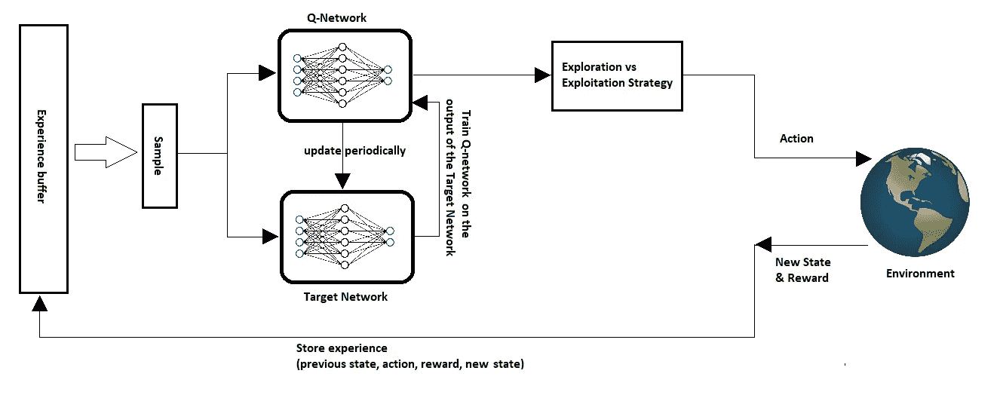

# 如何有效学习深度强化学习的小技巧

> 原文：<https://towardsdatascience.com/tips-on-how-to-learn-deep-reinforcement-learning-effectively-8578813ff23>

# 如何有效学习深度强化学习的小技巧

## 可能会帮你节省时间的多年经验总结

帕特里克·托马索在 [Unsplash](https://unsplash.com?utm_source=medium&utm_medium=referral) 上的照片

> 不要只是学习，要体验。不要只是阅读，要吸收。
> 
> 罗伊·t·贝内特《心中之光》

# 介绍

**首先，免责声明**:对一些人有用的，不一定对其他人有用。在这篇文章中，我揭示了在我花了几年时间阅读与强化学习相关的学术论文、书籍和源代码之后，什么对我有效。
一些读者可能会发现它，有用的其他人可能不会，但重要的是，通过分享，我相信我可能会帮助一些或一些很难进入 RL 的人。

这篇文章不能保证你会去理解每一本书或每一篇关于 RL 的论文，但是它会给你一个方法论，可能(就像我的情况)减轻学习的过程。

文章从一些基本的行为开始，这些行为是我们过去在学校经常做的，但是随着在线学习的普及，它已经越来越不像是一种条件反射了。

# 基本反射:记笔记

如果你不记得你过去在学校做了什么，那么，现在是时候做了:记笔记。

虽然在学校这是一件非常明显和自然的事情，然而在网络和视频学习的时代，这一基本行为经常被忽视！

在你旁边放一张纸，写下你在阅读或观看时遇到的所有定义或重要公式。相信我，你不会想通过上下滚动来记住那个符号是什么或者这个术语是什么意思。

除非你有过目不忘的记忆力，否则你肯定不会记得几页后的定义。更糟糕的是，你可能没有完全理解这个定义，所以你后来看到的可能与你自己的理解相矛盾，你需要再次检查以确保你得到了想要的意思。因此，把这份文件放在身边会节省你太多的时间。

你应该拿一支笔和一张纸，写下你所理解的内容，不要简单地抄袭。

最重要的是，不要将它们复制粘贴到另一个文档中，因为这对你自己没有任何好处。

此外，当您想要快速刷新关于算法的记忆，而不是从头到尾阅读几十页时，本文将作为一个备忘单供以后使用。

# 另一个基本条件反射:练习

还有一件在学校很常见，在网络学习的时代不知何故丢失了的事情，就是练习。

练习的方法有很多，但是效果较差的一种就是采用“假到做出来”的策略！我这么说的意思是“不知所云地”复制代码(或从 Github 下载)并运行它，而不试图理解它背后的概念，也不理解代码本身。如果你不知道自己在做什么，这种方法是行不通的。更不用说，如果你试图根据这种策略推销你的技能，一旦人们发现你并不真正了解自己的解决方案，就会适得其反！这会削弱他们对你的信心。记住方法或算法是不够的，需要的是能够理解它们是什么，以及为什么。

如果有时你不得不修改实现，你将需要理解其中的含义，当然，要能够解释结果并知道算法的边界。

所以实践包括理解算法的每个组成部分，理解代码，然后广泛地测试和调试它。

# 从普通强化学习开始

Deep RL 很吸引人，你可能会忍不住直接跳进水里开始游泳。通常，这是由于一些在线课程向你出售梦想。但这不是正确的方法(当然是在我看来)。

从表格方法开始，坚持做下去，直到它们成为你思维的有机组成部分。因为如果你不明白 Q-Learning 是什么，它代表了什么，再往前走就没有意义了。

q-学习:非策略 TD 控制(摘自萨顿和巴尔托的书:强化学习，介绍)

关于这个问题，可以去看看 DeepMind 或者大卫·西尔弗的 Youtube 课程。然后，先做所有的列表，必要时重复。

# 处理“深度”增加的复杂性

将神经网络添加到 RL 算法增加了它们的复杂性，因为有新的组件要馈送和训练。然而，抛开它们的技术特性，它们被插入来完成两个主要任务。因此，降低复杂性的一个方法是抽象地思考。

将神经网络想象成具有两个特征的黑匣子:

*   如果给定输入，它产生的输出不像你希望的那样精确，这就引出了下一点。
*   它可以更新其内部参数，以便“有希望”对相同的输入产生更好(更准确)的输出。

换句话说，借用表格方法，表的概念，但是一个非常大的概念，需要非常大的内存。有了这样的虚拟内存，您可以适应所有可能的(数百万或数十亿)状态和动作，以便为每个状态映射状态值和动作值。

但是既然你已经知道这在现实中是不可能的，那么就用占用内存少得多但结果不太准确的东西来代替它，例如，你得到的不是期望值 1，而是 0.85，0.90，1.10 或 1.20

在上面的例子中，近似值仍然是可以接受的，但这种情况很少发生。近似开始时非常不准确，然后随着迭代，野生随机数变得越来越准确。

因此，当你在科学论文中遇到神经网络时，不要陷入细节，只需将它想象为一个黑盒，它可以提供近似(理论上)，随着时间的推移，通过学习过程会变得更好。

考虑这个深度反事实后悔最小化算法。你可能会直接对与神经网络相关的神秘符号和表达感到不安。

深度反事实后悔最小化论文，作者:n .布朗、a .勒尔、S .格罗斯、t .桑德霍尔姆(【https://arxiv.org/pdf/1811.00164.pdf】T4)

但是你可以这样读它们:

NN 短语的解释(图片由作者提供)

这样的解释使你更容易理解和减轻嵌入算法中的复杂性。你现在谈论的是黑盒的更新(很多人，尤其是开发者很容易理解)。
一旦你很好地理解了算法，你就可以实现它，并把黑盒看作是对做神经网络的特殊函数(单独编码)的调用。

# 创建图表

从算法中制作图形和草图是降低复杂性和识别其组件及其相互关系的一种方法。你可以单独想象每个组件，以及将它与其他组件联系起来的活动流或信息流，而不是记住一大堆行。
有了这种精神(或具体)的表示，就很容易推导出算法的代码。

下面是深度 Q 网络算法的图表，比起一堆代码或伪代码，你会更容易理解和记忆它。

DQN 工作流程(图片由作者提供)

请注意，每个组件都非常清晰，并且与其他组件分离开来，这使您很容易进行推理。您甚至可以尝试取出一个组件，用一个不同的、可能更好的组件来替换它，以测量性能。

# 橡皮鸭法

照片由 [S. Tsuchiya](https://unsplash.com/@s_tsuchiya?utm_source=medium&utm_medium=referral) 在 [Unsplash](https://unsplash.com?utm_source=medium&utm_medium=referral) 上拍摄

最后，当你认为你准备好了，找个人告诉/教他们你学到了什么，最好是和你分享那种激情的朋友。

在那一刻，你可以接受测试，如果你真的掌握了材料或没有。你的朋友会问你问题，挑战你的知识，这会让你更多地思考你知道什么，你理解什么。

另一种方法是告诉你的橡皮鸭。这个方法来自[橡皮鸭调试](https://en.wikipedia.org/wiki/Rubber_duck_debugging)，我可以向你保证它有效。当你告诉其他人，包括一只橡皮鸭，一个问题被解决了多少次，你可能会感到惊讶，因为你强迫自己听你在说什么。因此，如果你没有人向你解释算法，就用大嗓门向你自己或你的鸭子解释，这样你就能清楚地听到自己的声音。

最后，关于它的博客或 vlog(视频日志)。别人在你之前做过多少次并不重要。把你的知识放在那里，试着获得反馈和问题，你可以反思和提高你的理解。事实上，你是在自己身上练习 RL，通过你得到的反馈来精炼和增强你对主题的理解。

博客/vlog 的另一个原因是不同的人对同一主题有不同的理解方式。所以你可能用一种吸引一些读者的方式解释了它。

# 编码和共享

在这个学习旅程的最后，最好是实现算法并展示给某人看。只为自己做没有任何好处，因为(很可能)你不会付出额外的长度和努力来使它工作或完善它。

不要只是从 GitHub 下载代码并运行它，这是没有道理的。就代码行而言，RL 算法并不庞大，所以花点时间来编写、测试和调试它，这样你就能发现与之相关的所有问题。

自己编写代码会让你想到每一个很可能让你的算法失败的实现细节，以防你没有恰当地处理它们。许多例子之一是忘记标准化神经网络的输入数据。

不要期望这个阶段会很顺利，即使你认为你掌握了算法，可能会有很多事情出错，你需要一个接一个地跟踪和修复它们。像 DQN 这样的小算法可能要花上好几天才能完成。所以保持动力，不要绝望。

共享代码或实现会无意识地促使你格外小心，并尽最大努力使其工作。即使没有人给你负面的反馈，但是如果你的代码做得很好，人们会开始使用它并在他们之间分享，最终，你会有一些人会因为你的工作而称赞你，因为它解决了他们的问题，这本身就是值得的。更不用说可能会有招聘人员在那边寻找像你这样的人，谁可以提供。

查看[RL-lab.com](https://rl-lab.com)关于如何与他人分享你的工作的例子。

# 结论

深度强化学习是一个艰难的课题，接近它具有挑战性，需要大量的耐心、投入和学习的动力。有效获取知识的方法之一是简化和隔离复杂的部分，然后通过实现和发布你的工作来保持动力。