# 关于熊猫、正则表达式和集合的提示

> 原文：<https://towardsdatascience.com/tips-on-pandas-regex-collections-f2e8096d12d2>

## 附有示例的实用指南

在之前关于[数据清理和特征工程](/overview-on-apply-map-applymap-iterrows-itertuples-df752a11f451?sk=f093bcdd435ff3f3bef0b31a95d3e3a6)的文章中，我们经历了一些操作(应用、映射等)。)示例及其模拟运行时。


图片由 [Taras Shypka](https://unsplash.com/@bugsster?utm_source=medium&utm_medium=referral) 在 [Unsplash](https://unsplash.com?utm_source=medium&utm_medium=referral) 上拍摄

在本文中，我将分享对我的工作有帮助的其他例子，希望也能对你的工作有帮助。我们将会看一些例子…

*   熊猫显示设置
*   功能模式
*   编译正则表达式
*   词典理解
*   默认字典

…使用相同的 iaito 数据集。这些例子并不全面，但是它们应该有助于您开始探索它们的应用。

关于数据集的简短概述；该数据集始于 2012 年，当时帮助 iaidoka 成员翻译 iaito 订单细节。每个记录包含每个所有者的 iaito 零件规格。出于隐私考虑，诸如所有者的全名和地址等敏感信息永远不会在数据集中捕获。数据集可以从我的 [GitHub repo](https://github.com/AngShengJun/petProj/blob/master/proj_nanato/project_nanato2022_Part1.xlsx) 中访问。

## 熊猫显示设置

熊猫有很多选择。我们可能遇到和使用的比较常见的应该是`max_rows`或者`max_columns`。当读取可能很长的表时，某些列可能会被截断为“…”。为了减轻这种情况，我们可以设置它显示所有的列(即`pd.set_option('display.max_columns', None)`)。

```
import pandas as pd
pd.set_option('display.max_columns', None)

df = pd.read_excel('project_nanato2022_Part1.xlsx',)
```

要查看数据帧的前 n 行或后 n 行，可以使用`head`或`tail`。

```
display(df.head()) # take a look at first default = 5 rows
df.tail() # take a look at last 5 rows
```

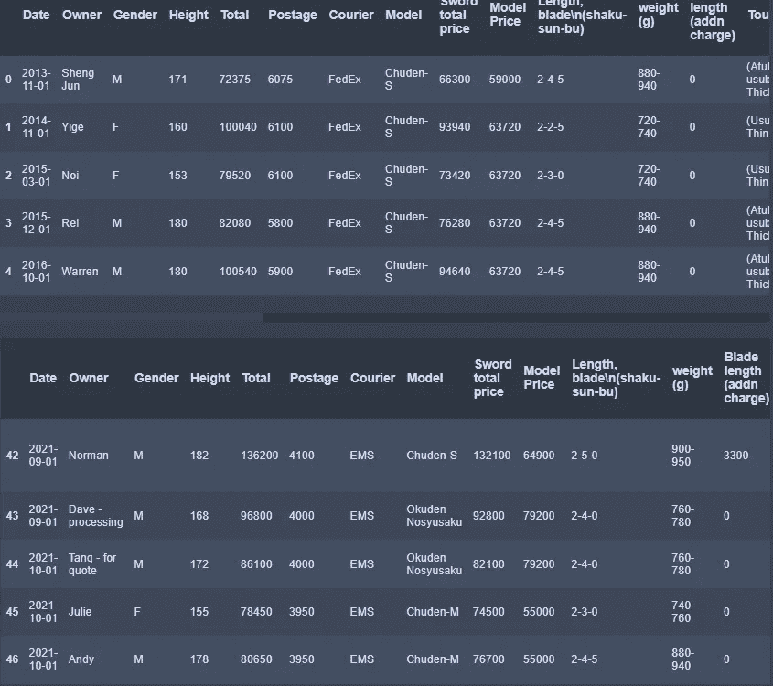

作者图片

不要误解我的意思，我完全支持使用`head()`和`tail()`，并且我仍然使用它们作为检查导出的数据帧副本是否正确的首选方法。但是通过上面的设置，我们压缩了数据框显示以显示第一行和最后“n”行——用更少的代码实现了相同的结果。

```
pd.set_option('display.max_rows', 10) # set display to 10 rowsdf = pd.read_excel('project_nanato2022_Part1.xlsx')
df
```


作者图片

当[处理多个文件](https://medium.com/data-arena/automate-data-cleaning-combining-of-files-a0fbdf853524?sk=e8ebe815c7b84cf982cd44dad908c224)时，另一个值得考虑的方面是检查这些文件的过程，以及潜在的文件大小。如果数据是干净的，但我们希望更好地感知数据特征，那么限制行数(即记录数)对于管理大文件更好。

```
# limit to 5 rows
df_limited = pd.read_excel('project_nanato2022_Part1.xlsx',nrows=5) 
df_limited
```

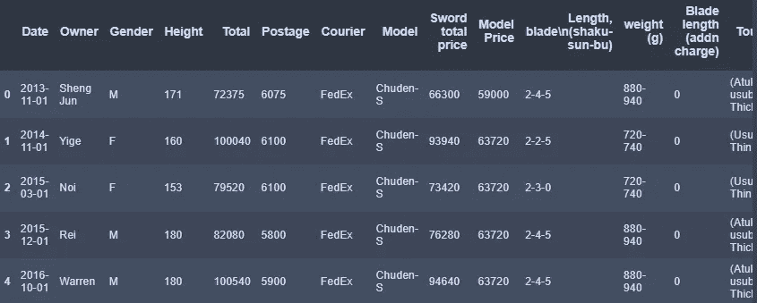

作者图片

*   另一个容易被忽略的小问题是为了方便而重复调用函数。我知道——我倾向于随意使用这个。一个例子是`df.shape`。摆脱这种情况的第一步是记住输出的特征(在本例中是行和列计数的元组)。我们可以调用它一次，并在将结果赋给变量后访问它们。

```
print(f'df rows: {df.shape[0]}, df columns: {df.shape[1]}')
print('.shape returns a tuple of rows and cols as a result, \nconsider using as assigned to a variable.')
res_shape = df.shape
print(f'df rows: {res_shape[0]}, df columns: {res_shape[1]}')
```

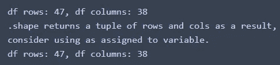

作者图片

## 功能模式

在函数模式中安排代码增强了灵活性和易用性，我们可以用它来修改代码以进行下游的数据清理或转换。考虑到数据清理中有时存在的不确定性，我最初并不总是这样做，而是尝试在重构时实现它们以增强可重用性。我们将以清理列名为例。

```
# initial column names
ini_cols = df.columns
ini_cols
```

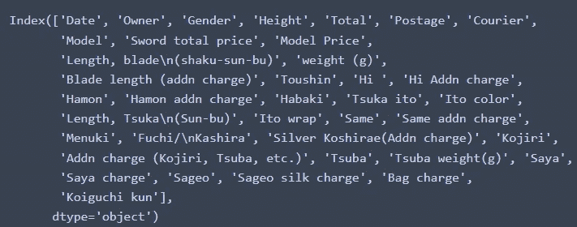

作者图片

关于这些列标题，我们需要

*   删除逗号(即标点符号)
*   用下划线替换空格
*   小写字母

让我们看看上一篇文章中的实现。为简洁起见，显示的行数调整为一。在这个例子中，重命名不是就地完成的。

```
pd.set_option('display.max_rows', 1) # 1 row for easier reading
# lowercase, drop commas, replace newline & spaces with underscores
col_names = []
for old in df.columns:
    new = re.sub( r"[,]" ,'',old.strip()) 
    new = re.sub( r"[\n\s/]" ,'_',new) 
    col_names.append(new.lower()) 
df.rename(columns=dict(zip(df.columns, col_names)), ) 
```

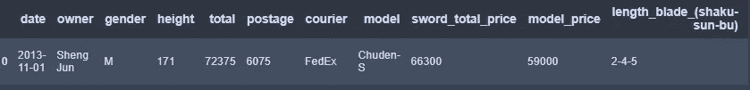

作者图片

*   现在，让我们把它分成几个方面，我们可以提高它。首先，我们可以使用`compile`派生可重用的正则表达式对象。下面是一个编译正则表达式的例子，然后手动调用模式的替换。

```
comma_ = re.compile( r"[,]" ) # compile the regular expressiontest_string_ = ini_cols[29]
print(f'input:\n\t{test_string_}')res_string_ = comma_.sub('', test_string_.strip())
print(f'comma removed:\n\t{res_string_}')
```

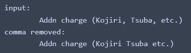

作者图片

然后，我们可以通过将操作序列作为一个 iterable 来实现这一点。我们会…

*   编译所有的正则表达式；
*   创建操作列表；
*   最后，作为一种功能来应用

```
# compile regular expressions
comma_ = re.compile( r"[,]" )
whitespaces_ = re.compile( r"[\n\s/]" )# functions 
def remove_comma(val):
    return comma_.sub('', val)def replace_whitespaces(val):
    return whitespaces_.sub('_', val)def clean_headers(headers, op_seq):
    cleaned_cols = []
    for val in headers:
        for op in op_seq:
            val = op(val)
        cleaned_cols.append(val)
    return cleaned_cols# sequence of operations as a list
op_seq = [str.strip, remove_comma, replace_whitespaces, str.lower]
# implement on df column headers
res = clean_headers(df.columns, op_seq)
df.rename(columns=dict(zip(df.columns, res)), inplace=True) 
df
```


作者图片

## 词典理解

与列表理解类似，语法如下:

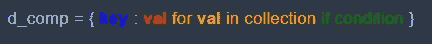

作者图片

对于 if-else 条件，应该是:

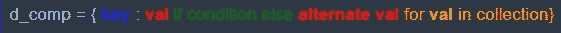

作者图片

我们会得到一部分数据。假设我们想要创建一个带有从所有者的性别推断出的称呼的列(即，如果性别是' M '，则添加' Mr . '；如果性别是' F '，则使用 5 行数据以保持简洁)。

```
pd.set_option('display.max_rows', 10) # set display to 10 rows
df_subset = df.iloc[:5][['owner', 'gender']].copy()
```

一种实现是:

```
name = {}
for i in range(len(df_subset)):
    if df_subset['gender'][i] == 'M':
        name[i] = 'Mr. ' + df_subset['owner'][i]
    else:
        name[i] = 'Ms. ' + df_subset['owner'][i]

df_dict = pd.DataFrame.from_dict(name, orient='index',columns=['name'])
df_dict
```

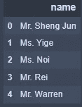

作者图片

用字典理解:

```
name2 = {i:'Mr. ' + df_subset['owner'][i]  
         if df_subset['gender'][i] == 'M' 
         else 'Ms. ' + df_subset['owner'][i]
         for i in range(len(df_subset)) 
        }

df_dict2 = pd.DataFrame.from_dict(name2, orient='index',columns=['name2'])
df_dict2
```

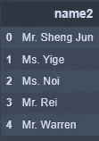

作者图片

## 默认字典

在字典中设置值通常涉及到从另一个集合中引用它们。典型的逻辑包括:如果值不在字典中，则设置一个键-值对；如果键已经存在，则添加到值序列中。如果默认值不在此实例的字典中，则认为它设置了一个键值对。使用来自`collections`的`defaultdict`可以方便地获得字典中的默认值。一个假设的用例可以回答:“生成每个模型的 tsuba 选择列表。”

```
# prep the data to work with
tsuba_codes = df['tsuba'].apply(lambda x: x.split(' ')[0])
model_series = df['model']print(tsuba_codes.unique())
print(model_series.unique())
```

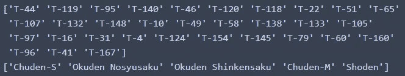

可处理的潜在数据范围|按作者分类的图片

使用 for 循环:

```
model_tsuba = {}
for model, code in list(zip(model_list, tsuba_codes)):
    if model not in model_tsuba:
        model_tsuba[ model ] = [code]
    if code not in model_tsuba[model]: # avoids duplicate tsuba code
        model_tsuba[ model ].append(code)for k, v in model_tsuba.items():
    v.sort()
    print(f'{k}: {", ".join(ele for ele in v)}')
```

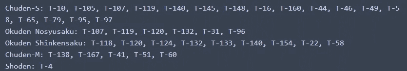

作者图片

```
from collections import defaultdictmodel_tsuba2 = defaultdict(list)
for model, code in list(zip(model_list, tsuba_codes)):
    model_tsuba2[model] = list(set(model_tsuba2[model] + [code]))for k, v in model_tsuba2.items():
    v.sort()
    print(f"{k}: {', '.join(ele for ele in v)}")
```

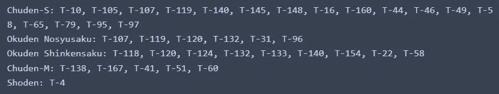

作者图片

本文只介绍了一些函数和例子，但是它们应该是您会遇到的最常见的函数和例子。

我希望这篇文章是一篇信息丰富的读物。感谢您的阅读，直到那时保持安全！