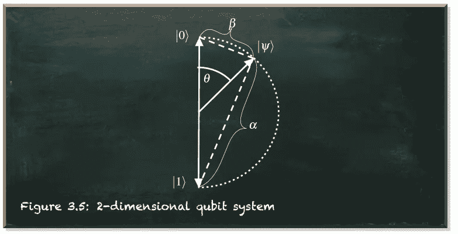
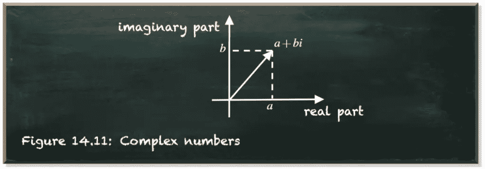
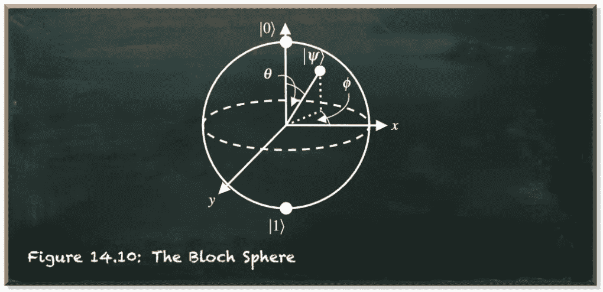

# 要真正“把事情搞砸”，你需要一台计算机——量子计算机

> 原文：<https://towardsdatascience.com/to-really-foul-things-up-you-need-a-computer-a-quantum-computer-9620746f1e87>

## 量子误差的原因和影响

量子机器学习要不要入门？看看 [**动手量子机器学习用 Python**](https://www.pyqml.com/page?ref=medium_foul&dest=/) **。**

> 犯错是人之常情，但要真正把事情搞砸，你需要一台电脑。
> 
> *保罗·埃尔利希*

我是一个软件人。因此，很难承认保罗·埃尔利希肯定不是指硬件而是软件。经典计算机是容错设备。他们不会犯错。

这些计算机需要区分零和一——高电压和低电压的区别。只要有高电压，就是一，有低电压，就是零。这种离散化意味着误差必须相对较大才能被注意到。因此，经典计算机不会把 0 当作 1，反之亦然。

所以，无论何时计算出错，都是因为软件的原因。作为一个写软件的人，这是一个严酷的教训。不，这不是电脑的错。它是我的。

但是，在量子计算领域，情况完全不同。量子计算机保持连续的量子态——量子叠加态。它意味着一个量子位(或量子位)不是零或一，而是处于零和一的复杂(如在复数中)线性组合中。只有一个警告。一个量子位只有在叠加态，除非我们测量它。一旦我们测量它，它立即跳到零或一。

**测量一个量子位会瓦解它的叠加态。**

但是什么是精确的测量呢？我们都习惯于测量事物，比如距离、温度和时间。这涉及到某种评估。那么，我们需要评估一个量子比特吗？如果是，评估意味着什么？

我们可以更深入地玩这个游戏。事实上，在量子计算的早期，对于测量一个量子力学系统是否涉及人类思维，存在着一种批判性的话语。

今天，大多数科学家认为我们可以更广泛地理解测量。量子力学系统与其环境之间的任何信息交换都可以称为测量。在亚原子世界中，信息交换频繁。如果两个原子发生化学反应，那就是信息交换。如果一个电子从一个原子移动到另一个原子——我们称之为电——那就是信息交换。即使两个电子、光子或任何两个粒子发生碰撞，那也是信息交换。

我们生活在一个充满运动粒子的世界(地球)。所以，你不会发现任何一个自然的量子力学系统不与它的环境持续交换信息。所以，我们尽可能地冷却量子计算机，这样就不会再有移动的粒子了。此外，我们用电磁场限制和悬浮一个粒子，使它处于自由空间，与周围环境没有相互作用。

然而，我们需要允许一些相互作用来使用这个粒子作为量子位。我们需要控制它。很容易想象这是一个微妙的过程——最小的不精确都可能让粒子接触到它的环境。好了，你知道了——信息交换。

我们今天拥有的最好的量子计算机遭受着与外界不必要的相互作用。它们以噪音的形式出现，破坏我们的计算。

所以，现在我们对量子误差的来源有了基本的了解。让我们从编程的角度来看看它们是如何影响我们的量子位的。

量子位是一个二维量子系统。我们可以用一个叫做“psi”的向量来表示它——|𝜓⟩.

下图描绘了 psi 最重要的特征——𝛼和𝛽.这些是到基本向量|0⟩和|1⟩.的距离这很重要，因为它们的绝对平方表示测量量子位的概率为 0 (=|𝛼|)或 1 (=|𝛽|)。

作者图片

所以，我们假设量子位处于一种状态，我们以 0.25 的概率把它测量为 0。相应地，我们以 0.75 的概率将其度量为 1。

如果你在这种状态下看一百个量子比特，你会数出 25 个 0 和 75 个 1。

进一步说，我们可以用量子位工作，比如改变概率。假设我们把它们作为一个整体测量的概率加上 0.25。因此，如果我们在改变量子位的概率之前不去看它，我们最终会得到一个我们一直认为是一个的量子位。所以，我们会数到 100。

但如果在我们改变它之前，量子位与它的环境发生了相互作用，它会以 0.25 的概率跳到零。接下来的变化会把它从零带到一个测量到 1 的概率为 0.25 的状态。

比方说，在我们改变它们的概率之前，十个量子位与它们的环境相互作用。然后，我们会测量七或八个量子位元为零。所以我们只能数出 92 或 93 个。

越来越糟了！

我上面不是提到过量子位叠加是零和一的复杂(如在复数中)线性组合吗？我不想听起来很聪明。

几何上，复数把一维数线的概念扩展到二维复平面。

作者图片

*i* 表示满足等式*I = 1*的虚数单位。因为没有实数满足这个等式，所以部分 *a* 和 *bi* 是相互独立的。因此，我们在迄今为止的二维量子态向量空间中增加了第三维度。

结果看起来像一个球体，因为该空间中的所有向量都被归一化为长度 1 (|𝛼| + |𝛽| = 1)。这是布洛赫球。

作者图片

这个代表相位的额外维度，不会直接影响量子位元状态向量到基本向量|0⟩和|1⟩.的距离因此，它不会直接影响测量概率。

然而，当你处理一个量子位时——我们所做的——它的相位很重要。例如，哈达玛门把一个正相位的量子位(|+⟩)变成|0⟩，把一个负相位的量子位(|-⟩)变成|1⟩.

不幸的是，意外测量不仅会导致比特翻转(混合 0 和 1)，还会导致相位翻转(混合正负)。

# 结论

我是一个软件人。导致量子计算错误的是硬件而不是软件，我对此并不满意。最终，要靠我们这些软件工程师想出算法来纠正这些错误，或者更好的是，想出对错误免疫的算法。

例如，IBM 最近宣布了一项总额为 10 万美元的奖金，用于在 IBM Quantum 的 7 量子位 Jakarta 系统上使用 Trotterization 模拟三粒子系统的海森堡模型哈密顿量。完成这项挑战的主要问题是应对噪音。

量子机器学习要不要入门？看看 [**动手量子机器学习用 Python**](https://www.pyqml.com/page?ref=medium_foul&dest=/) **。**

在这里免费获得前三章。