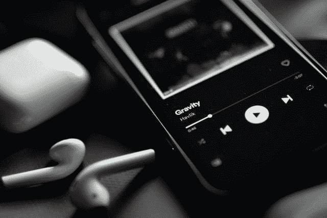
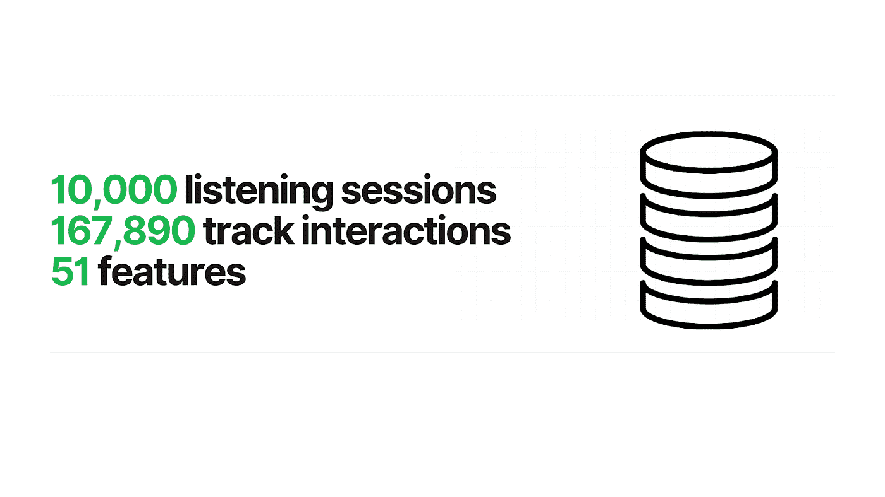
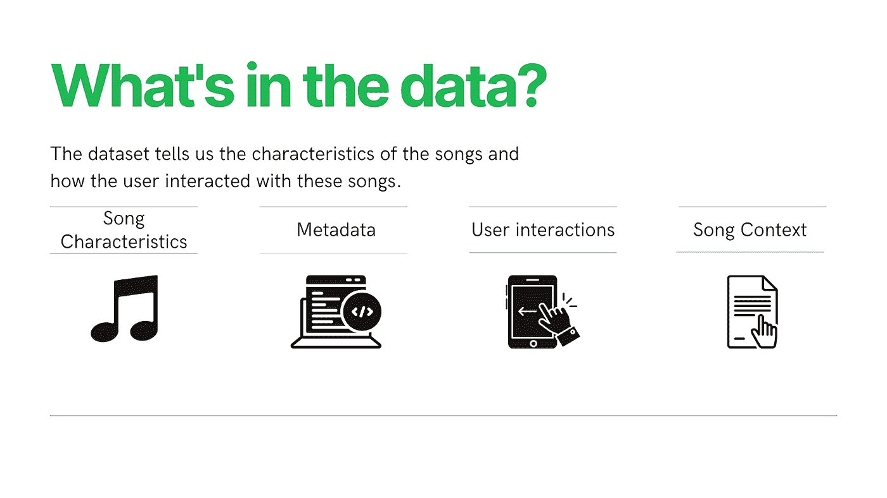
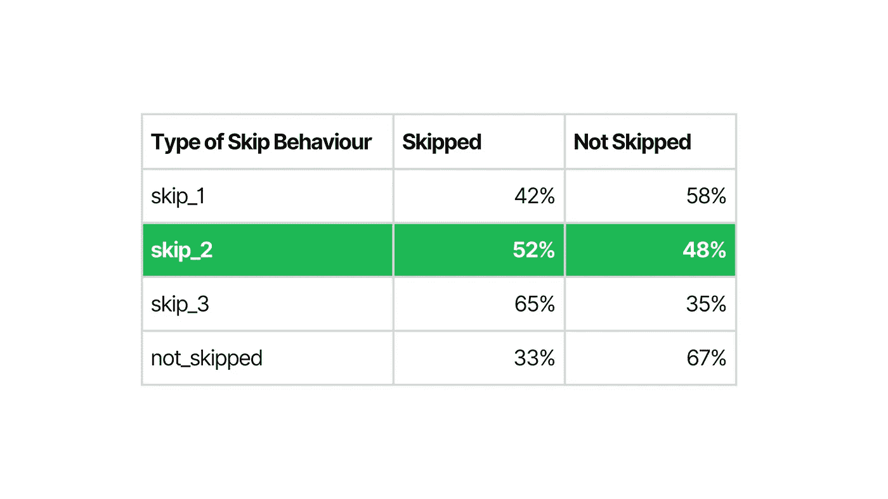
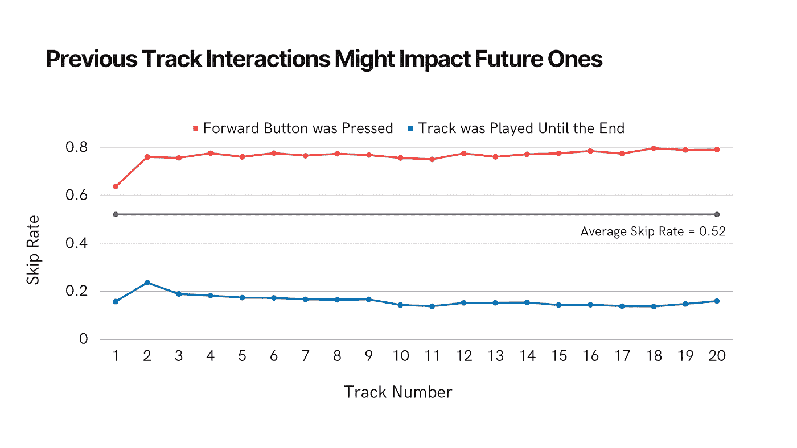
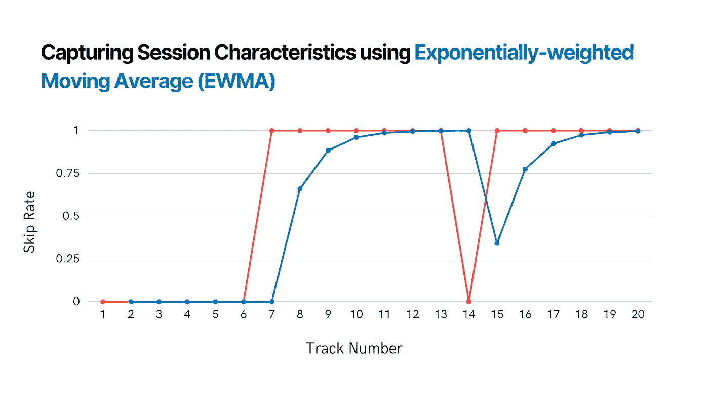

# 跳过，还是不跳过？这是一个问题

> 原文：<https://towardsdatascience.com/to-skip-or-not-to-skip-that-is-the-question-a0c76925737e>

## 分析和预测用户在 Spotify 上的行为:过去的互动似乎会推动未来的互动

照片由 [Effy](https://unsplash.com/@fhavlik?utm_source=unsplash&utm_medium=referral&utm_content=creditCopyText) 在 [Unsplash](https://unsplash.com/s/photos/spotify?utm_source=unsplash&utm_medium=referral&utm_content=creditCopyText) 上拍摄

# 介绍

作为我在 BrainStation 数据科学训练营的[顶点项目](https://github.com/alcthach/spotify-skip-prediction)的一部分，我深入研究了音乐流媒体平台 Spotify 上的跳过行为。我的目标是观察用户如何在平台上互动，并了解哪些因素可能会驱动他们的行为。

总的来说，我希望探索如何改善用户体验，因为它与曲目跳过有关。我设想了一个响应式播放列表，它会对一首接一首的用户交互敏感。例如，如果一个用户跳过了连续的歌曲，并完全停留在他们播放的一首歌曲上，我可以提取用户的动机并根据需要重新构建播放列表吗？

这个项目是我探索用户动态听觉体验可能性的第一步。第一个目标是预测用户是否会跳过给定的曲目。这篇文章总结了我解决这个问题的方法和结果。

# 关于数据

作者图片

我在这个项目中使用的数据集是在数据科学竞赛平台 [AIcrowd](https://www.aicrowd.com/) 上找到的。

[原始数据集](https://www.aicrowd.com/challenges/spotify-sequential-skip-prediction-challenge)包含 Spotify 服务上大约 1.3 亿次与用户互动相关的收听会话，占用户互动的近 400 万首曲目。我在这个项目中使用了这个数据集的缩略版本，它包含了 10，000 个听力会话，代表了不到 168，000 个单独的音轨交互。

作者图片

# 选择目标变量

这个项目的目标变量是用户是否跳过了一个曲目。数据集中的各种跳过行为表明一首歌曲在被跳过之前播放了多长时间。我选择‘skip _ 2’作为我的目标变量。它拥有最好的阶层平衡，积极阶层和消极阶层的比例为 52:48。

‘skip _ 2’表示歌曲在被跳过之前被短暂播放过。

# 探索性数据分析的发现:用户在 Spotify 上的行为如何？

我首先想了解用户如何与平台交互的总体情况。我发现的一些关键见解是:

*   52%的歌曲被跳过
*   根据用户与前一首曲目的交互方式，平均跳过率会有所不同
*   跳跃率似乎根据一天中的时间而变化

上图强调了跳跃行为的差异，基于它们如何到达当前轨道。平均而言，如果用户在播放前一首歌曲时按下前进按钮(红色)，跳过率会比完整播放(蓝色)时高。

# 特征工程:历史很重要

推动项目向前发展的因素之一是能够转换数据以做出准确的预测。我想知道在我试图预测的赛道附近发生了什么。用户最近是否心情不好？或者他们对歌曲的选择非常满意，并且演奏了大部分歌曲？

受这个想法的启发，我对数据进行了转换，以反映每次听力会话期间的指数加权移动平均值。在给定听力会话期间的每个时间点，计算偏向当前音轨的移动平均值。随着时间的推移，在预测当前曲目是否将被跳过时，开始播放的曲目变得不那么重要。

上图以跳过行为为例，说明了如何捕捉总体用户行为。请注意，指数加权移动平均线(蓝色)在计算中落后一个轨迹。这种策略可以防止模型预见未来，从而降低数据泄露的风险。与实际跳跃结果(红色)相比，EWMA 捕捉平均跳跃行为，并对当前轨道进行加权。

# 基线建模:之前的用户交互很重要

在使用逻辑回归进行基线建模的过程中，我遇到的一些关键发现是:

*   前一首曲目中前进按钮的使用是跳过当前曲目的有力预测
*   相比之下，播放到最后的前一首歌曲是不被跳过的强有力的预测

我的探索性数据分析反映了这些发现，强调了将过去的用户交互与未来联系起来的重要性。换句话说，如果用户先前跳过曲目，则他们更有可能跳过当前曲目，反之亦然。

# 最终模型:结果和讨论

除了基线逻辑回归模型之外，我还使用了一个随机森林分类器，通过计算整个听力过程中的指数加权移动平均值，对一组特征进行了训练。这个模型表现最好，预测跳跃结果的准确率为 78%，远远超过一个简单的模型。这个天真的模型会猜测一个曲目总是被跳过，并且 52%的时间是正确的。

# 模型的假设和限制

这一模式在某些假设下运作，有其局限性。它假设有关于它试图预测的歌曲之前和期间发生的事情的基线知识。给定一个歌曲序列，该模型将需要理解用户的行为，并跟踪后续歌曲的特征。

这意味着它可以预测收听会话中的一首歌曲，但不能处理连续歌曲的预测。由于该模型是一个分类器，它可以提供关于一首曲目是否可能被跳过的见解。如果部署在平台上，它可以根据歌曲被跳过的可能性来决定保留或丢弃播放列表中的歌曲。但它不能提供更多创造性的解决方案，比如在播放列表中添加新歌。

# 结论

这个模型在没有用户交互历史的情况下表现最好，比一个简单的模型稍好。这突出了在预测跳过结果时理解用户在听力会话中的行为的重要性。

随着用户跳过大约 50%的歌曲，可能有机会通过一个响应更快的平台来改善用户体验。就目前的情况而言，用户跳过多首歌曲可能比通过使用搜索栏或多次按键来尝试找到特定歌曲并导航到该歌曲更容易。我的愿景是通过用户与平台的互动来理解他们的意图，并尝试在那一刻给他们带来他们想听的歌曲。

# 后续步骤

在我对 Spotify 用户行为的分析和预测中，我对这个问题有了更深刻的理解。正如我之前提到的，这个项目是一个更大想法的起点。一个围绕着反应式播放列表监管，对用户的*收听情绪*敏感。

当我回到 Spotify 兔子洞时，我将采用更复杂的方法来解决这个问题，并回顾与这个主题相关的文献或类似的文献来寻找灵感。当用户决定跳过或播放一首歌曲时，寻求对用户动机的更深入理解——利用这些见解来进一步推动这个项目。

参考:

[1] B. Brost，R. Mehrotra 和 T. Jehan，[《音乐流会话数据集](https://arxiv.org/abs/1901.09851)》(2019)，2019 年网络会议论文集