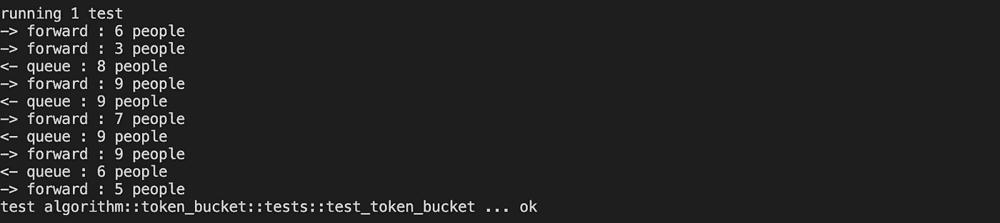

# 带 Rust 的令牌桶算法

> 原文：<https://towardsdatascience.com/token-bucket-algorithm-with-rust-4fa130c08ca8>

## 周末建设和学习。这个周末让我们用铁锈做一个象征性的桶。

我开始写作之旅已经快三年了。

每个周末，除了孩子和家庭活动之外，只要我有时间，我就会进行代码演练或编写代码和学习的想法。

你们的支持是让我不断前进，写出更多精彩学习分享的最重要动力。

你可以看看我的其他系列和不同主题的文章。

 [## 魏黄-中号

### 在媒介上阅读黄炜的作品。我喜欢学习。学会成功。每天，魏煌和其他成千上万的人…

jayhuang75.medium.com](https://jayhuang75.medium.com/) 

# 令牌桶是什么？

先说“限速”。每个软件工程师都明白“速率限制”是如何通过监控传入的请求并确保它们不违反阈值来管理 API。

我们正在定义每单位时间的请求率，并排队/拒绝发送超过我们的速率中描述的请求数的传入请求。

我们需要一种测量和跟踪的方法来实现这一点。具体来说，有两种主要算法可以实现这一点。

1.  令牌桶算法。
2.  漏桶算法。

> 让我们来关注一下令牌桶算法。我这里用的比喻是电影院。

克里斯特·卢哈尔斯在 [Unsplash](https://unsplash.com?utm_source=medium&utm_medium=referral) 上的照片

1.  一个电影院(桶)有预定义的最大容量(代币)和在此期间进入电影院的平均人数(比率)。
2.  每一批进电影院的人都会消耗来自电影院(桶)的容量(代币)。
3.  如果容量允许(有足够的代币)，人们可以从事以下活动，例如观看电影。
4.  如果没有足够的可用容量(令牌),我们可以根据您的使用案例和策略，拒绝即将到来的一批人的访问或排队。

这些步骤是我们需要在代码中反映的业务逻辑。

# 让我们编码

> *免责声明，该代码主要侧重于逻辑演练，可能不包含一些实现细节或性能调优。*

> 编码就像写一个故事。

在这个用例中，让我们从什么开始。

## 什么

Rust 中的结构是我们想要处理的对象。在这种情况下，我们查看令牌桶，其中包含容量(max_tokens)、平均人数(rate)、current_tokens、last_refill_timestamp 将是公式的变量。

令牌桶结构—按作者

## 怎么

构建新令牌桶的方式，我们可以考虑我们的第一个“如何”**如何**初始化新令牌桶。

令牌桶构造器—按作者

接下来的**如何**将是基本公式，私有核心引擎，来更新令牌桶的状态。

令牌桶更新—按作者

T 主要想法是检查最后更新的时间戳，并根据预定义的速率确定将有多少令牌添加到当前容量。

一旦它被更新，我们可以决定我们的下一步行动。

在下一个动作中，我们将把它塑造成一个 trait，它对令牌桶的动作函数进行分组。

令牌桶特征—按作者

最后**如何**将如何处理即将到来的人，一个公共功能控制与中央核心更新功能触发的时间间隔内。

令牌桶句柄—按作者

## 让我们测试一下

电影院我们最多能容纳 10 个人，平均两个人，输入速率，让我们用今天的 10 场电影来测试它，每部电影只有 2 秒。(仅供演示，我不相信有 2 秒钟的电影存在:)

令牌桶测试—按作者

令牌桶测试结果—按作者

# 最后的话

从逻辑代码演练的角度来看，我们主要了解了 Rust Token Bucket 算法。

请加入我的中码学习连载，获取最新更新。

 [## 用我的推荐链接加入媒体-黄伟

### 作为一个媒体会员，你的会员费的一部分会给你阅读的作家，你可以完全接触到每一个故事…

jayhuang75.medium.com](https://jayhuang75.medium.com/membership) 

另外，你可以用下面的链接给我买一杯咖啡，让我有动力在周末进行更多的锻炼和学习。

 [## jayhuang75 是编程、编码、工程和领导博客

### 嘿👋你现在可以给我买一杯咖啡，让我有动力在周末进行更多的建设和学习。

www.buymeacoffee.com](https://www.buymeacoffee.com/jayhuang75)