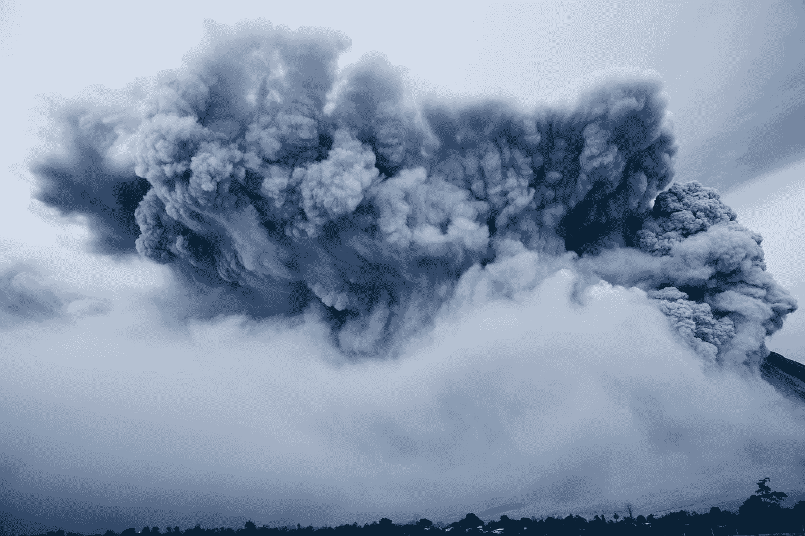
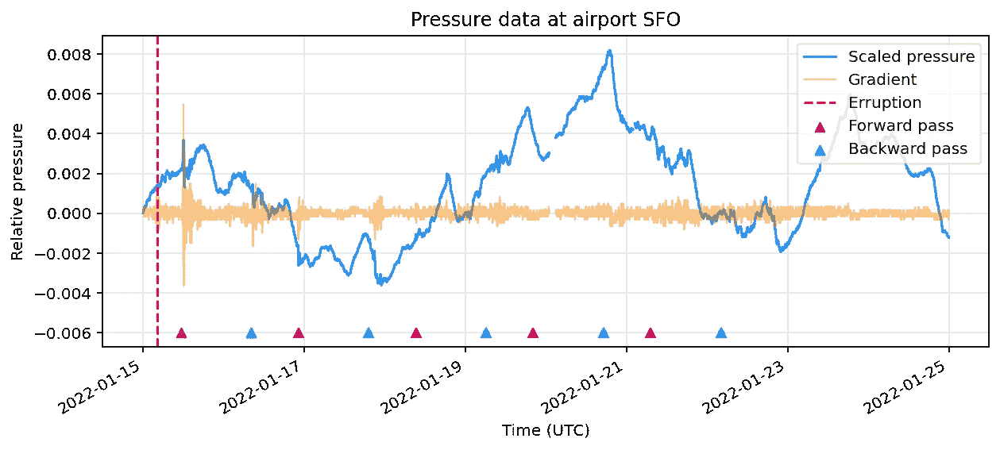
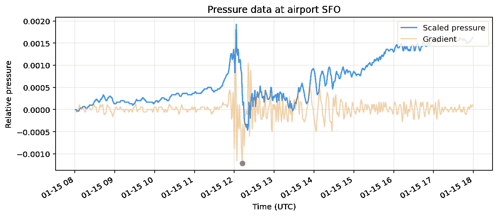
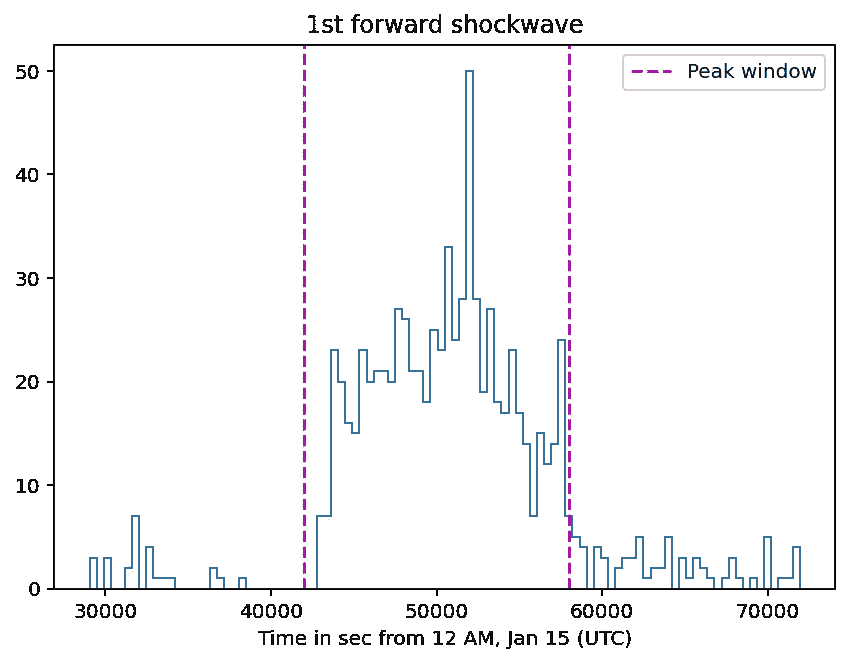
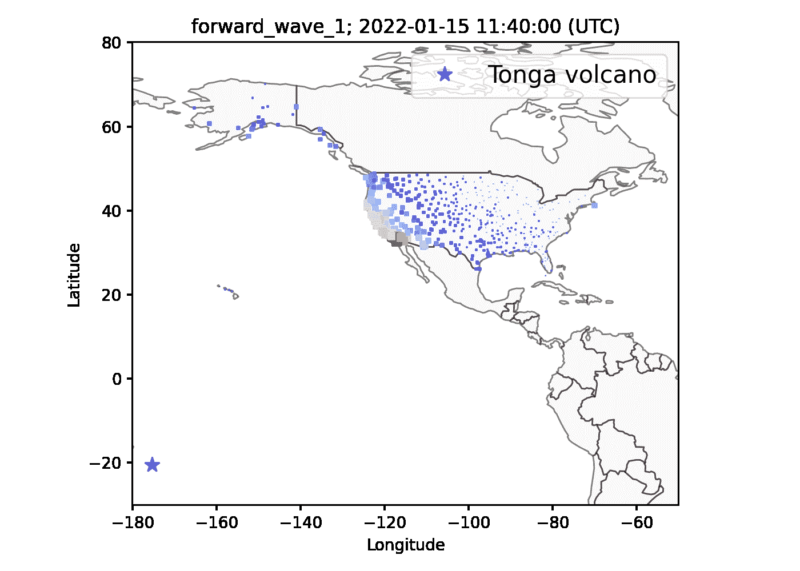
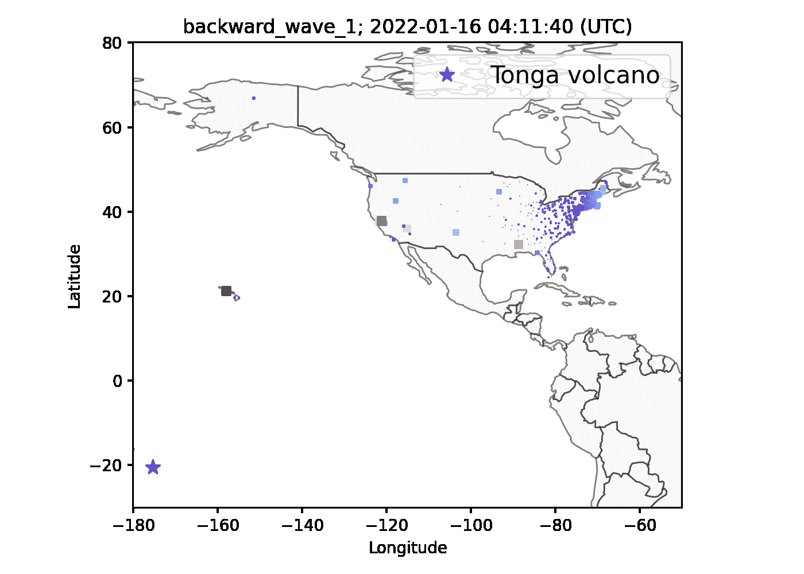

# 汤加火山:可视化冲击波传播

> 原文：<https://towardsdatascience.com/tonga-volcano-visualizing-the-shockwave-propagation-75dcfbadef76>

## 利用气压数据制作穿越美国的冲击波动画。



由[约什·金斯利](https://unsplash.com/@yoshginsu?utm_source=medium&utm_medium=referral)在 [Unsplash](https://unsplash.com?utm_source=medium&utm_medium=referral) 拍摄的照片

# 介绍

2022 年 1 月 15 日，**汤加北部的洪加-洪加哈派**火山经历了一次[猛烈喷发](https://www.jpl.nasa.gov/news/tonga-eruption-sent-ripples-through-earths-ionosphere)。爆炸释放的能量相当于几十兆吨 TNT 炸药，并引发了海啸，爆炸如此猛烈，以至于声波冲击波传遍了整个地球表面。

有趣的是，随着冲击波的传播，它压缩空气并在气象站的大气压力传感器中产生信号。在这项研究中，我们使用 GeoPandas 和 matplotlib 可视化了穿过美国的高能冲击波。

# 数据收集和探索

我们使用的公共数据集来自由爱荷华州立大学的爱荷华环境 Mesonet 维护的 [ASOS 网络](https://mesonet.agron.iastate.edu/ASOS/)，并且[可供公众使用](https://mesonet.agron.iastate.edu/disclaimer.php)，在该网络中，来自美国所有机场的历史气象数据以一分钟为间隔进行记录。我们感兴趣的测量是大气压力(以英寸汞柱测量)。 [Iowa Environmental Mesonet 网站](https://mesonet.agron.iastate.edu/request/asos/1min.phtml)为我们提供了查询其数据的 python 脚本，简化脚本(带多线程加速下载)可以在[这里](https://github.com/yanglyu902/tonga-volcano-shockwave-study/blob/main/get_data.py)找到。对于这项研究，我们下载了从 1 月 15 日午夜(UTC)到 1 月 25 日的 10 天数据。

首先，我们检查旧金山国际机场(SFO)的气压测量。蓝色曲线显示了相对于 t = 0 时测量值的压力测量值。黄色曲线显示使用`np.gradient()`计算到二阶精度的相对压力梯度(放大 30 倍以便可视化)。梯度的每一次突然下降都对应于冲击波的通过。



SFO 的压力数据(蓝色)和比例梯度(橙色)。品红色/青色:冲击波的向前和向后通道。

因为冲击波是一种围绕地球传播多次的圆形波，如这里的模拟[所示](https://twitter.com/an_amores/status/1484516695087759363)，每个梯度下降应该对应于冲击波的“**向前”**或“**向后”** **通道**，由洋红色和青色三角形标记表示。标记的时间戳计算如下(假设冲击波以音速传播):

```
forward: t(eruption) + t(Tonga to SFO) + N * t(go around Earth)
backward: t(eruption) - t(Tonga to SFO) + (N+1) * t(go around Earth)
```

因为压力梯度的突然下降在两次向前通过后不再明显，我们将只看到前两次激波通过。

# 可视化冲击波

首先，我们选择冲击波第一次“向前”通过(对应于第一个洋红色标记)周围的 12 小时时间窗口中的数据，即 1 月 15 日，上午 8 点到下午 8 点。空值大于 90%的机场被删除。然后，我们将冲击波的到达时间定义为对应于最小负梯度的时间。下图显示了 SFO 冲击波到达时间(红点)的计算结果。



SFO 的压力和梯度。红点:定义的到达时间。

然后我们用同样的方法计算所有机场的到达时间。还记录了每个机场到达时的梯度幅度。为了稍后创建更清晰的可视化，我们检查了所有机场的到达时间分布，并选择了中心峰值(在下图中两条紫色线之间),移除了到达时间异常的机场。



所有机场的到达时间分布。

一个有趣的观察是梯度的**幅度**作为到达时间的函数而减小。下图显示了对所有过滤机场的梯度振幅与时间数据进行的线性回归；观察到统计上显著的负相关。这是意料之中的，因为冲击波**在传播过程中会损失能量**。


内层机场梯度幅度与到达时间的关系。

最后，我们可以使用计算出的到达时间信息来可视化冲击波在美国的传播！在下面的 GIF 中，在每一个时间步(帧)，我们根据相应的冲击波到达时间和时间步之间的差异来改变站的颜色和大小。正如你所看到的，汤加火山爆发的能量如此之大，以至于一股压力波正在全国蔓延。



第一次向前通行。

# 地球是球形的

记住，冲击波是一种圆形的压力波，它会穿过整个地球。这意味着我们可以观察到压力波“向后”传播，因为它的一部分从地球的另一边向美国传播。

如果我们使用第一张图中第一个青色标记附近的数据对到达时间进行同样的计算，我们会得到下面的动画。



第一个反向通道。

当然，随着时间的推移，冲击波阵面的形状会发生扭曲，因为地球的形状是椭球形的。这大概解释了上面波前后面的搞笑“尾巴”；也可能是由于其他数据假象。

# 结论

我们利用机场的气压数据成功地显示了汤加火山冲击波穿过美国。正如我们提到的，冲击波围绕地球**传播了多次**，我们鼓励你在 Github 上用我的代码[尝试可视化后面的传播！剧透警告:第二和第三波通道在视觉上是可识别的，但是数据变得更加嘈杂。](https://github.com/yanglyu902/tonga-volcano-shockwave-study)

鸣谢:这项工作的动机来自加州大学伯克利分校 [AY 250: Python 研讨会](https://github.com/profjsb/python-seminar)的一个家庭作业项目。