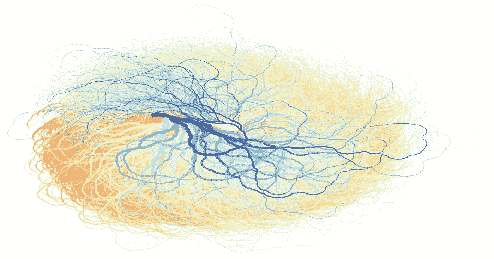
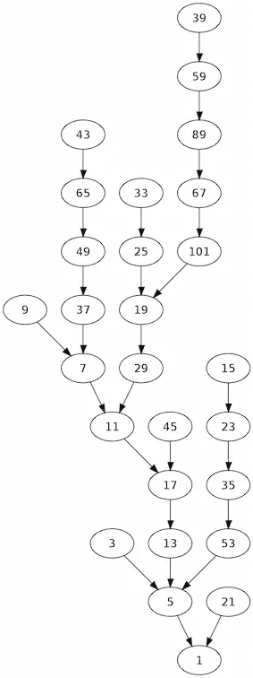
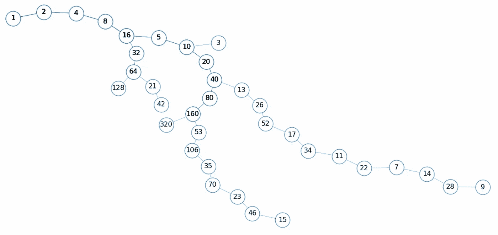
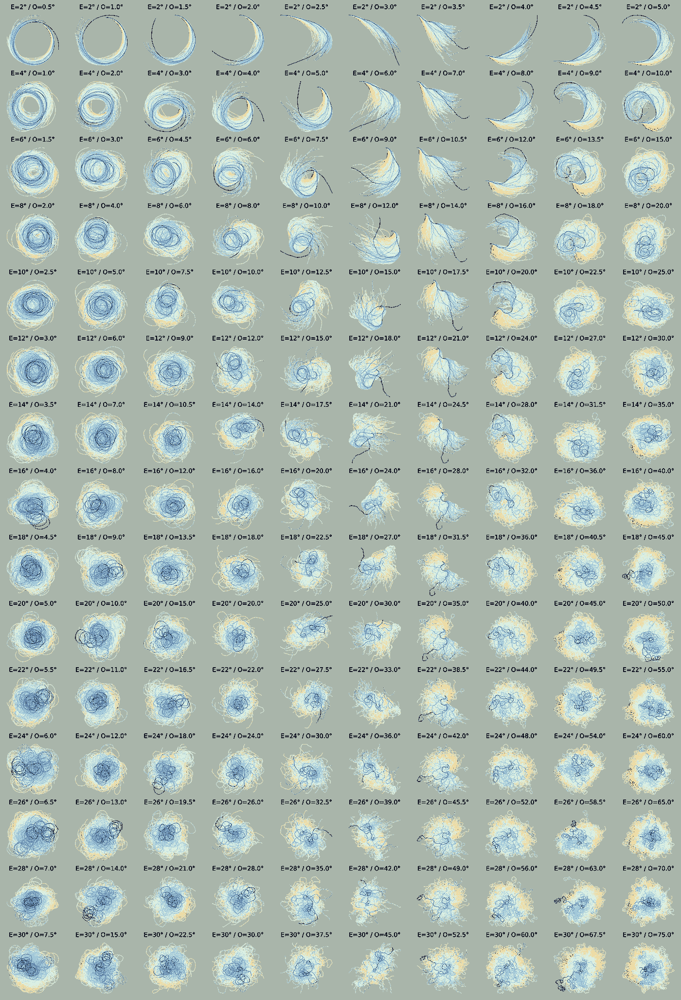
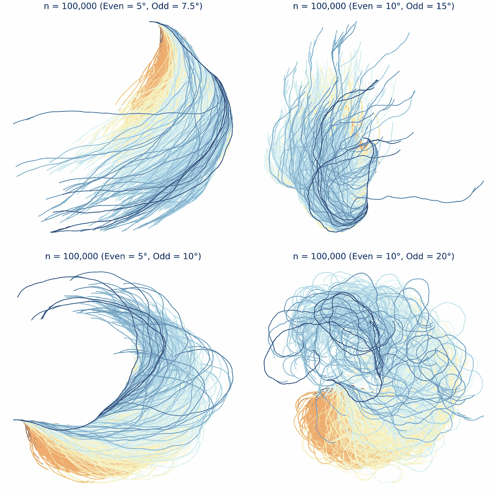
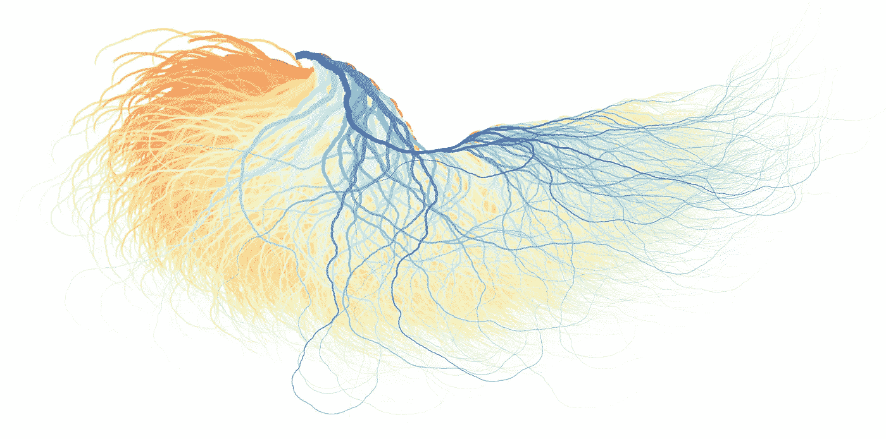

# 太简单了，无法解决

> 原文：<https://towardsdatascience.com/too-simple-to-solve-1758d63d562f>

## 柯拉茨猜想数据的可视化探索

初始值 *≤ 1，000，000* 的 100，000 个排序序列的可视化。图片作者。

这是一个简单到连一年级学生都能理解的数学问题，但它却如此复杂，以至于世界上最伟大的数学家都警告其他人不要去做。

开始是这样的。选择一个数字。如果是偶数，就除以 2。如果是奇数，乘以 3 再加 1。用新号码重复。数到 1 就停下来。

你看到了吗？简单。无非就是简单的整数除法，乘法，加法。例如，从 20:

*   20 是偶数，所以我们除以 2 得到 10；
*   10 也是偶数，所以除以 2 得 5；
*   5 是奇数，所以我们把它增加三倍，再加 1，得到 16。
*   16 是偶数，所以我们把它除以 2 得到 8，再(4)再(2)再(1)。
*   我们已经点击了 1，所以我们完成了。为什么？井 1 是奇数，所以可以将它增加三倍，加上 1 得到 4，然后 2，然后 1。我们陷入了一个*4–2–1*的循环中，因此当我们数到 1 时我们就完成了。

因此， *n=20* 的顺序是 *20，10，5，16，8，4，2，1*；其长度(或*总停止时间*为 8，其最大值(或*高度)*为 16。规则看似简单，但不同的数字会产生非常不同的、不可预测的序列。例如，n *= 127* 的序列有 111 个数长，在回落到 1 之前达到 9232 的高度；这是用粗体显示的奇数:

> **27** ，82， **41** ，124，62， **31** ，94， **47** ，142， **71** ，214， **107** ，322， **161** ，484，242， **121** ，364，182， ****395** ，1186， **593** ，1780，890， **445** ，1336，668，334， **167** ，502， **251** ，754， **377** ，1132，566， **283** 2734， **1367** ，4102， **2051** ，6154， **3077** ，9232，4616，2308，1154， **577** ，1732，866， **433** ，1300，650，**

这些序列被称为*科勒兹序列*或*轨道，而*科勒兹猜想*——*以[洛萨·科勒兹](https://en.wikipedia.org/wiki/Lothar_Collatz)命名——声明无论我们从什么正整数开始，应用上述规则总会把我们带到*4–2–1*。

到目前为止，这个猜想抵制了所有证明它的尝试，包括许多世界顶级数学家的努力。已经取得了进展，但解决方案仍然遥不可及，有些人认为目前的数学水平还不能解决如此简单的问题！事实上，数学家们的建议往往是，追求这一职业生涯终结的追求太危险了，一个老笑话是，这个问题是俄罗斯在冷战时期发明的，旨在减缓西方数学的进步。

> “数学可能还没有准备好解决这样的问题”——保罗 ready

但这是一个如此简单的问题，很难抗拒。例如，下面几行代码将获取一个数字 *n* ，并生成到达*4–2–1*所需的数字序列。现在我们可以生成任意多的序列。

Python 代码为一个数字 n 生成一个排序序列/轨道。

因此，我对 Collatz 的主要兴趣是作为有趣数据的来源。这是另一个例子，数论领域作为丰富的数据来源迫切需要探索和可视化。我第一次发现这个猜想是在[数字爱好者](https://www.google.com/url?sa=t&rct=j&q=&esrc=s&source=web&cd=&ved=2ahUKEwjM6_iG7Jv3AhVRUMAKHfW6B7YQyCl6BAgDEAM&url=https%3A%2F%2Fwww.youtube.com%2Fwatch%3Fv%3D5mFpVDpKX70&usg=AOvVaw2Y4JAUxcrH4DFbbev4KGVe)上，自从我偶然发现阿肯色大学数学家[埃德蒙·哈里斯](https://maxwelldemon.com/edmund-harriss/)的[精彩的 Collatz 可视化](https://www.newscientist.com/article/2139238-mathematics-has-a-bad-hair-day/)后，它就一直在我的*待办事项列表*上。因此，在巧克力蛋和一些休息时间的包围下，这个复活节我决定尝试再现埃德蒙的一些精彩画面。

一种常见的可视化柯拉茨数轨道的方法是使用一个有向图。例如，下图显示了一组小整数的图表。这些序列都收敛到 1，正如 Collatz 猜想所预测的那样；不失一般性，仅示出了奇数。

显示小数目排序序列的有向图:由[维基百科](https://commons.wikimedia.org/wiki/File:Collatz-graph-50-no27.svg)提供。

E [德蒙德·哈里斯](https://maxwelldemon.com/)走得更远——至少从美学的角度来看——提出了一种新的方法来渲染这些序列，产生更有机、更直观的数据表示。

基本想法很简单。给定的序列/轨道被渲染为一组相连的单位长度线段，但是每个线段的角度是根据它对应的是偶数还是奇数来选择的。偶数产生顺时针旋转，而奇数产生(通常较小)逆时针旋转。例如，下图显示了小数字的轨道示例，偶数角为 23 度(顺时针)，奇数角为 42 度(逆时针)。与早期更传统的有向图相比，这种视觉化已经有了更有机的感觉。

柯拉兹轨道的样本。图片作者。

通过一些小的调整，事情变得有趣多了，比如去掉标签和添加一些颜色。下面的可视化网格显示了各种不同的偶数/奇数角度的修改结果，每个角度都是从高达 1，000，000 的初始值中随机选择的 10，000 个初始值。我们可以看到不同的角度组合如何改变最终视觉形式的形状。

不同偶(E)角和奇(O)角对的哈里斯式可视化网格。基于从初始值中随机选择的一组 10，000 个初始值，每个可视化对应于相同的一组 10，000 个轨道，直到 1，000，000 个。图片作者。

为了更清楚，下面的四个图显示了从初始值到 1，000，000 随机选择的 100，000 个序列的较大样本的较小偶数和奇数角度组的这些修改的结果。

从高达 1，000，000 的初始值中随机选择的一组 100，000 个初始值的 100，000 个轨道的类似 Harriss 的可视化。每次观想都使用不同的偶角和奇角组合。图片作者。

生成这些图像中使用的 Collatz 轨道的 Python 代码如下所示；为了方便起见，Matplotlib 用于绘制线段，但也可以使用各种其他库。为了生成给定的图像，需要迭代一组选定的初始数字。

Python 代码，用于生成单个 Collatz 轨道的埃德蒙·哈里斯式可视化。作者代码。

W 这里到下一个？我认为有几个调整将有助于增强这些视觉化的有机本质，并进一步提高它们的美学效果。

*   首先，我们可以添加一个衰减参数来逐渐减少对应于一个轨道的各个线段的长度；这将特别减少较长轨道的长度，并潜在地为观想创造一些额外的空间。
*   第二，我们可以减少线段的厚度，让每一条都逐渐变细，让最长的轨道在极端处变得更像线。
*   最后，我们还可以调整线段的透明度，使线条逐渐变得不那么饱和，在极端情况下更加透明。

下面提供了实现这些更改的修改后的代码。请注意，这一次必须单独绘制线段，以便可以用特定的线宽/线宽和透明度/alpha 值来呈现每一条线段。和以前一样，代码使用 Matplotlib 作为绘图库，但是只需稍加修改就可以使用任意数量的替代库。

Python 代码，用于生成 Collatz 轨道的修改后的 Edmund Harriss 可视化，包括默认参数设置。作者代码。

再一次，为了使用这个代码生成一个完整的可视化，需要迭代一组期望的初始值。例如，下面的可视化是使用 200，000 个 Collatz 轨道创建的，这些轨道基于从所有这些轨道中采样的 200，000 个初始值，直到 1000，000 个。

200，000 个柯拉茨轨道的可视化(偶数转角= 11.45，奇数转角= 20.61)

这一次我选择了一对新的偶角和奇角来创造一种视觉效果，在过于统一和过于混乱之间取得了更好的平衡。新的锥形和透明效果确实有助于创建一个非常令人愉快的视觉效果，看起来非常自然。

在这篇文章中，我讨论了看似简单的柯拉茨猜想，几十年来，这个猜想已经被证明对许多人来说，既吸引人又令人沮丧。

我对这个问题的兴趣来自不同的地方。最近，我发现数论是数据科学和可视化实验中有趣数据的[巨大来源。素数、重复分数以及现在的柯拉茨猜想都提供了无限的复杂数据和有趣的假设，这对于锻炼和发展我的数据科学和可视化技能以及探索一些有趣和新颖的计算艺术形式的创作来说是理想的。](/discovering-the-shape-of-fractions-e9034ab0085c)

在我看来，像这里产生的这些可视化确实有助于捕捉像柯拉兹规则这样简单的公式所产生的复杂性——秩序和混乱之间的微妙平衡——这无疑是为什么柯拉兹猜想被证明是如此难以破解的原因。

功劳归功劳:大部分艰难的工作都是由埃德蒙·哈里斯完成的，他的工作为我的起步提供了最初的动力和方向。但我希望我的改编也能增加一些价值，也许它们会鼓励其他人开始他们自己的旅程……但要小心，因为有些人警告说，柯拉茨猜想是对不知情的探险家的诱惑……

如果您有兴趣阅读数据科学和数论交叉领域的进一步探索，您可以在以下内容中找到更多信息:

*   [弥合评估差距](/bridging-the-evaluation-gap-5e8af3e16ff0)
*   [伪素数隐藏在复合倒数之中吗？](/are-pseudoprimes-hiding-out-among-the-composite-reciprocals-c8952cfe1ab4)
*   [素数&循环倒数](/prime-fractions-cyclic-reciprocals-b1074f6ebc3b)
*   [发现分数的形状](/discovering-the-shape-of-fractions-e9034ab0085c)