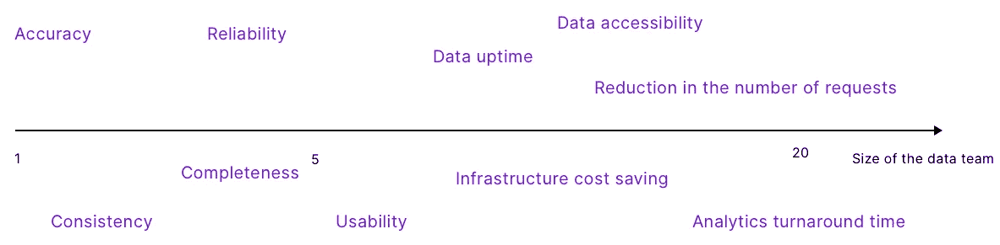

# 数据团队的 10 大指标

> 原文：<https://towardsdatascience.com/top-10-metrics-for-a-data-team-782999eb614f>

## 以及如何去测量它们

数据团队的十大指标—图片由 [Castor](https://www.castordoc.com/) 提供

衡量数据 ROI 是数据团队面临的最大挑战之一。有许多方法可以做到这一点，没有既定的最佳实践。[在之前的一篇文章中，受与数据领导者](https://medium.com/p/9c60a939f247)讨论的启发，我们试图确定一个衡量数据团队绩效的框架框架。本文试图进一步完善这种方法，提出 10 个可识别的指标来衡量数据团队的绩效。简而言之，这篇文章代表了我们的数据 ROI 框架的骨架。我们最喜欢的数据团队指标如下:

> *精度*
> 
> *一致性*
> 
> *可靠性*
> 
> *完整性*
> 
> *可用性*
> 
> *请求数量减少*
> 
> *基础设施成本节约*
> 
> *数据可访问性*
> 
> *数据正常运行时间*
> 
> *分析周转时间*

这些度量标准分为三大类:数据质量度量标准、可操作性度量标准和团队生产力度量标准。我们在这篇文章中简要解释了这些类别是如何产生的，但是不要犹豫去检查我们之前关于这个问题的文章来理解我们是如何形成这个框架的。这里的主要思想是，数据团队经历不同的开发阶段，并且每个阶段对应于特定的指标。这个想法很直观:根据您的数据团队是 1 人还是 20 人，您将会看到不同的指标。

根据团队规模的数据团队指标—图片由 [Castor](https://www.castordoc.com/) 提供

# 数据质量指标

数据团队的首要任务应该是向利益相关者提供干净、可靠和易于理解的数据。在你关注其他事情之前，你需要勾选数据质量框。我们的前五个指标应该可以帮助您实现这一目标。

# 1.准确(性)

## 这是什么？

💡**数据准确性**是指每个可用的数据字段是否代表现实。

## 为什么重要？

准确的数据是确保项目顺利进行的先决条件。准确的银行信息意味着您可以向客户收费，准确的电话号码意味着您可以随时联系到他们，等等。相反，不准确的数据往往会导致挫败感和高昂的运营成本。这个标准听起来很基本，但是每个组织都要处理准确性问题。获得正确的数据准确性只会让你站在数据分析比赛的起跑线上:它不会让你走得很远，但你不能在没有勾选的情况下开始比赛。

## 如何衡量？

测量精度相当直观。您需要计算准确数据和可用数据总量之间的比率。

数据准确性公式—图片由 [Castor](https://www.castordoc.com/) 提供

正如你所想象的，棘手的部分是分子。事实上，它需要区分准确和不准确的数据。理想情况下，这应该以**自动方式**执行，以防止任何人无休止地滚动数据集，拨打每个客户的电话号码，以确保其准确性。衡量数据准确性的关键是建立适当的规则，然后进行测试和评估来衡量数据集的质量。可以针对参考数据集或真实实体进行验证。

## 它看起来像什么？

应该为每个数据集计算数据准确性，并且数据集用户可以方便地访问数据准确性。它应该显示为一个百分比，并与公司达成协议，即在某个准确度阈值下，数据集不应用于分析。‍

# 2.一致性

## 这是什么？

💡**一致性**衡量应该匹配的实体实际上是否匹配。

## 为什么重要？

数据一致性确保分析能够正确捕捉和利用数据的价值。在大多数组织中，相同的信息可以存储在多个地方。如果这些信息在不同的地方都与相同的信息一致，我们就说数据是一致的。数据一致性确保具有相同名称的元素也具有相同的值。例如，如果你的人力资源信息系统显示一名员工已经不在那里工作了，但你的工资单显示他仍在收到一张支票，这就是不一致的。

## 如何衡量？

数据一致性通常显示为各种记录中匹配值的百分比。

数据一致性公式—图片由 [Castor](https://www.castordoc.com/) 提供

## 它看起来像什么？

一致性很难定义和计算。这个度量应该在不同的粒度级别进行计算:两个同名的表应该包含相同的信息，两个同名的列应该具有相同的结构。在最小的粒度级别上，从相同、一致的数据计算两个指标应该得到完全相同的数字。‍

# 3.可靠性

## 这是什么？

💡**可靠数据**是随着时间的推移保持准确和一致的数据**。**

## 为什么重要？

可靠性指的是数据质量和准确性能否长期保持。如果您的数据集在 T 时刻保持一致和准确，这很好，但您希望它在 T+1、T+2、T+3 等时刻保持一致和准确。如果数据不可靠，随着时间的推移，你就无法信任它。

## 如何衡量？

要衡量数据的准确性，应该查看用于创建和刷新数据的过程。这些过程被称为数据管道。如果数据管道完成了它们的工作，数据将被及时更新、刷新和交付。为了测量数据的准确性，你应该观察你的数据管道的健康状况，以及它们断裂的频率。数据准确性可以通过没有数据事故的时间百分比来获取。查看数据血统还可以让您更好地了解数据的可靠性。

数据可靠性公式—图片由 [Castor](https://www.castordoc.com/) 提供

## 它看起来像什么？

在数据集级别表示数据可靠性是最合适的。这将有助于您了解决定是否使用数据集所需的洞察力。例如，在使用过去两个月内中断十次的数据集之前，您可能要小心谨慎。‍

# 4.完全

## 这是什么？

💡**完整性**是指你手头信息的全面性。

## 为什么重要？

你可能有很多数据，如果不完整，就没有用。假设您正在查看一个客户的数据集，您只有客户的姓名，而没有他们的电子邮件地址，这使得您无法联系到任何人。你的数据不完整也没用。

## 如何衡量？

数据完整性的衡量标准是**缺失数据条目的百分比**。例如，有 100 个缺失字段的 500 列的完整度为 80%。

完整性公式—图片由 [Castor](https://www.castordoc.com/) 提供

## 它看起来像什么？

完整性也是一个度量标准，它非常适合在数据集级别显示。查看数据集的完整程度将指导您决定是使用数据集还是继续寻找更相关的信息。比方说，你偶然发现一个完备性为 15%的数据集。你可能更喜欢走自己的路，找到另一个更完整的。‍

# 5.可用性

## 这是什么？

💡**数据可用性**是指数据是否能被流畅地使用和理解。

## 为什么重要？

当您的数据易于理解并以明确的方式正确解释时，它就是可用的。例如，当一个外观仪表板很难理解时，你就有一个可用性问题。总的来说，用元数据丰富你的数据(即记录你的数据)使它在移动中变得可用和容易解释。即使您的数据在所有其他数据质量指标方面表现良好，它也很可能无法使用。事实上，这可能仍然意味着用户不信任、不理解或找不到数据。

## 如何衡量？

可用性可以通过查看您的数据资产的文档的**级别，或者数据用户的数量来衡量。总的来说，用元数据丰富你的数据(即记录你的数据)使它在移动中变得可用和容易解释。这里要查看的关键指标是记录的列的百分比。展示和传播您的数据文档的最佳方式是使用一个 [**数据目录**](https://www.castordoc.com/blog/data-catalog-benchmark-for-mid-market-companies) 。**

数据可用性公式——图片来自 [Castor](https://www.castordoc.com/)

## 它看起来像什么？

这是一个在每个数据集上显示的好数字。它还提高了数据团队的生产力，因为它鼓励利益相关者使用最流行的文档。

# 可操作性度量

‍Once:你的数据质量已经超过 80%，这意味着你可以从你的数据中得到明确的答案，现在是第二阶段的时候了:**数据可操作化**。对于一个简单的概念来说，操作化是一个复杂的词。这意味着将您的高质量数据交给领域专家，以便他们可以在自己的工作中更快地移动，而不必依赖数据团队来完成他们的请求。运营分析不是使用数据来影响长期战略，而是为业务的日常运营提供战略。‍

# 6.请求减少

## 这是什么？

💡此指标指特定业务类别中请求数量的**减少。**

## 为什么重要？

衡量数据可操作性的一个好方法是查看您允许其他团队独立解决**的问题的数量**，这要归功于所提供的基础设施。例如，当数据团队相对年轻时，它可能会收到来自其他团队的许多关于归因的请求。随着数据基础设施的改善，以及运营团队轻松访问数据，依赖数据团队解决归属问题的需求将会减少。营销团队在解决这类问题时变得更加独立，最终将归因相关请求的数量降至零。衡量数据可操作性的一个好方法是**查看不同类别中请求数量的减少**。你能从列表中剔除的问题越多，你的数据就越容易操作。

## 如何衡量？

评估这一指标的一个好方法是测量自支持查询的百分比。也就是说，企业完全可以自己完成的查询。它反映了这样一种思想，即数据团队应该专注于卸载查询，并为业务提供基础设施来自己运行查询。([杰西，2022](https://www.jesse-anderson.com/2022/03/kpis-every-data-team-should-have/) )

自支持查询公式的百分比—图片由 [Castor](https://www.castordoc.com/) 提供

## 它看起来像什么？

你应该记录几个月来每个类别的下降情况。这将使您清楚地了解团队独立处理的问题，以及哪些问题他们仍然需要依靠数据团队来解决。当您收到关于某个特定类别的**零个**请求时，您可以认为该特定类别中的数据完全可操作。‍

# 团队生产力指标

现在，您已经有了干净且可操作的数据。这使你成为数据世界中一个非常小的特权群体的一部分。您需要做的最后一件事是衡量数据团队成员的工作效率。尽管它将恢复数据质量和数据操作化特性，但这些都很重要。事实上，你想确保你的团队成员做好他们的工作。这并不简单，因为你团队中的人有不同的任务。数据工程师的使命是通过提供良好的数据基础设施让每个人的生活变得更轻松，而数据分析师则专注于帮助人们做出更好的数据驱动型决策。Mikkel Dengsoe 很好地解释了工程和分析之间的区别。关键是，他们有不同的任务，应该有不同的衡量标准。这是本部分的目的。

# 7.基础设施成本节约

## 这是什么？

💡**由于良好的数据管理和巧妙的工具选择，节省了成本**。

## 为什么重要？

除了向其他团队提供干净可靠的数据，数据工程师还负责**良好的数据管理。**这包括清理表格、归档不必要的表格，以及充分利用云所提供的优势。事实证明，良好的数据管理可以在**存储成本**方面节省大量资金。同样，数据工程师通常会寻求流程自动化或提高效率。这节省了时间和金钱。

基础设施成本的节约自然应该遵循良好的数据管理实践，并作为执行数据工程团队的自然回报。

## 如何衡量？

同样，这是一个合理的基本措施。您可以简单地查看基础设施成本降低的百分比。当然，你应该对这个数字持保留态度，并理解成本下降并不总是一个好兆头。成本下降是因为您的团队变得更有效率(好迹象)还是仅仅因为他们处理的数据比以前少了很多(不好迹象)？不管答案是什么，这个数字除了非常容易测量之外，还会告诉你一些事情。

## 它看起来像什么？

看看这些数字在几个月/几年内的变化，并相应地调整你的策略。‍

# 8.数据可访问性

## 这是什么？

💡该指标衡量数据人员访问数据的难易程度。

## 为什么重要？

乍一看，这个指标似乎有点愚蠢，但是您会惊讶地看到由糟糕的数据可访问性导致的沮丧程度。由于糟糕的文档或与数据治理计划相关的摩擦，数据科学家有时可能需要两到三天才能访问感兴趣的数据集。问题是，这些数据对于无法访问它们的人来说没有任何意义。

## 如何衡量？

这一指标并不容易衡量。你基本上是在寻找一个数据人员访问一个给定数据集所花费的平均时间。为了衡量这一点，您可以查看从请求访问数据集到获得访问权限之间的平均时间。这已经让您对贵公司的可访问性水平有了一个很好的了解。理想情况下，您还应该确定数据人员在仓库中找到所需数据集所需的平均时间。最直接的方法是做一个调查。

## 它看起来像什么？

你可以从全球层面来看这个数字。以及它的演变。如果这个数字非常高或者越来越低，也许是时候投资一个数据目录或一个更高效的数据治理计划了，这样可以同时实现数据保护和数据发现。‍

# 9.数据正常运行时间

## 这是什么？

💡数据正常运行时间指的是数据集准时交付*的**百分比时间**。*

## *为什么重要？*

*数据正常运行时间是一个关键指标，允许团队对工程团队的“乘数效应”进行量化。事实上，工程师很少影响组织中的顶级 KPI。它的使命是创建一个可靠的数据基础架构，然后充当“**倍增器”**，让分析团队更快、更高效地移动。数据正常运行时间是衡量这一基础设施质量的一个好方法，也是工程在多大程度上促进了分析生命的一个有力指标。它基本上是衡量数据可用和更新的频率。*

## *如何衡量？*

*数据正常运行时间是数据集按时交付的时间百分比。它总是相对于*预期频率*和 *SLA 要求*进行计算。*

**预期频率*指的是数据集的预期更新频率。这通常是每天、每小时或实时的。*

**SLA(服务水平协议)要求*是由数据生产者和消费者之间的 SLA 协议规定的频率条款，规定数据必须在何时更新。例如，SLA 可能会规定一个绝对时间，如早上 7:00，或者一个相对时间，如每 3 小时一次。*

*测量数据正常运行时间的最简单方法是测量数据停机时间(当数据没有按时交付时)，然后从 100%中减去这个数字。Barr Moses 在这篇[伟大的文章](/data-quality-youre-measuring-it-wrong-8863e5ae6491)中推导出了数据停机时间的公式。*

**

*数据停机时间公式—图片由 [Castor](https://www.castordoc.com/) 提供*

*例如，如果您在上个月有 15 个数据事件，每个事件需要 5 个小时来检测，3 个小时来解决，那么您的数据宕机时间估计为 120 个小时。‍*

# *10.分析周转时间*

## *它看起来像什么？*

*应该经常测量整个数据集的数据正常运行时间。观察它在几个月中的演变将会告诉你你的工程团队是否在更好、更有效地工作。*

## *这是什么？*

*💡周转时间指的是从提出数据驱动的问题到分析能够提供答案之间所经过的时间。*

## *为什么重要？*

*周转时间是衡量分析团队效率的一个很好的方法。这一指标最初是由 Benn Stancil 提出的。与工程团队相反，分析团队直接影响决策和顶级 KPI。他们的最终使命是为关键问题提供快速答案，从而启发组织的决策。在衡量他们的表现时，应该考虑到这一点。正如 Benn Stancil 所建议的，最好的方法是测量从提出问题到根据分析师给出的答案做出决定之间的时间。*

*以这种方式衡量分析性能的好处在于，它鼓励分析师将工作重点放在现实生活的决策上，防止他们迷失在探索性的数据分析中。*

## *如何衡量？*

*“当分析师被问到一个问题时，一个计时器就开始计时。当基于该问题做出决定时，计时器停止计时。分析师的唯一目标应该是最小化计时器上的小时数和天数。"( [B.Stancil，2022](https://benn.substack.com/p/method-for-measuring-analytical-work?s=r) )。因此，衡量分析周转时间的最佳方法是减去从提出问题到根据问题做出决定之间的时间。*

**

*分析周转时间公式——图片由 [Castor](https://www.castordoc.com/) 提供*

## *它看起来像什么？*

*应该为团队中的每个分析师计算这个数字，因为它最适合衡量个人绩效。你可以随意合计它来获得团队的总周转时间，但是单独测量它将允许你做出更多的战略决策。*

# *结论*

*数据分析的声称用途是增强组织内的决策。这是一个崇高的目标。然而，只有当数据是干净的，被决策者使用，并且你的团队成员是高效的，数据才会推动决策。这正是上面给出的度量标准所测量的。跟踪这些可以让你回答这样的问题:“我有高质量的数据吗？”，“领域专家是否将数据作为日常决策的一部分，或者他们是否仍然过于依赖数据团队？”以及“我的团队成员是否高效工作，完成他们的使命”。我们认为这三个维度最适合衡量数据团队的绩效，本文展示了在实践中如何做到这一点。*

# *关于我们*

*我们写了利用数据资产时所涉及的所有过程:从[现代数据栈](https://notion.castordoc.com/)到数据团队组成，再到数据治理。*

*在 Castor，我们正在开发一个数据文档工具 Figma，Slack generation。*

*想去看看吗？联系我们，我们将向您展示一个演示。*

**最初发表于*[*https://www.castordoc.com*](https://www.castordoc.com/blog/top-10-metrics-for-a-data-team)*。**