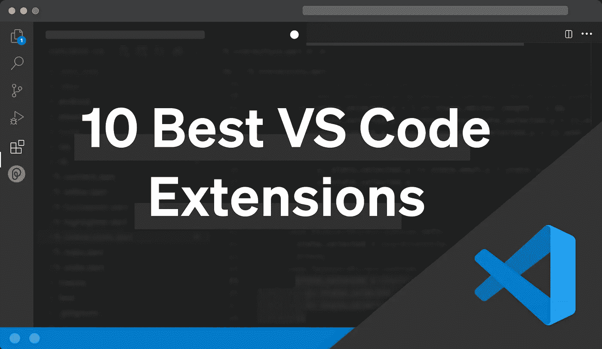
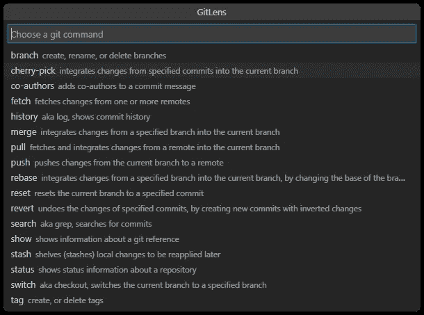
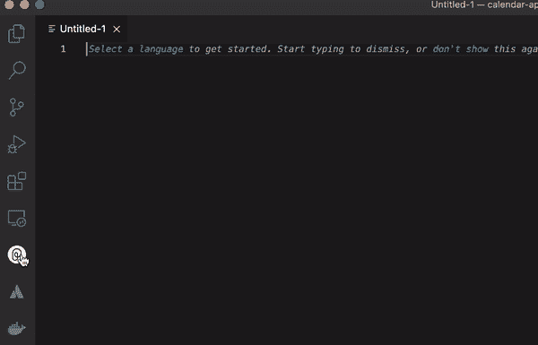
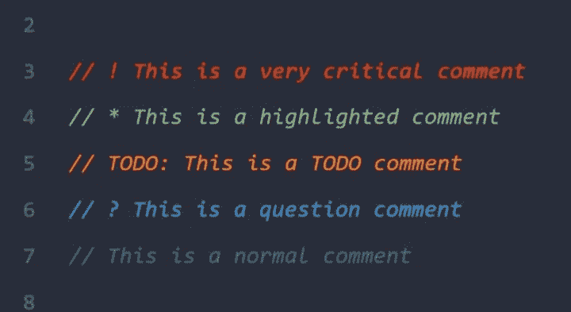
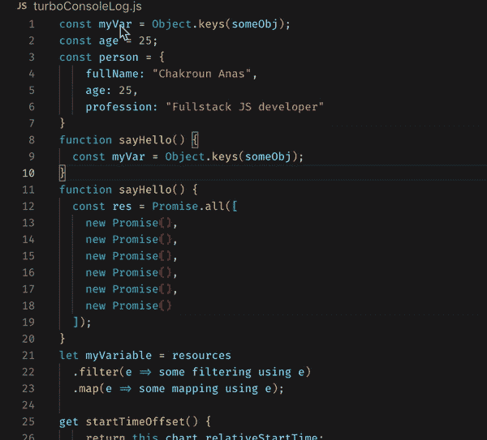
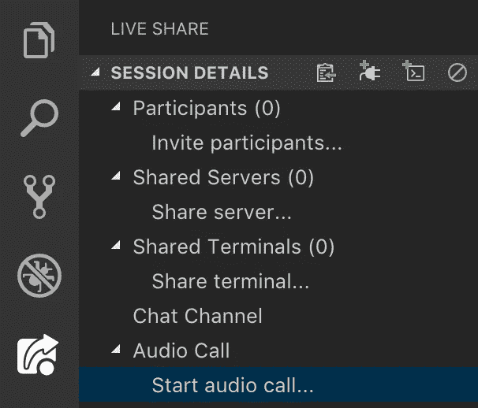
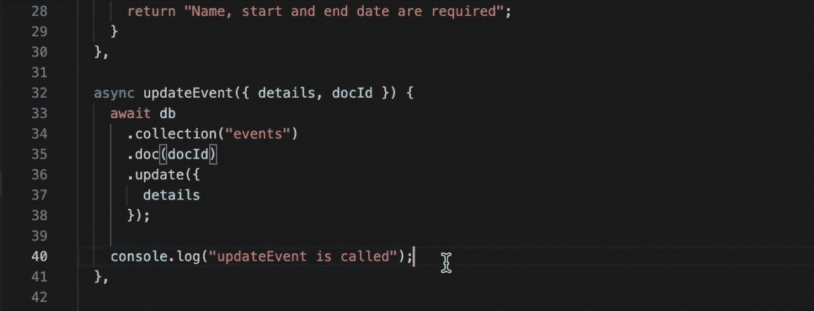
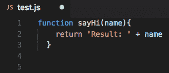
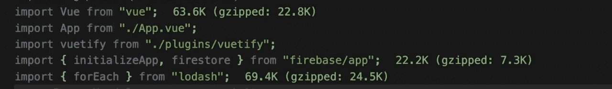

# 提高生产力的十大 VS 代码扩展

> 原文：<https://towardsdatascience.com/top-10-vs-code-extensions-to-boost-productivity-526595b18325>

## 您应该开始使用 VS 代码扩展来提高开发人员的生产力

VS Code 受欢迎的关键之一是其无与伦比的扩展生态系统，它提供了额外的功能并改善了整体编码体验。

10 个最佳 VS 代码扩展(图片由作者提供)

在这篇文章中，我将分享我的十大 VS 代码扩展的精选列表，这将大大提高你的生产力，使你成为一名更有效的开发人员。我们将深入研究这些扩展做什么，它们是如何工作的，以及为什么它们使编码更加容易。

[**GitLens**](https://marketplace.visualstudio.com/items?itemName=eamodio.gitlens)

GitLens 是一个非常流行的扩展，但由于它对任何开发人员的工作流程都很方便，所以总是值得一提。通常，作为开发人员，我们想知道谁写了一行代码或文件的作者，GitLens 允许您在 VS 代码文件中直观地显示 git 上下文。我最喜欢的扩展用例是当我需要找到合适的人来标记 PR 时。使用 GitLens，我可以预览每个文件的所有作者，然后使用这些信息来标记同行。文件的作者特别适合公关评论，因为他们有必要的背景来提供有价值的反馈。

除了查看行和文件周围的 git 上下文等基本功能之外，GitLens 还让您能够在编辑器中执行各种 Git 操作，而不是使用终端。使用 GitLens，您可以恢复、合并、甚至重置提交。如果您有兴趣了解 GitLens 的所有特性，文档内容丰富，涵盖了每一个特性。

Gitlens ( [来源](https://marketplace.visualstudio.com/items?itemName=eamodio.gitlens))

[**棋子**](https://code.pieces.app/install)

Pieces 是一个 AI 助手，可以让你保存自动分类的代码片段，将代码截图转换为文本，并根据编码模式自动保存常用代码。Pieces 的 VS 代码扩展允许您管理所有存储的代码片段，并将它们直接导入到编辑器中。然而，当你集成 Pieces 的其他应用程序时，比如它的 Chrome 扩展，Pieces 的真正力量就来了。只需 VS 代码和 Chrome 扩展，您就可以在任何网页上保存代码块，如 Stack Overflow，并将其直接导入 VS 代码文件或使用 Pieces 的自动完成功能导入。

要开始使用 Pieces，请下载 Pieces 引擎、Pieces OS 和 VS 代码扩展，Pieces OS 支持所有的集成，VS 代码扩展也可以在上面的网站链接中找到。

件(图片由作者提供)

[**更好评论**](https://marketplace.visualstudio.com/items?itemName=aaron-bond.better-comments)

更好的注释使开发人员能够使用完全可定制的标记系统更好地记录他们的代码。使用这个扩展，您可以通过定制不同注释类型的样式来获得语义上下文。例如，有了更好的注释，你可以让所有的`todo`注释在你的配置中显示为蓝色，当你查看一个有 todo 的文件时，它会立即显示为蓝色。我用更好的注释来表示常见的注释，如`bug`、`todo`、`query`和`question`。

更好的评论(图片由作者提供)

[**涡轮控制台日志**](https://marketplace.visualstudio.com/items?itemName=ChakrounAnas.turbo-console-log)

在编写 JavaScript 时，大多数人都喜欢说他们一直在使用调试器，但事实并非总是如此。有时，控制台日志记录只是开发过程中的一个必要部分，而 Turbo 控制台日志使它变得异常简单。使用 Turbo 控制台日志，您可以突出显示变量，使用键盘快捷键插入多个控制台日志，并使用一个命令删除所有日志。这对于加速 JavaScript 开发和调试确实至关重要。

涡轮控制台日志([来源](https://marketplace.visualstudio.com/items?itemName=ChakrounAnas.turbo-console-log))

[**LiveShare**](https://marketplace.visualstudio.com/items?itemName=MS-vsliveshare.vsliveshare-pack)

随着时间的推移，远程和混合工作变得越来越普遍，但这并没有降低协作和结对编程的重要性。LiveShare 使我们能够通过 VS 代码会话亲自模拟结对编程。使用 LiveShare，您可以邀请多达 30 人参加您的结对编程会议。如果您有 LiveShare 扩展包，其他人也可以跟随您处理文件、编辑或编写代码(取决于您授予的权限),并通过音频与您交谈。

LiveShare(图片由作者提供)

[**代码飞行者**](https://marketplace.visualstudio.com/items?itemName=formulahendry.code-runner)

优化和重构代码是开发过程的一个重要部分，而 Code Runner 是这个过程中不可或缺的工具。每当您想要测试代码片段时，Code Runner 都为您提供了突出显示您的代码并执行它以检查它是否工作的能力。编写许多行代码却不知道代码是否有效的日子已经一去不复返了。

代码运行者(图片由作者提供)

**Prettier 是一个非常固执己见的代码格式化程序，它在开发过程中强制执行 JavaScript 最佳实践。虽然 prettle 也是一个独立的 JavaScript 包，但是这个扩展的强大之处在于它可以被定制来在保存时根据 prettle 的配置重新格式化你的代码。Prettier 的唯一警告是它非常固执己见，会强行重新格式化和构建代码。如果这不是您想要的行为，它可能不是一个很好的选择，但是我坚信它有助于增强初学者的最佳实践。**

****

**更漂亮(作者图片)**

**[**码头工人**](https://marketplace.visualstudio.com/items?itemName=ms-azuretools.vscode-docker)**

**Docker 扩展有助于执行 Docker 操作，而不会留下 VS 代码。大多数开发现代应用程序的开发人员都使用 Docker 来封装他们的应用程序，通过这个扩展，任何开发人员都可以与他们的 Docker 容器、卷、网络等进行交互。除了执行所有涉及 Docker 的本地操作，开发人员还可以将图像推送到他们的容器注册中心。这个扩展真正支持从初学者到高级的任何级别的 Docker 开发。**

****

**Docker(图片由作者提供)**

**[**导入成本**](https://marketplace.visualstudio.com/items?itemName=wix.vscode-import-cost)**

**在编写 web 应用程序时，总会有关于应用程序包大小和性能的讨论。尽管这些讨论是必要的，也是重要的，但是围绕这些问题采取一些基本措施的最佳时机是在您编写代码的时候。Import Cost 通过在 Import 语句旁边显示导入的大小，帮助我们轻松地做到这一点。在引擎盖下，import cost 使用 webpack，当您更改导入报表时，它会立即给出反馈。如果您是从事 web 应用程序开发的前端开发人员，这一点很简单，也是必须的，因为应用程序的性能会影响用户体验、SEO 排名和转化率。**

****

**导入成本(图片由作者提供)**

**[**ESLint**](https://marketplace.visualstudio.com/items?itemName=dbaeumer.vscode-eslint)**

**和 Prettier 一样，ESLint 也是一个独立的 JavaScript 包，附带一个 VS 代码扩展。ESLint 这个包既是 linter，也是代码格式化程序，经常被许多 JavaScript 项目引导。使用这个扩展将会根据您设置的配置规则，提供实时改进代码的建议。同样，这有助于在您进行项目时，强制执行使用最佳实践来编写编写良好的代码的实践，而不是在以后考虑这些事情。**

****

**EsLint(图片由作者提供)**

**如果除了这里描述的以外，你有任何有用的扩展，请在下面评论它们，如果你知道任何新的或有用的扩展，请给这篇文章一个分享或赞！**