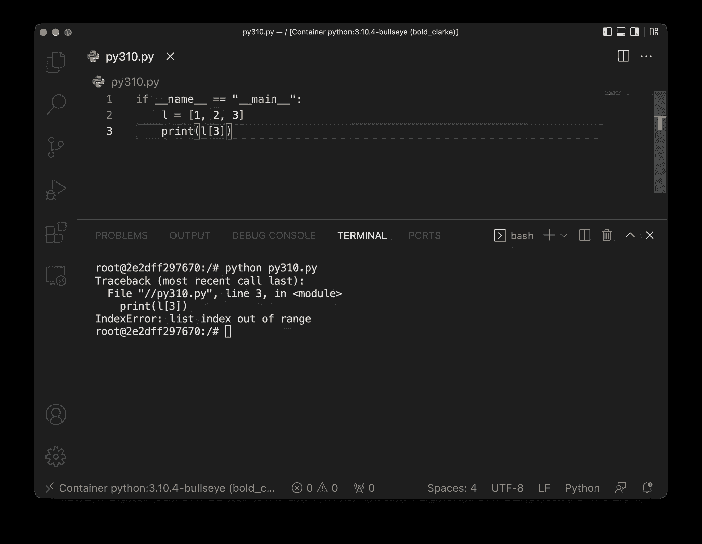
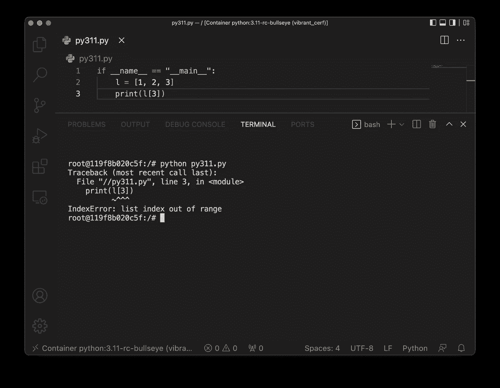
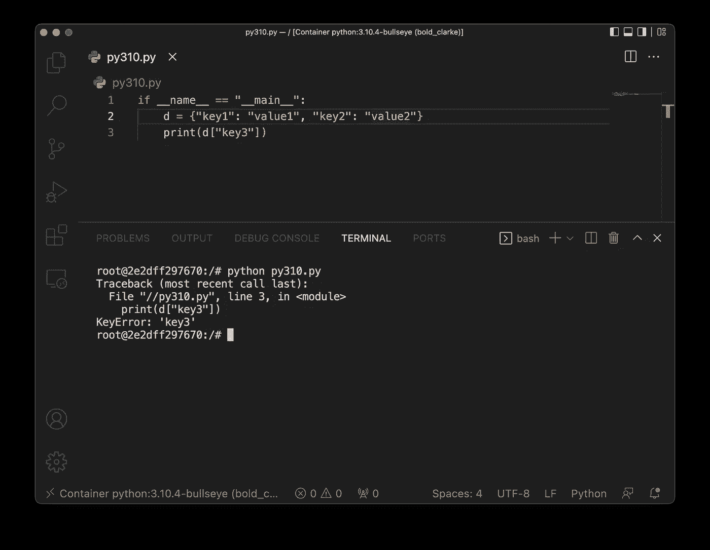
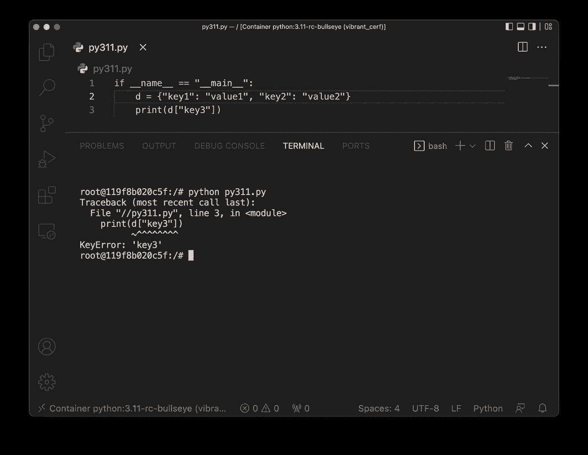
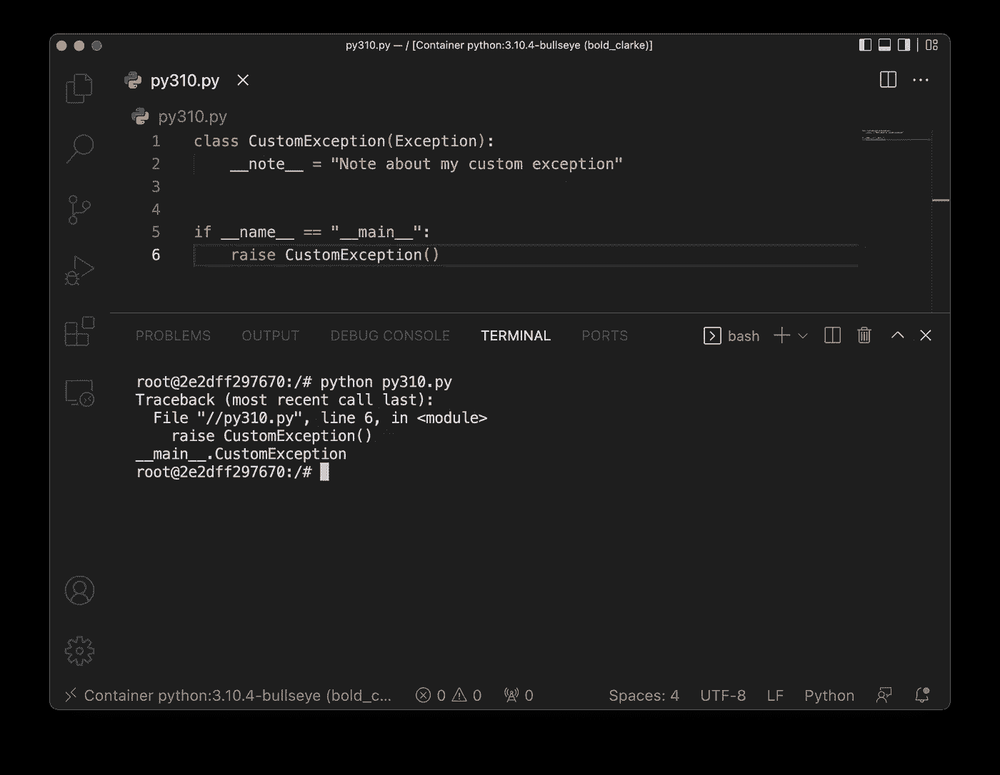
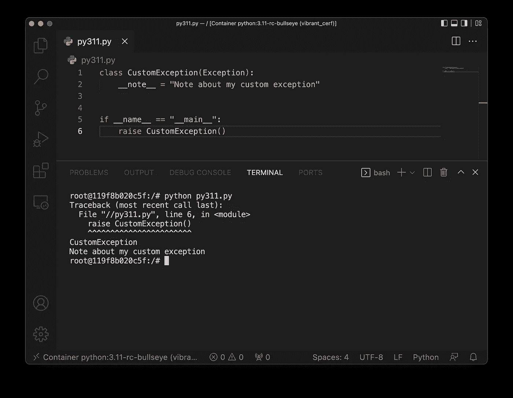
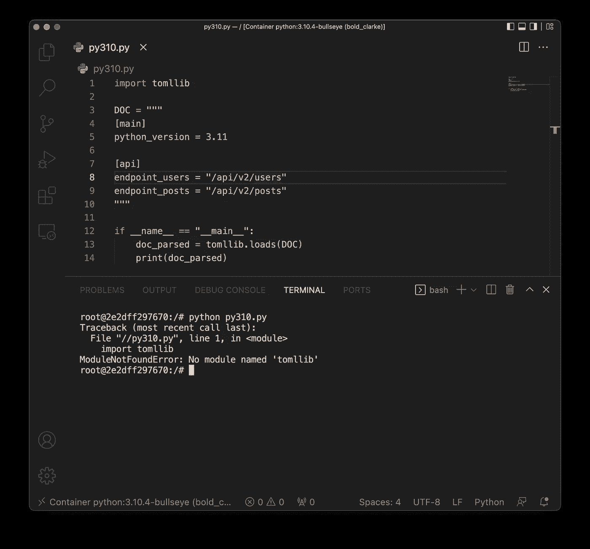
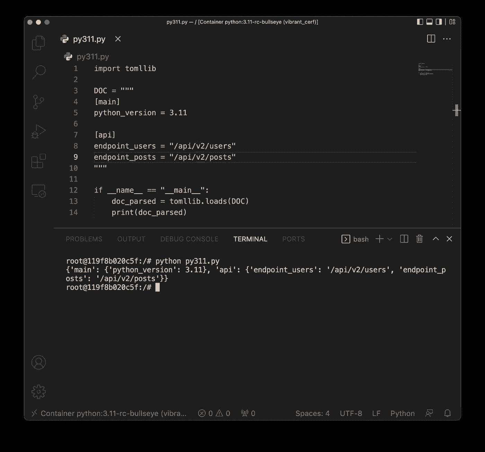

# Python 3.11 的三大新特性:做好准备

> 原文：<https://towardsdatascience.com/top-3-new-features-in-python-3-11-prepare-yourself-701cca4af9c3>

## Python 3.11 还没有发布，但是你可以尝试一下 RC 版本。剧透警告:太神奇了


照片由[在](https://unsplash.com/es/@comparefibre?utm_source=medium&utm_medium=referral) [Unsplash](https://unsplash.com?utm_source=medium&utm_medium=referral) 上对比纤维

Python 3.11 预计 2022 年 10 月播出。那是五个月以后的事了，为什么要大肆宣传呢？像往常一样，我们可以测试 RC 版本，看看它与 Python 3.10 相比如何。

这正是我所做的。我设置了两个 Docker 容器，一个用于 [Python 3.10](https://github.com/docker-library/python/blob/f871d0435e7f35a693fa1b60aa159e6a1a4c6a2e/3.10/bullseye/Dockerfile) ，另一个用于 [Python 3.11](https://github.com/docker-library/python/blob/f871d0435e7f35a693fa1b60aa159e6a1a4c6a2e/3.11-rc/bullseye/Dockerfile) ，并将它们附加到单独的 Visual Studio 代码窗口。我们将在两个版本中运行完全相同的代码，看看新版本带来了什么。

**TL；有很多新功能，但我决定写三个。这些是更好的错误位置、异常注释和内置的 TOML 解析器。相对于旧的 Python 版本，这是一个很大的改进。参考[官方变更日志](https://docs.python.org/3.11/whatsnew/3.11.html)获得新特性的完整列表。**

> *您知道 Python 3.11 将比 Python 3.10 快 60%吗？* [*下面是详细的基准*](https://medium.com/towards-data-science/python-is-about-to-become-64-faster-python-3-10-vs-python-3-11-benchmark-3a6abcc25b90) *。*

不想看书？请观看我的视频:

# Python 3.11 功能 1-增强的错误位置

当打印回溯时，Python 解释器现在将指向导致错误的确切表达式，而不仅仅是该行。例如，下面的代码片段会抛出一个错误，因为给定索引处的列表项不存在:

```
if __name__ == "__main__":
    l = [1, 2, 3]
    print(l[3])
```

在 Python 3.10 中，您将获得以下输出:



图片 1-增强的错误位置(1)(图片由作者提供)

另一方面，Python 3.11 将打印以下内容:



图 2-增强的错误位置(2)(图片由作者提供)

Python 3.11 在导致错误的代码部分加了下划线，非常简洁。比方说，Python 字典也是如此。下面的代码片段将引发一个错误，因为字典没有那个键:

```
if __name__ == "__main__":
    d = {"key1": "value1", "key2": "value2"}
    print(d["key3"])
```

以下是 Python 3.10 吐出的内容:



图 3-增强的错误位置(3)(图片由作者提供)

这是 Python 3.11 的输出:



图 4 —增强的错误位置(4)(图片由作者提供)

Python 3.11 再次强调了导致错误的确切代码部分。

# Python 3.11 功能# 2-异常注释

Python 的`Exception`类在 Python 3.11 中会有一个`__note__`属性。默认情况下它是`None`，但是你可以用任何你想要的字符串覆盖它。当然，这不是最具突破性的特性，但是如果您有几十个自定义异常类，这里或那里的一个注释会派上用场。

下面是我们将在两个容器中运行的代码:

```
class CustomException(Exception):
    __note__ = "Note about my custom exception" if __name__ == "__main__":
    raise CustomException()
```

这是 Python 3.10 的输出:



图 5 —引发自定义异常(1)(作者图片)

正如您所料，Python 3.10 的`Exception`类不知道这个新属性。Python 3.11 的情况完全不同:



图 6 —引发自定义异常(2)(作者图片)

Python 3.11 再次强调了导致错误的那一行——在本例中是一个明显的错误——但是它也在最后打印了我们的注释。

# Python 3.11 特性#3 —内置的 TOML 解析器

[TOML](https://toml.io/en/) ，或者说 *Tom 显而易见的极简语言*，是一种极简配置文件格式。在 Python 3.11 之前，没有内置的库来处理 TOML 配置文件。现在情况变了。

下面是我们将在两个容器中运行的代码片段:

```
import tomllib DOC = """
[main]
python_version = 3.11[api]
endpoint_users = "/api/v2/users"
endpoint_posts = "/api/v2/posts"
"""if __name__ == "__main__":
    doc_parsed = tomllib.loads(DOC)
    print(doc_parsed)
```

Python 3.10 没有`tomllib`库，所以立即引发了异常:



图 7 — TOML 配置文件(1)(图片由作者提供)

Python 3.11 支持它，因为解析 TOML 字符串没有问题:



图 8 — TOML 配置文件(2)(图片由作者提供)

当然，安装一个解析 TOML 文件的专用库需要几秒钟，但是很高兴看到它将成为新版本的内置功能。

# Python 3.11 新特性概述

我们已经介绍了 Python 3.11 中的三个特性。当然，还有其他的，比如自我类型、异常组、异步理解等等，但是如果你感兴趣的话，你可以参考官方变更日志。

新 Python 版本带来的最大改进可能是速度的提高。平均而言，Python 3.11 将比 Python 3.10 快 15%，差距高达 64%。我在我的详细的[基准测试文章](https://betterdatascience.com/python-310-vs-python-311/)中比较了这两者，所以请务必查看一下。

*你最喜欢的 Python 3.11 特性是什么？请在下面的评论区告诉我。*

喜欢这篇文章吗？成为 [*中等会员*](https://medium.com/@radecicdario/membership) *继续无限制学习。如果你使用下面的链接，我会收到你的一部分会员费，不需要你额外付费。*

<https://medium.com/@radecicdario/membership>  

## 推荐阅读

*   [学习数据科学先决条件(数学、统计和编程)的 5 本最佳书籍](https://betterdatascience.com/best-data-science-prerequisite-books/)
*   [2022 年学习数据科学的前 5 本书](https://betterdatascience.com/top-books-to-learn-data-science/)
*   [用 Python 打印列表的 7 种方法](https://betterdatascience.com/python-list-print/)

## 保持联系

*   雇用我作为一名技术作家
*   订阅 [YouTube](https://www.youtube.com/c/BetterDataScience)
*   在 [LinkedIn](https://www.linkedin.com/in/darioradecic/) 上连接

*原载于 2022 年 5 月 9 日 https://betterdatascience.com**的* [*。*](https://betterdatascience.com/python-311-whats-new/)