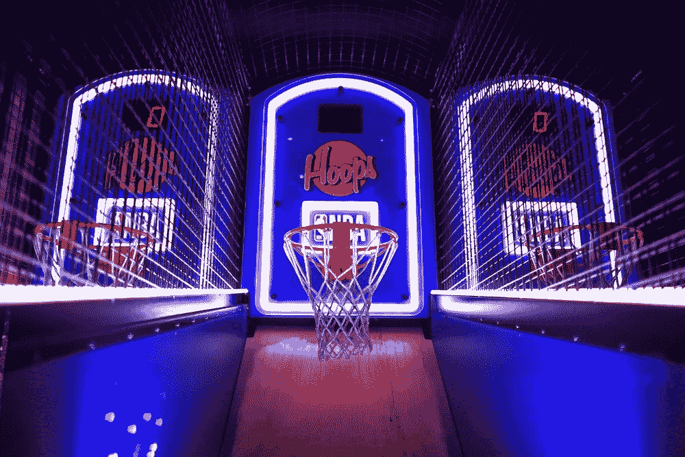
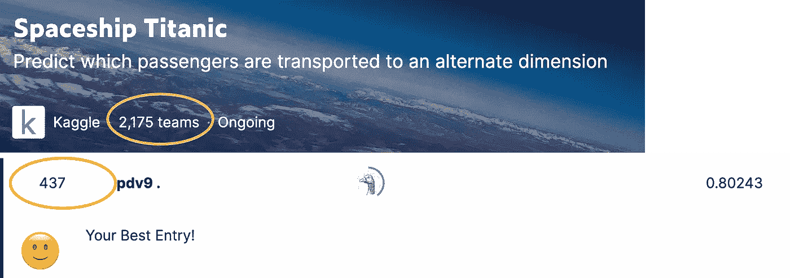
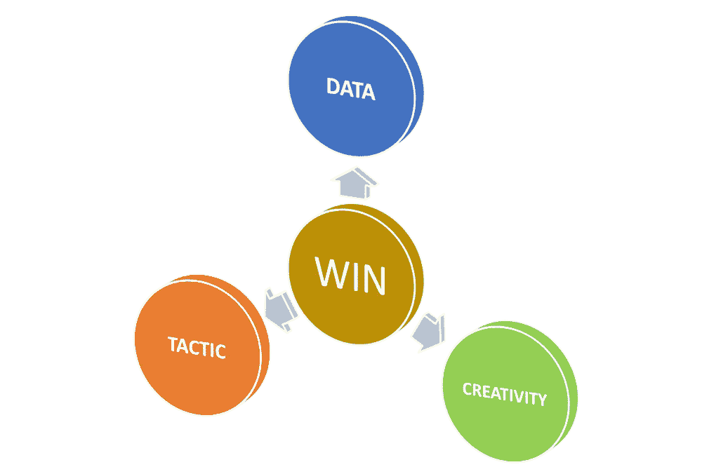
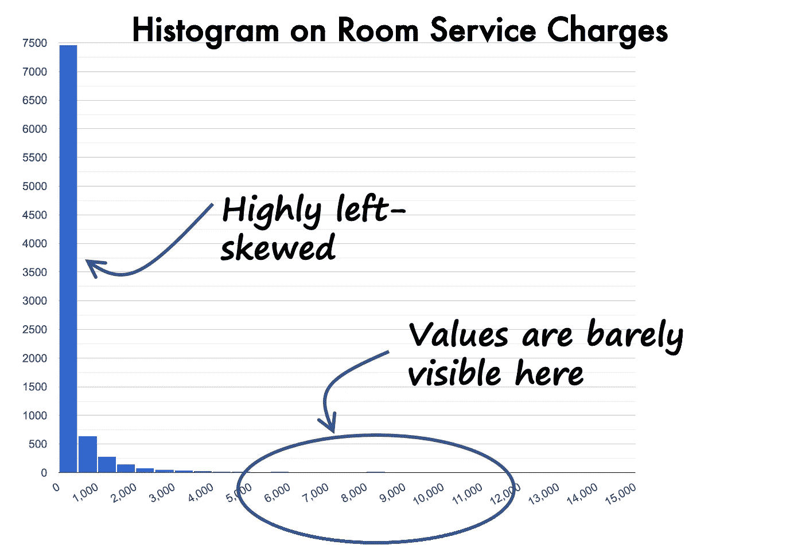
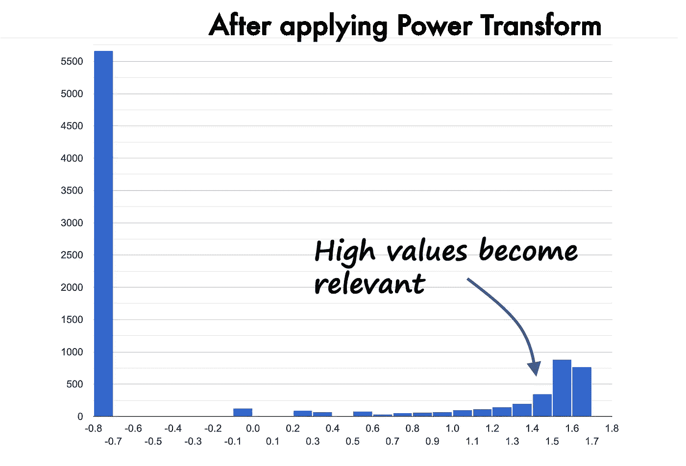
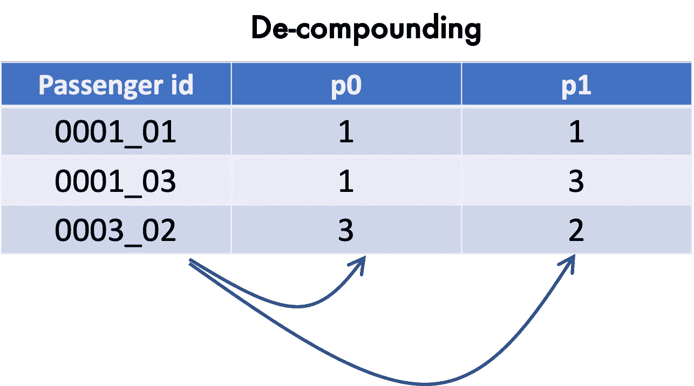
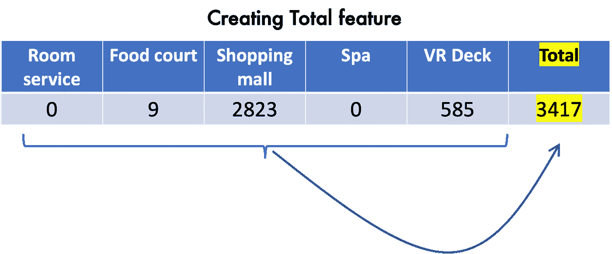
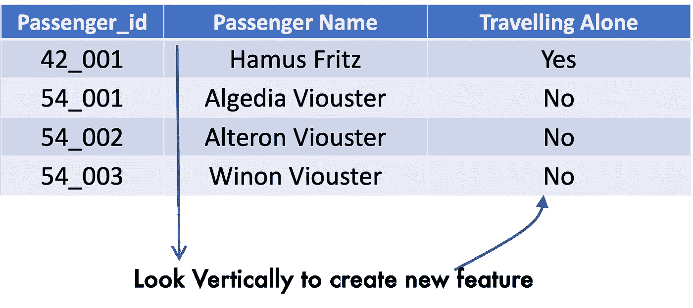
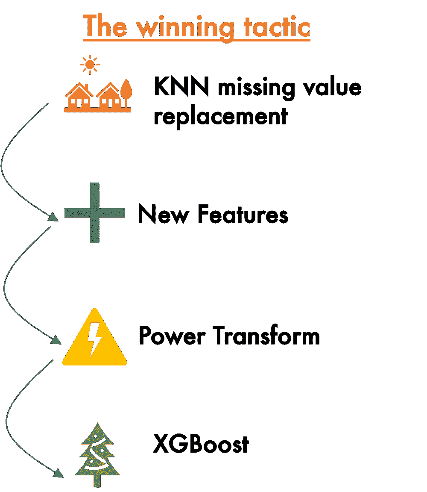

# 三大非机器学习技能将在 Kaggle 竞赛中崛起

> 原文：<https://towardsdatascience.com/top-3-non-machine-learning-skills-to-rise-in-kaggle-competitions-d438fec7d551>

## 数据、创造力和策略会让你爬上排行榜

由 [Unsplash](https://unsplash.com/s/photos/winner?utm_source=unsplash&utm_medium=referral&utm_content=creditCopyText) 上的 [Element5 数码](https://unsplash.com/@element5digital?utm_source=unsplash&utm_medium=referral&utm_content=creditCopyText)拍摄

这听起来可能有违直觉。但在像 Kaggle 这样的机器学习竞赛中，让你比其他人更有优势的关键技能可能不是机器学习。

你对机器学习算法的了解只是你在 Kaggle 中需要的基本技能。应用不同的算法、集成和超参数优化当然是必要的，但这只是自动化。任何人都可以从 Stack-overflow 或 Python Scikit-learn 复制/粘贴算法函数代码。它会帮助你获得一个不错的分数，但很少会让你进入前 10 名或前 20%。

我将用 Kaggle Space Titanic 问题来说明这篇文章，我在这个竞赛中取得了前 20%的成绩。(参考资料和数据集引用可在故事结尾获得)

进入排行榜的前 20%(图片由作者提供)

我使用的机器学习算法是 XGBoost。然而，帮助我达到前 20%的并不是算法。帮助我的是

*   关注数据
*   创造性特征工程
*   选择正确的机器学习策略

获胜需要的不仅仅是机器学习算法技能(图片由作者提供)

# 1.关注数据、数据、数据

机器学习过程中 80%的时间花在数据准备上。和 Kaggle 空间泰坦尼克号的问题没有什么不同。准备数据的主要活动之一是消除偏差和处理缺失值

## 消除偏斜——这一步通常会被忽略，但却非常必要

歪斜可能是一个杀手。你可以把它看作是一个沉默的离群值，我们往往会忘记它。在太空泰坦尼克号问题中，有许多倾斜的数值。让我们来看看其中的一项，那就是客房服务。

高向左倾斜(图片由作者提供)

正如你将观察到的，分布是高度左倾的。原因是大多数乘客没有为客房服务付费。但是，有一些高客房服务值，在直方图中几乎看不到。如果不处理偏斜，机器学习算法就会偏向小值。

消除偏斜的一种方法是应用幂变换函数。移除倾斜后的结果如下所示。

非倾斜数据(图片由作者提供)

应用电源变压器后，高值变得更加突出。机器学习算法将能够获得这些高值。在太空泰坦尼克号问题中，非偏斜有助于提高准确性，因为服务是决定乘客命运的重要特征。

## 处理缺失的价值——最关键的一步需要像专家一样完成

数据中有许多缺失值。虽然有许多方法可以替换丢失的数据，但 KNN (K 近邻)方法在太空泰坦尼克号问题中非常有效。

关于如何进行 KNN 缺失值替换的完整指南，你可以在这里看到我的文章。

# 2.创造性特征工程是领导者和其他人之间的区别

创造力是领导者区别于其他人的地方。功能工程是跳出框框思考的地方，并获得那些在 Kaggle 排行榜上上升的关键点。虽然创造力不能被记录，让我尝试给它一个基于太空大问题的结构。

## 在数据中查找复合字段

复合字段是开始您的创造性特征工程的好方法。复合字段将多个信息打包到一个字段中。当字段中有“_”、“-”或“/”或“:”时，您就有可能识别它们。典型的例子是日期字段。当你看到类似于 31/12/2022 的东西时，它有三个东西组合成一个——日期、月份和年份。

在空间大问题中，有两个场是复合场。第一个是 Passengerid，它包含 0001_01、0003_01 等数据。“_”表示复合字段。所以我们可以从这个领域创造两个特征。

分解乘客 id 字段(图片由作者提供)

类似地，您可以分解具有 G/3/S 和 C/1/S 等值的 cabin 字段。正如您所猜测的，您可以将它们分成三个特性。

## 寻找多个数字字段，看它们是否可以相加

数值字段是创造性特征工程的最佳伙伴。将它们以不同的方式结合起来很容易，并且可以帮助你赢得一些额外的准确性分数。创建最简单但非常有效的要素之一是基于数值字段的总体要素。通常，如果没有明确指定为特征，机器学习算法将不能导出“全部”信息。

在太空泰坦尼克号数据集中，您有多个数字字段，如客房服务费用、水疗费用、购物中心费用(想象一下在太空购物！)，等等。这是一个很好的机会来创建反映乘客总费用的总字段。

创建总体特征(按作者分类的图像)

在太空泰坦尼克号问题上，整个领域远远超过了所有的竞争对手！

## 用好奇的眼光寻找垂直的图案！

我们看数据的时候，一般倾向于横向分析。然而，当你垂直分析数据时，你可能会发现隐藏的金块。在太空泰坦尼克号问题中，隐藏的金块之一是乘客是独自旅行还是集体旅行的信息。

通过垂直分析数据创建新要素(图片由作者提供)

在垂直分析数据时，您会发现有些乘客具有相同的乘客 id(在 _)和相似的姓氏。这意味着他们是一家人，作为一个团体旅行。因此，我们可以创造性地创建一个新功能来指示乘客是否独自旅行。

无论你使用什么复杂的算法，都无法自动推断出这样的特征。这就是人脑的创造力发挥作用的地方。这将帮助你在 Kaggle 排行榜上遥遥领先。

# 3.战术——赢得竞争的最后一英里

战术是一系列行动，旨在实现某一目标。战术这个词起源于军事战争。人类已知的经典战术之一叫做斜序，曾用于希腊战例。

解决一个机器学习问题，其实就是一系列的算法。就像战争战术，如果你答对了，你就赢了。如果你做错了，即使你使用了正确的算法，你也输了！

在太空泰坦尼克号问题中，你有多种算法:KNN 缺失值替换、幂变换、创建附加特征、归一化、一键编码和 XGBoost。有没有特定的顺序有助于取得更好的成绩？答案是肯定的！这就是了。

制胜策略(图片由作者提供)

如果使用不同的序列，例如，如果反转幂变换和新特征创建，则精度会降低。

# 结论

要想在 Kaggle 排行榜上名列前茅，你需要的不仅仅是机器学习算法的知识。以下是最重要的三件事

*   专注于理解和准备您的数据
*   创造性特征工程将使你遥遥领先
*   像战争战术家一样思考！行动的顺序非常重要

# 额外资源

## 我学习数据科学的无代码平台

您可以访问我的平台，以一种非常简单的方式学习数据科学，并在不编码的情况下应用本文中描述的一些技术。[https://experiencedatascience.com](https://experiencedatascience.com/)

## 我的 Youtube 频道上的数据科学演示

这是我的 YouTube 频道的链接，我在那里展示了关于数据科学、机器学习和人工智能的各种演示。https://www.youtube.com/c/DataScienceDemonstrated
T3

请**订阅**,以便在我发布新故事时随时获得通知。

  

您也可以通过我的推荐链接**加入 Medium**

  

## 太空泰坦尼克号参考和数据源引用

太空泰坦尼克号问题和数据在这里:[https://www . ka ggle . com/competitions/space ship-titanic/overview](https://www.kaggle.com/competitions/spaceship-titanic/overview)

正如规则(【https://www.kaggle.com/competitions/spaceship-titanic/rules】)中所规定的，在第 7 A 节中，数据可以用于任何目的。

A.数据访问和使用。您可以出于任何商业或非商业目的访问和使用竞赛数据，包括参加竞赛和 Kaggle.com 论坛，以及学术研究和教育。