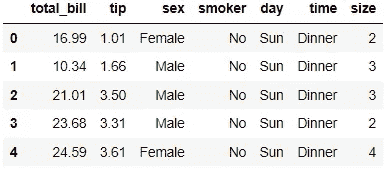
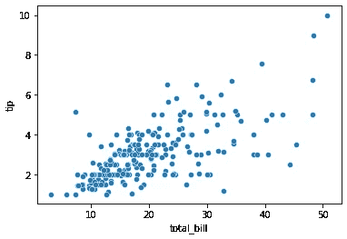
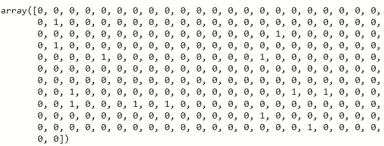
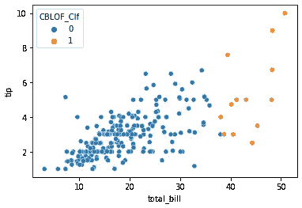
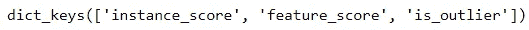
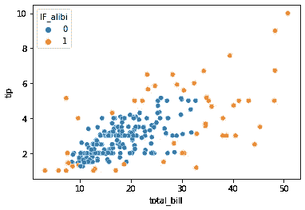
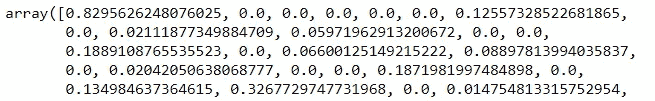
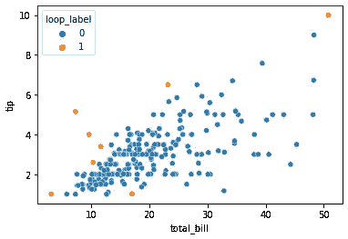

# 用于异常值检测的前 3 个 Python 包

> 原文：<https://towardsdatascience.com/top-3-python-packages-for-outlier-detection-2dc004be9014>

## 这些软件包会让你在分析中占有优势


[Bermix 工作室](https://unsplash.com/@bermixstudio?utm_source=medium&utm_medium=referral)在 [Unsplash](https://unsplash.com?utm_source=medium&utm_medium=referral) 拍摄的照片

我们数据分析的主要活动之一是识别数据中的异常值。异常值可以定义为不符合模式的极端数据或数据点。离群值有很多种，离群值的分类取决于数据或上下文。如果你想阅读更多关于异常分类或异常分析的内容，你可以在我的另一篇文章中阅读。

[](/outlier-why-is-it-important-af58adbefecc) [## 离群值——为什么它很重要？

### 极端数据的故事

towardsdatascience.com](/outlier-why-is-it-important-af58adbefecc) 

有许多检测异常值的技术。然而，该技术的有效性取决于数据和异常值分类。有时我们甚至不知道如何选择合适的方法或解释异常值。这就是为什么许多 python 包是专门为离群点检测开发的。

在本文中，我想展示我最喜欢的三个用于检测异常值的 python 包。我假设读者对异常值及其对数据的影响有所了解，所以我不会进一步解释。让我们开始吧。

# 1.热电偶

[PyOD](https://github.com/yzhao062/pyod) 或 python 离群数据检测是一个用于检测离群数据的 Python 包工具包。PyOD 包拥有 30 个离群点检测算法，从经典到最新-证明 PyOD 包维护良好。异常值检测模型的示例包括:

*   基于角度的异常检测
*   基于聚类的局部异常因子
*   主成分分析异常检测
*   可变自动编码器

还有很多。如果你有兴趣看到所有可用的方法，你应该访问下面的[页面](https://pyod.readthedocs.io/en/latest/pyod.html)。

PyOD 通过使用更少的代码行来预测异常数据，使异常检测变得简单而直观。与模型训练一样，PyOD 使用分类器模型来训练数据，并根据模型预测异常值。让我们用代码示例来试试这个包。首先，我们需要安装软件包。

```
pip install pyod
```

安装完这个包之后，让我们试着加载一个样本数据集。我会使用 seaborn 包中的 tips 数据。

```
import seaborn as sns
import pandas as pddf = sns.load_dataset('tips')
df.head()
```



作者图片

假设我们想找出 total_bill 和 tip 之间的多元异常值。如果我们可视化这两个特征之间的散点图，我们可能会感觉到数据扩散。

```
sns.scatterplot(data = df, x = 'total_bill', y = 'tip')
```



作者图片

如果我们看到上面的图，我们会注意到一些数据位于右上角，表明有异常值。但是，如果我们要将数据分为内层和外层，有什么限制呢？在这种情况下，我们可以使用 PyOD 来帮助我们完成这项工作。

对于我们的例子，我只使用两种方法——基于角度的离群点检测(ABOD)和基于聚类的局部离群点因子(CBLOF)。

```
from pyod.models.abod import ABOD
from pyod.models.cblof import CBLOF
```

让我们从 ABOD 模型开始；我们需要设置污染参数或从数据中检测到的异常值的分数。如果我将污染设置为 0.05，我希望从我们的数据中检测出 5%的异常值。让我们用我们的代码试一试。

```
abod_clf = ABOD(contamination=outliers_fraction)
abod_clf.fit(df[['total_bill', 'tip']]))
```

我们拟合想要检测异常值的数据。类似于模型分类器，我们可以访问分数/标签并使用该分类器进行预测。

```
#Return the classified inlier/outlier
abod_clf.labels_
```



作者图片

您也可以访问决策得分或概率，但让我们继续使用另一个模型并比较结果。

```
cblof_clf = CBLOF(contamination=0.05,check_estimator=False, random_state=random_state)
cblof_clf.fit(df[['total_bill', 'tip']])df['ABOD_Clf'] = abod_clf.labels_
df['CBLOF_Clf'] = cblof_clf.labels_
```

我们将结果存储在数据帧中，以比较两种检测算法。

```
sns.scatterplot(data = df, x = 'total_bill', y = 'tip', hue = 'ABOD_Clf')
```


ABOD 离群值(图片由作者提供)

从 ABOD 异常值检测结果中，我们可以看到来自中心的数据的极端部分被认为是异常值。从 CBLOF 模型来看。

```
sns.scatterplot(data = df, x = 'total_bill', y = 'tip', hue = 'CBLOF_Clf')
```



CBLOF 离群值(图片由作者提供)

与 ABOD 不同，CBLOF 算法将外部分类为在一侧(右侧)。如果愿意，您可以尝试另一种算法来检测数据中的异常值。

# 2.不在场证明-检测

[alibi-detect](https://github.com/SeldonIO/alibi-detect) python 包是一个开源包，专注于异常、敌对和漂移检测。该软件包可用于表格和非结构化数据，如图像或文本。如果你对图像数据的异常检测感兴趣，你可以在这里访问示例[。然而，在本文中，我将重点关注表格数据。](https://docs.seldon.io/projects/alibi-detect/en/latest/examples/alibi_detect_deploy.html)

alibi-detect 软件包提供了 10 种异常检测方法，你可以在这里阅读所有的。让我们用一个数据集示例来尝试其中一种方法。我将使用与前一个包相同的数据。

对于这个例子，我将使用隔离林方法。

```
from alibi_detect.od import IForestod = IForest(
    threshold=0.,
    n_estimators=100
)
```

我们设定门槛；如果你想自动设置阈值，有一个阈值推断的方法。接下来，我们将模型训练到数据集。

```
od.fit(df[['total_bill', 'tip']])
```

在模型拟合之后，我们需要做一个预测。

```
preds = od.predict(
    df[['total_bill', 'tip']],
    return_instance_score=True
)
```

如果我们将它设置为 True，那么结果将是一个包含实例得分和异常值标签的字典。

```
preds['data'].keys()
```



作者图片

然后，我们将异常值检测输入到数据框中，并使用散点图来可视化这些发现。

```
df['IF_alibi'] = preds['data']['is_outlier']
sns.scatterplot(data = df, x = 'total_bill', y = 'tip', hue = 'IF_alibi')
```



从 alibi-detect 隔离森林(图片由作者提供)

图像显示了更保守的结果，因为稍微偏离中心将被视为异常值。

你可以从 alibi-detect 中尝试很多算法。此处显示了算法概述[。](https://docs.seldon.io/projects/alibi-detect/en/latest/overview/algorithms.html)

# 3.侏儒

[PyNomaly](https://github.com/vc1492a/PyNomaly) 是一个 python 包，基于循环检测异常值(局部异常值概率)。该循环基于本地异常值因子(LOF)，但分数被标准化为范围[0–1]。如果你不确定 LOF 是什么，你可以在我的另一篇文章中读到它。

[](/novelty-detection-with-local-outlier-factor-4867e89e4f91) [## 具有局部异常因子的新奇检测

### 检测新数据是否是异常值

towardsdatascience.com](/novelty-detection-with-local-outlier-factor-4867e89e4f91) 

PyNomaly 的应用简单直观，类似于之前的包。让我们使用数据集示例来试验异常值检测。

```
from PyNomaly import loop
m = loop.LocalOutlierProbability(df[['total_bill', 'tip']], use_numba=True, progress_bar=True).fit()
scores = m.local_outlier_probabilities
```

如果有许多数据集要预测，我们可以在这里使用 Numba 否则，你可以关掉它。训练产生了我们可以自己推断的概率。



作者图片

每个数据都包含作为异常值的概率。我们可以尝试通过判断来推断哪个数据集是异常值，例如，概率高于 0.5 的数据点

```
df['loop_score'] = scores
df['loop_label'] = df['loop_score'].apply(lambda x: 1 if x >0.5 else 0)
sns.scatterplot(data = df, x = 'total_bill', y = 'tip', hue = 'loop_label')
```



循环法(图片由作者提供)

从上图中我们可以看到，如果概率高于 0.5，异常值位于数据的最极值点。

# 结论

离群点检测是数据科学家的主要活动。离群值可能在许多方面影响我们的分析和建模；这就是为什么我们希望在数据探索中发现异常值。

为了帮助离群点检测活动，我列出了我的前 3 个离群点检测 python 包；它们是:

1.  热电偶
2.  不在场证明-检测
3.  侏儒

希望有帮助！

在我的 [**LinkedIn**](https://www.linkedin.com/in/cornellius-yudha-wijaya/) 或 [**Twitter**](https://twitter.com/CornelliusYW) 上访问我。

> *如果您喜欢我的内容，并希望获得更多关于数据或数据科学家日常生活的深入知识，请考虑在此订阅我的* ***简讯。***

> *如果您没有订阅为中等会员，请考虑通过* [*我的推荐*](https://cornelliusyudhawijaya.medium.com/membership) *订阅。*