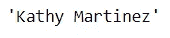
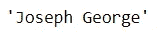
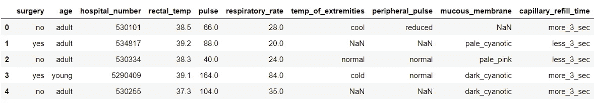
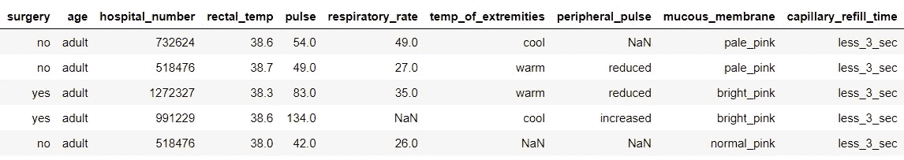
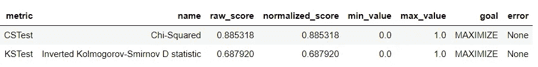
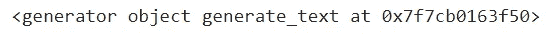
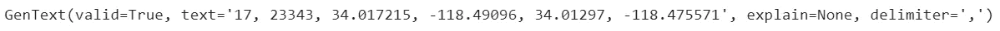
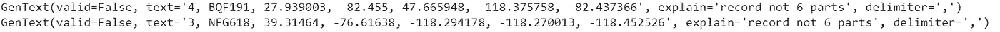

# 生成合成数据的前 3 个 Python 包

> 原文：<https://towardsdatascience.com/top-3-python-packages-to-generate-synthetic-data-33a351a5de0c>

## 为您的数据科学项目提供合成数据


照片由[马克西姆·伯格](https://unsplash.com/@maxberg?utm_source=medium&utm_medium=referral)在 [Unsplash](https://unsplash.com?utm_source=medium&utm_medium=referral) 拍摄

数据是每个数据项目的支柱；数据分析，机器学习模型训练，或者简单的仪表盘都需要数据。因此，获取满足您的项目的数据非常重要。

但是，您想要的数据不一定已经存在或公开。此外，有时您希望用符合您的标准的“数据”来测试您的数据项目。这就是为什么当您有特定需求时，生成数据变得很重要。

生成数据可能很重要，但是手动收集满足我们需求的数据需要时间。出于这个原因，我们可以尝试用编程语言来综合我们的数据。本文将概述我用来生成合成数据的 top 3 python 包。所有生成的数据都可以用于您想要的任何数据项目。让我们开始吧。

# 1.骗子

[Faker](https://github.com/joke2k/faker) 是为简化生成合成数据而开发的 Python 包。很多后续的数据合成生成器 python 包都是基于 Faker 包。人们喜欢这个包的简单和直观，所以让我们自己试试吧。首先，让我们安装这个包。

```
pip install Faker
```

为了使用 Faker 包生成合成数据，我们需要初始化`Faker`类。

```
from faker import Faker
fake = Faker()
```

随着课程的开始，我们可以生成各种合成数据。例如，我们将创建一个合成数据名称。

```
fake.name()
```



作者图片

当我们使用 Faker 类中的`.name`属性时，结果是一个人的名字。每次我们运行属性时，Faker 合成数据会随机产生。我们再来一次这个名字。



作者图片

结果是一个不同于我们之前迭代的名字。随机化过程在生成合成数据时很重要，因为我们希望数据集有所变化。

使用 Faker 包，我们可以生成更多的变量。它不仅限于名称变量，其他例子还有地址、银行、工作、信用评分等等。在 Faker 包中，这个生成器被称为**提供者**。如果您想查看整个[标准提供者](https://faker.readthedocs.io/en/stable/providers.html)、[社区提供者](https://faker.readthedocs.io/en/stable/communityproviders.html)和[本地化提供者](https://faker.readthedocs.io/en/stable/locales.html)，您可以在他们的文档中查看。

# 2.SDV

[SDV](https://sdv.dev/SDV/) 或合成数据库是一个 Python 包，根据提供的数据集生成合成数据。根据您在环境中提供的方案，生成的数据可以是单表、多表或时间序列。此外，生成的将具有与提供的数据集相同的格式属性和统计信息。

SDV 通过应用数学技术和机器学习模型(如深度学习模型)来生成合成数据。即使数据包含多种数据类型和缺失数据，SDV 也会处理它，所以我们只需要提供数据(以及需要时的元数据)。

让我们试着用 SDV 生成我们的合成数据。首先，我们需要安装软件包。

```
pip install sdv
```

对于我们的示例，我将使用 Kaggle 的马生存数据，因为它们包含各种数据类型和缺失数据。

```
import pandas as pd
data = pd.read_csv('horse.csv')
data.head()
```



作者图片

我们的数据集已经准备好了，我们希望基于数据集生成合成数据。让我们使用一个可用的[单桌 SDV 模型](https://sdv.dev/SDV/user_guides/single_table/models.html)、`GaussianCopula`。

```
from sdv.tabular import GaussianCopula
model = GaussianCopula()
model.fit(data)
```

训练过程很容易；我们只需要初始化类并拟合数据。让我们使用模型来产生合成数据。

```
sample = model.sample(200)
sample.head()
```



作者图片

利用来自模型的`.sample`属性，我们获得随机化的合成数据。您想要多少数据取决于您传递给`.sample`属性的数字。

您可能会意识到数据有时包含一个唯一的标识符。例如，我可以将上述数据集中的标识符指定为“hospital_number”上面的数据有多个“hospital _ nunber”的实例，如果它是唯一的数据，我们就不想要它。在这种情况下，我们可以将`primary_key`参数传递给模型。

```
model = GaussianCopula(primary_key='hospital_number')
model.fit(data)
```

样本结果将是从模型中生成的每个样本的唯一主键。

我们可能会问的另一个问题是，生成的合成数据有多好？在这种情况下，我们可以使用 SDV 的`evaluate`函数。该评估将真实数据集与样本数据集进行比较。有许多测试可用，但我们只关注 Kolmogorov-Smirnov(KS)和卡方(CS)测试。

```
from sdv.evaluation import evaluate
evaluate(sample, data, metrics=['CSTest', 'KSTest'], aggregate=False)
```



作者图片

KSTest 用于比较连续列，CSTest 用于比较离散列。两种测试的结果都是 0 到 1 之间的标准化分数，目标是使分数最大化。从上面的结果，我们可以评估离散样本列是好的(几乎与真实数据相似)。相比之下，连续列的分布可能会有偏差。如果您想了解 SDV 所有可用的评估方法，请参考[文档页面](https://sdv.dev/SDV/user_guides/evaluation/evaluation_framework.html)。

# 3.葛丽特

[Gretel](https://synthetics.docs.gretel.ai/en/stable/#) 或 Gretel Synthetics 是一个基于递归神经网络(RNN)的开源 Python 包，用于生成结构化和非结构化数据。python 包方法将数据集视为文本数据，并基于此文本数据训练模型。然后，该模型将产生带有文本数据的合成数据(我们需要将数据转换成我们想要的结果)。

Gretel 需要一点强大的计算能力，因为它是基于 RNN 的，所以如果你的电脑不够强大，我建议使用免费的谷歌 colab 笔记本或 Kaggle 笔记本。出于可访问性的目的，本文还将参考由 [Gretel](https://colab.research.google.com/github/gretelai/gretel-synthetics/blob/master/examples/synthetic_records.ipynb#scrollTo=2rx28XYXprJB) 提供的教程。

我们需要做的第一件事是使用下面的代码安装包。

```
pip install gretel-synthetics
```

然后，我们将使用以下代码生成一个配置代码，作为训练 RNN 模型的参数。以下参数基于 GPU 上的训练，使用的数据集是可从 Gretel 获得的[踏板车旅程坐标数据集](https://gretel-public-website.s3-us-west-2.amazonaws.com/datasets/uber_scooter_rides_1day.csv)。

```
from pathlib import Pathfrom gretel_synthetics.config import LocalConfig# Create a config for both training and generating dataconfig = LocalConfig(# the max line length for input training
max_line_len=2048, # tokenizer model vocabulary
datavocab_size=20000, # specify if the training text is structured, else ``None``
sizefield_delimiter=",", # overwrite previously trained model checkpoints
overwrite=True,# Checkpoint location
checkpoint_dir=(Path.cwd() / 'checkpoints').as_posix(),#The dataset used for RNN training
input_data_path="https://gretel-public-website.s3-us-west-2.amazonaws.com/datasets/uber_scooter_rides_1day.csv" # filepath or S3)
```

当配置就绪时，我们将使用下面的代码来训练我们的 RNN 模型。

```
from gretel_synthetics.train import train_rnntrain_rnn(config)
```

根据您的处理能力、配置和数据集，该过程可能需要一些时间。完成后，配置将自动保存您的最佳模型，并准备生成合成数据。让我们尝试使用`generate_text`来生成数据。

```
from gretel_synthetics.generate import generate_text#Simple validation function of the data is containing 6 data parts or not. You could always free to tweak it.
def validate_record(line): rec = line.split(", ")
   if len(rec) == 6:
      float(rec[5])
      float(rec[4])
      float(rec[3])
      float(rec[2])
      int(rec[0])
   else:
      raise Exception('record not 6 parts')#Generate 1000 synthetic data
data = generate_text(config, line_validator=validate_record, num_lines=1000)print(data)
```



作者图片

默认情况下，生成的数据是一个包含所有合成数据的生成器对象。我们可以尝试迭代对象值并打印结果来访问数据。

```
for line in data:
   print(line)
```

让我们仔细看看生成的合成数据。

```
line
```



作者图片

上图是格雷特 from 模型的合成数据示例。文本参数是我们的数据是以文本数据的形式出现的。如果我们想访问它，我们可以使用`.text`属性。

```
print(line.text)
```


作者图片

因此，我们只需要通过分隔符('，')分割数据，并将其处理成表格形式。但是，并非所有数据都是有效的(取决于您的评估),并且在使用之前需要彻底清理。



作者图片

上面的数据是无效的，因为它们产生了超过 6 个部分的数据，而我们只需要 6 个。这就是为什么我们需要小心 RNN 模型产生的数据。然而，实用性大于缺点，所以如果你使用 Gretel，做一点工作应该没问题。

准备好以 365 Data Science 上的**折扣价向所有专家学习数据科学吧！**

[](https://365datascience.pxf.io/c/3452806/1037878/11148) [## 为数据科学夏季做好准备- 65%折扣| 365 数据科学

### 选择一条职业道路，掌握你想要的特定工作角色的技能——数据科学家、数据分析师或商业…

365datascience.pxf.io](https://365datascience.pxf.io/c/3452806/1037878/11148) 

# **结论**

数据是任何数据项目的支柱，但有时我们想要的数据不可用或难以满足我们的要求。这就是为什么我们可以使用 Python 包来生成合成数据。本文解释了用于生成数据的 3 个顶级 Python 包，它们是:

1.  骗子
2.  SDV
3.  葛丽特

希望有帮助！

在我的[社交媒体上访问我。](https://bio.link/cornelli)

> *如果您没有订阅为中等会员，请考虑通过* [*我的推荐*](https://cornelliusyudhawijaya.medium.com/membership) *订阅。*