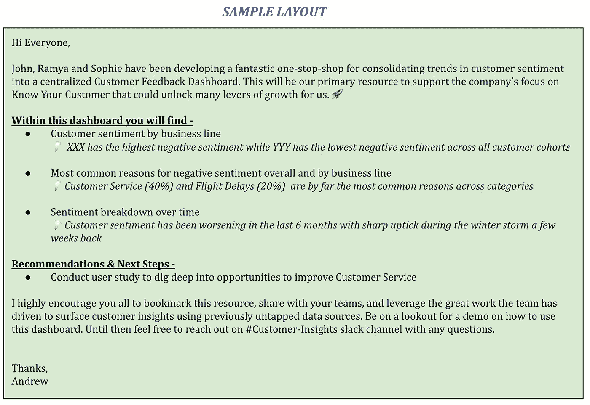
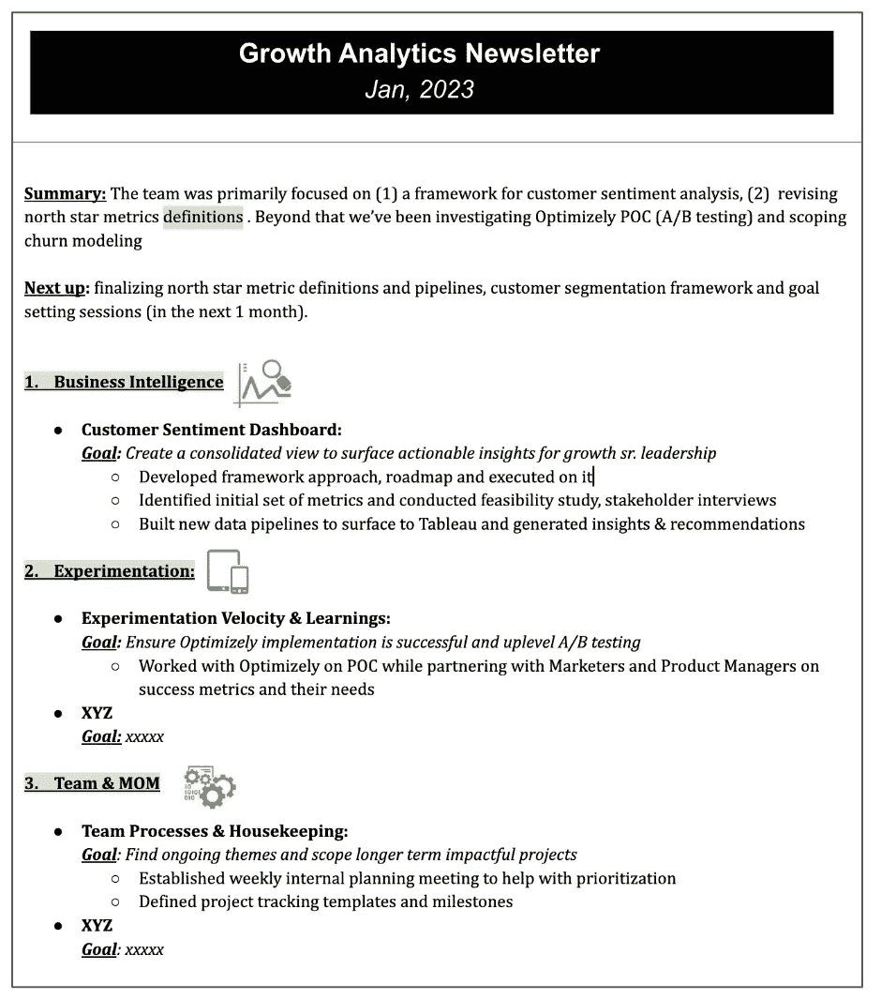

# 促进您在分析和数据科学领域工作的三大工具

> 原文：<https://towardsdatascience.com/top-3-tools-to-promote-your-work-in-analytics-data-science-7b87d80615fc>

## 获得你应得的荣誉

照片由[帕特里克·福尔](https://unsplash.com/es/@patrickian4?utm_source=medium&utm_medium=referral)在 [Unsplash](https://unsplash.com?utm_source=medium&utm_medium=referral) 拍摄

# 介绍

> 您是否厌倦了将分析和数据科学视为支持职能，而很少或根本不认可您的团队所推动的价值？
> 
> 对于你和你的团队所做的工作，你是否经常感到被低估？
> 
> 你想学习有助于宣传你的团队的贡献的工具吗？

在这篇博文中，我们将讨论让你和你的团队得到应有认可的 3 种最有效的方法。

# 宣传你的工作

“作品会自己说话”的日子已经一去不复返了。能够传达你正在推动的价值在任何工作中都很重要，但在分析领域这一点*至关重要*，因为在许多情况下，你正在让其他职能部门有效地完成他们的工作。例如，您与产品经理合作制定产品功能发布的初始策略。3 个月后，该功能推出，虽然你在构思阶段做出了巨大贡献，但随着发布时间的临近，互动越来越少，项目经理在发布时没有提到你。这只是一种情况，但还有几个这样的情况，累积起来会导致错过认可的机会。

> 能够*宣传你的工作*在分析中极其重要——没有这种技能，你所产生的影响很容易被忽视。

作为一个害羞、书呆子和自我意识强的孩子，我在 30 岁出头的时候一直不擅长自我推销。然而，随着我成为一名领导者，我不得不特别注意和学习这一技能——不仅是为了我自己，也是为了我所领导的团队。

以下是我学到的 3 个最有效的策略，用于提升分析和 DS 团队，展示所做工作的影响——

## 1.公告电子邮件

不久前，在一家科技初创公司工作时，我和我的团队认为我们在传播我们的工作方面做得很好。但是后来发生了一件事，彻底改变了我们的看法。我们非常努力地创建了一个新的客户保持仪表板——创建新的数据管道，定义有助于展现关键见解的指标，并进行迭代以最终实现出色的可视化。我发送了一封电子邮件，与一小群观众分享仪表板，我们得到了预期的不错的回应。

'这看起来棒极了！谢谢，”

*“非常有帮助——感谢分享。”*

然后，我们的营销副总裁介入进来，告诉我们用正确的包装可以实现什么。她发出了另一封信，向更广泛的受众“宣布”(而不仅仅是分享)仪表板。反响是惊人的！她在仪表盘上比我们在通讯上产生了更多的参与和兴奋。

这真是不可思议。谢谢🙌'

*真是杰作。🔥这种水平的分析严谨性将有助于释放未来的增长！我想提出一个午餐学习仪表板演示的请求；)’*

*‘爱，爱，爱——了不起的作品！!'*

最后，这是最受欢迎的仪表板之一，显然为作者和团队创造了大量的品牌资产。

这让我意识到更好地包装我们的公告或分发电子邮件的巨大机会。以下是我一路走来学到的一些技巧:

*   **使用吸引人的主题行** —例如，“保留仪表板在这里！”或“介绍保留仪表板”
*   除了陈述仪表板包含的内容，还要将其与**关键见解、建议和后续步骤**联系起来
*   **使用图标&视觉效果**——添加相关的图标和视觉效果使电子邮件更容易阅读，并能很好地摆脱所有沉重的文本。*注意:不要过度使用！*

> John、Ramya 和 Kevin 一直在开发一个奇妙的一站式商店，用于将客户情绪趋势整合到一个集中的客户反馈仪表板中。这将是我们支持公司关注“了解您的客户”的主要资源，这将为我们打开许多增长杠杆。🚀
> 
> **在该控制面板中，您会发现-**
> 
> —按业务条线划分的客户情绪:*💡在所有客户群中，XXX 的负面情绪最高，而 YYY 的负面情绪最低*
> 
> —情绪随时间的变化:*💡在过去的 6 个月里，客户情绪一直在恶化，在几周前的冬季暴风雪中急剧上升*
> 
> **建议&下一步-**
> 
> —进行用户研究，深入挖掘改进客户服务的机会
> 
> 我强烈建议大家收藏此资源，与您的团队分享，并利用团队的出色工作，利用以前未开发的数据源来挖掘客户见解。请留意如何使用这个仪表板的演示。在此之前，如有任何问题，请随时联系#Customer-Insights slack channel。

来源:作者

## 2.宣读

对于你们中可能没有听说过这个术语的人来说，“读出”是另一个术语，指的是以一种易于通读的方式包装的分析。通常，我会看到团队在进行一次性分析时给出的读数——无论是对某个主题的**深入探究**,例如是什么推动了客户保持率，还是**根本原因分析**,例如为什么漏斗顶端转化率下降，或者**分析实验/发布/活动绩效。**

除了一次性的读数，对你的利益相关者重要的主题进行重复性的读数会给你带来很多荣誉。根据业务需求，您可以选择每周或每月一次。

## **仪表板的重复读数**

你多久听到一次“更多的洞察力和更少的仪表板”的需求？我见过许多分析团队对此感到慌乱——他们会反驳说，你需要仪表板来创造洞察力。虽然这可能是真的，但最终发生的是没有来自这些仪表板的持续洞察流，它们只是被视为另一个数据来源。积极地与利益相关者分享这些仪表板的总结结果将会改变这种看法。

> 我们需要更多的洞察力，更少的仪表板

## 月度或季度业务回顾

这是另一种保持信息向利益相关者循环流动的好方法。业务回顾是根据关键指标的趋势来回顾业务健康状况的演示。这为高层领导提供了一个机会，让他们从单调乏味的一天中抽身出来，看看每个月或每个季度的业务表现。

分析团队最适合呈现业务评论，原因有多种——
1)他们是真实数据和指标来源的专家
2)他们更有可能采取分析严谨和假设驱动的方法
3)他们不偏不倚

## 客户的观点

归根结底，从某种意义上来说，你的商业伙伴就是你的客户，所以让我们站在他们的角度想想他们的需求。想象一下，作为一名营销人员、产品经理或运营经理，你的日常工作就是挖掘和整合来自仪表盘的信息。这对他们来说是一个很大的时间陷阱，坦率地说，这不是他们最擅长的。如果你能把这些信息推给他们，而不是他们不断来找你，这不仅会减轻他们的痛点，他们也会开始把你视为值得信赖的合作伙伴。重新调整这种推拉动力也将帮助你更好地控制你的时间和工作重点。

> 我们需要改变这种动态，这样团队就可以向高管推动见解，而不是让他们提出要求
> 
> ~分析和决策支持团队中一家科技创业公司的首席财务官

## 3.时事通讯

这是一个简单而有效的方法。就准备或设置而言，您不需要为此进行大量跨职能协调。您可以简单地开始向目标受众发布简讯，表达您的目标，并根据反馈进行迭代。这里的诀窍是突出正在进行的工作流的目标和那些已经完成的工作流的结果，总是与业务结果或利益相关者的需求相联系。下面是一个能让你赢得更多印象分的样本布局:

*   **总结** —关键胜利&接下来会发生什么
*   **按主题详细更新**
*   **时事通讯常见问题—**
    —**目标**:这篇时事通讯的目标是什么。例如，提供可见性并协调优先级
    - **节奏**:每周/两周/每月
    - **受众**:公司高级领导
    - **团队成员**-
    -**POC:**如果他们有问题，应该联系谁

> **总结:**该团队主要关注(1)客户情绪分析框架，(2)修订北极星指标定义。除此之外，我们一直在研究一个新的实验平台 POC (A/B 测试),并研究客户流失建模。
> 
> **下一步:**最终确定北极星指标定义和管道、客户细分框架和目标设定会议(在接下来的 1 个月内)。
> 
> **1。客户情绪仪表板:**
> 
> ***目标:*** 创建一个整合的视图，以展示可操作的见解，促进高级领导的成长
> 
> —开发框架方法、路线图并在其上执行
> 
> —确定了一组初始指标，并进行了可行性研究和利益相关方访谈
> 
> —构建了新的数据管道，从表面到表格，并产生了见解和建议

来源:作者

> *奖励提示*
> 
> 发送完所有这些信息后，将这些信息视为对话的开始，而不是对话的结束。这个想法不应该是“我已经为他们提供了工具，他们将从那里得到它”，而应该是一个对话的开始。您应该在沟通中始终有足够的信息，让他们知道可以向谁寻求更多的问题和合作。

# 结论

想想你正在做的一个项目或者你领导的一个团队。你能想象自己利用这些工具来传播你的作品吗？

LinkedIn 上有超过 100 万个分析和数据科学职位的招聘信息。大多数非分析角色也强调数据驱动技能的重要性。然而，许多分析和数据科学团队努力证明他们正在推动的价值。有了有效沟通工作的额外技能，你不仅能做好自己的工作，还能因此得到认可。

*如果您想继续看到我关于分析&数据科学职业发展的内容，您可以关注&订阅我的*<https://preeti-semwal.medium.com/subscribe>**。**

*我提供的其他资源可以帮助您在分析和设计领域发展职业生涯—*

*[**完成产品 A/B 测试课程及面试指南**](https://www.udemy.com/course/product-experimentation-ab-testing-in-r-with-real-examples/?couponCode=3B2B9F1E96F8605CD651) *(使用此链接可享受折扣价)**