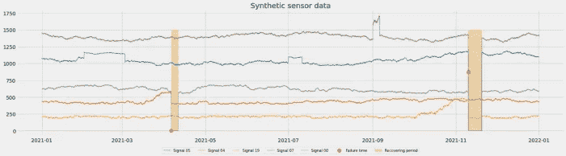
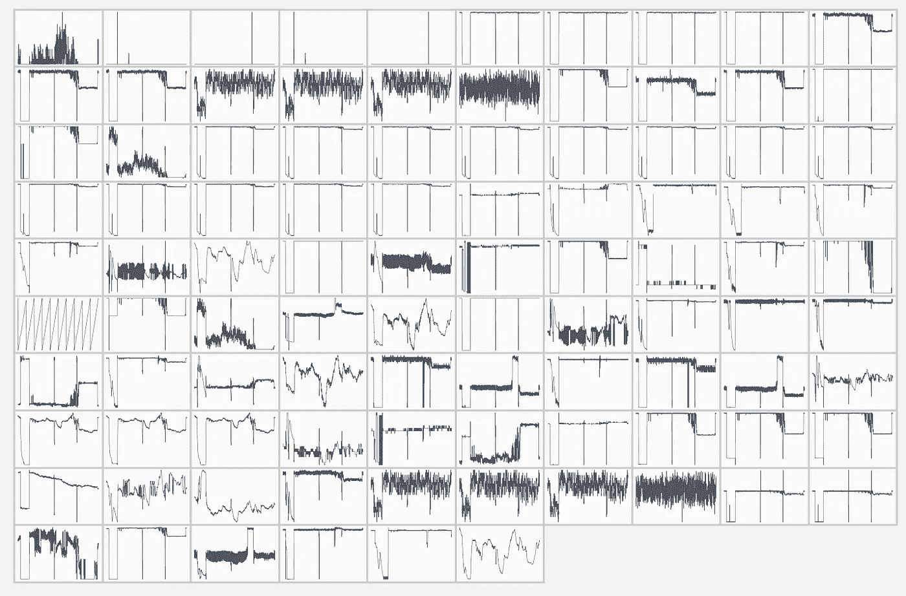
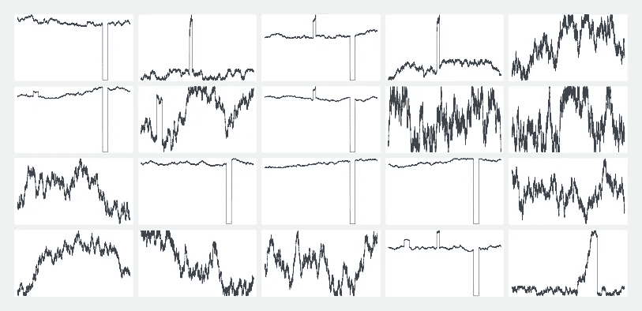
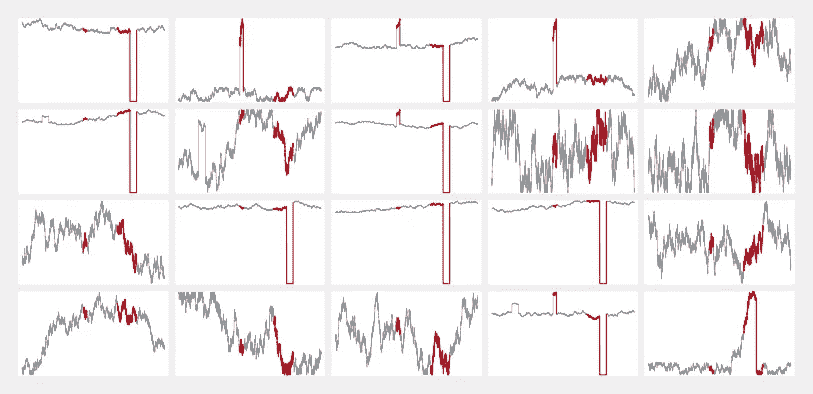
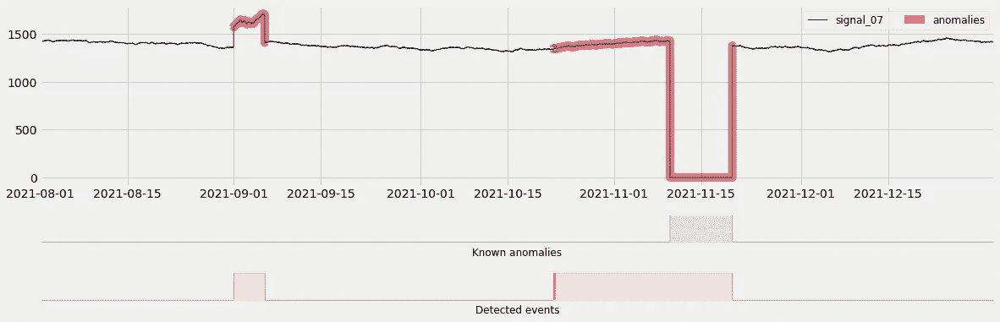
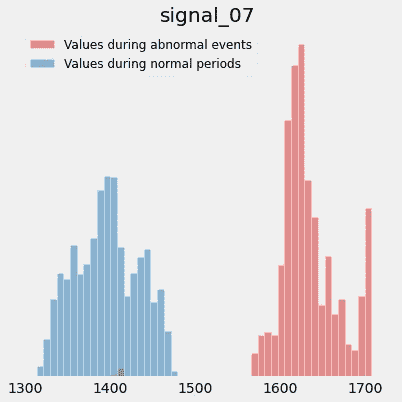
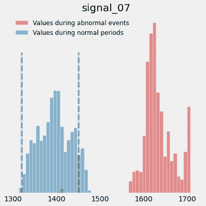
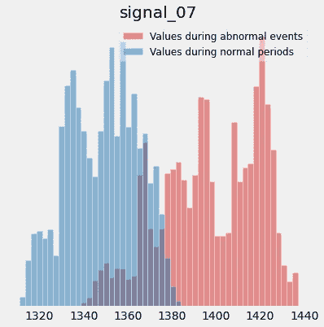

# 异常检测模型赢得您信任的三大方法

> 原文：<https://towardsdatascience.com/top-3-ways-your-anomaly-detection-models-can-earn-your-trust-f59072a6199c>

## 将异常检测模型结果连接回原始信号

在 [Unsplash](https://unsplash.com?utm_source=medium&utm_medium=referral) 上由[zdenk macha ek](https://unsplash.com/es/@zmachacek?utm_source=medium&utm_medium=referral)拍摄的照片

在上一篇文章中，我介绍了一些通过对原始结果进行后处理来从异常检测模型中提取更丰富信息的方法:

  

通读本文并付诸实践后，您可能会对这些见解的可信度有所反馈:

> “我不知道我是否能相信这些见解。为什么这个模型会这么说？给我看看数据！”

在某些情况下，证据就在布丁中:您必须在实时数据上部署模型，并对标记的异常进行几周的调查。这将使您能够进行定期的现实检查，并将模型标记的事件与您的用户在该领域中的知识进行比较。这种合作将逐渐建立和加强对你的模型的信任。

不久前，我在 LinkedIn 上发布了一个简短的演示(如果你想了解这篇文章，请查看 [**这篇文章**](https://www.linkedin.com/posts/michaelhoarau_connecting-anomaly-detection-models-to-original-activity-6915209751555420161-2tWe?utm_source=linkedin_share&utm_medium=member_desktop_web) )，其中我解释了当我试图将异常检测模型结果与输入时间序列联系起来时所遵循的过程。

我鼓励你跟随这篇博文，浏览 GitHub，获取 [**这一系列的 Jupyter 笔记本**](https://github.com/michaelhoarau/smarter-anomaly-detection) 。你可以使用你常用的 Jupyter 环境，或者用 Amazon SageMaker 创建一个。在您克隆了 repo 并运行前四个笔记本(从 [**数据生成部分**](https://github.com/michaelhoarau/smarter-anomaly-detection/blob/main/notebooks/synthetic_0_data_generation.ipynb) 到 [**模型评估部分**](https://github.com/michaelhoarau/smarter-anomaly-detection/blob/main/notebooks/synthetic_3_model_evaluation.ipynb) )后，您可以打开最后一个笔记本(`synthetic_4_results_deep_dive.ipynb`)并遵循本文。

# 数据集概述

在本文中，我仍然使用我用一些合成异常生成的人工数据集。如果您想了解更多关于这个数据集的信息，请前往我的 [**上一篇文章**](/your-anomaly-detection-model-is-smarter-than-you-think-c1cade5fcabe) 的数据集概述部分。简而言之，这是一个 1 年长的数据集，有 20 个时间序列信号和 10 分钟的常规采样率。当可视化这些数据时，您会发现一些故障时间(下面的红点)和一些恢复期(下面的黄色部分):

综合数据时间序列概览(图片由作者提供)

在上一篇文章中，我们还使用[**Amazon Lookout for Equipment**](https://aws.amazon.com/lookout-for-equipment/)(运行在 AWS 云中的托管服务)训练和异常检测模型。如果您想更深入地了解这项服务(即使您不是开发人员)，我在 AWS 书籍的时间系列中专门为这项服务写了 6 章:

  

# 回到时间序列

我将假设你已经运行了前 4 个笔记本到最后，你有一个训练有素的模型和你的第一次可视化来理解它的结果。为了更好地理解正在发生的事情，你可能想回到最初的时间序列。即使在已经部署了这种模型的生产环境中，执行常规的错误分析也可能是您需要与您最喜欢的主题专家一起进行的活动。毕竟，这些人工智能模型不会取代你的专家和操作员:它们只是通过提供更快的洞察力来增强他们。

## 时间序列可视化

可视化你所有的时间序列(即使只有 20 个)可能已经很有挑战性了。这是我最近遇到的一个数据集示例，您可以看到近 100 个时间序列在一起:

多元数据集:时间序列概述(图片由作者提供)

真是大海捞针，不是吗？如果我们为 20 个传感器的更简单的合成数据集组合相同的图，则更容易看到发生了什么:

合成多元数据集概述(图片由作者提供)

然而，在现实生活中依靠这种简单性可能是不够的…您可以做的第一件事是突出显示您的模型检测到一些事件的时间范围:

突出显示检测到的异常范围(图片由作者提供)

这稍微好一点，特别是如果你有很少的时间序列，并且异常很容易发现。然而，如果你读了我以前的文章，你会记得我们的异常检测模型实际上挑出几个传感器。让我们绘制第一个，而不是在一个单一的窗格中显示所有这些:

现在这看起来更明显了(图片由作者提供)

`signal_07`输入是我们的异常检测模型挑选出来的时间序列之一，是这些检测到的事件的主要贡献者。在上面的图中，我用红色突出显示了异常的时间范围:现在更清楚为什么第一个事件被检测到了。第二个事件更有趣:实际的失败是清晰可见的，但是模型实际上在这种情况发生前 2 周就检测到了错误。

> “如果不太明显，我也没发现我的信号有什么问题，会发生什么？”

这是你可能会关心的问题之一，尤其是当你看到前一个图中突出显示的失败之前的两周时间时。看起来信号在故障前略有增加，但没有这么明显。这就是使用直方图来可视化时间序列信号所取值的分布可能会派上用场的地方。让我们看看这个…

## 可视化时间序列值分布

让我们关注上面第一个检测到的事件。我在笔记本上添加了一些实用函数来绘制两个叠加的直方图:

第一个异常点周围**信号 _07** 的值分布(图片由作者提供)

*蓝色直方图*是`signal_07`在训练范围内所取值的分布，而红色直方图突出显示了异常期间同一信号所取的值。行为的变化甚至更加明显，您甚至可以用您的领域专业知识来丰富这些直方图。例如，您可能知道在正常操作条件下，`signal_07`的范围在 1320 和 1450 之间。在这种情况下，您可能希望通过在直方图中添加以下信息来帮助您的用户:

突出显示正常操作条件(图片由作者提供)

让我们看看第二个异常的直方图:

第二异常周围**信号 _07** 的值分布(图片由作者提供)

这里可以看到失败发生的部分(0 左右的横条)。让我们放大第二部分，看看在失败之前**发生了什么:**

故障前**信号 _07** 的值分布(图片由作者提供)

在这里，尽管在时间序列上差别很小，但分布的变化却非常明显。

# 结论

在本文中，您了解了如何将异常检测模型结果与原始时间序列联系起来。这对于在您的机器学习系统中建立信任非常有价值，也是与领域专家合作并进一步改善您的异常管理流程的一个很好的工具。基本上，异常检测模型输出可以帮助您集中调查，而适当的可视化或原始数据可以帮助您查明原因！

在以后的文章中，我将深入研究如何计算直方图之间的距离，并使用它作为异常检测模型中衡量特征重要性的代理。

我希望你觉得这篇文章很有见地:如果你不想错过我即将发布的帖子，请随时在这里给我留下评论，并不要犹豫订阅我的 [**中型电子邮件订阅源**](https://michoara.medium.com/subscribe) ！想支持我和以后的工作？**通过我的推荐链接加入 Medium** :

 