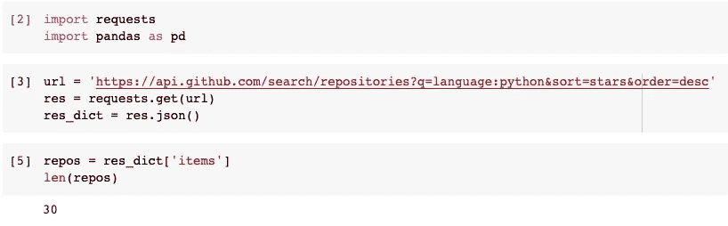
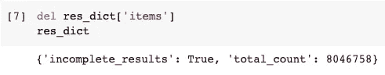
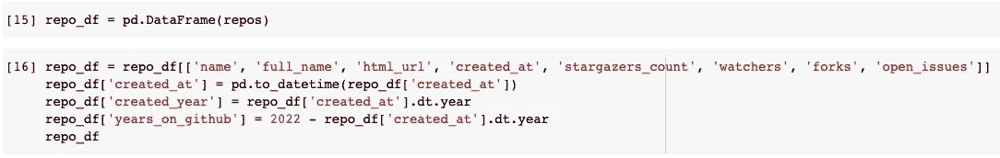
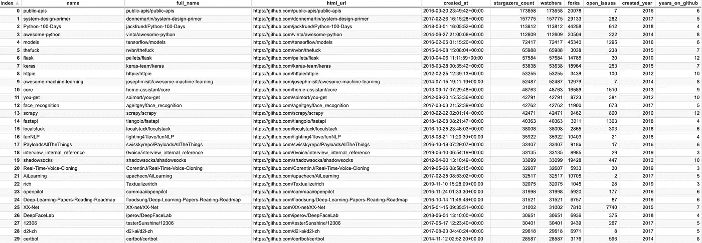
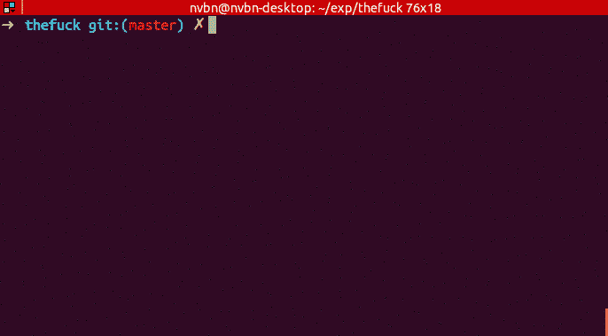
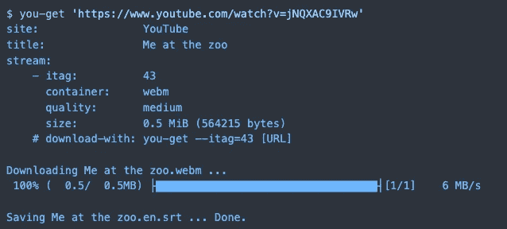

# 2022 年初前 30 名 GitHub Python 项目

> 原文：<https://towardsdatascience.com/top-30-github-python-projects-at-the-beginning-of-2022-86b1e3dad1a>


图片来自[皮克斯拜](https://pixabay.com/?utm_source=link-attribution&utm_medium=referral&utm_campaign=image&utm_content=4278774)

# 2022 年初前 30 名 GitHub Python 项目

## 拥有最多明星的仓库

2022 新年快乐！作为新年的第一个帖子，我很好奇到目前为止最受欢迎的 Python 项目是什么。GitHub 绝对是最适合拥有这些统计数据的地方。虽然不是所有的开源项目都会在这里维护，但是不会有任何其他地方有这种能力。

这个排名很简单，因为我会分享我的代码。现在，让我们看看如何用几行代码从 GitHub API 中获取排名列表。之后，我将使用我的术语对这些项目进行分类，然后添加一些简短的介绍。

**排名前 30 的 GitHub 项目分类如下:**

*   **7 项提高生产率的回购**
*   **作为编程框架的 3 个回购**
*   **促进机器学习的 5 个回购**
*   **4 个便利现实生活的回购**
*   **6 个收集整理有用信息的回购**
*   **5 个教授某些科目的回购**

# GitHub 搜索 API


图片来自[阿雷克索查](https://pixabay.com/users/qimono-1962238/?utm_source=link-attribution&utm_medium=referral&utm_campaign=image&utm_content=1844080)来自[皮克斯拜](https://pixabay.com/?utm_source=link-attribution&utm_medium=referral&utm_campaign=image&utm_content=1844080)

官方 API 文档可以在这个页面找到:[https://docs . github . com/en/rest/reference/search # search-repositories](https://docs.github.com/en/rest/reference/search#search-repositories)

所以，本文不再重复参数等细节。如果您对我们还能做什么感兴趣，请参考该页面。

最美妙的是，我们不需要注册或申请一个 API 密钥来使用这个端点。当然，它有一个速率限制，每分钟最多 10 个请求，但这对我们测试代码和拉排名列表来说已经足够了。

首先，我们需要使用 Python 的`requests`模块。它是内置的，我相信你们大多数人应该很熟悉它。然后，我们需要熊猫对数据进行一些转换。

```
import requests
import pandas as pd
```

URL 是基于 API 文档的`https://api.github.com/search/repositories`。因为我们只对基于 Python 的项目感兴趣，所以我们需要在查询中放入参数`language:python`。然后，我们要将搜索结果按星数排序，按降序排序。

```
url = '[https://api.github.com/search/repositories?q=language:python&sort=stars&order=desc'](https://api.github.com/search/repositories?q=language:python&sort=stars&order=desc')
```

然后，我们可以使用`requests`模块来调用这个 API 端点。我们应该使用 GET 方法。然后，我们可以将结果转换成 Python 字典。

```
res = requests.get(url)
res_dict = res.json()
```

所有的搜索结果都将放在一个带有关键字“items”的数组中。所以，我们可以得到所有的回购信息如下。默认页面大小是 30，所以我们将有 30 个回购。他们正是排名前 30 的 Python Repos:)

```
repos = res_dict['items']
len(repos)
```



结果字典中还有一些其他信息。如果我们删除项目数组，我们可以看到它表明搜索结果有更多的页面，在我发出请求时，总共有 8，046，758 个 Python Repos。



现在，让我们将条目数组转换成熊猫数据帧。

```
repo_df = pd.DataFrame(repos)
```

然后，我想删除所有不感兴趣的列。我还将添加一个名为`year_on_github`的专栏来记录这个项目在 GitHub 上创建了多少年。

```
repo_df = repo_df[['name', 'full_name', 'html_url', 'created_at', 'stargazers_count', 'watchers', 'forks', 'open_issues']]
repo_df['created_at'] = pd.to_datetime(repo_df['created_at'])
repo_df['created_year'] = repo_df['created_at'].dt.year
repo_df['years_on_github'] = 2022 - repo_df['created_at'].dt.year
```



以下是 30 大回购的完整列表:



# 提高生产率的回购


图片来自 [Pixabay](https://pixabay.com/?utm_source=link-attribution&utm_medium=referral&utm_campaign=image&utm_content=2145770) 的[玛利亚 _ 多姆妮娜](https://pixabay.com/users/maria_domnina-2013500/?utm_source=link-attribution&utm_medium=referral&utm_campaign=image&utm_content=2145770)

这些项目方便了我们的日常工作，提高了我们的工作效率，例如为操作系统增加了一些功能。

## 1.thefxxk(排名第六，65，988 颗星)

请注意，这个名字是经过编码的，因为我正在写一篇适合所有年龄段的文章:)

当我们在 Linux 或 GitBash 环境中使用控制台时，这个工具可以帮助我们纠正前面命令中的错误。



图片提供:[https://raw . githubusercontent . com/nvbn/the fuck/master/example . gif](https://raw.githubusercontent.com/nvbn/thefuck/master/example.gif)

## 2.httpie(排名第九，53，255 颗星)

HTTPie 是一个命令行 HTTP 客户端。它的目标是使 CLI 与 web 服务的交互尽可能人性化。HTTPie 是为测试、调试和通常与 APIs & HTTP 服务器交互而设计的。`http` & `https`命令允许创建和发送任意 HTTP 请求。它们使用简单自然的语法，并提供格式化和彩色化的输出。


图片提供:[https://raw . githubusercontent . com/httpie/httpie/master/docs/httpie-animation . gif](https://raw.githubusercontent.com/httpie/httpie/master/docs/httpie-animation.gif)

## 3.you-get(排名第 12，42，791 颗星)

这是一个很小的命令行工具，用于从网络上下载媒体内容(视频、音频、图像)，以防没有其他方便的方法。



## 4.localstack(排名第 16，38，008 颗星)

这个 repo 是一个云服务模拟器，运行在您的笔记本电脑或 CI 环境中的单个容器中。使用 LocalStack，您可以完全在本地机器上运行 AWS 应用程序或 Lambdas，而无需连接到远程云提供商！无论您是在测试复杂的 CDK 应用程序或 Terraform 配置，还是刚刚开始了解 AWS 服务，LocalStack 都可以帮助您加快并简化测试和开发工作流程。

## 5.shadowsocks(排名第 20，33，099 颗星)

Shadowsocks 是一个免费的开源加密协议项目，在中国被广泛用于规避互联网审查。在撰写本文时，由于违反规定，此回购已被删除。

## 6.富人(排名第 23，32，075 颗星)

这种回购可以轻松地为终端输出添加色彩和风格。它还可以呈现漂亮的表格、进度条、降价、语法高亮源代码、回溯等等——开箱即用。

有一篇我的文章详细介绍了这个库。

[](/get-rich-using-python-af66176ece8f) [## 使用 Python 在控制台中显示富文本

towardsdatascience.com](/get-rich-using-python-af66176ece8f) 

## 7.certbot(排名第 30，28，587 颗星)

Certbot 是 EFF 加密整个互联网努力的一部分。web 上的安全通信依赖于 HTTPS，它要求使用数字证书，让浏览器验证 Web 服务器的身份(例如，这真的是 google.com 吗？).Web 服务器从被称为证书颁发机构(ca)的可信第三方获得证书。Certbot 是一个易于使用的客户端，它从 Let's Encrypt(一个由 EFF、Mozilla 和其他公司推出的开放认证机构)获取证书，并将其部署到 web 服务器上

# 作为编程框架的回购协议


来自 [Pixabay](https://pixabay.com/?utm_source=link-attribution&utm_medium=referral&utm_campaign=image&utm_content=3370969) 的 [Capri23auto](https://pixabay.com/users/capri23auto-1767157/?utm_source=link-attribution&utm_medium=referral&utm_campaign=image&utm_content=3370969) 图片

这些回购协议都是非常著名的框架，要么用于 web 开发，要么用于其他一些软件开发。

## 1.flask(排名第七，57584 颗星)

对于这个框架，我想不需要太多的介绍。如果您正在使用 Python 进行 Web 开发，您必须曾经使用过它，或者至少了解它。

## 2.scrapy(排名 14，42，471 颗星)

如果你想使用 Python 进行 Web 抓取，这是一个“必须学习”的框架。它简化并自动化了从网页中提取信息的工作。它用于抓取网站并从其页面中提取结构化数据。它可以用于广泛的目的，从数据挖掘到监控和自动化测试。

## 3.fastapi(排名 15，40，363 颗星)

与 flask 类似，这也是 Python 中用于 web 后端开发的流行框架。它的重点是使用最少的代码编写常规的 Web APIs。如果你的后端不太复杂，就使用它。

# 促进机器学习的回购协议


图片来自[Pixabay](https://pixabay.com/?utm_source=link-attribution&utm_medium=referral&utm_campaign=image&utm_content=3859539)Gerd Altmann

机器学习无疑是 Python 最火的用法。所以，在这个列表中有这么多与机器学习相关的项目并不奇怪。

## 1.模特(排名第五，72，417 颗星)

如果你听说过使用 Python 的机器学习，你一定听说过 TensorFlow。这个回购也叫“TensorFlow Modul Garden”。它组织机器学习模型，并使用 TensorFlow 通过示例实现它们。模型可能来自 TensorFlow 官方，也可能来自一些著名的研究项目或社区。当我们想要在 TensorFlow 中使用任何机器学习模型时，它们可以非常有助于节省我们的时间。

## 2.keras(排名第八，53，638 颗星)

Python 中非常流行的机器学习框架。它提供了许多高级 API，使数据科学家能够用最少的代码训练深度学习模型。

## 3.人脸识别(排名 13，42，762 颗星)

顾名思义，这个项目可以从 Python 或命令行识别和操作人脸。号称是世界上最简单的人脸识别库。只要输入一张人脸图像，它就会识别定位。然后，您甚至可以使用一些现成的功能对其进行修改。

## 4.实时语音克隆(排名第 21，32，607 颗星)

我宁愿把它放在 ML 类别中，因为这是一个了不起的项目，但我们需要小心，它不应该被滥用。基本上，它可以从 5 秒钟的语音记录中“学习”某人的声音，然后用同样的声音说任何话。下面是作者的演示视频。

## 5.DeepFaceLab(排名第 27，30，651 颗星)

如果你曾经看过“deepfake”视频，很可能就是这个项目创作的。它学习一张人脸，并将其“植入”到另一个视频中，用它学习的那张脸替换这张脸。可能会有很多伦理问题，但这个项目确实令人惊叹。

# 便利现实生活的回购


图片由[钱比](https://pixabay.com/users/newhouse-1160730/?utm_source=link-attribution&utm_medium=referral&utm_campaign=image&utm_content=998265)发自 [Pixabay](https://pixabay.com/?utm_source=link-attribution&utm_medium=referral&utm_campaign=image&utm_content=998265)

这些回购都是用 Python 写的，但是在现实生活中使用。它们既可以节省我们的时间，也可以让我们做一些非常酷的事情。

## 1.核心(排名第 11，48，763 颗星)

这种回购是开源的家庭自动化，将本地控制和隐私放在第一位。由世界各地的修补匠和 DIY 爱好者组成的社区提供动力。非常适合在 Raspberry Pi 或本地服务器上运行。它被许多成功的家庭自动化产品使用，如亚马逊 Alexa 和谷歌 Cast。

## 2.openpilot(排名第 24，31，998 颗星)

这个 repo 是一个开源的驾驶辅助系统。它执行自适应巡航控制(ACC)、自动车道居中(ALC)、前方碰撞警告(FCW)和车道偏离警告(LDW)等功能，适用于越来越多的受支持的汽车品牌、车型和年款。然而，你需要购买他们的产品并安装在你的车上。不是完全 DIY 而是减少了努力。

## 3.XX-Net(排名第 26，31，002 颗星)

这是一个绕过中国“防火长城”的代理工具，使中国互联网用户能够浏览某些网站，如 YouTube 和脸书。

## 4.12306(排名第 28，30401 星)

12306 是中国预订火车票的热线号码，大约 15 年前，当他们开始网上预订时，它也被用作域名。这个回购是一个自动订票工具，因为在高峰期座位可能会短缺，很难预订。这就是开发者解决问题的方式:)

# 收集和组织有用信息的仓库


图片来自 [Pixabay](https://pixabay.com/?utm_source=link-attribution&utm_medium=referral&utm_campaign=image&utm_content=2463779) 的[艾哈迈德·阿迪蒂](https://pixabay.com/users/ahmadardity-3112014/?utm_source=link-attribution&utm_medium=referral&utm_campaign=image&utm_content=2463779)

这些 repos 可能不会维护太多代码，但它们要么使用 Python 来收集这些信息，要么这些信息是关于 Python 的。这些信息被认为是非常有帮助的，所以他们的排名很高。

## 1.公共 API(排名第一，173，658 颗星)

这个 repo 组织了数百个可用于软件和网络开发的免费 API。它们中的许多都非常有趣，比如有趣的事实，每次我们调用它时，它都会随机产生一个有趣的事实。还有一些非常有用的 API，如 Colormind API，它可以用来生成华丽的颜色代码，这些代码可能会在我们的数据可视化中使用。此外，有许多政府开放的 API 可以用来提取一个国家的统计数据。

## 2.牛逼——python(排名第四，112，609 星)

这个 repo 组织了数百个其他 GitHub Python 项目，这些项目“棒极了”。它们对你的“反重力”非常有用:(这些项目被分类，以便更容易找到我们需要的。

## 3.令人敬畏的机器学习(排名第十，52，487 颗星)

和上一个类似，这个 repos 收集的是机器学习项目。

## 4.funNLP(排名第 17，35，922 颗星)

这是一个中文回购，虽然它也可以用于英语。但是，该文档不提供英文版本。它提供了 NLP 词典，如敏感词，NLP 工具集和一些学习材料。

## 5.面试 _ 内部 _ 参考(排名 19，33，135 星)

又一个中国回购。它经常组织来自华为等知名公司的面试问题。它还提供了作为数据开发人员必须了解的基本知识，如算法和数据库设计原则。

## 6.深度学习-论文-阅读-路线图(排名第 24，31，521 颗星)

如果你想从基础开始学习机器学习，这个回购可能是一个好的开始。它利用学术论文绘制了历史上机器学习发展的“路线图”。

# 教授某一学科的报告


图片来自 [Pixabay](https://pixabay.com/?utm_source=link-attribution&utm_medium=referral&utm_campaign=image&utm_content=3765909) 的 [Stefan Meller](https://pixabay.com/users/steveriot1-6715269/?utm_source=link-attribution&utm_medium=referral&utm_campaign=image&utm_content=3765909)

这些回复不是用来编码的。它们可以被认为是一种开源的“书”。他们提供的信息可以用来学习一些东西。

## 1.系统设计入门(排名第二，157，775 颗星)

如果你想开始你的系统架构师职业生涯，这个回购是一个宝石。它介绍了许多有用的概念和必要的演示图表。您可以找到几乎所有您想知道的信息，例如何时使用 SQL 或 NoSQL、如何设计分布式关系数据库以及什么是反向代理。

## 2.Python-100 天(排名第三，113，812 颗星)

这个回购是中文的，它变得如此受欢迎是因为许多开发人员在中国学习 Python。它将 Python 编程知识组织成 100 个部分，这样，如果学习者坚持每天学习其中的一部分，他们可以在 100 天内完成。不幸的是，它没有被翻译成英语。

## 3.PayloadsAllTheThings(排名 18，33，407 颗星)

该报告显示了 Web 应用程序安全的有用负载和旁路列表。如果你想成为一个有经验的 web 开发人员，避免流行的安全漏洞和陷阱，这是一个必须学习的材料。几乎所有的概念都是用 Python 示例实现的。

## 4.AiLearning(排名第 22 位，32，517 颗星)

一个从 Python 基础到 PyTorch ML 框架教学的中文回购。

## 5.d2l-zh(排名第 29 位，29，618 颗星)

这是一本名为《潜入深度学习》的书。虽然这份回购是中文的，但英文版(原版)可以找到如下。

[https://www.d2l.ai/](https://www.d2l.ai/#)

# 摘要


图片来自 [Pixabay](https://pixabay.com/?utm_source=link-attribution&utm_medium=referral&utm_campaign=image&utm_content=6838768) 的 [Kanenori](https://pixabay.com/users/kanenori-4749850/?utm_source=link-attribution&utm_medium=referral&utm_campaign=image&utm_content=6838768)

由于我定义“受欢迎”的方式仅仅是使用明星的数量，很明显一些教授一些学科和组织信息的 repos 会排名很高。那是因为人们会倾向于添加星星作为“书签”。代码是提供的，所以这取决于你添加一些更多的考虑到这个排名，并满足你的好奇心。

[](https://medium.com/@qiuyujx/membership)  

如果你觉得我的文章有帮助，请考虑加入 Medium 会员来支持我和成千上万的其他作者！(点击上面的链接)