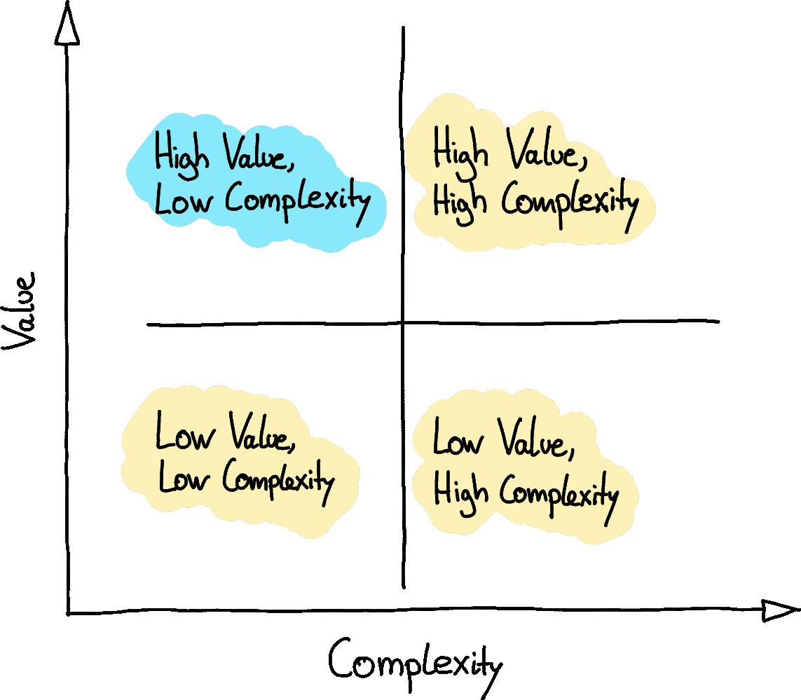

# 新数据科学职位前 3 个月的 5 大建议

> 原文：<https://towardsdatascience.com/top-5-bits-of-advice-for-the-first-3-months-in-your-new-data-science-role-a93d1fe91a7f>

# **在你新的数据科学职位的前 3 个月，最重要的 5 条建议**

## *充分利用你的新数据科学家职位*

布拉登·科拉姆在 [Unsplash](https://unsplash.com/?utm_source=unsplash&utm_medium=referral&utm_content=creditCopyText) 拍摄的照片

S 开始一份数据科学家的新工作是你职业生涯中伟大的下一步。新的团队，新的经理，新的数据(希望有)，新的挑战和机遇。在与同事和朋友讨论了前三个月最重要的建议后(感谢所有的投入！)，就想出了这篇文章。

这样做的目的不仅是帮助你在新职位的前三个月里游刃有余，还能帮助你为快节奏的职业生涯打下基础。

所以，即使你不在一个新的岗位上，我相信这个建议无论如何都会帮助你，让你最大限度地利用你的现状。

# **#1 了解同事和利益相关者**

第一天最常见的做法是了解你的团队成员。你可能会从一张桌子走到另一张桌子去打招呼，并在你的第一次团队会议上进行详细的介绍。除此之外，我建议与你的团队成员安排 **30 分钟的一对一会议**。这有助于你更好地理解他们面临的挑战，他们对你的角色的期望，以及对他们来说什么是重要的。这些会议的目的是倾听 T21 的意见并做笔记。你通常已经介绍过自己，所以这都是为了更好地了解你的同事。

**你可以问的问题:**

*   你的背景是什么？
*   你目前正在做的项目是什么？
*   最大的挑战是什么，为什么？
*   你感兴趣的数据(科学)/科技话题有哪些？
*   正在使用哪些工具/软件/框架？
*   我们和其他部门的关系如何？
*   如果你是我，你会关注什么？
*   你对我的角色有什么期望？
*   在一起工作时，对你来说什么是重要的？

你通常也会和类似的团队在一个水平层次上一起工作。因此，安排与他们的会面也是有意义的。这些会议不仅能帮助你更好地了解情况，还能发出正确积极的政治信号。

第一次**垂直** 1:1 会议很可能是和你的经理。确保你和他/她经常见面是很重要的，尤其是在最初的三个月。这有助于你参与进来，保持在正确的轨道上，并明确期望。我们将在第四点中对此进行更深入的探讨。

除了你的老板，还有很多(非技术)利益相关者。与他们会面不仅有助于你更好地了解公司的战略和 T2 的政治形势，还能让他们了解你。

**在这些会议中你可以问的问题有:**

*   你的背景是什么？
*   组织面临的最大挑战是什么？
*   你对我们的团队/单位有什么期望？

这些会议也有助于你找到未来的导师或看门人。一个重要的**利益相关者群体**还没有被提及:**业务**。作为一名数据科学家，你的工作是创造商业价值。您通常要么咨询业务，要么研究能为业务带来价值的数据产品。**了解你的(内部)客户、他们的(真实)需求和期望**至关重要。你应该利用第一次会面来了解对方，谈论期望和挑战。在接下来的几周里，你还应该关注敏锐的商业知识。我们将在第 3 点中讨论这一部分。

# **#2 尽快爬上学习曲线**

在与你的经理和同事进行第一次一对一会谈后，尽快熟悉数据、用过的技术和当前的项目是很重要的。主动是关键。如果您在创建环境方面有任何问题或需要帮助，请联系同事或与他们安排会议。如果你不完全理解一个缩写或者一个项目的目的/方法，**就问**。在最初的几个月里，没有人会因为你不知道一些只有内部人员才能知道的事情而责备你。在德国，我们有“保护小狗”的说法。每个人都知道你是新来的，所以没有人会责怪你——至少在最初的几个月。后来，人们可能会说“已经六个月了——你应该知道的”。

在对所使用的技术和项目更加熟悉之后，你可能会意识到你还有一些差距。在前三个月内，集中精力填补这些空白。您通常会在网上找到许多围绕任何数据科学相关主题的资源和培训。

# **#3 敏锐的商业知识**

如前所述，**业务或领域知识是必不可少的**。你的目标是为企业带来价值。要做到这一点，你首先要了解业务。安排与客户的会面，以便**更好地了解他们的业务**、**如何收集数据、**和**他们的需求是什么**。此外，询问他们如何衡量他们的成功(例如，使用什么 KPI)。

请记住，他们所说的和他们想要的可能有差异。根据您的团队和职位，您可能会有专门面对客户的人。无论如何，在最初的几个月里获得第一手信息是有益的。所以至少要参加客户和你的团队之间的会议。但是没有人会责怪你和你的客户建立 1:1 的关系。

# **#4 与老板和利益相关者的期望一致**

你的经理是决定你在公司的奖金和未来的人。对于中长期的未来，其他因素和联系可能更重要，但让我们专注于前三个月。

为了与你的经理建立成功的关系，让他们**能够信任你**以及你**专注并执行正确的事情**对他们来说很重要。**紧密合作、期望管理和积极主动是关键。**

让我们简短而精确:

*   与您的经理进行频繁的一对一会谈，每周一次到两次。
*   关注 1:1 会谈中最重要的几点，以及你的老板可以如何提供帮助
*   不要只谈论问题，也要谈论成就
*   尽早并经常阐明期望
*   协商诊断和行动计划的时间表
*   不要让自己马上陷入救火中——先弄清楚状况

大部分要点也可以在与利益相关方合作时使用。始终确保您和您的利益相关者之间的每一项决策和协调**都与您的经理**保持一致。

# **#5 确保早期胜利——摘下唾手可得的果实**

最后但同样重要的是，我最喜欢的建议。**安全早胜**。重要的是在最初的几个月里显示出你是最适合这个角色的，并且是一个启动者。争取在对你的经理和利益相关者(你的老板尊重他们的意见)重要的领域尽早取得成功。

然而，**确保这些事情是可行的，现实的**。你的外部依赖越多，不能及时完成任务的风险就越大。我打赌你知道下面的影响和复杂性图表(图 1。).

**图一**。价值-复杂性矩阵(图片由作者提供)。

明智的做法是**拿起低垂的果实**来确保这些早期的胜利。**影响大且相对容易完成的任务**。在你“收获”果实后，确保让你的经理和利益相关者知道你的成就。换句话说，**做好事并谈论它**。这有助于你获得可见性。说到可见性，确保能够访问所有相关的数据源。这有助于您稍后回答业务问题、启动新项目和监督数据环境。

这些是我对你作为数据科学家职业生涯前三个月的 5 条建议。由于数据科学家一词被理解为意味着许多事情，因此提到的一些要点可能并不完全适合您的情况。然而，我希望这些提示对你的新职位有所帮助。