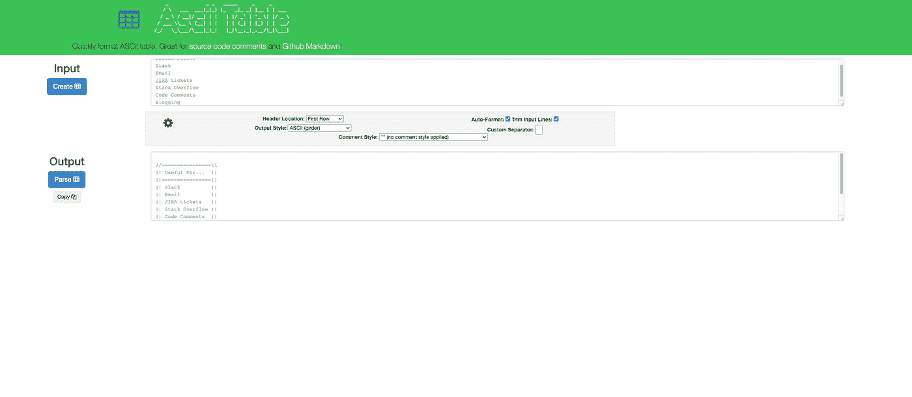
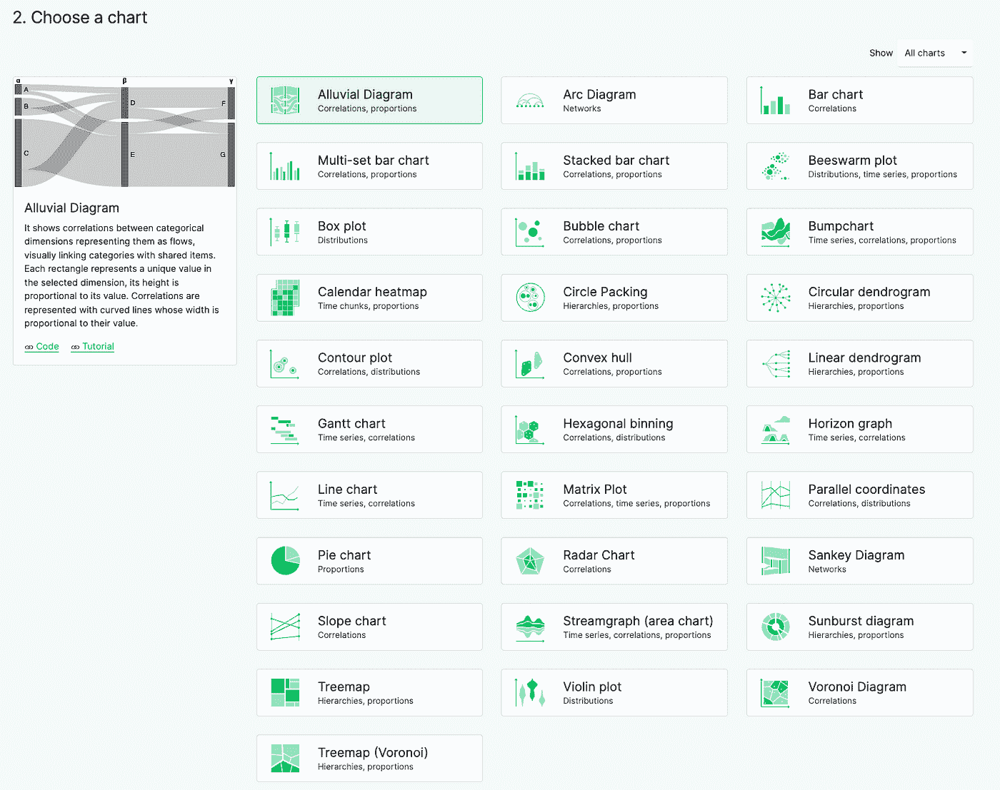

# 每个数据分析师都应该拥有的 5 大书签

> 原文：<https://towardsdatascience.com/top-5-bookmarks-every-data-analyst-should-have-547a2c9ad1fe>

## 节省您时间和精力的在线工具


约翰·施诺布里奇在 [Unsplash](https://unsplash.com/s/photos/data?utm_source=unsplash&utm_medium=referral&utm_content=creditCopyText) 上的照片

作为一名高级数据分析师，我的工作通常包括一两个大型底层数据研究项目，以及分散在不同团队中的“时间敏感型”小型项目。在一个典型的星期里，我可能会制作 5-7 个图表，编写一些查询，再调整一些，并帮助一个同事调试他们的。我可能会张贴 1 或 2 张 JIRA 内部门票，并执行一些 StackOverflow 搜索。

主要的潜在问题是，有了这些次要的干扰，我离脱离手头更大的任务只有一步之遥了。这就是为什么最好的分析师是敏捷和快速的。他们逆来顺受，很快就解决了琐碎的工作。

事实是，成为一名优秀的分析师就是要平衡质量和速度。这表现在寻找好的工具来帮助你更有效率。在那一周，我可能会使用半打不同的工具和软件。如果有一件事分析师们都同意，那就是没有一个单一的工具可以做所有伟大的事情。这就是为什么我给年轻分析师的最大建议之一是**开始收集在线书签**。养成导出这些书签的习惯，这样当你换工作或升级电脑时就可以随身携带。

以下是每个分析师都应该拥有的 5 大书签。有些在日常生活中很有用，而有些则是在特定情况下很少使用的。然而，你可能有一天会需要它们，当你需要的时候——它会帮你省去很多麻烦和时间。

## #5 Ascii 表格格式化程序

表格格式化程序允许您将复制/粘贴的数据块转换为更高效、更美观的格式。这在许多不同的方面都会派上用场。有时候我会通过 Slack 或者 email 给同事发一个快表；其他时候，我会将数据粘贴到 JIRA 的机票上。此外，表格格式化程序对于在论坛中发布或回答问题非常有用，比如堆栈溢出，或者在博客中发布数据。诀窍是选择一个像 Courier New 这样的等宽字体来正确排列。



[https://ozh.github.io/ascii-tables/](https://ozh.github.io/ascii-tables/)

```
//================\\
|| Useful For...  ||
|]================[|
|| Slack          ||
|| Email          ||
|| JIRA tickets   ||
|| Stack Overflow ||
|| Code Comments  ||
|| Blogging       ||
\\================//
```

有很多选择，但我最喜欢的是 https://ozh.github.io/ascii-tables/。它快速、简单，并且对于输出格式有很多不同的选择。此外，Ascii 表格式化程序将自动转换文本，而不必单击任何东西；就是瞬间！

以下是几个不同的例子:

## 第四名 SQL 美化者

有两种类型的 SQL 作者——一种以自己的查询为傲，并将其格式化以便于阅读，另一种喜欢看着世界毁灭。无论你想格式化别人的混乱还是你自己的——SQL 美化器是必不可少的。

下一次，当您发现自己试图破译类似这样的查询时:

使用 SQL 美化器立即使它看起来像这样:

在可下载程序、插件和在线版本的形式中，有很多选择。我更喜欢网络版，这里:【https://codebeautify.org/sqlformatter】T2。

## #3 JSON 查看器和转换器

我尽量避免使用 JSON 数据，但不幸的是，有时候，我别无选择。这就是为什么我在书签中保留了各种各样的 JSON 相关的查看器和转换器。

想快速浏览一个 JSON 结构，看看有哪些元素可用？需要调试解析脚本失败的原因吗？然后我推荐使用 https://www.convertcsv.com/json-to-csv.htm 和 https://www.convertcsv.com/csv-to-json.htm[的](https://www.convertcsv.com/csv-to-json.htm)[来实现表格和 JSON 结构之间的转换，使用 http://jsonviewer.stack.hu/](https://www.convertcsv.com/json-to-csv.htm)[来解析和查看。](http://jsonviewer.stack.hu/)

## #2 图表构建者

构建可视化和仪表板是分析师工作的重要部分。不幸的是，我估计我制作的大约 80%的图表实际上不是为了仪表板，而是为了回答快速的、特别的问题。启动一个专门的应用程序，比如 Tableau，或者摆弄 Excel，对于很多这样的任务来说都是多余的。相反，我需要可以快速建立图表的东西。

有很多在线资源可以用来构建快速图表，但是 https://app.rawgraphs.io/是我最喜欢的。我喜欢它，因为它有各种不太为人所知的图表类型(如日历热图和圆圈包装)，否则在 Excel 中要花很长时间才能弄清楚。



[https://app.rawgraphs.io/](https://app.rawgraphs.io/)

## #1 SQL 生成器

大多数分析师实际上并没有记住天底下每一种转换的语法。更确切地说，大多数人会回忆起以前做过类似事情的查询，他们会在他们的文件夹`Untitled1.sql`、`Untitled2.sql`和`Copy of RevenueQuery_final_final_final(3).sql`中挖掘，直到找到为止。或者，谷歌也可以来帮忙，但这需要花费大量的时间在论坛或教程中找到正确的问题和正确的语法。

相反，给自己标上一个好的 SQL 生成器。SQL 生成器基本上是一个 SQL 查询的模板，它允许您定制列名和表结构，选择想要执行的操作，然后它为您构造各种不同“风格”的 SQL 语法。

再也不要强调`DATEDIFF()`和`DATE_DIFF()`之间的细微差别了！我推荐这款:[https://app.rasgoml.com/sql](https://app.rasgoml.com/sql)

## 结论

事实是，作为一名分析师，平衡质量和速度至关重要。拥有一个可以帮助你在不牺牲质量的情况下偷工减料的工具包是提高效率的一种方法。如果您目前还没有“工具”的书签文件夹，希望本文能给您一个好的起点！

其他人呢？你有我错过的书签吗？

## 社区建议

*   正则表达式助手— [韦斯利·朗斯沃斯](https://www.linkedin.com/in/wesley-longsworth/) ( [正则表达式](https://regexr.com/)，[正则表达式 101](https://regex101.com/) )